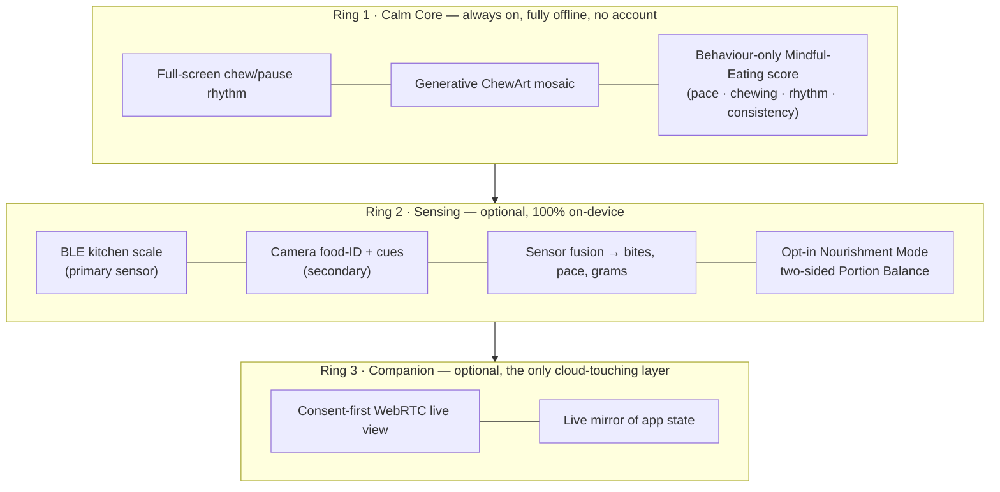

# Chewie 🥢

**A calm companion that helps you eat slower, chew more, and stay in your body during a meal.**

Chewie turns your phone into a quiet table-side coach. The whole screen breathes
between a **chew** colour and a **pause** colour, so you learn a slower rhythm without
counting or staring at numbers. Every finished meal becomes a unique piece of
generative mosaic art (**ChewArt**) that grows into a personal artwork over months.

Beyond the calm core, Chewie can *optionally* sense a meal (a Bluetooth kitchen scale
as the primary sensor, the camera as a helper), coach you gently, let a trusted person
watch along, and — for adults who opt in — help you land inside your **ideal amount**:
a healthy, **two-sided** range where eating *too little* counts against you exactly as
much as eating *too much*.

> **Status:** this repository currently contains the **architecture & product design**
> (see [`docs/`](docs/)). No application code has been written yet — the design is the
> deliverable, and the roadmap in [`docs/09-roadmap-and-mvp.md`](docs/09-roadmap-and-mvp.md)
> is the build plan.

---

## The idea in one picture

Each ring is independent: **remove Rings 2 and 3 and you still have a complete,
lovable, offline app.** A failed cloud call can never break the dinner table.

---

## What makes it different

- **The calm core never asks how much you ate or what you weigh.** The always-on score
  measures *behaviour* — slowness, thorough chewing, honoured pauses, steady rhythm,
  consistency against your own gentle baseline — inside healthy **bands** where both
  extremes lower the score. Eating less can *never* raise it; that's enforced in code,
  not just policy (the scoring function literally cannot receive grams or calories).
- **Your artwork is the reward.** ChewArt tiles are seeded by *how* you ate, are stored
  as tiny seed+params (never as images), and are reproducible and exportable.
- **The scale is the star sensor.** A Bluetooth kitchen scale gives ground-truth mass,
  precise per-bite weight loss, and exact pace — far more reliable than guessing from a
  camera. The camera adds food identification and chewing cues, and powers the companion
  view. Everything degrades gracefully: scale-only, camera-only, both, or manual.
- **Nourishment Mode is opt-in, adults-only, and two-sided.** Enter height, weight, age,
  sex and activity, and Chewie derives your BMI, your WHO healthy-weight *range*, and your
  energy needs (Mifflin–St Jeor → TDEE), then a per-meal **target band**. The Portion
  Balance score peaks in the middle and drops on *both* sides — it coaches you *into and
  inside* your ideal amount, never toward eating less. Targets clamp to the healthy range;
  underweight goals route to gentle support, not optimisation. Off by default, fully
  hideable, and explicitly **not medical advice**. See
  [`docs/10-nourishment-and-intake-targets.md`](docs/10-nourishment-and-intake-targets.md).
- **Watching-along is consent-first.** The companion stream is peer-to-peer, encrypted,
  ephemeral, never recorded, and revocable — the eater always sees and controls who is
  watching.
- **Privacy is the default.** Local-first, encrypted-at-rest, no account for the core,
  camera frames never leave the device, eating/health data treated as GDPR Article 9
  special-category data.

---

## Design documents

Read them in order, or jump to what you need.

| # | Document | What's inside |
|---|----------|---------------|
| 01 | [Product Vision, Personas & Core Loop](docs/01-product-vision.md) | The problem, who it's for, the calm core loop, principles & non-goals, the "battle yourself" motivation reframed healthily |
| 02 | [System Architecture & Tech Stack](docs/02-system-architecture.md) | Concentric-ring topology, React Native + Expo, Supabase (EU), what-runs-where, CI/deployment |
| 03 | [Chewing Engine & Generative ChewArt](docs/03-chewing-engine-and-art.md) | Drift-free session FSM, full-screen visual/colour system, the ChewArt generator, gallery & export |
| 04 | [Sensing, Sensor Fusion & Meal AI](docs/04-sensing-and-ai.md) | BLE scale drivers, camera pipeline, fusion modes, food ID, honest nutrition estimation with ranges |
| 05 | [Mindful-Eating Score & Self-Competition](docs/05-scoring-model.md) | Behaviour-only banded scoring, the intake wall, live coaching, personal baseline |
| 06 | [Companion Mode, Secure Pairing & Realtime](docs/06-companion-and-pairing.md) | WebRTC P2P, signalling, pairing/consent, state-sync, TURN |
| 07 | [Data Model, Sync, Privacy & GDPR](docs/07-data-model-and-privacy.md) | Local-first encrypted schema, RLS, consent tiers, Article 9 handling, export/delete |
| 08 | [Responsible Design, Safety & Accessibility](docs/08-responsible-design-and-safety.md) | Eating-disorder-risk safeguards, onboarding/age gate, honesty rules, accessibility, red-team |
| 09 | [Roadmap, MVP Scope & Delivery Plan](docs/09-roadmap-and-mvp.md) | Phased plan (calm core → scale → camera → companion → cloud), spikes, definition of done |
| 10 | [Nourishment Mode & Two-Sided Portion Balance](docs/10-nourishment-and-intake-targets.md) | Opt-in profile → BMI/healthy-range/TDEE → two-sided per-meal target band & adequacy score |

Architecture decisions are recorded in [`docs/adr/`](docs/adr/README.md).

---

## Tech stack (target)

| Concern | Choice |
|---|---|
| Client | React Native + Expo (dev-client/CNG) + TypeScript; Reanimated + Skia |
| Session engine | Pure XState v5 statechart on a monotonic clock (drift-free through screen-dim) |
| Local storage | op-sqlite + SQLCipher + Drizzle (encrypted); MMKV for settings; ChewArt stored as seed+params |
| Backend (optional) | Supabase (EU): Postgres + RLS, Auth, Realtime, Edge Functions, Storage |
| Sensing | react-native-ble-plx (scale, primary) + react-native-vision-camera + on-device TFLite/MediaPipe |
| Companion | react-native-webrtc P2P (DTLS-SRTP), Supabase signalling, managed TURN |
| Cloud AI | Opt-in only: a single blurred still-frame call, zero-retention; never continuous |
| Nutrition data | Bundled offline subset of Open Food Facts + USDA FoodData Central (food → nutrient ranges) |

---

## Roadmap at a glance

- **Phase 0 — Foundations:** workspace, encrypted schema, pure engine/scoring/art packages, tests.
- **Phase 1 — Calm Core MVP:** the offline, no-account chew/pause app + ChewArt + gentle behaviour score + safeguards. A complete product on its own.
- **Phase 2 — Scale as ground truth:** BLE scale, bite step-detection, banded score, battle-yourself.
- **Phase 3 — On-device camera sensing:** food ID, chew cues, fiducial portions, optional Balance & Variety insight.
- **Phase 4 — Consent-first companion:** WebRTC live view + state mirror, revocable pairing.
- **Phase 5 — Nourishment Mode, optional cloud, compliance:** opt-in intake targets (behind an ED-clinician design review), zero-knowledge sync, DPIA, store-review prep.

Full detail in [`docs/09-roadmap-and-mvp.md`](docs/09-roadmap-and-mvp.md).

---

## A note on responsibility

Chewie touches eating, bodies, and (optionally) intake and weight — areas where a careless
app can do real harm. The design takes that seriously: the calm core is numberless, the
behaviour score can't be gamed toward eating less, intake features are opt-in, two-sided,
clamped to healthy ranges, and gated behind an eating-disorder-clinician review, and there
are care pathways instead of congratulation when usage looks concerning. Chewie is a
wellbeing companion, **not a medical device** — no diagnosis, no clinical precision claims,
estimates always shown as ranges. See
[`docs/08-responsible-design-and-safety.md`](docs/08-responsible-design-and-safety.md).
