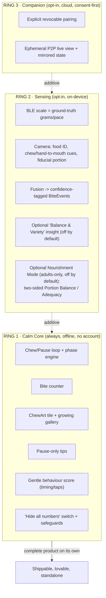
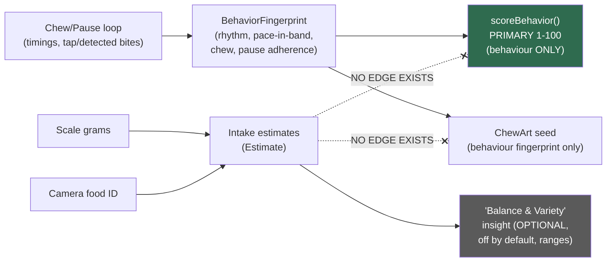
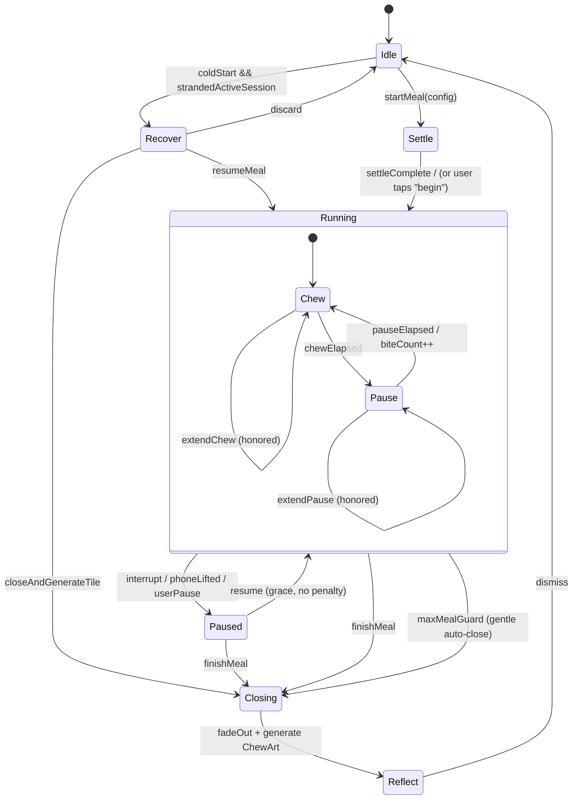

# Chewie — Product Vision, Personas & Core Loop

> Section owner: Product Vision, Personas & Core Loop
> Status: Draft v2 (foundational — this is the "why" every other doc conforms to)
> Conforms to: the canonical concentric-rings architecture spine (Calm Core / Sensing Layer / Companion Plane), committed at `docs/02-system-architecture.md`.

### Canonical documentation map (single numbering convention)

All Chewie design docs live under `docs/` with the numbering below. **This is the one canonical scheme; no doc invents its own sibling paths.** A CI link-checker over `docs/` fails the build on any dangling cross-reference (see `docs/02-system-architecture.md` §CI). Related docs referenced here (not duplicated):

| Path | Owns |
| --- | --- |
| `docs/02-system-architecture.md` | The canonical spine every doc conforms to; ADR index pointer; CI link-check policy |
| `docs/01-product-vision.md` | **This doc** — vision, personas, core loop, principles, metrics |
| `docs/03-chewing-engine-and-art.md` | `@chewie/engine` XState statechart, `ChewieClock`, keep-awake, background cues, **in-progress session checkpoint & recovery** |
| `docs/05-scoring-model.md` | `@chewie/scoring` band math, property tests |
| `docs/03-chewing-engine-and-art.md` | `@chewie/art` seeded PRNG, palettes, geometry, deterministic SVG + tolerant raster export |
| `docs/04-sensing-and-ai.md` | `@chewie/fusion` scale drivers, camera, `SensorMode`; consumes canonical `BiteEvent` |
| `docs/06-companion-and-pairing.md` | Ring 3 WebRTC/Supabase pairing, RLS, Presence |
| `docs/10-nourishment-and-intake-targets.md` | `@chewie/nutrition` optional, off-by-default intake insight; **persisted-session recovery shape** |
| `docs/07-data-model-and-privacy.md` | Encrypted SQLite schema, GDPR/DPIA, age-band field |
| `docs/03-chewing-engine-and-art.md` | Tokens (no red/failure states), motion, haptics |
| `docs/08-responsible-design-and-safety.md` | **First-run/onboarding flow owner**, age gate, disordered-use heuristic, message catalog |
| `docs/10-nourishment-and-intake-targets.md` | **Opt-in, adults-only *Nourishment Mode*** — anthropometric profile, WHO healthy-weight range + TDEE, and the *two-sided* **Portion Balance** (Adequacy) score in `@chewie/nourishment`; strictly secondary to the calm core |
| `docs/adr/` | Architecture Decision Records, indexed by `docs/adr/README.md` (single authority for ADR numbers) |

> **Shared types & constants have one home each** (see §5.4): `Estimate<T>` and `BiteEvent` live in `@chewie/core-types`; default timings live in `@chewie/config`. Docs cite those homes rather than re-declaring shapes, so the type and its schema default cannot drift.

---

## 1. One-paragraph vision

Chewie turns a meal into a calm, glanceable rhythm. The whole screen breathes between a **chew phase** and a **pause phase**; you take a bite, chew while the screen is soft green, rest while it is soft amber, and repeat — without ever really having to look at it. Nothing shouts, nothing shames; at the table the live screen stays numberless, and the always-on core never asks how much you ate or what you weigh. Every finished meal leaves behind one small, deterministically-generated **ChewArt** mosaic tile; over months those tiles grow into a personal artwork that is the quiet reward for showing up. Optional layers can add a Bluetooth kitchen scale, an overhead camera, a single behaviour score, an adults-only, off-by-default **Nourishment Mode** that gently coaches toward a healthy *two-sided* portion range (an *ideal amount* to get into and stay inside — never toward eating less), and a consent-first companion view — but they are strictly additive: remove all of them and Chewie is still a complete, lovable, offline app. The product's soul is **calm and self-kindness**; its ethics are enforced in the architecture, not in a disclaimer.

---

## 2. The problem, and why slow / mindful eating matters

### 2.1 The behaviour we serve

Most people eat faster than their body can keep up with. Satiety signalling (the gut→brain "I've had enough" loop, mediated by CCK, GLP-1, PYY and gastric stretch) lags ingestion by roughly **15–20 minutes**. Eat a meal in 8 minutes and you routinely finish before the "enough" signal arrives; eat the same meal in 25 minutes and you feel it in time. Slower eating and more thorough chewing are associated with:

- **Better digestive comfort** — larger, less-chewed boluses and rushed, aerophagic eating aggravate reflux, functional dyspepsia, bloating and IBS-type discomfort for many people. Slower, calmer, better-chewed meals are a first-line behavioural suggestion clinicians already give.
- **Satiety awareness** — more time and more oral processing let fullness register, so people more often stop at *comfortable* rather than *stuffed*.
- **Savouring and presence** — attention to taste, texture and the people at the table is the difference between eating a meal and merely clearing a plate.

Crucially for Chewie: **all three benefits are about *how* you eat, not *how much*.** That is the seam we design along. We help pace, chewing, pauses, presence and calm. We do **not** help "eat less" — that would be a different, and harmful, product (see §9 Non-goals and the ethical mandate throughout).

### 2.2 Why existing tools don't fit

| Existing tool | What it does | Why it fails our user |
| --- | --- | --- |
| Calorie / macro trackers (MyFitnessPal etc.) | Log intake, count calories, set weight goals | Numbers-first, weight-loss-framed, high ED risk, ignores *rhythm* entirely |
| Meditation apps | Generic mindfulness sessions | Not situated at the table, no per-bite loop, no meal artifact |
| "Chew counter" novelty apps | Count chews, buzz at you | Nagging, gamified in the wrong direction, no calm, no reward loop |
| A kitchen timer | Marks time | No rhythm, no reward, no gentleness, easy to ignore/abandon |

**The gap:** a *calm, situated, non-numeric, non-dieting* companion that lives on the dinner table, supports the rhythm of a real meal, and rewards the *practice* rather than the *outcome*.

### 2.3 Design improvements over the raw idea (summary)

Where the raw brief pointed at something, this vision sharpens it:

1. **Drift-free, sleep-inclusive timing.** The loop is computed from a **native monotonic anchor that keeps counting while the device sleeps** (`ChewieClock`), not a per-second `setInterval` decrement and *not* `performance.now()` — because neither survives a locked screen (see §6.4).
2. **A meal is an emotional arc, not a raw timer.** We wrap the chew/pause loop in a *settle → loop → close → reflect* lifecycle so meals begin and end gently instead of snapping on/off (see §6.2).
3. **Bands, not minimization.** Pace and bite-size are healthy *bands*; the optimization gradient **stops at the band** — there is deliberately no "slower is always better" or "less is always better" slope (see §8 and §3).
4. **"Battle yourself" without the ratchet.** Personal-best is measured against a **band-clamped adaptive baseline** that celebrates progress, forgives regressions, and cannot demand infinite improvement (see §7).
5. **Art that cannot encode intake.** Each ChewArt tile is seeded from a **behaviour fingerprint** whose type physically excludes grams/calories, so the artwork reflects *how* you ate, never *how much* (see §5.3).
6. **Honoured pauses.** Interruptions and long natural pauses are first-class and never count as failure (see §6.5).
7. **Survives process death.** A mid-meal crash/OS-kill is recoverable, not a silently lost session (see §6.6).
8. **Success measured by graduation, not engagement.** Our metrics reward users internalising the practice and needing us *less* (see §10).

---

## 3. Calm-technology design principles

Chewie is an exercise in **calm technology** (Weiser & Brown; Amber Case). The phone earns its place on the table only if it stays in the periphery. Concretely:

1. **The periphery is the product.** The primary display is a full-screen ambient colour you can read from the corner of your eye. You should be able to eat a whole meal *without once focusing on the screen*. Text, icons and bars are secondary confirmations, not the channel.
2. **Speak rarely, and only in the pause.** No coaching during the chew phase. Educational tips and any live nudges appear **only during pause phases**, are short, deterministic (from a constrained catalogue), and skippable. Chewie can communicate but does not need to *talk*.
3. **Cue through colour and touch, not alarms.** Phase changes are signalled by a soft colour crossfade and an optional gentle haptic — never a jarring sound, never a red flash. There is **no red, no alarm, no failure state** anywhere in the eating experience (`docs/03-chewing-engine-and-art.md`).
4. **The table is sacred.** During a meal, notifications are suppressed, the score is *not* shouted, and nothing competes with the humans and food in front of you. The app's job is to *disappear into* the meal.
5. **Works beautifully when it fails.** Offline-first, sensor-optional. If BLE drops, the camera is off, or there is no network, you still get the complete calm loop. Degradation is graceful and honest (see §5.2 and `docs/04-sensing-and-ai.md`).
6. **The right amount of technology.** Sensing, scoring, nutrition and the companion are *opt-in layers*, never gates. The smallest complete Chewie is the calm loop plus a growing artwork — and that is already the whole point.
7. **Amplify humanity, not the app.** Every feature is judged by whether it makes the meal calmer and the person kinder to themselves. If a feature increases self-surveillance, anxiety, or numeric obsession, it is wrong for Chewie regardless of how "engaging" it is.

These principles are testable acceptance criteria, not vibes. Example checks: *"Can a first-time user complete a meal having looked at the screen fewer than 3 times?"*; *"Does any eating flow ever render red, or the word 'failed'?"* (must be no).

---

## 4. Target personas & Jobs-to-be-Done

Chewie is explicitly **not** framed as a weight-loss or dieting app. Our personas come to us for **digestion, satiety awareness, or presence** — never for restriction.

We model each persona as a Job-to-be-Done in forces-of-progress form: the *situation*, the *motivation*, the *desired outcome*, and the *forces* (push toward change / pull of Chewie / anxiety / habit) that decide adoption.

### 4.1 Primary persona A — "Sanne", the digestive-comfort seeker

> **Situation:** A clinician or her own hard experience has told Sanne that eating slowly and chewing well eases her reflux / IBS / functional dyspepsia. She forgets the moment a meal gets social or busy.
> **JTBD:** *"When I sit down to eat, help me slow down and chew properly so my gut doesn't punish me for the next three hours — without turning dinner into a chore or a spreadsheet."*
> **Desired outcome:** Fewer post-meal flare-ups; a calm cue she can trust so she doesn't have to police herself.
> **Forces:** Push = real physical discomfort. Pull = a gentle, non-medical, non-numeric aid. Anxiety = "will this make me obsessive about food?" (we must answer: no). Habit = eating fast on autopilot.

Sanne is our sharpest fit. She wants **relief and calm**, not scores. She may never turn on the scale or camera. The calm core alone must fully serve her.

### 4.2 Primary persona B — "Tom", the fast eater seeking satiety awareness

> **Situation:** Tom inhales meals in front of a screen and often realises too late that he's overfull and uncomfortable. He isn't dieting; he wants to *notice fullness in time*.
> **JTBD:** *"Help me slow down enough to feel when I've had enough, so I stop at comfortable instead of stuffed."*
> **Desired outcome:** Ending meals feeling satisfied, not heavy; more enjoyment per bite.
> **Forces:** Push = the "ugh, too full" feeling. Pull = a rhythm that paces him without nagging. Anxiety = "is this a diet app in disguise?" (must be visibly no). Habit = eating at laptop speed.

Tom is where the **optional pace band** earns its keep — but framed as *satiety awareness*, never *eat less*. His band target is "slow enough to feel full," which *plateaus*; there's no reward for going ever slower or eating ever less.

### 4.3 Primary persona C — "Marijke", the mindful eater / practitioner

> **Situation:** Marijke meditates and wants to bring the same presence to eating, but "mindful eating" is abstract and she loses the thread mid-meal.
> **JTBD:** *"Give my meditation practice a home at the table — a quiet structure that keeps me present with the food and the people, and leaves a small beautiful trace."*
> **Desired outcome:** Meals as a small daily practice; a sense of accretion and beauty over time.
> **Forces:** Push = wanting depth, not autopilot. Pull = the calm aesthetic + the growing ChewArt garden. Anxiety = "will it be gimmicky / gamified?" Habit = distracted eating.

Marijke is why the **aesthetic and the ChewArt reward** must be genuinely lovely and genuinely *slow*. She wants a garden, not a scoreboard.

### 4.4 Supporting role — "Els", the invited companion (Ring 3 only)

Els is **not** a fourth motivation; she is a *role the eater can invite*. E.g. a partner supporting Sanne after a procedure, or an adult child a parent asks to "sit with me at dinner" remotely.

> **JTBD (of the eater inviting Els):** *"Let someone I trust gently sit with me at a meal, seeing my calm screen — because I chose to share it, and I can end it in one tap."*

Els's design is **consent-first and eater-controlled**: view-only, ephemeral, never recorded, revocable, always-visible (`docs/06-companion-and-pairing.md`). Els must *never* become a way to *police* someone's eating (see anti-persona below).

### 4.5 Explicit anti-personas (who we design *against*)

Naming who we refuse to serve is a design tool, not just ethics theatre:

- **The dieter seeking weight loss / calorie restriction.** Chewie has no goal-weight, calorie budget, deficit, or "eat less" gradient anywhere. The opt-in *Nourishment Mode* (§5.5) computes BMI and an energy need only to coach toward a **healthy two-sided range** — it clamps to the healthy range, penalizes under-eating exactly like over-eating, and its API literally cannot express "reduce," so it is useless as a restriction tool. If weight loss is your goal, Chewie will feel pointedly indifferent to it — by design.
- **The controller/surveiller** who wants to watch and correct another person's eating. The companion plane is built so the *eater* holds all control; there is no covert watch, no recording, no "notify me if they eat too much." We add friction and education against this use.
- **The optimiser/quantified-self maximiser** who wants to grind a number upward forever. The band-clamped design deliberately denies an infinite optimization slope; "in your comfortable band" is a finished state, not a plateau to break through.

---

## 5. How the reward and the optional layers fit — without breaking the calm

The vision is **concentric rings** (per `docs/02-system-architecture.md`). Each ring adds capability but *never adds obligation* and *never gates* the ring inside it.



**Rule:** Ring N may never import Ring N+1. Remove Ring 3, you still have a complete sensing app. Remove Ring 2, you still have the complete calm app. This is enforced by module boundaries and feature flags (`RING2_SENSING_ENABLED`, `RING3_COMPANION_ENABLED`), not by convention.

### 5.1 The ChewArt reward — a garden, not a scoreboard

ChewArt is the **primary intrinsic motivator**, and it is deliberately *slow*:

- **One tile per completed meal.** Not per bite, not per minute — per *meal*, so the reward cadence matches the practice, not the engagement loop.
- **Accretive.** Tiles tessellate into a growing mosaic over weeks and months. The reward is *the artwork you're slowly making*, which you can only see by continuing to show up. This is a garden you tend, not points you farm.
- **Deterministic and yours.** Stored as `seed + params`, never as an image — the whole gallery is a few kilobytes. The **seed, geometry and parameters are fully deterministic**, and the exported **SVG (vector geometry) is pixel-identical everywhere**; the **rasterized PNG is reproducible within a perceptual tolerance**, because Skia GPU raster (gradients/blur) is not byte-identical across drivers. The deterministic ground truth is the geometry/params, not the PNG (`docs/03-chewing-engine-and-art.md` §13/§21).
- **Never punitive.** A missed day *freezes* the garden (it simply doesn't grow that day); it never wilts, resets, or shows a gap-shaming marker (see §7.3 gentle continuity).

### 5.2 Optional sensing — additive signal, zero obligation

The sensing ring makes the loop *smarter* without making it *louder*:

- The **BLE kitchen scale** is the strongest quantitative sensor: the weight-time curve gives ground-truth grams/bite (each bite = a downward step) and true pace in grams/min. It is *primary* for quantity.
- The **camera** is *secondary/qualitative*: food identification, chew-cadence and hand-to-mouth cues, and fiducial (ruler/ArUco) portion estimation when no scale is present. It is *also* the companion's live view.
- **Four first-class modes** with graceful degradation — `SensorMode = NONE | SCALE_ONLY | CAMERA_ONLY | BOTH` — so every hardware combination is a valid, honest experience (details in `docs/04-sensing-and-ai.md`).

The vision constraint on this ring: **more sensing must never mean more pressure.** Extra signal feeds the *art* and *optional* insights and the *behaviour* score's rhythm inputs — it never turns the calm loop into a dashboard.

### 5.3 How signals flow so the calm — and the ethics — hold

The single most important structural diagram in this doc:



The dashed crossed arrows are **not lint rules — they are absent code paths.** `scoreBehavior()` in `@chewie/scoring` cannot receive grams or calories as arguments (its type signature forbids it), and the ChewArt seed is derived from a `BehaviorFingerprint` that has no intake field. So "ate less" is *architecturally incapable* of raising the score or changing the art. Exact math and property tests live in `docs/05-scoring-model.md`; the fingerprint type is defined in §7.4 below and consumed by both `@chewie/scoring` and `@chewie/art`.

> **The intake wall stays, and Nourishment Mode does not breach it.** The optional **Nourishment Mode** (§5.5) is a *separate, parallel plane*: it consumes intake on the right of this wall and produces its own **Portion Balance** (Adequacy) score in `@chewie/nourishment` — it is **never** the behaviour score and **never** the ChewArt seed. No intake value is ever an argument to `scoreBehavior()`, so both crossed edges above remain absent code paths. See `docs/10-nourishment-and-intake-targets.md`.

### 5.4 Canonical shared types & constants (one home, one shape)

Types and constants that cross ring, package or companion boundaries have exactly **one authoritative declaration**. Docs reference these; they never re-declare a divergent shape.

**`Estimate<T>` — the only sanctioned quantitative-estimate shape.** Home: **`@chewie/core-types`** (a Ring-1 package, so every ring can import it). Confidence is **numeric `0..1`** — deliberately, because fusion composes confidences with min / noisy-OR arithmetic that an enum cannot express; the UI maps the number to a coarse label for display.

```ts
// @chewie/core-types
export interface Estimate<T extends number> {
  value: T;
  low: T;                 // inclusive lower bound of the plausible range
  high: T;                // inclusive upper bound
  confidence: number;     // 0..1 (fusion-composable); UI buckets this into low/med/high
  unit: string;           // e.g. 'g', 'g/min', 'kcal'
  source: SensorMode;     // NONE | SCALE_ONLY | CAMERA_ONLY | BOTH
}
```

The shared `<EstimateReadout>` component **refuses to render a bare `value`** without its `low..high` range and a "rough estimate" label — so an estimate cannot be accidentally presented as precise or medical truth.

**`BiteEvent` — the canonical fusion→consumer bite record.** Home: **`@chewie/core-types`**. Single confidence representation (numeric, matching `Estimate`), single field naming. `@chewie/fusion` produces it; `@chewie/scoring`, `@chewie/art`, history, and the companion state mirror all consume *this* shape:

```ts
// @chewie/core-types
export interface BiteEvent {
  id: string;
  tStartMonoMs: number;         // ChewieClock monotonic ms (sleep-inclusive)
  tEndMonoMs: number;
  massG?: Estimate<number>;     // present only when a scale/fiducial contributed; ranged, never bare
  chewProxyMs?: number;         // chew duration proxy (camera/haptic), optional
  chewsPerBite?: number;        // optional
  handToMouth?: boolean;        // camera cue, optional
  phase: Phase;                 // which phase the bite landed in
  source: SensorMode;
  confidence: number;           // 0..1
  flags?: string[];             // e.g. 'low-stability', 'inferred'
}
```

> Docs 02/05/07/09 cite these declarations verbatim; a golden test in `@chewie/core-types` asserts no sibling package redefines `Estimate`/`BiteEvent`. This closes the prior divergence where each doc paraphrased a different shape.

**Default timings live in `@chewie/config`, not in prose.** See §6.3 — the engine default and the SQLite schema default both import `DEFAULT_TIMINGS`, so they cannot drift.

### 5.5 Optional pillar — *Nourishment Mode*: hit your ideal amount (a two-sided range)

The calm core is the soul, and it is **numberless and quantity-free forever**. But some people have a genuine, health-positive goal the core deliberately does not serve: **eating *enough* — the ideal amount — and neither too little nor too much.** *Nourishment Mode* is an **optional, clearly secondary pillar** that serves exactly this **adequacy** goal, without ever becoming a diet app. It is specified in full in `docs/10-nourishment-and-intake-targets.md`; this section states the vision-level requirements it satisfies.

- **A two-sided target, never a minimize.** The user is *not* asking to eat less. They want to hit an **ideal amount — a comfortable *range*** — and be coached to get **into and stay inside** it. **Both under-eating *and* over-eating lower the score** (the *Portion Balance* / *Adequacy* score, 0–100, peaks at the range centre and drops on **both** sides). "Eat as little as possible" scores near *zero*, not near 100 — minimization is structurally impossible, mirroring the band philosophy in §3 and §7.
- **A separate plane, so the calm core never changes character.** Adequacy lives in a new Ring-2 package, `@chewie/nourishment`, entirely on the *intake* side of the wall (§5.3). The always-on behaviour score stays 100% intake-free, and the **live at-the-table surface stays numberless** — live coaching toward the range is *qualitative* ("there's room to enjoy a little more"; "you're in your comfortable range"), never a ticking calorie/gram readout. The Adequacy facet only appears in the composite **when Nourishment Mode is on**, shown side-by-side with the behaviour score, never blended into one grade.
- **Opt-in, adults-only, off by default, fully hideable.** It is a **distinct enrollment** (age-gated `ADULT`, its own explicit consent) layered on top of the intake pipeline — enabling the scale or numbers does *not* enable it. One tap hides all numbers and returns the app to the calm behaviour-only product; the profile is deletable.
- **Honest, health-clamped, and never medical advice.** With opt-in inputs (height, weight, age, sex, activity — height and weight alone can't size an energy need) the app derives **BMI**, a **WHO healthy-weight *range***, and an energy need (**TDEE** via Mifflin–St Jeor × activity), then a **per-meal target *band***. Every estimate is a *ranged, confidence-qualified* ballpark — never "you ate X kcal." Crucially, **targets clamp to the healthy range**: the app never sets or optimizes toward an underweight target, and stats indicating underweight (BMI < 18.5) or any attempt to set a reducing/very-low goal route to the gentle care/signpost pathway (`docs/08-responsible-design-and-safety.md`), never to a smaller band. There is no goal-weight, calorie-budget, or deficit anywhere — the API cannot express "reduce."

This is the pillar's whole point: **adequacy (avoiding both under- and over-eating) is materially different from a weight-loss / restriction flow, which stays banned (§9).** It extends persona Tom's *satiety awareness* (§4.2) with an explicit, guarded target for people who want one — while remaining, by construction, incapable of becoming the restriction app we design against (§4.5).

---

## 6. The core loop — the emotional heart

### 6.1 What it feels like

You sit down. You press start (or Quick Mode for a snack). The screen fades to a soft **chew green**; you take a bite and chew. A large central icon and a thin countdown ring show, peripherally, that the phase is running. The green crossfades to a soft **pause amber**; you set your fork down and rest, and maybe a one-line tip drifts in. Amber fades back to green; you take the next bite. A small bite counter ticks. You barely look at any of it. Twenty minutes later you press "finished," the screen exhales, and a new ChewArt tile blooms into your gallery.

### 6.2 The meal-session lifecycle (an arc, not a switch)

An improvement over "raw timer on/off": every meal is a small emotional arc. The chew/pause loop is *nested inside* `running`.



- **Settle (≈3–8 s):** a soft breathing-in animation before the first bite. Prevents the abrupt "GO" feeling; sets a calm tone.
- **Running:** the chew/pause loop (§6.3).
- **Paused:** interruptions are honoured, not failed (§6.5).
- **Recover:** on cold start after a crash/OS-kill, a calm resume-or-close choice (§6.6) — not a silently lost meal.
- **Closing:** a gentle fade-out and tile generation — the "landing."
- **Reflect:** an optional, quiet post-meal moment (new tile, a kind one-line summary, and — only if the user enabled them — ranged, non-shaming insights). No verdict, no red, no "score card" energy.
- **`maxMealGuard`:** if a session is left running absurdly long (phone forgotten on the stand), it auto-closes gently rather than logging a 4-hour "meal."

Full statechart, keep-awake, haptics, background/notification cues **and the recovery mechanism** are specified in `docs/03-chewing-engine-and-art.md`. This section owns the *emotional shape*; that doc owns the *implementation*.

### 6.3 The chew/pause phase model

Defaults are **not literals in this doc** — they are placeholders in `@chewie/config` pending an ED-clinician evidence pass (see §12 open question 2). The engine and the DB schema both import the same constant, so they cannot diverge:

```ts
// @chewie/config — the ONE source of default timings (placeholder, clinician-review-pending).
export const DEFAULT_TIMINGS = {
  standard: { chewMs: 30_000, pauseMs: 8_000 },
  quick:    { chewMs: 15_000, pauseMs: 4_000 },   // Quick Mode snack preset
} as const;
// @chewie/engine phase defaults AND docs/08 SQLite column defaults both read from here.
```

```ts
type Phase = 'chew' | 'pause';

interface PhaseConfig {
  chewMs: number;          // default DEFAULT_TIMINGS.standard.chewMs; healthy band, user-customizable
  pauseMs: number;         // default DEFAULT_TIMINGS.standard.pauseMs
  advance: PhaseAdvanceMode;
  gracePauseMs: number;    // how long a pause may naturally overrun before we auto-resume prompting; 0 = strict metronome
}

type PhaseAdvanceMode =
  | 'metronome'            // auto: phases advance purely on the clock (guided rhythm)
  | 'responsive';          // phase advances when a bite is registered (tap or detected), self-paced

interface SessionConfig {
  quickMode: boolean;               // uses DEFAULT_TIMINGS.quick, less ceremony
  phase: PhaseConfig;
  chewColor: string; pauseColor: string;   // fully customizable
  hapticsEnabled: boolean;
  tipsEnabled: boolean;             // shown only during pause
  maxMealMs: number;                // maxMealGuard, default e.g. 60*60*1000
}
```

- **Metronome mode** suits Sanne/Marijke who want a steady guided pace.
- **Responsive mode** suits Tom, who advances the loop by actually taking a bite (tap, or a detected hand-to-mouth/weight-step in Ring 2) — the app *follows* him rather than *driving* him. This is the more honouring default once Ring 2 is present.

### 6.4 Drift-free, sleep-inclusive timing (the concrete improvement)

Do **not** decrement a counter every second, **and do not anchor on `performance.now()`.** Two distinct failure modes must be defeated:

1. `setInterval` accumulation drifts and freezes when backgrounded.
2. `performance.now()` (Hermes) and its native equivalents `mach_absolute_time()` (iOS) / non-continuous nanotime **stop advancing while the device is asleep**. A meal phone locks its screen; if we anchored on `performance.now()` and "recomputed from the anchor" on resume, we would **under-count** the sleep interval and land the user in the *wrong phase* — the exact bug this section exists to prevent.

The single source of truth is a **native, monotonic, sleep-inclusive clock**, `ChewieClock`, injected everywhere (never `Date.now()`, never `performance.now()` for elapsed time):

```ts
// @chewie/engine — the ONLY clock the phase engine may read.
// Native bridge: iOS mach_continuous_time(); Android SystemClock.elapsedRealtimeNanos().
// Both keep counting across sleep/lock, are immune to wall-clock/DST changes, and are monotonic.
export interface ChewieClock {
  nowMs(): number;   // ms since an arbitrary fixed origin, INCLUDING time spent asleep
}
```

```ts
interface PhaseView {
  phase: Phase;
  remainingMs: number;      // time left in current phase
  progress: number;         // 0..1 within current phase (drives the countdown ring)
  cycleIndex: number;       // completed full cycles == bite prompts so far (metronome mode)
}

function computePhase(anchorMs: number, nowMs: number, cfg: PhaseConfig): PhaseView {
  const cycle = cfg.chewMs + cfg.pauseMs;
  const elapsed = nowMs - anchorMs;             // nowMs comes from ChewieClock.nowMs()
  const cycleIndex = Math.floor(elapsed / cycle);
  const t = elapsed - cycleIndex * cycle;       // position within current cycle
  if (t < cfg.chewMs) {
    return { phase: 'chew', remainingMs: cfg.chewMs - t, progress: t / cfg.chewMs, cycleIndex };
  }
  const pt = t - cfg.chewMs;
  return { phase: 'pause', remainingMs: cfg.pauseMs - pt, progress: pt / cfg.pauseMs, cycleIndex };
}
```

- The UI reads `computePhase(anchor, ChewieClock.nowMs(), cfg)` each animation frame (Reanimated derived value on the UI thread). It is *always correct* regardless of dropped frames, dimming, backgrounding, **or a fully asleep/locked screen** — on resume it recomputes from the anchor against a clock that *did* keep counting.
- In **responsive mode**, the anchor is reset to `ChewieClock.nowMs()` at each registered bite, so the loop paces to the eater rather than the clock.
- Background haptic/notification cues (`expo-haptics`, `expo-notifications`) cover the case where the app is throttled and can't animate — the *cue* still fires at the phase boundary.
- **Testable acceptance:** the S2 drift spike measures the **lock → device-sleep → resume** path (not merely a foregrounded, dimmed screen) and asserts **< 1 s** phase error after a multi-minute sleep. Docs 02 and 00 state the same `ChewieClock` requirement; `performance.now()` is documented there as *insufficient across sleep*. (Details: `docs/03-chewing-engine-and-art.md` §8.2.)

### 6.5 Honoured pauses and interruptions (never "failed")

The table is a social, interruptible place. The loop must be forgiving:

- A **natural over-long pause** (someone talks to you) is *honoured*: within `gracePauseMs` we simply keep resting; beyond it we softly re-prompt, never scold. Long pauses are *good* — they are exactly the mindful behaviour we want.
- **Phone lifted from the stand** (Ring 2 accel/camera signal) or an incoming call transitions to `Paused` with a calm hold screen, not a lost session.
- Resuming carries **no penalty**. There is no "you broke your rhythm" message anywhere in the catalogue.
- If the meal is abandoned, we generate a tile for what happened or discard silently per user preference — never a red "incomplete" marker.

### 6.6 Recovery after interruption or process death (distinct from backgrounding)

Backgrounding is handled by fold-forward against `ChewieClock` (§6.4) because the process is still alive. **Process death is different:** an OS memory kill, battery death, or hard crash destroys the in-memory engine (`PhaseAnchor`, bite counters, XState context) and the ephemeral Zustand session state. For a 20–40 min meal on a stand, this is a *likely*, not exotic, occurrence — and must never mean a silently lost meal or a `MealSession` row stranded at `status = 'active'` forever.

**Design commitment (owned by `docs/03-chewing-engine-and-art.md`; persisted shape defined in `docs/07-...` / `docs/07-data-model-and-privacy.md`):**

- **Lightweight checkpoint.** While a session runs, the engine periodically (e.g. every phase boundary and every ~10 s, throttled) persists the *minimal recoverable session* to durable storage (SQLite/MMKV):

  ```ts
  interface SessionCheckpoint {
    sessionId: string;
    monoAnchorMs: number;     // ChewieClock anchor at meal start
    wallAnchorMs: number;     // Date.now() at start, for human-readable "was this today?" + reaper age
    config: SessionConfig;    // to reconstruct phase math
    biteCount: number;
    sensorMode: SensorMode;
    lastCheckpointMonoMs: number;
  }
  ```

- **Cold-start detection & calm choice.** On launch, if a `status = 'active'` session (or checkpoint) exists, enter the `Recover` state (§6.2) and offer a **calm resume-or-close**: *"You had a meal in progress — carry on, wrap it up gently, or set it aside?"* No red, no "you crashed," no data-loss scolding. Resuming re-derives the phase from the persisted `monoAnchorMs`; closing generates a tile for what happened; discarding clears it. Because `ChewieClock` is sleep-inclusive, a resume after hours-off simply lands in `maxMealGuard`-close territory rather than a bogus phase.
- **Reaper.** A launch-time sweep closes/abandons any orphaned `active` session older than a sane threshold (via `wallAnchorMs`) so no row is stranded forever.

### 6.7 First-run, single-profile scope, and empty states

The **end-to-end first-run/onboarding flow is owned by `docs/08-responsible-design-and-safety.md`** — this vision doc sets the requirements it must satisfy:

- **Age-gate first.** Before anything else, capture an **age band** (not a birthdate we store more than we need). The band is a first-class setting persisted in `docs/08`'s schema and read by `docs/07` (intake pipeline) and `docs/06` (companion). For users under the GDPR digital-consent age (16, adjustable per member state), intake/nutrition scoring and companion features default **off / parental-gated**, and "hide all numbers" defaults **ON and harder to enable** (§8 principle 4).
- **Just-in-time, calm permission priming.** Notifications, BLE and camera permissions are **never** requested up front. Each is primed with a one-line calm rationale *at the moment the feature is first used* (a scale when the user opens Ring 2; camera when they enable sensing; notifications when they first want background cues). Declining any permission leaves a fully working calmer subset.
- **Profile creation is minimal.** No account, no weight, no goal — just age band, language (nl/en), and default timings. Core onboarding copy centres digestion, satiety, savouring and calm; **the calm-core setup asks for no BMI, no weight, and offers no calorie/diet path** (§8 principle 5). The only place anthropometric inputs exist is a **separate, later, adults-only *Nourishment Mode* enrollment** (§5.5) — never part of core onboarding — reached deliberately, with its own explicit consent interstitial that frames it as a comfortable *range*, never a weight-loss goal (`docs/10-nourishment-and-intake-targets.md`; consent/age-gate mechanics in `docs/08-responsible-design-and-safety.md`).
- **First-meal guidance.** A gentle, skippable first-meal overlay explains the two-phase rhythm in one or two lines, then gets out of the way.
- **Empty states are designed, not afterthoughts.** Zero-tile gallery ("your garden starts with your first meal"), zero-history, and pre-baseline scoring ("warming up — no target yet, just eat calmly") each have a specific calm empty state. Insights are simply absent until intake is explicitly enabled.

**Single-profile-per-device — an explicit MVP decision.** Chewie models **one `LocalProfile` per device** (one age band, one baseline, one continuity, one settings set) for the MVP. We do **not** blend two eaters' baselines/streaks, and we do **not** silently let a minor inherit an adult's defaults. Consequence for shared devices (a family tablet on the stand, partners taking turns): the age-gated defaults belong to the *profile*, and a shared device therefore assumes the **most protective** onboarding was completed once. Lightweight **local profile-switching** (no accounts, just a picker) is a tracked post-MVP consideration; until it ships, the onboarding copy states that Chewie is set up for one person, and the safest path for a shared minor/adult device is the minor-safe (behaviour-only) profile. This decision is co-owned by `docs/08` (data model) and `docs/10` (age gate).

---

## 7. "Battle yourself" — reframed as gentle, band-clamped personal-best

The user asked to "battle themselves" and improve their score a little each time. Taken literally, that is an eating-disorder ratchet. We keep the *emotional* promise (personal growth, showing up for yourself) and remove the harm (infinite optimisation, restriction gradient).

### 7.1 The three reframing rules

1. **You compete only with your own recent self** — never other people, never a global ideal, never leaderboards.
2. **The target is a comfortable *band*, and the ratchet stops there.** Once your behaviour sits in the healthy band, there is *nothing further to win by going slower or eating less.* "In your calm band" is a finished, celebrated state.
3. **Feedback is celebration-or-neutral, never punishment.** Progress toward your band is celebrated; a rushed meal is met with kindness ("some meals are just meals"), and your baseline barely moves. There is no "you regressed" message.

### 7.2 The adaptive personal baseline (algorithm)

For each behaviour sub-signal (pace, chew thoroughness, pause adherence, rhythm steadiness), we keep a slowly-adapting personal baseline via an EWMA, and derive a *gentle* next-meal target that is **clamped into the band and never past its centre**:

```ts
interface BandTarget { lo: number; hi: number; center: number; }  // healthy band for a sub-signal

interface Baseline {
  value: number;            // EWMA of recent meals for this sub-signal
  meals: number;            // how many meals contributed (for warm-up / re-entry)
  lastMealAt: number;       // for forgiving re-entry after a break
}

// Slow, forgiving smoothing. Slightly quicker toward improvement than away from it,
// but because the target is band-clamped there is NO runaway pressure.
function updateBaseline(b: Baseline, meal: number, target: BandTarget, nowMs: number): Baseline {
  const improving = distanceToBand(meal, target) < distanceToBand(b.value, target);
  const alpha = improving ? 0.25 : 0.12;           // gentle either way; regressions move it least
  const relaxed = relaxAfterBreak(b, nowMs);       // long absence -> baseline eases, "welcome back, no pressure"
  return {
    value: relaxed.value + alpha * (meal - relaxed.value),
    meals: b.meals + 1,
    lastMealAt: nowMs,
  };
}

// Next-meal "stretch": nudge from baseline toward the band, but clamp INSIDE the band
// and never overshoot center. If already in-band, target = stay comfortable (no push).
function nextTarget(b: Baseline, band: BandTarget): number {
  if (inBand(b.value, band)) return b.value;                 // <-- the ratchet stops here
  const STEP = 0.15;                                         // small, humane increment
  const nudged = b.value + STEP * (band.center - b.value);
  return clampTowardCenter(nudged, band);                   // never past center, never outside band
}

function distanceToBand(x: number, b: BandTarget): number {
  return x < b.lo ? b.lo - x : x > b.hi ? x - b.hi : 0;      // 0 anywhere inside the band
}
```

Key properties (asserted by property-based tests in `docs/05-scoring-model.md`):

- **No infinite gradient.** `nextTarget` returns "stay put" once in-band; it can never demand ever-slower or ever-smaller.
- **Symmetric bands.** `distanceToBand` is 0 across the whole band and rises on *both* sides — too-fast *and* too-slow, too-big *and* too-small, both cost you equally. "Less" is never intrinsically "better."
- **Forgiving.** Regressions barely move the baseline; a long break *relaxes* it and greets you kindly rather than resetting a streak to zero.

### 7.3 Gentle continuity (the "streak" that never punishes)

- Practice continuity is shown as a **growing garden and a soft "days practised" tally**, not a fragile streak number.
- A missed day **freezes** (no growth) rather than **resets**. A "rest day" is a first-class, celebrated concept.
- Copy is drawn from a constrained catalogue with **no** `failed / broke / lost / missed` templates (`docs/08-responsible-design-and-safety.md`).

### 7.4 The BehaviorFingerprint (shared by scoring and art, intake-free by type)

```ts
// Consumed by BOTH @chewie/scoring and @chewie/art.
// It has NO grams/calories field — by construction, not by convention.
interface BehaviorFingerprint {
  meanBiteIntervalMs: number;         // pace proxy (or grams/min mapped to a band elsewhere)
  paceInBand: number;                 // 0..1 distance-to-band score for pace
  chewThoroughness: number;           // 0..1 (chew duration/count band; degrades gracefully w/o camera)
  pauseAdherence: number;             // 0..1 fraction of pauses honoured
  rhythmSteadiness: number;           // 0..1 from coefficient-of-variation of bite intervals (banded: steady, not robotic)
  biteCount: number;                  // count only — NOT amount
  // deliberately absent: grams, calories, portion, weight, nutrition
}
```

- `scoreBehavior(fp: BehaviorFingerprint, baseline, band): number /* 1..100 */` — primary score, behaviour only.
- `deriveChewArtSeed(mealId: string, fp: BehaviorFingerprint): Seed` — the tile's palette/geometry come from *rhythm*, *steadiness*, *pause-honouring* — so two meals of very different *amounts* but the same *calm* look equally beautiful. The art is a **portrait of the meal's rhythm**, not its mass.

---

## 8. Product principles (design commitments)

1. **Calm over engagement.** We optimise for peace at the table, not time-in-app. If a "growth" tactic would make Chewie noisier or nudgier, we don't ship it.
2. **The always-on score is behaviour, never amount.** The primary, always-on behaviour score measures *how* you eat; quantity can never enter it and "ate less" can never raise it — enforced by type, not by hope. Amount is scored *only* in the separate, opt-in *Nourishment Mode* (§5.5), and there only as a **two-sided Adequacy** score where under-eating lowers it just like over-eating.
3. **Bands, not minimisation — everywhere.** Healthy ranges with symmetric, two-sided penalties; no "more/less is always better" slope anywhere. This holds for the behaviour bands *and* for Nourishment Mode's Portion Balance band, whose maximum is only at the range centre.
4. **Numbers are optional, gentle, and hideable.** Intake/nutrition is off by default, always ranged (`Estimate<T>` from `@chewie/core-types`, §5.4), never a lone `/100 healthiness`, and a single switch *disables the pipeline* (not just hides the UI) app-wide. It defaults ON (numbers hidden) for minors.
5. **No weight-loss framing; adequacy is opt-in and guarded, not banned.** The calm core is numberless and quantity is *never* in the always-on score. Weight-loss *framing* stays impossible: no goal-weight, calorie-budget, or deficit column exists anywhere, and the schema guard bans those tokens in every table. What is *permitted* is the opt-in *Nourishment Mode* (§5.5): current height/weight/age/sex/activity live only in a single reviewed, adults-only, encrypted `anthropometric_profile` health module; BMI and the healthy range are computed at runtime, never stored; and every target **clamps to the healthy range** and is **two-sided** (never minimization). Core onboarding still centres digestion, satiety, savouring, calm (`docs/07-data-model-and-privacy.md`, `docs/10-nourishment-and-intake-targets.md`).
6. **Self vs self only.** No feeds, no leaderboards, no comparison surfaces.
7. **Kindness in every string.** No red, no alarms, no failure language; a constrained message catalogue makes punitive copy un-addable.
8. **Consent-first everything shared.** The companion is eater-controlled, ephemeral, never-recorded, revocable, always-visible.
9. **Honest about accuracy.** Camera-based estimates are shown as rough ranges with confidence — never as precise or medical truth. Chewie is not a medical device and says so plainly.
10. **Local-first, private-by-architecture.** The calm core needs no account and no network, forever. Sensitive data (camera frames = GDPR Art. 9) is never persisted or uploaded by default.
11. **Graceful degradation is a feature.** Four sensor modes, each honest and useful; the app never fabricates precision it doesn't have.
12. **Graduation is success.** If a user internalises the practice and needs us less, we succeeded (see §10).

---

## 9. Non-goals (explicit)

- **Not a weight-loss / dieting / restriction app.** No goal-weight, calorie budget, deficit, or "eat less" mechanic — not in onboarding, not in the schema, not anywhere. The opt-in *Nourishment Mode* (§5.5) is the deliberate opposite of a diet flow: it targets **adequacy** — a healthy *two-sided* range where under-eating is penalized exactly like over-eating — clamps every target to the healthy range, routes underweight stats to gentle care, and exposes no API that can express "reduce" (`docs/10-nourishment-and-intake-targets.md`).
- **Not a food/macro diary.** No MyFitnessPal-style logging. Intake insight and Nourishment Mode are secondary, optional, ranged and non-punitive.
- **Not a scoreboard.** No blended score mixing behaviour with amount; behaviour and intake/adequacy are separate packages and stay that way — when Nourishment Mode is on, Behaviour and Adequacy are shown side-by-side and labelled, never multiplied into one grade that could hide a restriction gradient.
- **Not a surveillance tool.** No covert or continuous watching; no recording of the companion feed; no "alert me if they overeat."
- **Not a social network.** No public gallery by default, no feeds, no leaderboards, no ranking.
- **Not a medical device.** No diagnosis, no clinical-precision claims; designed to stay out of EU MDR scope; estimates always ranged.
- **Not engagement-maximising.** No notification-driven re-engagement of the calm core, no time-in-app targets, no punishing streaks, no dark patterns.
- **Not cloud-dependent for the core.** The calm loop runs in airplane mode forever; removing the entire cloud plane leaves a complete app.
- **Not a multi-viewer / web-viewer companion (initially).** 1:1 ephemeral P2P first; group/SFU deferred.
- **Not multi-user in the MVP.** One profile per device for now (§6.7); explicitly scoped, with age-gate implications noted.

---

## 10. Positioning & success metrics

### 10.1 Positioning statement

> **For** people who want to eat more slowly and mindfully — because their gut, their fullness cues, or their peace of mind asks them to — **Chewie is** a calm, private dinner-table companion that turns each meal into a gentle chew-and-pause rhythm and, over months, into a growing piece of personal art. **Unlike** calorie counters and diet trackers, **Chewie** never asks how much you ate or what you weigh; it cares only about *how calmly and thoroughly* you ate, and it celebrates you against no one but your own recent self.

Category line: *"A calm, local-first mindful-eating companion — not a diet app."*

### 10.2 North Star

**Practised, in-band meals per active user per week** — a meal completed at a calm, in-*band* rhythm (not a faster or lower-intake one). It rises when people find the practice genuinely helpful, and it is *neutral to how much anyone eats*.

### 10.3 Wellbeing-oriented success metrics (and why each is safe)

| Metric | Direction | Why it's wellbeing- (not engagement-) oriented | How measured (privacy-preserving) |
| --- | --- | --- | --- |
| Median bite-interval **moving into the healthy band** over first ~10 meals, then **plateauing** | Toward band, then flat | Rewards reaching a *comfortable* pace and *stopping there* — not ever-slowing | On-device; opt-in anonymous aggregate only |
| Self-reported **digestive comfort / satiety satisfaction** (brief, optional check-in) | Up | Direct wellbeing outcome, not a proxy | In-app optional survey, local + opt-in aggregate |
| **Pause-honouring rate** | Up | Measures presence and calm, intake-neutral | On-device fingerprint |
| **Gentle continuity** (days practised, rest-days-inclusive) | Steady/up | Rewards a sustainable practice, tolerant of gaps | Local |
| **ChewArt garden growth** | Up over months | Intrinsic, slow, accretive reward | Local |
| **"Healthy fade"**: users who report having *internalised* the pace and use Chewie less on purpose | Up (celebrated) | We treat graduation as success, not churn | Optional exit/return survey |

### 10.4 Guardrail metrics (must **not** rise — early-warning of harm)

These feed the local, on-device disordered-use safeguard (`docs/08-responsible-design-and-safety.md`). **Be honest about what the safeguard can and cannot see:**

- **The strongest ED signals are structurally dark for the highest-risk users.** "Sustained extreme-low intake" and "skipped-meal cadence" are only observable when the user has *already enabled the intake pipeline* or *keeps opening and logging meals*. The people at greatest risk are exactly those who keep intake **off** or **stop opening the app** — so an engagement-based or intake-based heuristic **cannot reach a disengaged restrictor.** We state this plainly here, and the DPIA + ED-clinician review (`docs/10`, `docs/08`) must record it as a known limitation, not a solved problem. The safeguard is a gentle net, not a detector.
- **Default-mode (behaviour/usage) signals that DO exist**, and which the heuristic leans on first: obsessive **number-toggling** (repeatedly opening/hiding intake), **extreme self-set bite targets or timings** (e.g. absurdly long chew or tiny bite goals), and **session-shape anomalies** (chronically abandoned meals, rapidly shrinking session counts). These are available in the default, intake-off configuration.
- **Intake-based signals (opt-in only, clearly caveated):** *if and only if* the intake pipeline is on, sustained extreme-low intake or a heavy skipped-meal pattern *may additionally* surface the calm, dismissible help/resource card — never a growth alert, never a companion/cloud signal.
- **Companion sessions not eater-initiated** → must be structurally impossible; monitored as a safety invariant.
- **Session length per meal creeping ever-upward** → a smell of an emerging "eat ever slower" ratchet; investigate, don't celebrate.

The safeguard runs **on-device only**, is never sent to companion or cloud, is easy to turn off (so it cannot itself become a surveillance/shaming vector), and always states the app is not medical advice.

### 10.5 Anti-metrics (we explicitly do **not** optimise)

DAU/MAU maximisation • time-in-app • notification-driven re-engagement of the core loop • streak length as a hook • any metric that improves when someone eats *less*.

---

## 11. Conformance checklist (for reviewers of any sibling doc)

A quick gate any Chewie doc/PR must pass, distilled from the above:

- [ ] References siblings only by the `docs/NN-*.md` scheme in the map above (CI link-checker green).
- [ ] Uses `Estimate<T>` / `BiteEvent` from `@chewie/core-types` — no re-declared shape, numeric `confidence: 0..1`.
- [ ] Reads default timings from `@chewie/config` `DEFAULT_TIMINGS` — no literal timing defaults in prose or schema.
- [ ] Uses `ChewieClock` (sleep-inclusive) for all elapsed-time math — never `Date.now()`/`performance.now()`.
- [ ] Claims deterministic **geometry/params + pixel-identical SVG**; raster only "reproducible within a perceptual tolerance."
- [ ] Cites ADRs by number from the single index in `docs/adr/README.md` (no ad-hoc numbering).
- [ ] No red/failure state, no punitive copy, no intake→behaviour-score/art code path, and no goal-weight/calorie-budget/deficit/persisted-BMI field in any table. (Current height/weight/age/sex/activity are permitted *only* in the reviewed, opt-in `anthropometric_profile` module for adults-only Nourishment Mode; any Adequacy scoring is two-sided and clamped to the healthy range — see `docs/10-nourishment-and-intake-targets.md`.)

---

## 12. Open questions & risks (honest)

**Open questions**

1. **Default `PhaseAdvanceMode`.** Metronome (guided) is friendlier for first-run calm; responsive (self-paced) is more honouring once Ring 2 exists. Which is the day-one default, and do we auto-switch when a scale/camera appears?
2. **Default chew/pause timings and band edges.** The `@chewie/config` `DEFAULT_TIMINGS` values (§6.3) are placeholders needing an ED-clinician-reviewed evidence pass before Phase 1 ships (no numbers should feel like a prescription).
3. **Reflect-screen content for numbers-hidden users.** What does a genuinely lovely, entirely non-numeric post-meal moment look like? (Likely: the new tile + one kind line, nothing else.)
4. **Quick Mode ceremony.** How much of the settle/reflect arc do we keep for a snack without it feeling heavyweight?
5. **Persona-adaptive onboarding.** Do we ask "why are you here?" (digestion / presence / satiety) and gently theme copy — while making sure *none* of the paths ever reads as dieting? (Flow owned by `docs/10`.)
6. **Companion for minors.** Even parental-gated, is a watched-eating feature ever appropriate for under-16s, or off entirely by default?
7. **Local profile-switching.** Do we ship lightweight per-device profiles post-MVP (§6.7), and if so how do we keep the age-gate protective on a shared minor/adult device?

**Risks (vision-level; full register in `docs/02-system-architecture.md` `risks`)**

- **Eating-disorder / surveillance harm is the dominant risk.** Mitigated structurally (behaviour-only score by type, symmetric bands, intake off/hideable/disable-able, consent-first ephemeral companion, local disordered-use safeguard, no failure states, streak-freeze) — but **must be validated by an ED clinician before any intake feature ships**, and note honestly (§10.4) that the safeguard cannot reach a disengaged restrictor.
- **"Battle yourself" could still be felt as pressure** by anxious users despite the band clamp. Mitigation: celebration-only feedback, forgiving baseline, easy way to hide the score entirely, and safeguard heuristics that can soften/disable scoring.
- **Calm can read as "boring"** to some users chasing dopamine — an acceptable, deliberate trade; we serve the personas above, not the optimiser anti-persona.
- **The reward being "too slow"** to retain early users before the garden fills. Mitigation: the first few tiles must each be individually beautiful and the settle/reflect arc must feel rewarding from meal one.
- **Framing drift.** Marketing or a future PM could quietly re-introduce weight-loss framing for growth — including trying to bend Nourishment Mode (§5.5) into a covert diet flow. Mitigation: the schema still has **no** goal-weight/calorie-budget/deficit/persisted-BMI columns (banned in every table by a token guard); anthropometric inputs live only in one reviewed, adults-only table; and Nourishment Mode is guarded by construction — two-sided (never minimization), clamped to the healthy range, no reduce API, adults-only, and lexicon-checked — so any covert-restriction attempt is a code-review-visible act blocked on multiple axes, not a silent one (`docs/08-responsible-design-and-safety.md`, `docs/10-nourishment-and-intake-targets.md`).
- **Shared-device age-safety gap.** Single-profile-per-device (§6.7) means a shared minor/adult device could present adult defaults. Mitigation: most-protective onboarding assumption + explicit copy now; profile-switching tracked as the real fix.
