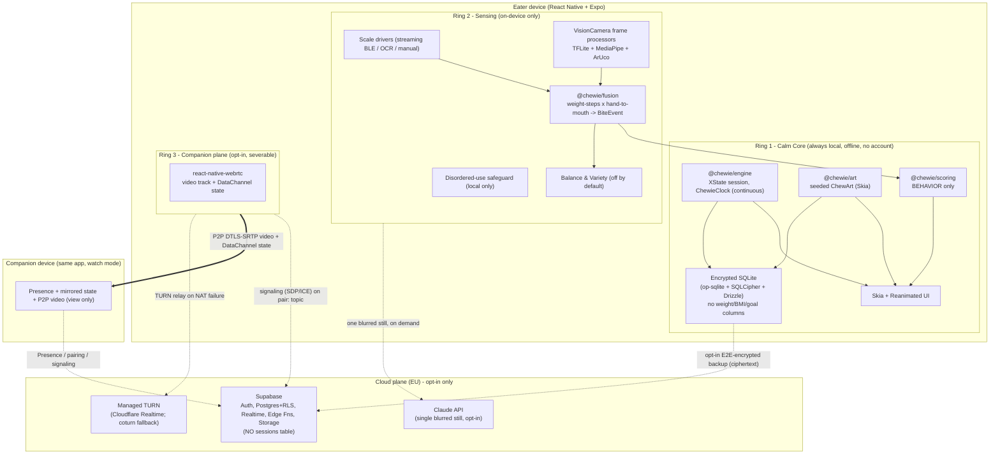
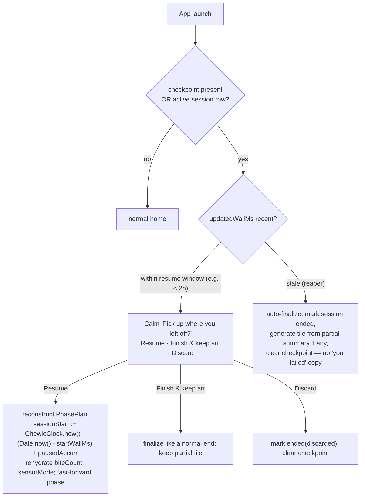
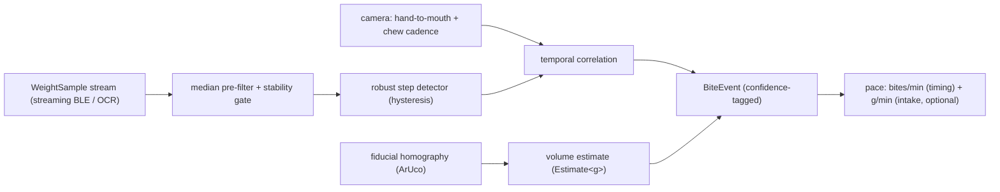
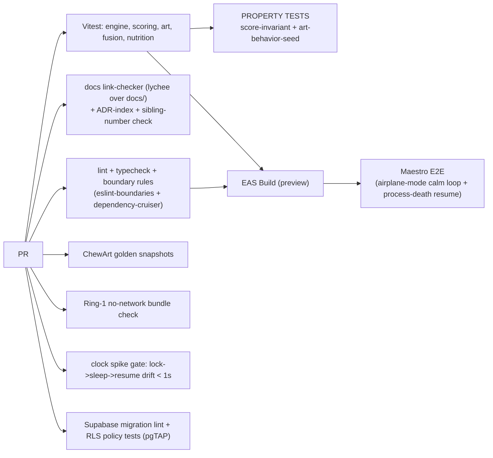

# Chewie System Architecture and Tech Stack

**Doc:** `docs/02-system-architecture.md`
**Status:** Canonical expansion of the architecture spine (`docs/02-system-architecture.md`). Authoritative for module boundaries, the local/cloud split, platform choice, cross-cutting data flow, and the shared type/ADR/config indexes referenced by sibling docs.
**Owner:** System Architecture & Tech Stack area.
**Audience:** All engineers. Read this and the spine before the per-area docs.
**Relationship to the spine:** This doc is the load-bearing expansion of the shared spine. Where a topic has its own doc (session engine + art, sensing/fusion, scoring, companion, nutrition, data model, privacy/DPIA) this doc defines the *seam* and defers the internals. Sibling docs are indexed in §22 and follow the **single canonical numbering convention** committed in this repo (§5.3).

---

## 1. Scope and non-scope of this doc

**In scope:** client platform decision; the ring/module topology and how boundaries are *enforced*; the monorepo layout; the canonical **file-numbering, ADR, shared-type, and config** conventions every sibling doc must obey; the on-device vs cloud split ("what runs where"); the top-level component + data-flow; the drift-free **sleep-inclusive** session-engine timing contract and in-progress-session recovery; the sensing/fusion pipeline seam; the scoring boundary as an architectural (not policy) property; the Supabase backend and exactly what needs it; the **single canonical companion-consent model**; the WebRTC signaling path; AI-inference placement and its privacy tradeoff; on-device observability/diagnostics; env/config/feature-flags; deployment/hosting; build/CI.

**Deferred to sibling docs:** the full XState statechart, cue system, ChewieClock native module, and the ChewArt generative algorithm (`03-chewing-engine-and-art.md`); fusion math and per-vendor scale drivers (`04-sensing-fusion.md`); the scoring bands, property tests, and the disordered-use safeguard (`05-scoring-and-ethics.md`); companion UX and coaching copy (`06-companion-realtime.md`); the encrypted schema, the canonical pairing migration, session-checkpoint shape, and profile model (`07-data-model.md`); the Balance & Variety insight (`60`-scoped section of `05`); the DPIA/privacy program and the diagnostics privacy review (`08-privacy-dpia.md`); and the first-run/onboarding flow + empty states (`01-product-vision-and-onboarding.md`).

---

## 2. Architectural principles (the invariants everything else obeys)

1. **Concentric rings, one-directional dependencies.** Ring N may import Ring N+1 **never**. Ring 1 (Calm Core) is a complete, shippable, offline, account-free product that *cannot even reference* sensing or cloud code. Enforced in CI (§6.3), not by convention.
2. **Local-first, cloud-severable.** Deleting the entire cloud plane leaves a complete app that runs in airplane mode forever. The cloud is an *addition*, never a dependency of the core loop.
3. **Ethics enforced by types and boundaries, not disclaimers.** The primary score's function signature is structurally incapable of receiving grams/calories; the schema has no weight/BMI/goal columns; camera frames are typed as never-persisted. "Ate less" cannot raise the score because there is no code path for it to travel. (§9, §11.)
4. **Honesty by type.** Every quantitative estimate is the single canonical `Estimate<T>` (§5.4). A shared component refuses to render a bare number. Nothing is presented as medical precision.
5. **Consent is authorized signaling, not a readable cloud session.** There is **no cloud `sessions` table**; meal/session state never has a readable cloud representation and flows Eater→Companion only over the P2P DataChannel. The cloud authorizes **only** the ephemeral signaling channel that establishes that peer link, gated by a single canonical pairing predicate (§12.1). Revocation takes effect **immediately via source-side PeerConnection teardown**; RLS is the durable backstop that blocks re-subscription, not an instant remote kill-switch (§12.2).
6. **Determinism where it matters.** The session engine, scoring, art, and fusion are pure, framework-free packages driven off a **sleep-inclusive continuous clock** (§8) and a seeded fixed-point PRNG, unit- and property-tested with no React or native in the loop.

---

## 3. Client platform decision (React Native + Expo) — and the PWA/Capacitor path we evaluated

The section brief asked us to justify a **PWA-first (React + Vite + TS + Tailwind) wrapped in Capacitor** client. We evaluated that seriously and **land on React Native + Expo instead**, conforming to the canonical spine (ADR `0001-client-platform-react-native-expo.md`, §5.3). The brief's own justification — "wrap it to get reliable camera, BLE, background timing, store presence" — is exactly the evidence that pushed the decision one step further to full native RN. Below is the honest reasoning; the PWA is not discarded, it is **relocated** (§3.3).

### 3.1 The decisive observation

Chewie's four hardest requirements — (a) high-frame-rate camera access for **on-device ML frame processing**, (b) robust **BLE** to a kitchen scale, (c) native **haptics + keep-awake + local-notification** cues plus a **sleep-inclusive native clock** (§8.2), and (d) **store presence** with camera/BLE/"another person watching" review — all fall into the "you need native code anyway" bucket on a webview stack. In particular:

- **Web Bluetooth does not exist on iOS.** Neither Safari nor `WKWebView` (which Capacitor uses on iOS) expose Web Bluetooth. A Capacitor app talking to the BLE scale must use a **native BLE plugin** (`@capacitor-community/bluetooth-le`), not a web API. So the webview buys us nothing for the single most important sensor.
- **Camera-ML in a webview is the weak path.** `getUserMedia` works in `WKWebView` on modern iOS, but a webview cannot match native **frame-processor** access (raw YUV frames at high FPS with worklet-thread ML). TFJS/MediaPipe-WASM + WebGPU in a webview is heavier and jankier on low-end devices than native TFLite/ExecuTorch/MediaPipe Tasks. This is the core of Ring 2.
- **The continuous clock is native.** A drift-free 20–40 min meal requires a clock that advances while the device is asleep (`mach_continuous_time` / `elapsedRealtimeNanos`); no web API exposes this (§8.2). A webview would inherit the exact bug this design exists to avoid.
- **The calm animation is GPU art.** A 20–40 min full-screen 60fps phase loop *plus* pixel-reproducible generative tiles is far stronger on **Skia + Reanimated (UI-thread)** than on a webview Canvas2D/CSS pipeline throttled on old hardware.

Once BLE, camera, haptics, keep-awake, and the continuous clock are all native, the remaining question is only: **native UI (RN) or webview UI (Capacitor) on top of that same native layer?** For an animation-heavy, camera-ML-heavy product, native UI wins.

### 3.2 Decision matrix

| Requirement | Pure PWA | PWA + Capacitor (webview UI + native plugins) | **React Native + Expo (chosen)** |
|---|---|---|---|
| BLE scale (Ring 2 primary sensor) | Impossible on iOS | Native plugin (webview irrelevant) | `react-native-ble-plx`, mature |
| High-FPS camera frame processors + on-device ML | Weak / unreliable | WASM in webview, low-end jank | `react-native-vision-camera` frame processors — **best-in-class** |
| Sleep-inclusive continuous clock (§8.2) | Not exposed to web | Needs a native plugin anyway | Native `ChewieClock` module |
| 60fps full-screen animation over 20–40 min | CSS/Canvas, throttling risk | Same, in webview | Reanimated on UI thread |
| Deterministic, pixel-reproducible art + GPU export | Canvas2D, weaker | Same | `@shopify/react-native-skia` |
| Background cues (haptics, notifications, keep-awake) | Throttled/absent | Native plugins | Native modules, first-class |
| WebRTC P2P + DataChannel | **Good** (only real PWA strength) | Good | `react-native-webrtc`, more control (TURN, codec, background) |
| Shared TS with Supabase Edge Functions | Yes | Yes | Yes (neutral — all TS) |
| Store presence + review of camera/BLE/watch | PWA can't be in stores | Yes | Yes |
| Offline no-account core | Service worker (fragile at dinner table) | OK | Native, robust |

**Conclusion:** A *pure* PWA cannot deliver the product (BLE + continuous clock + background cues). Capacitor makes it shippable but leaves the hardest layers (camera-ML, animation, clock) on the weaker webview substrate while still forcing native plugins for everything else — i.e. we pay the native cost *and* keep the webview handicap. **RN + Expo** pays the native cost once and gets the strongest camera-ML and animation stacks. The shared-TypeScript-with-the-backend argument (a real Capacitor selling point) also holds for RN, so it is not a differentiator.

> **Improvement over the brief:** the brief treated "wrap in Capacitor" as the way to get native capabilities. We show that for *this* sensor/animation/timing profile the wrap doesn't remove the webview's ceiling, so we go native. The brief's instinct was right (a PWA alone is insufficient); the conclusion is stronger.

### 3.3 Where the PWA lives on

The PWA is not deleted — it is the right tool for the **web-facing surfaces**, hosted on Vercel/Netlify (§18):

- **Art-share pages** (`share.chewie.app/t/:id`): static, server-rendered ChewArt from a seed, no app install.
- **Companion *web* viewer (future, Phase 4+):** the one place a webview is genuinely strong is WebRTC. A React+Vite PWA companion "watch" page lets someone view the live feed without installing the app. Deferred behind the native companion (spine defers a web viewer), but the architecture reserves the seam: the companion state/video contract (§14) is transport-defined, not RN-specific.
- **Marketing/landing.**

These are separate deployables under `apps/web` and never share the eater's native runtime.

---

## 4. System topology



Participants: **Eater device** (rings 1–3), **Companion device** (same app, "watch" mode), one **cloud hub** (Supabase + TURN + optional Claude). The heavy `==>` edge is direct peer media *and* structured state; the dotted edges are all opt-in and severable. Note there is no cloud edge carrying session state — the Companion learns state only over the DataChannel.

---

## 5. Monorepo layout, module boundaries, and the canonical conventions

pnpm workspace + Turborepo. Pure logic lives in framework-free packages; only `apps/*` touch React/native/cloud.

```
chewie/
  apps/
    mobile/            # Expo RN app (the eater + companion app). Only place native/cloud is wired.
    web/               # Vercel/Netlify: art-share, marketing, future companion web viewer (React+Vite+Tailwind)
  packages/
    core-types/        # @chewie/core-types  Ring 1  THE shared types: Estimate<T>, SensorMode, BiteEvent,
                       #                             CompanionStateMsg, PhasePlan, SessionCheckpoint, feature flags,
                       #                             and DEFAULT_TIMINGS (the single config source, §5.5)
    engine/            # @chewie/engine    Ring 1  XState session, ChewieClock contract, recovery. Pure TS.
    art/               # @chewie/art       Ring 1  seeded ChewArt param+render contract. Pure TS (+ Skia adapter in app).
    scoring/           # @chewie/scoring   Ring 1  scoreBehavior(). CANNOT import grams/calories. Pure TS.
    fusion/            # @chewie/fusion    Ring 2  sensor fusion -> BiteEvent + Estimate<T>. Pure TS.
    nutrition/         # @chewie/nutrition Ring 2  Balance & Variety insight. Pure TS. Off by default.
    tsconfig/          # shared tsconfig, eslint, tsup, vitest presets (build tooling only)
  supabase/
    migrations/        # SQL (the canonical pairing migration + RLS lives here, §12.1)
    functions/         # Deno/TS Edge Functions
  docs/
    00-architecture-spine.md   # the committed canonical spine
    0N-*.md                    # design docs, single numbering convention (§5.3)
    adr/                       # NNNN-title.md, single index (§5.6)
```

> **Naming note:** `DEFAULT_TIMINGS` and all shared types live in the runtime package `@chewie/core-types`; `packages/tsconfig` holds only build presets (renamed from an earlier ambiguous `config/` to avoid implying it holds runtime config).

### 5.1 Ring import rules (enforced)

`eslint-plugin-boundaries` + `dependency-cruiser` fail CI on any illegal edge:

| Package | Ring | May import | May NOT import |
|---|---|---|---|
| `@chewie/core-types` | 1 | (leaf) | everything (it is the leaf) |
| `@chewie/engine` | 1 | `core-types` | fusion, nutrition, supabase, webrtc, react-native |
| `@chewie/art` | 1 | `core-types` | fusion, nutrition, cloud |
| `@chewie/scoring` | 1 | `core-types` (behavior subset only) | **anything with grams/calories**, fusion internals, nutrition, cloud |
| `@chewie/fusion` | 2 | `core-types` | scoring-intake path, cloud, webrtc |
| `@chewie/nutrition` | 2 | `core-types` | scoring, cloud (nutrition data is bundled offline) |
| `apps/mobile` | wiring | all packages | — (but rings still gated by feature flags at runtime) |

> **Improvement over the brief:** boundaries are a *lint failure*, not a code-review norm. A junior PR that imports `@chewie/fusion` into the calm-core screen fails CI before review.

### 5.2 Why the shared types live in `core-types` (fixing the divergence)

`Estimate<T>`, `BiteEvent`, `SensorMode`, `CompanionStateMsg`, `PhasePlan`, and `SessionCheckpoint` are load-bearing *across ring and device boundaries*. Historically each doc paraphrased them into a slightly different shape, which is a correctness bug (a "shared" component can't be shared if the type is three types). **Rule: these types are defined once in `@chewie/core-types` and every doc and package imports them — no paraphrasing, no per-doc redefinition.** §5.4 freezes the two that diverged most.

### 5.3 Canonical file-numbering convention (fixing broken cross-references)

All design docs live flat under `docs/` as `NN-title.md` with a **single global numbering**. The committed spine is `00`. This doc is `02`. The full index is §22. **A CI link-checker (`lychee` over `docs/`) fails the build on any dangling cross-reference or ADR reference**, so the drift that produced three different sibling-path schemes cannot recur. Sibling docs cite each other *only* by the numbers in §22 and ADRs *only* by the index in §5.6.

### 5.4 Frozen shared types (`@chewie/core-types`)

**`Estimate<T>` — the only sanctioned quantitative-estimate shape.** Confidence is **numeric `0..1`** (chosen deliberately: it composes with fusion's noisy-OR / min combination math; an enum would not). This supersedes every earlier per-doc variant.

```ts
// @chewie/core-types
interface Estimate<T> {
  value: T;
  low: T;
  high: T;
  confidence: number;      // 0..1 — composes with fusion noisy-OR/min
  unit?: string;           // e.g. 'g', 'g/min'
  source?: SensorMode;     // provenance of the estimate
}
```

The shared `<EstimateValue>` component **refuses to render** without `low`/`high` and a "rough estimate" label; bare intake numbers are un-representable.

**`BiteEvent` — one definition, crossing the fusion→engine→scoring→companion boundaries.** Timestamps are **continuous-clock ms** (§8.2). Confidence is **numeric `0..1`** (consistent with `Estimate<T>`). Mass is an `Estimate<number>` and is *intake data* that scoring can never receive.

```ts
// @chewie/core-types
interface BiteEvent {
  id: string;
  tStartMonoMs: Monotonic;      // continuous-clock ms (sleep-inclusive), §8.2
  tEndMonoMs: Monotonic;
  intervalMs: number;           // since previous bite -> TIMING (scoring)
  chewDurationMs?: number;      // from cadence -> TIMING (scoring)
  chewsPerBite?: number;
  handToMouth?: boolean;
  mass?: Estimate<number>;      // grams -> INTAKE ONLY (nutrition), never scoring
  phase: 'chew' | 'pause';
  source: SensorMode;
  confidence: number;           // 0..1
  flags?: string[];             // e.g. ['refill-rejected','unstable']
}
```

All sibling docs (fusion, companion, data-model) **cite these**, not local paraphrases.

### 5.5 Single config source: `DEFAULT_TIMINGS` (fixing default drift)

The default chew/pause/quick timings are **clinician-review placeholders** and had drifted across three docs. They now live in exactly one place — `@chewie/core-types` — and both the XState engine default *and* the Drizzle schema default import from it, so code and schema cannot diverge:

```ts
// @chewie/core-types — CLINICIAN-REVIEW PLACEHOLDERS, single source of truth
export const DEFAULT_TIMINGS = {
  chewMs: 30_000,
  pauseMs: 8_000,
  quick: { chewMs: 15_000, pauseMs: 4_000 },
} as const;
```

The Drizzle column default is `.default(DEFAULT_TIMINGS.chewMs)` etc.; the engine's initial `PhasePlan` reads the same constant. Sibling docs quote the constant name, never a hard-coded number.

### 5.6 Single ADR index (fixing number collisions)

ADRs are numbered once, globally, in `docs/adr/`. This index is authoritative; earlier docs that reused `0006`/`0007` for two different decisions are superseded. Docs reference ADRs **only** by this table.

| ADR | Decision |
|---|---|
| `0001-client-platform-react-native-expo` | RN + Expo over Flutter/Capacitor (§3) |
| `0002-concentric-rings-topology` | Rings + strict dependency ordering (§2, §5.1) |
| `0003-supabase-single-eu-backend` | Supabase as the one managed EU backend (§12) |
| `0004-ondevice-first-ai` | On-device-first AI; one opt-in blurred still (§15) |
| `0005-scale-primary-sensor-and-fusion-modes` | Scale is primary; four fusion modes (§10) |
| `0006-scale-driver-abstraction` | Driver abstraction; **streaming-first** resolution (§10.2) |
| `0007-companion-webrtc-p2p` | P2P video + DataChannel; no SFU; planes split (§14) |
| `0008-isolated-behavior-scoring` | Scoring package cannot receive intake (§11) |
| `0009-local-first-encrypted-sqlite-and-sync-seam` | Encrypted SQLite + repository seam (§13) |
| `0010-continuous-clock-timing-and-recovery` | Sleep-inclusive `ChewieClock` + session recovery (§8) |

---

## 6. What runs where

### 6.1 The split

| Concern | On device (default) | Cloud | Notes |
|---|---|---|---|
| Chew/pause loop, UI, timing | ✅ always | never | Ring 1, airplane-mode capable |
| Bite counter (manual) | ✅ | never | |
| ChewArt generation + gallery + export | ✅ | never | seed+params only; export can *optionally* upload a PNG to Storage on user action |
| In-progress session checkpoint (§8.4) | ✅ MMKV | never | crash/process-death recovery |
| Meal history | ✅ encrypted SQLite | opt-in ciphertext backup only | keys derived on device |
| BLE scale ingest + step detection | ✅ | never | |
| Camera food ID, chew/hand cues, fiducial | ✅ (TFLite/MediaPipe/OpenCV) | never (continuous) | frames in-memory only |
| Sensor fusion → BiteEvent, pace | ✅ | never | |
| Behavior score + live coaching | ✅ | never | deterministic bands, no network |
| Balance & Variety (nutrition) | ✅ bundled DB | Edge Fn lookup optional | off by default; ranges only |
| Disordered-use safeguard | ✅ **only** | never (not to companion, not to cloud) | can't become surveillance; behavior-first (§11.2) |
| On-device diagnostics/debug log | ✅ **only** | opt-in export/share by user action | no eating data (§16) |
| Cloud "second opinion" food ID | — | ✅ opt-in, single blurred still | zero retention |
| Companion pairing / consent | — | ✅ Supabase Auth + `pairings` row/RLS | anonymous device identity |
| WebRTC signaling (SDP/ICE) | — | ✅ Supabase Realtime Broadcast on `pair:<id>` | |
| Companion live video | ✅↔✅ **P2P** | TURN relay only on NAT failure | never server-recorded |
| Companion mirrored state | ✅↔✅ DataChannel | never | phase/countdown/bite/score/tip |
| "Who is watching" | — | ✅ Supabase Presence | one-tap revoke = teardown + row flip (§12.2) |

### 6.2 What actually *needs* a backend

Only these genuinely require the cloud; everything else is on-device by mandate:

1. **Pairing/consent as authorized state** between two devices (a `pairings` row + the predicate that authorizes the signaling topic).
2. **WebRTC signaling** (SDP/ICE rendezvous) over the per-pairing Realtime topic.
3. **Presence** — the eater seeing live watchers.
4. **TURN credentials** — short-lived, minted server-side (a secret can't ship in the client).
5. **The opt-in Claude still-frame proxy** — holds the API key; the client never sees it.
6. **Optional ciphertext backup + nutrition lookups** — both optional, both minimizing.

Everything else is on-device. If Supabase is down, the eater's entire experience except companion/backup is unaffected. Note that **no session state is read from the cloud** — the companion always learns state peer-to-peer (§5.5, §14).

### 6.3 Enforcing "Ring 1 has no network"

`apps/mobile` is split into feature modules; the Ring-1 bundle graph is checked in CI to contain **no import of** `@supabase/*`, `react-native-webrtc`, or any `fetch`-bearing module. A Maestro smoke test runs the full calm loop with the device in airplane mode and network mocks that throw on any socket.

---

## 7. Top-level data flow (one meal)

```mermaid
sequenceDiagram
  participant U as Eater
  participant CLK as ChewieClock (native, continuous)
  participant ENG as engine (XState)
  participant SEN as sensing (BLE + camera)
  participant FUSE as fusion
  participant SCO as scoring (behavior only)
  participant UI as Skia/Reanimated UI
  participant CKP as checkpoint (MMKV)
  participant DB as encrypted SQLite
  participant ART as art (seed)

  U->>ENG: start meal (config: chewMs, pauseMs, mode)
  ENG->>CLK: sessionStart = continuousNow()
  ENG->>CKP: write SessionCheckpoint (start anchors, config, mode)
  loop every animation frame / reconcile tick
    ENG->>CLK: now = continuousNow()
    ENG->>ENG: phase = phaseAt(plan, now)
    ENG->>UI: {phase, remainingMs, biteCount}
  end
  par sensing (Ring 2, optional)
    SEN->>FUSE: WeightSample stream + hand-to-mouth events
    FUSE->>FUSE: step-detect + correlate -> BiteEvent (confidence)
    FUSE->>ENG: auto bite (replaces manual tap)
    FUSE->>SCO: BehaviorSignals (timing, chew, adherence) [NO grams]
  end
  U->>ENG: (or) manual bite tap
  ENG->>CKP: update bite counters (periodic)
  ENG->>DB: append bite (timeseries)
  SCO->>UI: live BehaviorScore + band nudge
  U->>ENG: end meal
  ENG->>ART: deriveSeed(mealSummary)  // timing/rhythm/bites, not grams
  ART->>DB: persist tile {seed, params}
  ENG->>DB: persist meal (encrypted); mark session ended
  ENG->>CKP: clear checkpoint
```

Note the two ways a bite enters: a manual tap (Ring 1) or a fused `BiteEvent` (Ring 2). The engine treats them uniformly; scoring never receives mass. The checkpoint (§8.4) makes the session recoverable if the process dies mid-meal.

---

## 8. The session engine seam (drift-free, sleep-inclusive timing + recovery)

Full statechart, the `ChewieClock` native module, and the recovery flow live in `03-chewing-engine-and-art.md`; here is the contract the whole app depends on.

### 8.1 The problem with the naive approach

A per-second `setInterval` that decrements a counter **drifts** (timer coalescing, GC pauses) and **freezes when backgrounded** — fatal for a 20–40 min meal on a stand.

> **Improvement over the brief:** we never accumulate ticks. We store the phase plan and *compute* the current phase from elapsed time on every frame. The animation frame is a *renderer*, not the source of truth.

### 8.2 Clock source — sleep-inclusive continuous clock (corrected)

**`performance.now()` / `Date.now()` are both insufficient.** `Date.now()` jumps on wall-clock changes. `performance.now()` (Hermes) is monotonic but is backed by `mach_absolute_time` (iOS) / `nanoTime`-class sources that **do not advance while the device is asleep/locked**. Recomputing `phaseAt` on resume after a locked screen with such a clock **under-counts elapsed time and lands the engine in the wrong phase** — precisely the failure this seam exists to prevent.

The single source of truth is therefore a **native `ChewieClock`** exposing a **sleep-inclusive continuous** timestamp:

- iOS: `mach_continuous_time()` (advances during sleep), converted to ms.
- Android: `SystemClock.elapsedRealtimeNanos()` (counts time since boot including deep sleep), converted to ms.

```ts
// @chewie/core-types
type Monotonic = number; // ms from a SLEEP-INCLUSIVE continuous source (ChewieClock)

interface Clock { now(): Monotonic; }   // injected everywhere; ChewieClock in prod, fake in tests
```

The engine takes `Clock` as an **injected dependency** so tests are deterministic and the source can be swapped without touching engine logic. `performance.now()` is explicitly **not** an acceptable production `Clock`.

### 8.3 Timing model

```ts
// @chewie/core-types
interface PhasePlan {
  sessionStart: Monotonic;   // ChewieClock at start
  sessionStartWallMs: number;// Date.now() at start — for display/history only, never for phase math
  chewMs: number;            // seeded from DEFAULT_TIMINGS unless customized (§5.5)
  pauseMs: number;
  pausedAccumMs: number;     // total time spent user-paused
}

// Pure, O(1), drift-free. Called every frame AND on foreground resume.
function phaseAt(plan: PhasePlan, now: Monotonic) {
  const elapsed = now - plan.sessionStart - plan.pausedAccumMs;
  const cycle = plan.chewMs + plan.pauseMs;
  const cycleIndex = Math.floor(elapsed / cycle);
  const inCycle = elapsed - cycleIndex * cycle;
  const inChew = inCycle < plan.chewMs;
  return {
    phase: inChew ? 'chew' : 'pause',
    cycleIndex,
    remainingMs: inChew ? plan.chewMs - inCycle : cycle - inCycle,
    progress: inChew ? inCycle / plan.chewMs : (inCycle - plan.chewMs) / plan.pauseMs,
  };
}
```

**Background / lock / resume:** the JS runtime pauses when backgrounded; on resume we call `phaseAt` once with the current `ChewieClock` time and *fast-forward* the statechart to the correct phase — no missed-tick catch-up loop. Because the clock counted sleep time, the recompute lands in the **correct** phase even after the screen was locked and the device slept. As defensive backstops: **local notifications** are scheduled at absolute phase-boundary deadlines (cue even if the OS suspended the app), **haptics** fire on each boundary while foregrounded, and **keep-awake** holds the calm screen on (the phone is usually on a stand and charging).

> **Spike gate (S2):** the `<1s`-drift acceptance test must exercise the **lock → device sleep → resume** path (physically locking and letting the device sleep across several phase boundaries), *not merely* a foregrounded dimmed screen. A foregrounded-only test would pass even with the broken `performance.now()` clock and give false confidence.

### 8.4 In-progress session recovery (process death — new)

Backgrounding is handled by fold-forward (§8.3). **Process death is different** and must be handled explicitly: the engine is headless/in-memory (XState context, `PhasePlan`, bite counters live in RAM; Zustand session state is never persisted). An OS memory kill, battery death, or hard crash mid-meal would otherwise lose the entire session silently — no tile, no partial history, no "resume?" — and strand the SQLite `MealSession` row at `status='active'` forever. Over a 20–40 min meal on a stand this is a *likely* event, not an edge case.

**Design:** a minimal, cheap `SessionCheckpoint` is written to **MMKV** (fast, synchronous, survives process death) at session start and on every bite / phase transition (debounced):

```ts
// @chewie/core-types — the recoverable minimum, NOT the full session
interface SessionCheckpoint {
  mealSessionId: string;
  startMono: Monotonic;      // ChewieClock anchor at start
  startWallMs: number;       // Date.now() anchor — reconstructs elapsed if the clock's epoch reset
  plan: Pick<PhasePlan, 'chewMs' | 'pauseMs' | 'pausedAccumMs'>;
  biteCount: number;
  sensorMode: SensorMode;
  quickMode: boolean;
  updatedWallMs: number;
}
```

**On launch** the engine checks for a checkpoint AND a stranded `status='active'` `MealSession`:



- **Clock-epoch caveat:** `elapsedRealtimeNanos` resets on reboot. If the device rebooted between crash and relaunch, `startMono` is from a different epoch, so on Resume we reconstruct elapsed from the **wall-clock anchor** (`Date.now() - startWallMs`) rather than the raw continuous delta. This is display-grade precision, acceptable for a resume prompt.
- **Reaper:** on every launch, any `MealSession` with `status='active'` older than the resume window is auto-finalized (ended, tile from partial summary if there were bites, otherwise closed) so no row is stranded forever. Copy is calm and non-punitive — a missed/interrupted meal is never a "failure".
- **Ownership:** the recovery flow and checkpoint writing are owned by `@chewie/engine` (`03`); the persisted `SessionCheckpoint` shape and the `MealSession.status` lifecycle + reaper query are owned by the data model (`07`).

### 8.5 Engine states (summary)

`idle → running{ chew ↔ pause } → paused → completed`, plus `quickMode` (a running variant with a single short plan), plus a `recovering` entry state that resolves the §8.4 prompt. Events: `START`, `BITE`, `PAUSE`, `RESUME`, `END`, `TICK(now)`, `APP_FOREGROUND(now)`, `RECOVER(choice)`. Context carries `PhasePlan`, `bites: BiteEvent[]`, and `sensorMode`. The engine is React-free and native-free (clock injected); the app subscribes and renders.

---

## 9. Art engine seam

ChewArt is deterministic: a **seed** derived from the meal summary + a **param set** → a Skia render. Algorithm in `03-chewing-engine-and-art.md`. The architectural contract:

- **Storage is seed+params, never pixels** (a whole gallery is kilobytes, re-renderable at any resolution).
- **Determinism:** a seeded **fixed-point** PRNG (splitmix64-style, integer math) — never GPU-nondeterministic ops — so the same seed yields the same tile across iOS/Android/GPU. Guarded by golden snapshot tests.
- **Ethical seed derivation:** the seed is derived from **behavior/rhythm** (bite intervals, pause adherence, phase count, mindfulness), *not* from grams or calories. Two people who ate very different amounts but chewed equally calmly get equally beautiful tiles. Eating less produces no "better" art. Checked by a property test in the art package.

```ts
// @chewie/art
function deriveSeed(m: MealSummary): Seed;        // behavior fields only
function tileParams(seed: Seed): ChewArtParams;   // deterministic
// render(params) lives in the Skia adapter in apps/mobile
```

---

## 10. Sensing and fusion architecture (Ring 2, on-device)

Full math and drivers in `04-sensing-fusion.md`. The seam and the honesty guarantees:

### 10.1 Sensor modes (graceful degradation, first-class)

```ts
enum SensorMode { NONE, SCALE_ONLY, CAMERA_ONLY, BOTH }
```

Each mode is a supported product, not an error state. `NONE` = manual taps (Ring 1). The scale is the **primary quantitative** sensor; the camera is **secondary/qualitative**.

### 10.2 Scale driver abstraction — streaming-first resolution (corrected)

The deciding capability is **`continuousStream`**, not conformance to a SIG profile. Many cheap and even "smart" scales implement the standardized **Weight Scale Service `0x181D`** whose measurement characteristic `0x2A9D` is an **Indicate** intended for a *single stabilized* reading — which is the **wrong tool** for continuous bite tracking, where we need the whole weight-*time* curve including unstable intermediate readings. The real workhorses are **proprietary streaming drivers** (e.g. smart-coffee-scale protocols that emit a high-rate weight stream). So the resolution order **prefers streaming**:

```ts
interface ScaleDriver {
  id: string;
  match(adv: BleAdvertisement): boolean;
  continuousStream: boolean;                       // THE deciding capability
  parse(packet: Uint8Array): WeightSample | null;  // {grams, t, stable}
}

// Resolution order (highest priority first):
//   1) per-vendor PROPRIETARY STREAMING driver (continuousStream: true)  <- preferred workhorse
//   2) SIG Weight Scale Service 0x181D — ONLY when it happens to stream
//      unstable readings (nice-to-have; usually stabilized-only, so deprioritized)
//   3) camera-OCR of the LCD (continuous, universal fallback)
//   4) manual entry (always available)
```

When two drivers match, the one with `continuousStream: true` wins; a stabilized-only `0x181D` device is used only if nothing better is available (and step detection then falls back to coarser stabilized-delta bites). Fusion consumes normalized `WeightSample`s and never knows which driver produced them.

> **Consistency note:** this ordering matches `04-sensing-fusion.md`. The earlier "`0x181D` first" ordering is superseded — it would have preferred a driver that cannot stream the curve the fusion engine needs.

### 10.3 Fusion pipeline



**Robust step detection** (improvement over "diff two samples"): a sliding-median baseline with hysteresis and a stability gate rejects hand-on-scale transients, drift, and refills (a large *increase* = plate refilled, not a bite; flagged `refill-rejected`). Only settled downward steps above a minimum become bite candidates.

**Correlation:** each weight step is matched to hand-to-mouth events within a window `W`. Match → high confidence, grams from the scale. Step with no camera → medium (scale only). Hand-to-mouth with no step (CAMERA_ONLY) → low, grams as a fiducial-derived `Estimate`. Confidence is the numeric `0..1` on `BiteEvent` (§5.4), combined via noisy-OR/min across cues.

`BiteEvent` and `Estimate<T>` are the frozen `core-types` definitions (§5.4) — this doc does not redefine them. Note again: `BiteEvent.mass` is *intake* and reaches only `@chewie/nutrition`, never `@chewie/scoring`.

---

## 11. Scoring boundary (the ethics-as-architecture keystone)

Bands, property tests, and the safeguard in `05-scoring-and-ethics.md`. The architectural facts this doc guarantees:

### 11.1 Intake is not a scoring parameter

```ts
// @chewie/scoring — the ONLY exported scoring entry point.
// Note what is ABSENT: no grams, no calories, no total intake, no mass.
interface BehaviorSignals {
  bites: Array<{ intervalMs: number; chewDurationMs?: number }>;  // TIMING only
  pauseAdherence: number;    // 0..1, honored pauses
  rhythmCV: number;          // coefficient of variation of inter-bite intervals
  baseline: PersonalBaseline;// self-vs-self only
}
function scoreBehavior(s: BehaviorSignals): BehaviorScore; // 1..100
```

- The type literally cannot receive mass. There is **no code path** from `BiteEvent.mass` into `scoreBehavior`. `@chewie/scoring` may not import `@chewie/nutrition` or `@chewie/fusion` internals (§5.1).
- **"Pace" here is temporal** (seconds/bite); **bite thoroughness is chew duration/count** — grams never proxy either.
- **Symmetric bands, center = 100:** too-fast *and* too-slow both lower the score; eating less never raises it. Property tests assert `∀ reduction of intake ⇒ score unchanged` (structurally guaranteed — it can't take intake) and `∀ pace outside band ⇒ score < center`. A failing property test blocks merge (§18).
- **One switch disables the pipeline:** `intakeNumbersHidden` is read at a single selector that gates every grams/calorie element app-wide *and* disables the nutrition pipeline. For minors it defaults ON.

> **Improvement / clarification over the brief:** the brief said "pace/bite-size are bands." We split *behavioral* pace (timing → score) from *intake* pace (g/min → informational only) so "bite-size" is a healthy band **without** letting grams into scoring. Bite-size-in-band is scored via chew thoroughness, not mass.

### 11.2 The disordered-use safeguard — honest about its blind spot (corrected)

The safeguard is local-only (§6.1) and can soften/disable scoring and surface a calm, dismissible help/resource card. **We must be honest about what it can and cannot detect**, because its strongest-sounding signals are exactly the ones that go dark for the highest-risk users:

- **Intake-based triggers are OPTIONAL and conditional.** "Sustained extreme-low intake" is only computable when the user has *already enabled the intake pipeline* (a scale or camera + intake numbers on). "Skipped-meal cadence" only works while the user *keeps opening the app and logging*.
- **The population at highest ED risk is precisely those who keep intake off or stop opening the app** — a disengaged restrictor is invisible to any engagement- or intake-based heuristic. **Engagement-based detection cannot reach a disengaged restrictor. We do not claim otherwise.**
- **Therefore the default-mode heuristic leans on the behavior/usage signals that actually exist without the intake pipeline:** obsessive number-toggling (rapidly hiding/showing intake), extreme self-set bite targets or timings (e.g. absurdly tiny target bite size, absurdly long chew targets), session-shape anomalies (many abandoned near-zero-bite sessions), and re-checking patterns. These are computed from behavior/UI events, not from grams.
- **This limitation is stated wherever the triggers are listed** (here, in `05`, and in `08`) and is called out explicitly for the **DPIA and the ED-clinician review**: the care pathway is a gentle backstop, not a safety net that reaches everyone, and the app always states it is **not medical advice**.
- The safeguard is easy to turn off so it cannot itself become a surveillance/shaming vector, and its signals are **never** sent to the companion or the cloud.

---

## 12. Backend architecture (Supabase, EU region) and the canonical companion-consent model

One managed backend. What each piece is for and why it must be server-side:

| Supabase capability | Purpose | Why not on-device |
|---|---|---|
| **Auth** (anonymous-first) | device identity for pairing only | two devices need a shared identity authority |
| **Postgres + RLS** | `pairings`/consent rows; ciphertext backup | consent must be shared, enforced state |
| **Realtime Broadcast** | WebRTC signaling (SDP/ICE) + state-only fallback on `pair:<id>` | rendezvous between two devices |
| **Realtime Presence** | "who is watching" | live shared view of watchers |
| **Edge Functions (Deno/TS)** | mint/verify pairing tokens, mint TURN creds, nutrition lookup, Claude proxy | hold secrets; sign tokens |
| **Storage** | exported ChewArt PNG (opt-in) | sharing a public art page |

**There is no cloud `sessions` table.** Meal/session data lives only in local encrypted SQLite (and optional ciphertext backup) and has **no readable cloud representation at all**. The companion learns state exclusively over the P2P DataChannel (§14). The cloud's *only* consent boundary is authorizing the ephemeral **signaling** channel that lets the two devices establish that P2P link.

### 12.1 The single canonical pairing migration (fixing the three incompatible RLS models)

The consent boundary is defined **once**, in `supabase/migrations/`, and referenced by docs `06` and `07`. One table (`pairings`), one topic scheme (`pair:<pairingId>`), one predicate (`is_paired(topic)`), gating `realtime.messages` (Broadcast/Presence) — **not** a `sessions` table.

```sql
-- CANONICAL companion-consent migration. Referenced by 06-companion-realtime.md and 07-data-model.md.
-- No cloud `sessions` table exists. The cloud authorizes only the signaling topic.

create table pairings (
  id             uuid primary key default gen_random_uuid(),
  eater_id       uuid not null references auth.users(id),
  companion_id   uuid references auth.users(id),          -- null until redeemed
  realtime_topic text generated always as ('pair:' || id::text) stored unique,
  active         boolean not null default true,
  expires_at     timestamptz not null,
  created_at     timestamptz not null default now()
);

-- SECURITY DEFINER predicate: is auth.uid() authorized on this topic right now?
create function is_paired(topic text) returns boolean
  language sql security definer stable as $$
  select exists (
    select 1 from pairings p
    where p.realtime_topic = topic
      and p.active
      and p.expires_at > now()
      and (p.eater_id = auth.uid() or p.companion_id = auth.uid())
  );
$$;

-- Authorize Realtime Broadcast + Presence on the per-pairing topic. THE consent boundary.
create policy companion_signaling_read on realtime.messages
  for select using ( is_paired( (realtime.topic()) ) );
create policy companion_signaling_write on realtime.messages
  for insert with check ( is_paired( (realtime.topic()) ) );

-- Eater manages their own pairing rows (mint/revoke); companion may read the row it belongs to.
alter table pairings enable row level security;
create policy eater_manages_pairing on pairings
  for all using (eater_id = auth.uid()) with check (eater_id = auth.uid());
create policy companion_reads_pairing on pairings
  for select using (companion_id = auth.uid());
```

**Schema minimization (hard mandate):** the schema has **no** `weight`, `bmi`, `goal`, or `calorie_target` columns anywhere. A weight-loss flow is *un-buildable* without a migration that review would catch. Raw video is never stored; intake is never stored server-side in plaintext (only client-side-E2E-encrypted, if the user opts into backup). Full schema in `07-data-model.md`.

**Edge Functions (sketch):**

| Function | Auth | Returns | Retention |
|---|---|---|---|
| `POST /pairing/mint` | eater | inserts `pairings` row; short-lived signed token + QR payload (topic = `pair:<id>`) | token TTL ~2 min |
| `POST /pairing/redeem` | companion | sets `companion_id`; RLS then authorizes the topic | until revoked |
| `POST /turn/credentials` | either paired peer | ephemeral TURN user/pass | ~minutes |
| `POST /nutrition/lookup` | eater (opt-in) | food → nutrient **ranges** | no request logging of food |
| `POST /ai/second-opinion` | eater (opt-in) | ranged food ID / summary | **zero retention**; blurred still discarded |

### 12.2 Revocation semantics — honest about latency (corrected)

Revocation is **not** an instant remote RLS kill-switch, and we do not claim it is. Supabase Realtime evaluates the `realtime.messages` policy at (re)subscription and at intervals, so an *already-subscribed* companion could keep receiving broadcasts until the next policy check. Immediacy comes from the **source side**:

**"Stop all" performs, in order:**
1. **Source-side teardown (immediate, authoritative):** the eater app closes the `RTCPeerConnection` and its DataChannel and stops the local media track. Media and state stop at the source instantly, regardless of RLS timing.
2. **Broadcast a `revoke` control message** on the channel so a cooperating companion tears down too.
3. **Flip the row (`active=false`) — the durable backstop:** `is_paired` now returns false, so the companion cannot **re-subscribe** or re-negotiate. Presence reflects the departure.

So: **security relies on source-side PeerConnection teardown; RLS is the durable backstop that prevents re-authorization, not an instantaneous propagation guarantee.** Docs `06`/`07` state this the same way; the earlier "revocation is a row delete, observable in real time" phrasing (as an RLS-only claim) is superseded.

---

## 13. Local storage and sync seam

- **Local:** `op-sqlite` + **SQLCipher-at-rest** + Drizzle (meals, bite timeseries, tile seeds, `MealSession.status` lifecycle for recovery §8.4). **MMKV** for settings/flags **and the `SessionCheckpoint`**. **Zustand** for ephemeral session/UI state (never persisted). Camera frames: in-memory only, never written.
- **Sync (Phase 5, opt-in):** a **repository seam** — the UI talks to a `MealRepository` interface, not to SQLite directly — so PowerSync/ElectricSQL can be dropped in for **zero-knowledge, client-side E2E-encrypted** backup of *tiles + settings only*. Keys derived on device; the server stores ciphertext under RLS and can never read eating data.

```ts
interface MealRepository {          // local impl today; syncing impl later, same interface
  append(meal: Meal): Promise<void>;
  history(range: DateRange): Promise<Meal[]>;
  tiles(): Promise<TileSeed[]>;
  activeSession(): Promise<MealSession | null>;   // for recovery/reaper (§8.4)
}
```

### 13.1 One profile per device (explicit decision)

**MVP scopes Chewie to a single active local profile per device.** The data model has one `LocalProfile` (one age-band, one continuity/baseline/settings set). A shared family tablet on the stand would otherwise blend two people's baselines and streaks, and — critically for the minor-safety mandate — a minor sharing a device with an adult could inherit adult defaults.

Consequences and the rule:

- **Stated limitation:** on a shared device the onboarding age-band belongs to the device owner; another user's meals mix into the owner's baseline. We do not silently pretend otherwise.
- **Minor-safety default on shared devices:** because we cannot know who is holding a shared device, the age gate is presented per fresh install and the **most-conservative (behavior-only, intake-hidden) defaults are recommended** for any device that might be shared.
- **Planned option (post-MVP):** a *lightweight local profile switch* where **each profile carries its own age band and its own minor-safe defaults, baseline, and continuity** — so switching to a minor's profile applies minor defaults. If/when this ships it is an explicit decision recorded in `07`/`08`, not an implicit blend.

Ownership of the profile model + age-band storage is `07-data-model.md`; the age-gate UX and minor-safe defaults are `08-privacy-dpia.md` and the onboarding flow (`01`).

---

## 14. Companion plane and WebRTC signaling path (Ring 3)

Two **separate planes** so a state-only companion still works when video/NAT fails:

- **State plane:** a WebRTC **DataChannel** carrying `CompanionStateMsg` (mirrors the UI without re-encoding the screen). This is the *only* way the companion learns session state — there is no cloud row to read (§12).
- **Video plane:** a P2P **DTLS-SRTP** video track, ephemeral, **not recorded, no record button**, live watermark.

```ts
// @chewie/core-types
interface CompanionStateMsg {
  v: 1;
  phase: 'chew' | 'pause';
  phaseRemainingMs: number;
  biteCount: number;
  behaviorScore: number | null;   // null when hidden
  currentTip: string | null;
  // Intake is NOT sent unless the eater explicitly shares AND intakeNumbersHidden is false.
  intake?: { sharedByEater: true; grams: Estimate<number> };
}
```

### 14.1 Signaling sequence

```mermaid
sequenceDiagram
  participant E as Eater app
  participant SB as Supabase (Auth + Realtime + Edge Fn)
  participant C as Companion app
  participant T as TURN (Cloudflare/coturn)

  E->>SB: mint pairing token (Edge Fn) -> inserts pairings row (topic pair:<id>), TTL ~2min -> QR/code
  C->>SB: redeem token -> sets companion_id; is_paired() now authorizes topic pair:<id>
  E->>SB: subscribe Realtime topic pair:<id>; announce Presence
  C->>SB: subscribe topic pair:<id>; Presence visible to E
  E->>SB: TURN credentials (Edge Fn, ephemeral)
  C->>SB: TURN credentials (Edge Fn, ephemeral)
  E->>SB: Broadcast SDP offer on pair:<id>
  SB->>C: SDP offer
  C->>SB: Broadcast SDP answer
  SB->>E: SDP answer
  E<->>C: ICE candidates via Broadcast (trickle)
  E==>C: direct P2P DTLS-SRTP video + DataChannel state (CompanionStateMsg)
  Note over E,C: media AND state are P2P; only relayed via T on NAT failure. No cloud state read.
  E->>C: (revoke) close PeerConnection + broadcast revoke  [immediate]
  E->>SB: set pairings.active=false  [durable backstop: blocks re-subscribe]
```

The eater sees every watcher via **Presence** and can **stop all** with one tap; per §12.2 that tap tears down the PeerConnection immediately and flips the row as the backstop. No server-side media path exists.

---

## 15. AI inference placement and the privacy tradeoff

**Default: on-device. Cloud is a single explicit opt-in still frame.** Camera frames are treated as **GDPR Article 9 special-category data**: never written to disk, never uploaded in the default path.

| AI task | Default location | Tech | Cloud option | Data leaving device | Rationale |
|---|---|---|---|---|---|
| Food identification | on-device | TFLite/ExecuTorch classifier (VisionCamera) | one blurred still → Claude (opt-in) | **none** by default | privacy of a shared table; offline; cost |
| Hand-to-mouth + chew cadence | on-device | MediaPipe Tasks hand/pose | never | none | continuous → must stay local |
| Fiducial portion (scale-less) | on-device | OpenCV ArUco/AprilTag homography | never | none | geometry, no cloud needed |
| Live coaching nudges | on-device | deterministic band logic | never | none | must work offline, low latency |
| Nutrition mapping | on-device (bundled OFF/USDA subset) | lookup | optional Edge Fn lookup | food name only, opt-in | ranges only |
| "Second opinion" food ID / meal summary | **cloud, opt-in only** | Claude (Haiku multimodal) via Edge Fn proxy | — | one **face/PII-blurred still**, zero retention | higher accuracy on demand, never continuous |

**The tradeoff, stated honestly:** on-device is less accurate than a cloud vision model, but continuous cloud vision of a dinner table (possibly with other people) is an unacceptable surveillance and Article-9 exposure. We resolve it by making the **scale the quantitative ground truth** (so we don't *need* accurate camera calorimetry), keeping the camera **qualitative**, and offering **one blurred still to Claude only when the eater asks** — returned as an `Estimate<T>` range, never a precise figure. The Claude API key lives only in the Edge Function; the client never holds it. See the `claude-api` skill for current model IDs/pricing at implementation time.

---

## 16. On-device observability and diagnostics (new)

With **no third-party behavioral analytics** in the calm core and **Sentry opt-in only**, Ring 2 — the most failure-prone surface (fragmented streaming BLE drivers, model-load failures, fusion misclassification, thermal throttling) — would otherwise be *unobservable in the field*, which also undermines the roadmap promise to grow the supported-scale list from real-world data. We close this gap **without breaking the local-first mandate**:

1. **Local, user-viewable debug log (on-device only).** A ring-buffer diagnostic log written to app storage, viewable in Settings → Diagnostics, containing **no eating data**: driver match/parse events, model load timings and failures, frame-processor duty-cycle and thermal-throttle events, fusion mode transitions, WebRTC ICE state. Values are metadata, not intake. The user can **export/share** it explicitly (opt-in, one action) to help debug — nothing leaves the device otherwise.
2. **Opt-in aggregate counters (no eating data).** If the user opts in, coarse counters only — `scaleDriverMatched{driverId}`, `scaleParseFailure{driverId}`, `fusionModeUsed{mode}`, `modelLoadFailure{model}`, `thermalThrottleEvents` — with **no grams, no food identity, no timestamps of eating, no session content**. This is the data that lets us curate the supported-scale list and catch driver regressions.
3. **Safe crash context.** When Sentry is opted in, only the diagnostic-metadata subset (§16.1 fields, sanitized) may be attached — never a `BiteEvent`, `MealSummary`, `Estimate`, food label, or frame. A lint rule forbids attaching those types to any crash-report call.

**What is explicitly forbidden in all three channels:** grams/calories/mass, food identities, camera frames or derivatives, session timing that reveals meals, companion identities, and anything from the disordered-use safeguard. The DPIA (`08`) reviews the exact field allow-list.

---

## 17. Environment, config, and feature flags

**No secrets in the client.** The client ships only the Supabase URL + anon key (RLS is the security boundary). TURN creds and the Claude key are minted/held server-side.

| Var | Where | Notes |
|---|---|---|
| `EXPO_PUBLIC_SUPABASE_URL` | client build | public |
| `EXPO_PUBLIC_SUPABASE_ANON_KEY` | client build | public; RLS enforces access |
| `SUPABASE_SERVICE_ROLE_KEY` | Edge Fn env only | never in client |
| `TURN_SHARED_SECRET` | Edge Fn env only | mints ephemeral creds |
| `ANTHROPIC_API_KEY` | Edge Fn env only | proxy only |
| `SENTRY_DSN` | client, **opt-in gated** | crash reporting off unless user opts in |

**Feature flags** (SCREAMING_SNAKE, gate whole rings; MMKV-backed, some build-time):

```ts
RING2_SENSING_ENABLED       // camera + BLE fusion
RING3_COMPANION_ENABLED     // cloud companion plane
CLOUD_AI_SECOND_OPINION     // the opt-in Claude still
BALANCE_INSIGHT_ENABLED     // nutrition insight, default OFF
DIAGNOSTICS_AGGREGATE_OPTIN // opt-in aggregate counters (§16)
intakeNumbersHidden         // master switch; default ON for minors
```

Flag hierarchy: a disabled ring flag makes its native modules unreachable *and* keeps its bundle out of Ring 1 (§6.3). The age band chosen at onboarding (owned by the onboarding flow `01`, stored per `07`) sets minor-safe defaults (intake/companion restricted; `intakeNumbersHidden` ON).

---

## 18. Deployment and hosting

| Surface | Host | Pipeline |
|---|---|---|
| Eater/Companion native app | App Store + Play | **EAS Build** (dev-client / CNG, **not** Expo Go) |
| OTA updates | EAS Update | JS/asset only; **native changes (BLE/camera/WebRTC/ChewieClock) require store submit** |
| Backend | **Supabase** (EU) | migrations + Edge Fn deploy via CI |
| TURN | **Cloudflare Realtime** (coturn fallback) | creds minted per session |
| Art-share pages, marketing, future companion web viewer | **Vercel / Netlify** (`apps/web`, React+Vite+Tailwind) | git push deploy |

> **Reconciliation with the brief:** the brief's "Vercel/Netlify for the PWA" is honored — the PWA/web deployable is `apps/web` (art-share + future web viewer), not the eater app. The eater app is native via EAS.

**EAS Build profiles:** `development` (dev-client, all native modules incl. `ChewieClock`), `preview` (internal distribution), `production` (store). **EAS Update channels** map to profiles; only the calm-core JS is safely OTA-able.

---

## 19. Build and CI



Pipeline (GitHub Actions + Turborepo, cached):

1. **Static:** typecheck, ESLint, **ring boundary rules** (fail on illegal import), the **crash-context allow-list lint** (§16), Prettier.
2. **Docs integrity:** **link-checker** over `docs/` (fail on any dangling cross-reference), plus a check that every ADR reference resolves in the §5.6 index — so cross-reference and ADR drift cannot recur.
3. **Pure logic (Vitest):** unit tests for all packages.
4. **Property tests (the ethics gate):** `reduce-intake-never-raises-score`, `symmetric-bands`, `art-seed-ignores-grams`. **A failing property test blocks merge** — the ethical mandate is a red build, not a review comment.
5. **Golden/snapshot:** deterministic ChewArt reproducibility across platforms.
6. **Ring-1 no-network check:** the calm-core bundle graph must not include Supabase/WebRTC/fetch.
7. **Clock spike gate:** the S2 acceptance test drives the **lock → device sleep → resume** path and asserts `<1s` drift (§8.3) — a foregrounded-only test is not accepted.
8. **Supabase:** migration lint + RLS policy tests (pgTAP) — including that a non-paired `auth.uid()` cannot read/write `pair:<id>` — so a bad policy can't ship consent leakage.
9. **Build/E2E:** EAS preview build + Maestro flows incl. the airplane-mode calm loop **and a process-death resume** (kill mid-meal, relaunch, assert the resume prompt).

---

## 20. Security and privacy architecture (summary)

- Local-first, no account for the core; anonymous identity exists only to pair.
- SQLCipher at rest; camera frames in-memory only (Article 9 handling).
- **Consent = authorized signaling on `pair:<id>`, not a readable cloud session** (no `sessions` table); state flows P2P only.
- **Revocation = immediate source-side PeerConnection teardown + RLS backstop** (§12.2), not an instant remote RLS propagation claim.
- No secrets in the client; TURN + Claude behind Edge Functions.
- EU data residency + DPA; **mandatory DPIA** before any intake feature (`08-privacy-dpia.md`), which also reviews the observability field allow-list (§16) and the safeguard blind spot (§11.2).
- Zero-knowledge, E2E-encrypted, opt-in sync of tiles+settings only.
- Local-only disordered-use safeguard (never sent to cloud/companion; easy to disable; **honestly limited** for disengaged users, §11.2); the app states it is **not medical advice**.
- One profile per device for MVP (§13.1) with conservative minor-safe defaults on possibly-shared devices.
- No advertising, no data monetization, no exfiltrating analytics SDKs; opt-in-only crash reporting with a sanitized field allow-list.

---

## 21. Risks and open questions

**Top architectural risks** (product risk register in the spine):

1. **ED / surveillance harm** — mitigated structurally (behavior-only score by type, symmetric bands, intake off/hideable + pipeline-disable-able, consent-first ephemeral companion, local safeguard, no failure states). **Must be validated by an ED clinician before any intake feature ships**, and the clinician review must specifically weigh the safeguard's honest blind spot (§11.2).
2. **BLE scale fragmentation** — proprietary GATT, stabilization-only `0x181D`, auto-power-off. Mitigated by the **streaming-first** driver abstraction + OCR + manual, and by the opt-in aggregate driver-match/parse-failure counters (§16) that let us curate the supported list; do **not** over-promise device compatibility at launch.
3. **Camera-ML power/thermals over 20–40 min** — duty-cycle frame processors, run models intermittently, always allow scale-only/manual; thermal events are visible in diagnostics (§16).
4. **WebRTC NAT/TURN cost** — managed TURN + ephemeral creds + graceful fallback to the state-only plane.
5. **Expo native-module friction** (BLE/VisionCamera/WebRTC/**ChewieClock** need dev builds) — commit to EAS dev-client from Phase 0, pin versions.
6. **Skia/Reanimated battery + cross-GPU determinism** — UI-thread derived values, fixed-point PRNG, golden tests, low-end device testing.
7. **Process-death data loss** — mitigated by the checkpoint + reaper (§8.4); residual risk is a crash between two checkpoint writes losing at most a few bites, which the resume prompt handles gracefully.

**Open questions:**

- **Client-platform discrepancy (resolved, flagged):** the section brief specified PWA+Capacitor; the canonical spine specifies RN+Expo. This doc follows the spine (§3) and reframes the PWA as `apps/web`. A reversal would be an ADR change, not silent drift — recorded here and in `0001`.
- **Companion web viewer timing:** Phase 4 (native only) vs pulling the `apps/web` viewer forward — depends on demand for install-free watching.
- **Sync engine choice** (PowerSync vs ElectricSQL) — deferred to Phase 5; the repository seam keeps it reversible.
- **Nutrition data licensing/coverage** (Open Food Facts / USDA subset) — surface coverage/confidence; user-correctable.
- **Local profile switching (§13.1):** whether to ship the post-MVP per-profile age-band switch, or hold the single-profile scope indefinitely — an explicit `07`/`08` decision, not a silent blend.
- **ChewieClock epoch reset on Android reboot (§8.4):** the wall-clock reconstruction is display-grade; confirm it is acceptable for the resume prompt on target devices, and decide whether a rebooted-mid-meal session should default to Resume or Finish.

---

## 22. Sibling docs (canonical index)

Single numbering convention (§5.3); CI link-checker enforces these paths.

| # | File | Owns |
|---|---|---|
| 00 | `docs/02-system-architecture.md` | the committed canonical spine (source of the conventions here) |
| 01 | `docs/01-product-vision.md` | product vision; **first-run/onboarding flow owner** (age-gate-first, just-in-time permission priming, first-meal guidance) and **empty states** (zero tiles/history/baseline) |
| 02 | `docs/02-system-architecture.md` | **this doc** — topology, conventions, seams, shared-type/ADR/config indexes |
| 03 | `docs/03-chewing-engine-and-art.md` | XState statechart, cues, the `ChewieClock` native module, process-death recovery, ChewArt algorithm/export |
| 04 | `docs/04-sensing-and-ai.md` | streaming-first scale drivers, step detection, fusion math |
| 05 | `docs/05-scoring-model.md` | behavior bands, property tests, disordered-use safeguard (incl. §11.2 limitation), Balance & Variety insight |
| 06 | `docs/06-companion-and-pairing.md` | pairing UX, WebRTC planes, revocation semantics (§12.2), coaching copy |
| 07 | `docs/07-data-model-and-privacy.md` | encrypted schema, the canonical `pairings` migration, `SessionCheckpoint` shape, `MealSession` lifecycle + reaper, profile model |
| 08 | `docs/07-data-model-and-privacy.md` | DPIA, Article 9, DSAR, age gate + minor-safe defaults, observability field allow-list review |
| ADR | `docs/adr/NNNN-*.md` | decision records — single index in §5.6 |
