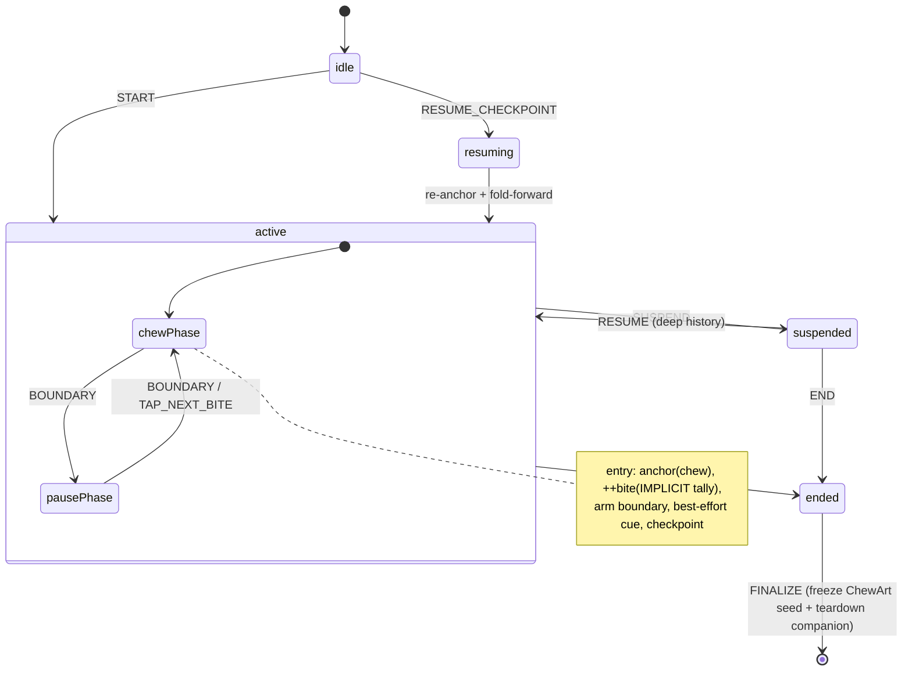

# Chewie — Chewing Engine, Phases & Generative ChewArt (Ring 1 Design)

> **Scope.** This document owns two Ring 1 ("Calm Core") subsystems: the real-time **Phase Engine** (`@chewie/engine`) and the **ChewArt** generative art system (`@chewie/art`). Both are pure, framework-agnostic TypeScript packages with no React and no network. They are the beating heart of the lovable offline product and must run in airplane mode forever.
>
> **Conformance.** Stack, naming, phases, and ethics follow `docs/00-architecture-spine.md`. This doc is also the **canonical owner** of three cross-cutting concerns the critique flagged as divergent across the doc set: (a) the drift-free **clock source of truth** (§2), (b) **in-progress session recovery after process death** (§2.6), and (c) the rule that **ChewArt reward channels are quantity-independent** (§11). Where sibling docs previously described these differently, they defer to this document.

### Canonical doc & path convention

All design docs live in `docs/` under a single `NN-name.md` scheme (this file is `docs/03-chewing-engine-and-art.md`). ADRs live in `docs/adr/NNNN-title.md` and are indexed in `docs/adr/README.md` (the single ADR index — reference ADRs by that index only; do not re-number locally). A CI link-checker (`pnpm docs:links`) walks `docs/` and fails the build on any dangling cross-reference or ADR id.

**Related docs (canonical filenames):**

| File | What this doc relies on |
|---|---|
| `docs/00-architecture-spine.md` | Rings, stack, naming, ethical guardrails, phases. |
| `docs/02-system-architecture.md` | App wiring, `@chewie/core-types` home of shared types. |
| `docs/04-sensing-fusion.md` | `@chewie/fusion`, `SensorMode`, `BiteEvent`, behavior signals (Ring 2). We *consume* its outputs; we never import it. |
| `docs/05-scoring-behavior.md` | `@chewie/scoring`, `BehaviorScore` (behavior-only, intake-blind), baseline/PB eligibility. |
| `docs/06-companion-plane.md` | Ring 3 mirrors our `EngineSnapshot` over a DataChannel; companion teardown. |
| `docs/07-data-model.md` | Encrypted SQLite schema (no weight/BMI/goal columns); persisted `TileSeed`, `MealSession`, and the **session checkpoint** shape (§2.6). |
| `docs/08-onboarding-and-safeguards.md` | First-run flow, age-band capture, permission priming, empty states, disordered-use safeguard, single-profile decision. |
| `docs/09-privacy-and-compliance.md` | DPIA, minor-safe defaults, Article 9 handling. |
| `@chewie/config` | **Single source of truth for placeholder default timings/palettes** (§4). Schema defaults in `07` import from here; the engine imports from here; they cannot drift. |

**ADRs referenced here:** `ADR-0010 — sleep-inclusive monotonic clock (ChewieClock)`, `ADR-0011 — deterministic seed+params ChewArt`. (See `docs/adr/README.md`.)

---

## 0. What I changed vs. the raw briefing (and why)

| Raw idea | Improvement here | Why |
|---|---|---|
| `setInterval` per-second decrement | **Sleep-inclusive monotonic clock as source of truth; UI reads the clock every frame; FSM uses self-correcting timeouts** | `setInterval` drifts and *freezes when backgrounded*, silently losing minutes over a 20–40 min meal. |
| "Solve backgrounding" (unspecified) | **Deterministic "fold-forward" replay on resume, plus explicitly *best-effort* OS cues** | JS timers suspend when the phone locks. Fold-forward recovers *state* exactly; cues are best-effort (§2.5). |
| `performance.now()` as the drift-free anchor | **A native sleep-inclusive clock (`mach_continuous_time` / `elapsedRealtimeNanos`)** | `performance.now()` maps to a clock that **does not advance during device sleep**; recompute-on-resume would *under-count*. This is the exact bug §2.1 calls out. |
| Naive luminance `0.299R+0.587G+0.114B` | **WCAG 2.2 relative luminance gated ≥4.5:1, ranked by APCA; text chosen to satisfy *both* animated endpoints** | The naive formula misjudges soft pastels and would flip text mid-fade. |
| Green ↔ amber phases | **Colorblind-safe defaults + redundant coding (lightness *and* glyph *and* label *and* haptics)** | Green/amber is one of the worst deuteranope pairs; never rely on hue alone. |
| Pause = fixed timer | **`pauseAdvance: 'timed' \| 'tap' \| 'either'`** | "Honoring pauses" means the pause shouldn't be cut off by a stopwatch. |
| Bite counter = raw taps | **Three reconciled bite sources (`IMPLICIT`/`MANUAL`/`SENSED`), one authority, and a *neutral tally only* — never a session-ending threshold** | Serves Phase 1 (tap) → Phase 2 (scale) without rewrite; removes any "bite quota" restriction lever. |
| "Mosaic from counts" | **Layered generative tiles whose *reward channels are quantity-independent*** | Counts/duration correlate with amount eaten; driving beauty from them creates a soft "ate more = prettier" gradient. Removed (§11). |
| Fixed art but no crash story | **Periodic session checkpoint + resume-on-relaunch + orphan reaper** | A 20–40 min on-a-stand meal *will* sometimes be OS-killed; losing the whole session (and the tile) silently is unacceptable (§2.6). |

---

## 1. Package layout & boundaries

```
packages/
  core-types/            # @chewie/core-types — the ONE home of BiteEvent, Estimate<T>, SensorMode
  config/                # @chewie/config — canonical default timings/palettes (§4)
  engine/                # @chewie/engine — pure, no React, no net
    src/
      clock.ts           # Clock abstraction over the native ChewieClock (§2)
      machine.ts         # XState v5 statechart
      selectors.ts       # elapsed/remaining/progress derivations (pure)
      reconcile.ts       # fold-forward replay on resume (§2.5)
      checkpoint.ts      # RecoverableSession snapshot/restore (§2.6)
      cues.ts            # CueBus interface (best-effort) — implemented by app
      biteSource.ts      # IMPLICIT | MANUAL | SENSED reconciliation (neutral tally)
      contrast.ts        # WCAG + APCA foreground resolution
  art/                   # @chewie/art — pure geometry + deterministic PRNG
    src/
      rng.ts             # xoshiro128** + SplitMix64 seeding (integer-exact)
      features.ts        # ArtFeatureVector (reward channels are quantity-independent)
      palette.ts         # temporal/behavioral palette derivation
      tile.ts            # tile geometry -> DrawOp[] (renderer-agnostic)
      compose.ts         # growing-mosaic layout (phyllotaxis / grid / panels)
      render/
        skia.ts          # DrawOp[] -> Skia (raster PNG)  (app-side)
        svg.ts           # DrawOp[] -> SVG string          (pure, deterministic)
apps/mobile/             # Expo app: React bindings, Reanimated/Skia, CueBus impl, native ChewieClock
```

**Hard rule:** `@chewie/engine` and `@chewie/art` never import each other, never import Ring 2/3, and emit **plain data**. Both consume shared types from `@chewie/core-types` (the single definition of `BiteEvent`, `Estimate<T>`, `SensorMode` — see §5, §9). The app wires everything together. This keeps them Vitest-unit-testable without a device and lets the companion plane mirror the same snapshots.

---

## PART A — The Phase Engine (`@chewie/engine`)

### 2. Timing: the drift-free clock (canonical source of truth)

#### 2.1 `performance.now()` is insufficient — this is the crux

The tempting anchor is `performance.now()` (Hermes) or `mach_absolute_time()` / `CLOCK_MONOTONIC`. **These do not advance while the device is asleep.** If the eater locks the phone for 4 minutes and we "recompute elapsed from the anchor" on resume using such a clock, we *under-count by the sleep interval* and land in the wrong phase — precisely the drift the feature claims to eliminate over a 20–40 min meal on a stand.

Therefore, the **elapsed-time-of-record uses a sleep-inclusive continuous clock**, exposed via a tiny native module `ChewieClock` (Expo config plugin):

- **Android:** `SystemClock.elapsedRealtimeNanos()` — counts *through* deep sleep.
- **iOS:** `mach_continuous_time()` — unlike `mach_absolute_time()`, it advances during sleep (the iOS analogue of `elapsedRealtime`).

`performance.now()` is retained **only** for per-frame foreground rendering math (§6), never for elapsed-time-of-record. `Date.now()` is a cross-check only (NTP/user clock changes cause jumps). See `ADR-0010`.

> This is the canonical definition. `docs/01`, `docs/02`, and `docs/09` reference `ChewieClock`/`Clock.monoNow()` from here rather than describing a `performance.now()`-based anchor.

#### 2.2 The clock abstraction

```ts
export interface Clock {
  /** Sleep-inclusive monotonic ms since an arbitrary epoch; advances during device sleep. */
  monoNow(): number;
  /** Wall-clock ms (Date.now); may jump. Used only for reconciliation cross-check + palettes. */
  wallNow(): number;
}
```

The injected `Clock` is the **single source of truth** everywhere elapsed time matters. Tests inject a scriptable fake; production injects the `ChewieClock`-backed impl.

#### 2.3 Elapsed derivation (pure)

Phase state is never "ticked". Everything is *derived* from timestamps captured at phase entry:

```ts
interface PhaseAnchor {
  phase: 'chew' | 'pause';
  index: number;          // cycle index (0-based)
  monoStart: number;      // Clock.monoNow() at phase entry (sleep-inclusive)
  wallStart: number;      // Clock.wallNow() at phase entry (reconciliation only)
  durationMs: number;     // planned duration (Infinity if tap-advance)
}

const elapsedInPhase = (a: PhaseAnchor, c: Clock) => c.monoNow() - a.monoStart;
const remainingMs   = (a: PhaseAnchor, c: Clock) => Math.max(0, a.durationMs - elapsedInPhase(a, c));
const phaseProgress = (a: PhaseAnchor, c: Clock) =>
  a.durationMs === Infinity ? 0 : Math.min(1, elapsedInPhase(a, c) / a.durationMs);
```

The **animation and the countdown read these selectors every frame**; the FSM only fires *discrete* boundary events. Both consult the same sleep-inclusive clock, so they can never desync — even if the JS thread stalls, the next frame reads the correct elapsed.

#### 2.4 Self-correcting boundary timer (replaces `setInterval`)

To fire the boundary transition we schedule **one** `setTimeout`, verify against the clock, and reschedule if the OS fired it early/late:

```ts
function armBoundary(anchor: PhaseAnchor, clock: Clock, send: Send) {
  let handle: Timeout;
  const tick = () => {
    const left = remainingMs(anchor, clock);
    if (left <= BOUNDARY_EPS_MS) { send({ type: 'BOUNDARY' }); return; }
    handle = setTimeout(tick, Math.min(left, MAX_TIMER_SLICE_MS)); // cap each slice, self-correct
  };
  tick();
  return () => clearTimeout(handle);
}
```

At most one wake/second while foregrounded, immune to timer drift, no per-second state mutation.

#### 2.5 Backgrounding: exact state recovery, *best-effort* cues

Two concerns are separate and must not be conflated: **recovering the correct phase** (exact, guaranteed) and **cueing the user while suspended** (best-effort).

**(a) State recovery — exact, via fold-forward.** On return to foreground (`AppState → 'active'`) we replay the deterministic schedule analytically. Because the clock is sleep-inclusive, `elapsedInPhase` is already correct on resume; we just consume whole phases:

```ts
function reconcileOnResume(ctx: SessionContext, clock: Clock) {
  const a = ctx.anchor;
  let overshoot = elapsedInPhase(a, clock) - a.durationMs;
  if (overshoot <= 0) return { anchor: a, foldedCycles: 0 };  // still mid-phase

  let cur = a, folded = 0;
  while (overshoot > 0 && !terminal(ctx)) {
    const next = nextPlannedPhase(cur, ctx.config);            // chew<->pause, ++index
    next.monoStart = cur.monoStart + cur.durationMs;           // anchor to the exact instant it should have started
    next.wallStart = cur.wallStart + cur.durationMs;
    overshoot -= next.durationMs;
    cur = next; folded++;
    if (biteBoundary(next)) ctx.biteState.implicit++;          // keep the neutral tally honest
  }
  return { anchor: cur, foldedCycles: folded, endReached: terminal(ctx) };
}
```

If `pauseAdvance:'tap'` (a pause has `durationMs = Infinity`), fold-forward parks in that pause — a savored pause is never auto-skipped.

**(b) Cueing while suspended — best-effort, NOT a guarantee.** The reliable cue path is **keep-awake + foreground**, which matches the on-a-stand, usually-charging use we design for. Everything beyond that is best-effort, and the docs must say so plainly:

- **`expo-keep-awake`** holds the calm screen on during a foregrounded session. This is the *guaranteed* path and the one the copy should encourage ("keep Chewie on-screen; it's happiest on a stand while charging").
- **Haptics while suspended are impossible on iOS.** `expo-haptics` only fires while the app is foreground/active. There is no "haptic still fires while frozen" path on iOS — do not claim one.
- **Local notifications are best-effort and capped.** iOS caps pending local notifications at **64**. A default metronome meal has a boundary roughly every ~18s (chew + pause), i.e. **~130 boundaries over 40 min** — more than we can pre-schedule, and a *suspended* app cannot reschedule. So we pre-schedule only the next handful of boundaries; if the app stays suspended past them, cues go silent mid-meal. Delivery timing is also imprecise. We therefore treat notification cues as a courtesy for brief lock intervals, not a full-meal metronome.
- **Permission may be denied/revoked.** See §8 for the notifications-denied degraded design (detect at session start, one-time calm explanation, fall back to keep-awake + foreground haptics).

**Net honest guarantee:** *state* is always recovered exactly on resume; *cues* are reliable only while foregrounded (keep-awake), and best-effort for short lock intervals. We never promise boundary cues survive OS suspension for a full-length meal.

**Secondary safety net (no native module):** if `ChewieClock` is unavailable we fall back to `Date.now()` with jump detection — divergence beyond `MAX_PLAUSIBLE_JUMP_MS` is treated as a clock correction and ignored. This keeps Ring 1 shippable everywhere, at reduced sleep-accuracy.

#### 2.6 Process-death recovery (checkpoint + resume + reaper)

Backgrounding (§2.5) is distinct from **process death** — OS memory kill, battery death, hard crash. The engine is headless and in-memory (`PhaseAnchor`, `biteState`, XState context live in RAM; Zustand session state is never persisted per `docs/07`). Without a checkpoint, a cold restart loses the whole mid-meal session silently: no tile, no partial history, no resume, and `docs/07`'s `MealSession` row is stranded at `status='active'` forever. Over a 20–40 min on-a-stand meal this *will* happen. **The engine owns recovery; `docs/07` owns the persisted shape.**

**Checkpoint.** Every `CHECKPOINT_INTERVAL_MS` (default 15 s) and on every phase boundary/suspend, the engine emits a minimal `RecoverableSession` that the app persists to SQLite (durable) with an MMKV mirror for fast launch read:

```ts
interface RecoverableSession {          // ~a few hundred bytes; defined in docs/07
  sessionId: string;
  config: SessionConfig;                // includes timing, mode, pauseAdvance
  startedAt: { mono: number; wall: number };
  anchor: PhaseAnchor;                  // last known phase + its start anchors
  biteState: { implicit: number; manual: number; sensed: number; authority: BiteAuthority };
  sensorMode: SensorMode;               // NONE at Ring 1
  updatedAt: { mono: number; wall: number };
  status: 'active';
}
```

**Resume-on-launch.** On cold start the app asks the engine to inspect any persisted `status:'active'` checkpoint:

```
onLaunch():
  cp = loadCheckpoint()
  if !cp: return normalStart()
  gapWall = wallNow() - cp.updatedAt.wall            // sleep-inclusive elapsed unavailable across process death → use wall
  if gapWall > STALE_SESSION_MS (e.g. 3h):
     reap(cp)                                        # too old to be "this meal" → finalize-or-discard silently
  else:
     offerCalmResume(cp)                             # "Pick up your meal, or wrap it up?"
```

Because a sleep-inclusive `monoNow()` epoch does **not** survive process death (a new epoch begins), we reconstruct elapsed across the death using `wallNow()` deltas (with jump-detection), then re-anchor the recovered `PhaseAnchor` to the fresh `monoNow()`. The calm resume sheet offers exactly two gentle choices — **"Continue this meal"** (re-anchor and fold-forward to now) or **"Wrap it up"** (finalize → generate the ChewArt tile from whatever was recorded, mark the session complete). No "you crashed / you failed" language.

**Reaper.** On launch (and lazily in the gallery), any `MealSession` still `status:'active'` older than `STALE_SESSION_MS` is closed by the reaper. Reaped and `maxMealGuard`-closed sessions are **flagged `unattended:true`** and are **excluded from baseline/PB** (`docs/05` baseline-eligibility) and produce, at most, a clearly-flagged tile (see §11, §16). See §3 for the companion-teardown interaction.

---

### 3. The finite-state machine

XState v5, pure (no network `invoke`, no React). One compound `active` state holds the chew ⇄ pause loop; a separate `suspended` state (user paused the *whole session*) uses deep history to resume the exact phase. Naming avoids the `pause phase` vs `suspend` collision.



```ts
type EngineEvent =
  | { type: 'START'; config: SessionConfig }
  | { type: 'RESUME_CHECKPOINT'; recovered: RecoverableSession }  // §2.6
  | { type: 'BOUNDARY' }                       // internal, from armBoundary
  | { type: 'TAP_NEXT_BITE' }                  // user taps to end a tap-advance pause
  | { type: 'LOG_BITE' }                       // manual bite log (MANUAL tally)
  | { type: 'SENSED_BITE'; event: BiteEvent }  // from @chewie/fusion (Ring 2), opaque
  | { type: 'SUSPEND' } | { type: 'RESUME' }
  | { type: 'END' }
  | { type: 'APP_RESUMED' };                   // triggers reconcileOnResume

interface SessionContext {
  config: SessionConfig;
  anchor: PhaseAnchor;
  biteState: { implicit: number; manual: number; sensed: number; authority: BiteAuthority };
  startedAt: { mono: number; wall: number };
  cycleCount: number;
  ended?: { reason: 'user' | 'maxDuration'; at: number; unattended?: boolean };
}
```

**Auto-end guards — corrected.** There is exactly **one** auto-end: `MAX_DURATION` (the `maxMealGuard`, default 60 min), a pure safety net for a forgotten-on-a-stand phone.

- **`targetBites` no longer ends a session.** The prior `TARGET_REACHED` auto-end is removed. Mechanically, a bite target that shortens a meal is an early-stop/restriction lever (configure a low target → app ends the meal after a few bites) and a "bite quota" surfaced to a watcher. Neither is acceptable under the ethical mandate. Bite count is a **neutral tally only, never a terminating threshold** (§5). If a soft target is ever kept, it may only *extend/encourage* (a gentle "you can keep going" nudge), never shorten — but the default and recommended behavior is no target at all.
- **`maxMealGuard` auto-close is flagged.** A `MAX_DURATION` close sets `ended.unattended = true`. Such sessions are **excluded from the self-vs-self baseline/PB** (`docs/05`) and generate at most a **clearly-flagged** tile (§16) — an unattended forgotten "meal" must not pollute the baseline or masquerade as a real session. On `FINALIZE`, the engine also emits a **companion-teardown** signal so any live pairing (`docs/06`) receives a clean end-of-session rather than a frozen frame (the companion shows "meal ended," pairing tears down; it never sees a stalled last frame).

Ending is never framed as failure; a short meal is valid (Quick Mode, §7.4).

---

### 4. Configuration model

```ts
interface PhaseTiming {
  chewMs: number;
  pauseMs: number;
  pauseAdvance: 'timed' | 'tap' | 'either'; // 'either' default: timer OR tap ends pause
}

interface SessionConfig {
  mode: 'meal' | 'quick';
  timing: PhaseTiming;
  maxMealMs: number;           // maxMealGuard safety cap
  biteAuthority: BiteAuthority;// which source is the displayed tally (§5)
  cues: CuePrefs;              // haptics/sound/notify toggles (best-effort — §2.5, §8)
  a11y: A11yPrefs;             // reduced motion, spoken guidance, palette
  palette: PhasePaletteId;     // colorblind-safe default
  // NOTE: intentionally NO targetBites, NO weight/calorie/goal field — nowhere to put one.
}
```

**Defaults come from `@chewie/config`, the single source of truth** — they are *not* hardcoded in this doc, the engine, or the schema independently (that is exactly how the three conflicting default sets crept in across docs). `@chewie/config` exports placeholder, clinician-review-pending values; the engine imports them, and the `docs/07` schema defaults import the same constants, so schema and engine cannot drift:

```ts
// @chewie/config — placeholder defaults pending clinician review; the ONLY source
export const DEFAULT_TIMING = {
  meal:  { chewMs: /* CONFIG */, pauseMs: /* CONFIG */, pauseAdvance: 'either' },
  quick: { chewMs: /* CONFIG */, pauseMs: /* CONFIG */, pauseAdvance: 'either' },
} as const;
export const MAX_MEAL_MS = /* CONFIG */; // maxMealGuard
```

All timings/colors are user-customizable (spine requirement). Palette tokens live in `docs/08` / the design system.

---

### 5. Bite counter — three sources, one authority, a neutral tally

```ts
type BiteAuthority = 'IMPLICIT' | 'MANUAL' | 'SENSED';

function biteCount(ctx: SessionContext): number {
  switch (ctx.biteState.authority) {
    case 'SENSED':   return ctx.biteState.sensed;   // Ring 2 scale/vision ground truth
    case 'MANUAL':   return ctx.biteState.manual;   // user taps "I took a bite"
    case 'IMPLICIT': return ctx.biteState.implicit; // # chew phases entered
  }
}
```

- **Phase 1 (offline):** authority = `IMPLICIT` (each chew phase = one guided bite) or `MANUAL`. Both increment independently, so switching authority never loses history.
- **Phase 2+ (Ring 2):** authority = `SENSED`. A `SENSED_BITE` can also *advance the phase* (start the next chew) when `pauseAdvance:'either'`, closing the loop between real behavior and the pacing guide. The engine treats `BiteEvent` as an **opaque, confidence-tagged datum — it does not read or store grams.**
- **`BiteEvent` is defined once** in `@chewie/core-types` (see §9) — the engine imports that single definition and never paraphrases it.

**Bite count is a neutral tally, full stop.** It never terminates a session (§3) and it is **not surfaced to the companion as a target or quota** — the companion sees only the running count as part of the calm mirror (§9), the same neutral number the eater sees, with no goal line.

---

### 6. Rendering the phases (app-side, on the UI thread)

The engine is headless. The app binds it with Reanimated + Skia. Continuous visuals are **clock-derived**, never JS-timer-derived. Per-frame math may use `performance.now()` for smoothness (foreground only); the *anchor* is always the sleep-inclusive `monoNow()`.

```ts
const elapsed = useSharedValue(0);
useFrameCallback(() => { 'worklet'; elapsed.value = monoNowWorklet() - anchor.monoStart; });
const progress = useDerivedValue(() => Math.min(1, elapsed.value / anchor.durationMs));
const bg = useDerivedValue(() => interpolateColor(crossfade.value, [0, 1], [fromColor, toColor]));
```

- **Full-screen color transition.** On a boundary a short `crossfade` `withTiming` (~700 ms ease) blends phase colors while `progress` continues from the clock. The whole screen is the background; the icon, label, and bar sit on top.
- **Progress.** Linear bar *and* a ring around the icon; both read `progress`. Reduced-motion → bar still updates, color transition instantaneous.
- **Edge pulse (optional).** A soft radial breathing glow (≈0.1 Hz pause, ≈0.9 Hz suggested chew rhythm). Aesthetic only; **off under reduced-motion**.
- **Central icon.** A distinct glyph per phase so phase is legible without color — part of redundant coding (§7.2).

---

### 7. Contrast, color & accessibility

#### 7.1 Foreground contrast resolution

WCAG 2.2 relative luminance (sRGB-linearized), gated ≥ **4.5:1** for text and ≥ **3:1** for the large icon, *ranked* by **APCA Lc** (better for soft pastels). Because the background *animates* between two phase colors, we pick a foreground that clears the bar against **both endpoints** so text never flips mid-fade.

```ts
const srgbToLinear = (c: number) => c <= 0.04045 ? c / 12.92 : ((c + 0.055) / 1.055) ** 2.4;
function relLuminance({ r, g, b }: RGB) {
  return 0.2126*srgbToLinear(r/255) + 0.7152*srgbToLinear(g/255) + 0.0722*srgbToLinear(b/255);
}
const contrastRatio = (l1: number, l2: number) => (Math.max(l1,l2)+0.05)/(Math.min(l1,l2)+0.05);

function resolveForeground(bgA: RGB, bgB: RGB, minRatio = 4.5): RGB {
  const lA = relLuminance(bgA), lB = relLuminance(bgB);
  const scored = FOREGROUND_TOKENS.map(fg => {
    const lf = relLuminance(fg);
    return { fg, worst: Math.min(contrastRatio(lf,lA), contrastRatio(lf,lB)),
             apca: Math.min(apcaLc(fg,bgA), apcaLc(fg,bgB)) };
  }).filter(c => c.worst >= minRatio).sort((a,b) => b.apca - a.apca);
  return (scored[0] ?? worstCaseInkOrPaper(lA, lB)).fg; // guaranteed fallback
}
```

A property test asserts every default palette yields a compliant foreground against both endpoints; a fuzz test does the same for random user colors, and the UI refuses to persist a custom palette that can't be made legible (offering an auto-adjusted nearest color).

#### 7.2 Colorblind-safe defaults & redundant coding

Green↔amber is a poor CVD pair, so defaults separate phases by **lightness and hue temperature** (cool/darker chew vs. warm/lighter pause), not hue alone. Phase is *also* signalled by **glyph**, **label** (i18n `nl`/`en`), **haptic pattern**, and optional **spoken guidance**. We ship CVD-tested presets (deuteran/protan/tritan-safe + high-contrast). **Never red** — the design system has no red/failure token (spine rule); pause is warm-amber, not "stop."

#### 7.3 Reduced motion, screen readers, eyes-free

- **Reduced motion:** cross-fades instant, edge pulse off, ChewArt live-build off (final tile still renders).
- **VoiceOver/TalkBack:** phase container announces on change ("Chew"/"Pause"); icon has role/label; countdown exposes `accessibilityValue`. `announceForAccessibility` on phase change.
- **Spoken guidance (eyes-free):** optional `expo-speech` speaks phase changes and gentle nudges — ideal at a dinner table where you're *not* staring at the phone. A first-class mode.

#### 7.4 Quick Mode

`mode:'quick'` = shorter chew/pause defaults (from `@chewie/config`), tips suppressed, minimal chrome. Still produces a ChewArt tile (flagged `quick`) unless the user disables snack tiles. Same FSM, different `SessionConfig`.

---

### 8. Cue bus (haptics / sound / notifications) — best-effort by contract

One interface so the engine emits *intent*; the app decides medium, respects prefs, and honors platform limits. Defaults are dinner-table-quiet (haptics on, sound **off**).

```ts
interface CueBus {
  onPhaseEnter(phase: 'chew' | 'pause', at: PhaseAnchor): void; // FOREGROUND haptic + optional soft tone
  onBite(count: number): void;                                  // foreground selection haptic
  scheduleBoundaryNotification(atWallMs: number, phase: 'chew'|'pause'): string; // best-effort, capped
  cancel(id: string): void;
  /** Session-start capability probe so the UI can explain degraded cueing honestly. */
  probeCapabilities(): { notifications: 'granted'|'denied'|'undetermined'; canHapticInBackground: false };
}
```

- Foreground haptics: chew→pause `impactAsync(Light)`; pause→chew `selectionAsync()`. **Background haptics are not attempted on iOS — they are impossible while suspended.**
- Notifications carry **absolute** boundary timestamps but are **best-effort**: subject to the iOS **64-pending cap** and imprecise delivery; only the next handful of boundaries are pre-scheduled, and a suspended app cannot reschedule (§2.5). They are a courtesy for brief locks, not a full-meal metronome.
- Sounds (if enabled): soft, short, non-alarming; no "you failed" tone exists.

**Notifications-denied / revoked degraded design.** At session start the engine calls `probeCapabilities()`. If notifications are `denied`/`undetermined`, the app shows a **gentle, one-time** explanation ("Cues work best with the screen on — keep Chewie on its stand while charging. Turn on notifications if you'd like brief reminders when the screen is off.") and **prefers keep-awake + foreground haptics as the guaranteed path**. We never silently rely on a cue channel that isn't there.

---

### 9. The snapshot the app (and the Companion) consumes

```ts
interface EngineSnapshot {           // serializable, no PII, no grams, no target/quota
  state: 'idle' | 'chew' | 'pause' | 'suspended' | 'ended' | 'resuming';
  cycleIndex: number;
  biteCount: number;                 // neutral running tally only — no target line
  remainingMs: number;               // derived at read time from the clock
  phaseProgress: number;             // 0..1
  totalElapsedMs: number;
  behaviorScorePreview?: number;     // from @chewie/scoring (behavior-only)
  currentTipId?: string;             // pause-only tip
}
```

Ring 3 mirrors exactly this over a WebRTC DataChannel (`docs/06`). Nothing here reveals mass, calories, camera data, or a bite target.

**Shared type provenance (one definition each).** The engine consumes two shared types that cross ring/companion boundaries; both are defined **once** in `@chewie/core-types` and imported, never paraphrased:

```ts
// @chewie/core-types — the ONLY definitions
type SensorMode = 'NONE' | 'SCALE_ONLY' | 'CAMERA_ONLY' | 'BOTH';

interface BiteEvent {
  tStartMonoMs: number;              // sleep-inclusive clock
  tEndMonoMs: number;
  intervalMsFromPrev?: number;
  chewProxyMs?: number;
  grams?: Estimate<number>;          // present only if a quantitative sensor exists; engine ignores it
  source: SensorMode;
  confidence: number;                // 0..1 (numeric — composes with fusion noisy-OR/min math)
  flags?: string[];
}

interface Estimate<T> {              // THE sanctioned quantitative-estimate shape (frozen)
  value: T; low: T; high: T;
  confidence: number;                // 0..1 numeric (NOT an enum) so fusion can combine estimates
  source: SensorMode;
  unit?: string;
}
```

Confidence is **numeric 0..1 everywhere** (chosen deliberately: it composes under fusion's noisy-OR/min math where an enum cannot). The shared "refuses to render a bare number" UI component keys off this single `Estimate<T>`. `docs/02`, `docs/04`, and `docs/09` cite these definitions from `@chewie/core-types` rather than restating them.

---

## PART B — ChewArt (`@chewie/art`)

### 10. Goals

Every completed meal deterministically yields a unique, beautiful mosaic tile ("Kauwkunst" in `nl` UI, `ChewArt` in code). Tiles accumulate over months into one growing artwork — the primary intrinsic motivator. Requirements: **deterministic & reproducible** (store seed+params, ~a few hundred bytes, re-render at any resolution), **varied & lovely**, **behavior-driven** (calm/thorough/steady sessions look *distinct* — never "less food = prettier"), **live-previewable**, exportable (PNG/SVG), stable across app versions. See `ADR-0011`.

### 11. Ethical firewall — reward channels are quantity-independent

This is the load-bearing fix. Earlier drafts mapped **bite count → mosaic grain richness** and **meal duration → tile scale**. Both bite count and duration correlate with *amount eaten*, and duration additionally rewards *prolongation* — so larger/longer meals rendered as visibly bigger, richer tiles. That is a soft quantity gradient in the primary intrinsic reward: a small-appetite eater's art would read as perpetually "lesser," and rewarding prolongation contradicts the "don't ratchet toward ever-slower/ever-longer" guardrail. Removed.

**Rules (enforced by property tests, §19):**

1. **Tile size is fixed.** All tiles render at one canonical size. Duration does **not** scale the tile. A short calm snack and a long calm meal occupy the same footprint.
2. **Grain richness is quantity-independent.** Cell count / grain density is a **fixed base range**, textured only by *behavior quality* (steadiness → crystalline vs. organic), never by bite count or duration.
3. **`biteCount` and `mealDurationMs` may feed only the *seed* (non-valenced entropy) and the recorded snapshot** — never any valenced/reward channel (size, grain richness, bloom, accents). Two meals of different amount but the same calm behavior therefore render as *different but equally rich* tiles.
4. **Reward channels are functions of behavior-quality features only** (pace-band-distance, pace variance, pause adherence, rhythm steadiness, self-vs-self consistency). Symmetric bands: erratic sessions produce *different*, not *worse*, art.
5. **No intake ever.** `ArtFeatureVector`'s constructor cannot receive grams/calories. Optional food *variety* (opt-in `@chewie/nutrition`) may add only **hue diversity**, a non-valenced dimension.

The invariant test (§19) asserts: increasing `biteCount` or `mealDurationMs` **cannot monotonically increase any reward channel's magnitude**, and perturbing any hypothetical intake input leaves every output byte unchanged.

### 12. Input: the session feature vector

```ts
interface ArtFeatureVector {
  // identity / reproducibility
  algoVersion: number;
  mealOrdinal: number;         // append-only index -> lattice position
  createdAtWall: number;       // epoch ms -> time-of-day & season palette

  // BEHAVIOR-QUALITY (the reward channels) — normalized, band-relative, quantity-free
  paceBandDistance: number;    // 0=centered in healthy band -> harmony
  paceVariance: number;        // steadiness -> lattice regularity vs. organic
  pauseAdherence: number;      // 0..1 honored pauses -> negative space
  rhythmSteadiness: number;    // -> flow-field coherence
  consistencyVsBaseline: number; // self-vs-self -> subtle "bloom" richness
  chewQuality?: number;        // Ring 2 (cadence) -> texture grain; optional

  // NEUTRAL ENTROPY ONLY — feed the seed + recorded snapshot, NEVER a reward channel (§11)
  biteCount: number;           // recorded; seed entropy; NOT grain, NOT size
  mealDurationMs: number;      // recorded; seed entropy; NOT tile scale
  mode: 'meal' | 'quick';
  unattended?: boolean;        // maxMealGuard/reaper-flagged (§2.6, §3) -> flagged tile (§16)
  varietyHue?: number;         // opt-in nutrition, non-valenced hue spread only
  // NOTE: no grams, no calories, no weight. Structurally absent.
}
```

Offline, the behavior-quality features are proxies from timing + taps; with Ring 2 they are scale/vision-derived (still behavior-only). Same pipeline either way — sensing makes the art *truer*, not different in kind.

### 13. Determinism: seed, PRNG, versioning

```ts
function deriveSeed(f: ArtFeatureVector, userSalt: bigint): { hi: number; lo: number } {
  const canon = canonicalize(f);            // fixed field order, fixed rounding
  let h = 0xcbf29ce484222325n;              // FNV-1a offset basis
  for (const b of utf8(canon)) { h = (h ^ BigInt(b)) * 0x100000001b3n & 0xffffffffffffffffn; }
  h ^= userSalt;                            // distinct users, identical session -> distinct art
  return { hi: Number(h >> 32n), lo: Number(h & 0xffffffffn) };
}
```

- **PRNG:** `xoshiro128**` seeded via `SplitMix64`, all `Uint32` integer math (no `Math.random`, no float accumulation). `nextFloat = (nextU32() >>> 8) / 2**24` — an exact IEEE-754 dyadic, identical on every CPU.
- **No GPU-nondeterministic ops** in generation: geometry is computed on the CPU into a renderer-agnostic `DrawOp[]`; Skia/SVG only *rasterize*. The **SVG path output is the deterministic ground truth**; the raster is derived and golden-tested with a perceptual tolerance.
- **`algoVersion`** is stored per tile; historical tiles re-render with their original generator (old versions in `render/versions/`, golden-tested) so improving the art **never retroactively mutates** a saved gallery.

```ts
interface TileSeed {              // the entire persisted tile — a few hundred bytes
  id: string; mealId: string;
  algoVersion: number;
  seedHi: number; seedLo: number;
  paletteId: string;
  latticeIndex: number;          // = mealOrdinal, position in the growing mosaic
  createdAtWall: number;
  features: ArtFeatureVector;     // snapshot -> full reproducibility
  flags: { quick: boolean; unattended: boolean; landmark?: 'gold' | 'bloom' };
}
```

### 14. Tile generation algorithm (layered, fixed-size, quantity-free reward)

Built in ordered layers, each consuming the PRNG so the whole tile is one deterministic stream. Output is `DrawOp[]` (rects, paths, gradients, opacity) — no rendering dependency. **The canvas is a fixed unit square (§11 rule 1).**

```
generateTile(seed, features) -> DrawOp[]:
  rng = xoshiro(splitmix(seed.hi, seed.lo))
  ops = []

  # L0. Palette (temporal cohesion + behavioral harmony) — §15
  pal = derivePalette(features, rng)
  ops.push(backgroundWash(pal.base))

  # L1. Mosaic grain: FIXED base count from the seed (quantity-free), texture from steadiness
  n      = GRAIN_BASE + rng.intRange(0, GRAIN_JITTER)   # NOT from biteCount/duration
  jitter = mix(0.02, 0.9, features.paceVariance)        # steady -> lattice; erratic -> organic
  sites  = poissonOrJittered(rng, n, jitter)
  cells  = voronoi(sites)                               # or square/hex grid when jitter ~ 0

  # L2. Fill cells: hue walk along palette; value from chew QUALITY (not duration)
  for cell in cells:
    depth = mix(0.35, 1.0, norm(features.chewQuality ?? 0.5))  # cadence quality, band-relative
    col   = pal.walk(rng, harmony = 1 - features.paceBandDistance)
    ops.push(fillPath(cell, shade(col, depth)))

  # L3. Motif overlay: flow field oriented by rhythm; coherence from steadiness
  field = flowField(rng, coherence = features.rhythmSteadiness)
  ops.push(...streaks(field, density = features.pauseAdherence, color = pal.accent))
  # honored pauses open airier negative space (lower density = calmer)

  # L4. Landmark accents: rare "special" flecks for self-bests / long savored pauses
  if features.consistencyVsBaseline > BLOOM_T: ops.push(...bloom(rng, pal))   # richness
  if strongPauseAdherence(features):           ops.push(goldFleck(rng))       # 'landmark'

  # L5. Quick-mode / unattended variants
  if features.mode == 'quick':   ops = simplify(ops)                          # calmer, still full-size
  if features.unattended:        ops = markUnattended(ops)                    # clearly-flagged (§16)

  return ops
```

Design intent per reward channel — **all behavior-quality, symmetric, quantity-free:**
- **pace-band-distance → harmony** (centered pace = analogous/serene; off-band = more contrast, still lovely).
- **pace variance → regularity** (steady = crystalline lattice; variable = organic Voronoi).
- **pause adherence → negative space** (honoring pauses = airier).
- **rhythm steadiness → flow coherence**.
- **chew quality → cell depth/texture** (cadence quality, not how long or how much).
- **consistency vs. your own baseline → subtle "bloom" richness** (self-vs-self).
- **grain base & tile size → fixed** (not bites, not duration).

### 15. Palette derivation (temporal cohesion so months read as one artwork)

```
derivePalette(features, rng):
  tod    = timeOfDay(features.createdAtWall)   # dawn|day|dusk|night hue families
  seasn  = season(features.createdAtWall)      # subtle hue shift across the year
  base   = hueFamily(tod, seasn)
  sat    = mix(0.25, 0.7, 1 - features.paceBandDistance)  # centered pace -> gently richer
  spread = features.varietyHue ?? smallDefault # opt-in nutrition variety = wider hues only
  return Palette(base, sat, spread, accent = complementSoft(base))
```

Anchoring palette to **time-of-day and season** makes a wall of many meals form a natural gradient — mornings cool, evenings warm, summers brighter — so the growing mosaic looks *composed*, not random. No palette uses a red "bad" state.

### 16. Growing mosaic composition (default: phyllotaxis spiral)

Each meal is one floret placed by the golden angle, so the artwork grows outward like a sunflower. **Tile scale is uniform (§11 rule 1)** — placement no longer takes a per-meal scale from duration.

```ts
function placeTile(latticeIndex: number): Placement {
  const GOLDEN = 137.50776405003785 * Math.PI / 180;
  const angle = latticeIndex * GOLDEN;
  const r = PHYLLO_C * Math.sqrt(latticeIndex);   // even areal density
  return { x: Math.cos(angle) * r, y: Math.sin(angle) * r,
           rotation: angle, scale: TILE_SCALE };   // constant, not duration-derived
}
```

Alternate layouts (`compose.ts`), all pure and reproducible: **calendar grid** (weeks × days "habit tapestry"), **monthly panels**, **dense packing**. Changing layout never mutates tiles, only placement. The mosaic is a virtual/infinite canvas; the gallery renders the viewport and export rasterizes the whole thing.

**Unattended tiles.** A `maxMealGuard`/reaper-flagged session (`unattended:true`) produces a **clearly-flagged, muted variant** (or, per user setting, no tile) and is placed but visually distinct; it is already excluded from baseline/PB (`docs/05`). This keeps a forgotten-phone "meal" from silently becoming a normal, baseline-shaping artwork.

```mermaid
flowchart LR
  S[Session ends / FINALIZE] --> F[ArtFeatureVector\nbehavior-quality + temporal only]
  F --> D[deriveSeed -> TileSeed\npersisted ~bytes]
  D --> G[generateTile -> DrawOp[]  (fixed size)]
  G --> R1[Skia raster -> PNG]
  G --> R2[SVG string (deterministic)]
  D --> C[placeTile (phyllotaxis, uniform scale)]
  C --> M[Growing mosaic canvas]
  M --> R1
```

### 17. Live preview

The tile is a pure function of the (possibly partial) feature vector, so during the meal we re-derive a **provisional** tile every few seconds — the eater watches it bloom as they eat (grain textures as steadiness settles, negative space opens as pauses are honored). Crucially, because grain and size are quantity-free, the preview does **not** visibly "grow richer the more you eat." Reduced-motion disables the animation (final tile still renders). At `FINALIZE` (or the resume sheet's "Wrap it up," §2.6) we freeze the snapshot → the definitive `TileSeed`.

### 18. Gallery, export & persist-failure safety

- **Empty / first-run states** (owned in detail by `docs/08`, surfaced here): a zero-tile gallery shows a calm "your first tile appears after your first meal" placeholder, not an error; history and insight views likewise show gentle empty states before any baseline exists.
- **Gallery:** virtualized grid, each cell re-rendered from `TileSeed` (kilobytes for years of meals). Tap → meal summary (`EngineSnapshot` history + behavior score; intake only if enabled and un-hidden) → export. Filter by month; view the composed mosaic.
- **PNG export:** `DrawOp[] → Skia → makeImageSnapshot()` at arbitrary resolution. Single tile or whole mosaic.
- **SVG export:** `DrawOp[] → svg.ts` emits deterministic vector paths — good for print/share.
- **Wallpaper:** render the mosaic at device resolution. **Android:** `WallpaperManager` / `ACTION_SET_WALLPAPER`. **iOS (honest limitation):** apps cannot set wallpaper programmatically → "Save to Photos" + one-tap Shortcut + Live-Photo option. Documented, not hand-waved.

**Persist-failure fallback (the reward moment must never fail silently).** Writing the finalized meal + tile to encrypted SQLite can fail (storage full, I/O error) — and this happens at the emotional peak of the meal. The finalize path is transactional and defensive:

```
finalize(session):
  tile = freezeTileSeed(session)          # cheap, in-memory
  showBloom(tile)                          # the reward animation fires from memory FIRST
  try:
    persist(meal, tile) with retry(backoff, n=3)
  catch StorageFull | IOError:
    keepInMemory(meal, tile)               # session stays recoverable via the checkpoint (§2.6)
    surfaceCalm("We couldn't save this meal yet — free up a little space and tap Retry.")
    offerRetry() / offerExportNow()
```

The bloom renders from memory before persistence is attempted, so the eater always sees their tile; a failed write becomes a calm, retryable "couldn't save yet" state, never a lost, silent reward.

---

## 19. Testing strategy

- **Clock & sleep (Vitest, fake clock):** inject a scriptable sleep-inclusive `Clock`; assert selectors match analytic truth; **simulate lock → device sleep → resume** and assert `reconcileOnResume` lands in the exact phase with correct remaining and folded tally. The `< 1s drift` spike target is measured on the **lock→sleep→resume** path (S2), *not* merely a foregrounded dimmed screen. Assert `pauseAdvance:'tap'` never auto-skips.
- **Process death (Vitest + integration):** write a checkpoint, simulate cold start with a fresh `monoNow()` epoch, assert wall-delta reconstruction, the resume sheet's two choices, stale-session reaping, and orphan `MealSession` closure.
- **FSM (@xstate/test):** every path idle→…→ended; SUSPEND/RESUME preserves phase & anchors; `MAX_DURATION` fires and flags `unattended`; **assert no bite-target auto-end exists**; no illegal transitions.
- **Contrast (property):** all default palettes + 10k random custom palettes clear ≥4.5:1 against both endpoints (or the UI blocks the palette).
- **Cue degradation (unit):** notifications-denied path surfaces the one-time explanation and never schedules; no background-haptic call on iOS.
- **Determinism (golden):** `generateTile` byte-identical for a fixed seed across iOS/Android CI runners; SVG snapshot per `algoVersion`; PNG perceptual-hash tolerance. Old `algoVersion` renderers keep passing their goldens forever.
- **Art ethics (property) — the load-bearing tests:**
  1. `ArtFeatureVector` has no intake field (type-level).
  2. Perturbing any hypothetical intake input leaves every output byte unchanged.
  3. **Increasing `biteCount` cannot monotonically increase any reward channel's magnitude** (grain richness, bloom presence, accent count, tile size).
  4. **Increasing `mealDurationMs` cannot monotonically increase any reward channel's magnitude** — tile size is constant across durations.
  5. Two feature vectors identical in behavior-quality but differing in `biteCount`/`mealDurationMs` yield tiles of equal size and equal grain-richness metric (they may differ via seed entropy, but not in *reward*).
- **A11y:** reduced-motion path emits zero animations; announcements fire on phase change; spoken-guidance TTS invoked on transitions.
- **Persist-failure:** simulate storage-full at finalize; assert bloom renders from memory, no silent loss, retry available.

## 20. Performance & battery

- Continuous work stays on the Reanimated **UI thread** via derived values; the JS thread handles only discrete boundary events (~1/sec foreground, 0 backgrounded).
- Live-preview re-render is **duty-cycled** (every N seconds, off under reduced-motion, skipped when backgrounded).
- Keep-awake pairs with the on-a-stand/charging use; cues are best-effort beyond that (§8).
- ChewArt generation is CPU geometry + one Skia rasterize on finalize; the gallery lazy-renders viewport tiles only.
- Checkpoints (§2.6) are ~a few hundred bytes every 15 s — negligible I/O.

## 21. Risks & open questions

- **iOS sleep-inclusive clock** requires the `ChewieClock` native module (`mach_continuous_time`). Fallback is keep-awake + wall-clock fold-forward with jump detection. *Open: verify `mach_continuous_time` under Low Power Mode and long lock; verify `elapsedRealtimeNanos` on aggressive Android OEM dozing.*
- **Background cueing is best-effort, by design.** Suspended-app haptics are impossible on iOS; notifications are capped at 64 pending and imprecise; a suspended app can't reschedule. Reliable cueing = keep-awake + foreground. Copy and onboarding must set this expectation; do not market a full-meal background metronome. *Open: does a short "screen dimmed but session live" nudge notification help without nagging?*
- **Process-death UX.** The resume sheet must feel caring, never accusatory. *Open: the exact `STALE_SESSION_MS` and whether "Wrap it up" should default-generate a tile for a very short recovered session.*
- **Skia cross-GPU raster determinism** isn't guaranteed for gradients/blur → SVG geometry is ground truth, raster golden-tested with tolerance. *Open: confirm tolerance thresholds on low-end Android GPUs.*
- **Colorblind default** moved off green/amber; needs a real CVD-user review pass (`docs/08` / design system).
- **`pauseAdvance:'tap'` + cues:** an indefinite pause has no boundary timestamp; we schedule a gentle "still paused?" nudge after a long interval instead. *Open: what interval feels caring, not nagging?*
- **iOS wallpaper** cannot be set programmatically — shipped as Save-to-Photos + Shortcut; manage expectations in copy.
- **Single-profile assumption.** This engine models one session at a time and `docs/07` models one `LocalProfile`; a shared family/kitchen device would blend baselines and age-gated defaults. *Open (owned by `docs/07`/`docs/08`): explicitly scope to single-user-per-device, or add lightweight local profile-switching — a decision the minor-safety mandate forces.*
- **Safeguard reach (cross-link, honesty note).** The engine's session-shape signals (session length, toggling, extreme self-set timings) are available by default, but the strongest disordered-use triggers listed elsewhere — "sustained extreme-low intake," "skipped-meal cadence" — depend on the *optional* intake pipeline being enabled and on the user continuing to open the app. The users at highest risk are exactly those who keep intake off or stop engaging, so those triggers are dark for them. The default-mode safeguard must lean on the behavior/usage signals that *do* exist here (session-shape anomalies, obsessive number-toggling, extreme bite timings), and `docs/08`/`docs/09` must state plainly in the DPIA and clinician review that engagement-based detection cannot reach a disengaged restrictor. This is not fully solvable in software; it is a known limitation, not a covered case.
