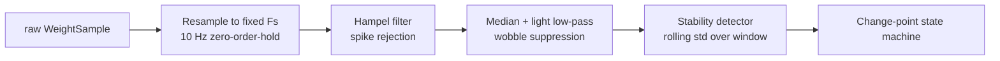
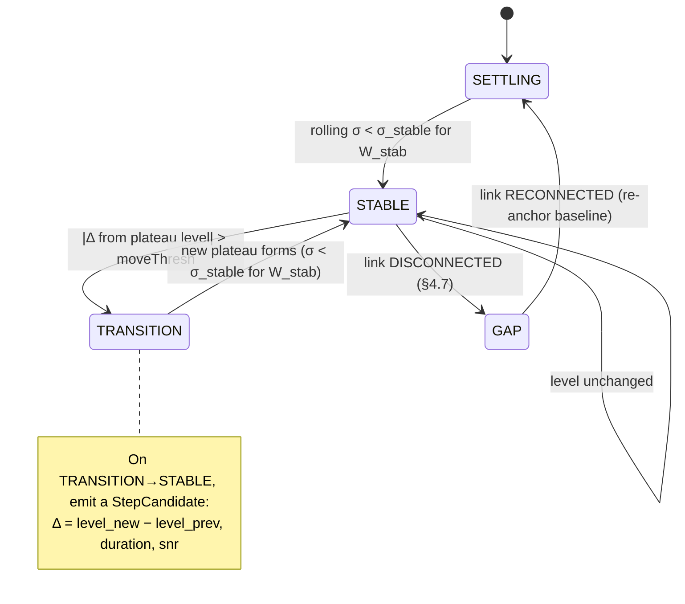
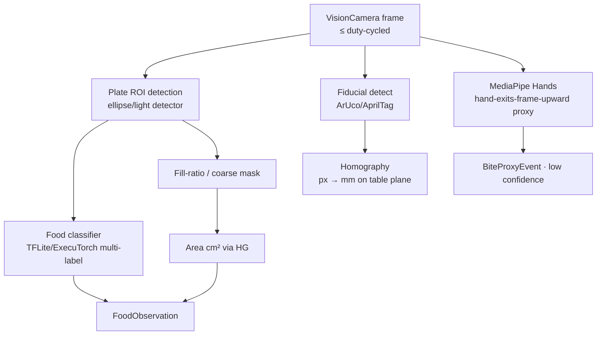

# Chewie Ring 2 — Sensing, Sensor Fusion & Meal AI

> Status: Design (Draft 2) · Owner: Sensing/Fusion area · Target phases: **Phase 2** (scale) and **Phase 3** (camera + nutrition + fusion)
> Ring: **2 — Sensing Layer** (on-device only; imports Ring 1, never imports Ring 3)
> Package footprint: `@chewie/fusion` (this doc's core), `@chewie/nutrition` (optional insight), plus native seams in `apps/mobile` for BLE and camera. Shared cross-ring types (`Estimate<T>`, `BiteEvent`, `SensorMode`, `SensorSource`) live in the Ring‑1 package `@chewie/core-types` and are **re‑exported, never re‑defined** here. A new opt‑in Ring‑2 consumer, **`@chewie/nourishment`** (`docs/10-nourishment-and-intake-targets.md`), reads this doc's **`MealEstimate`** intake fields; it lives entirely on the *intake* side of the §7.3 wall and does not change fusion.

This document specifies the **optional** sensing layer that sits on top of the Calm Core. Ring 2 is severable: with `RING2_SENSING_ENABLED = false` the app is the complete Phase‑1 product. Nothing here may weaken that guarantee.

### Related docs (canonical paths)

This repo uses one numbering scheme: `docs/NN-topic.md` for design docs, `docs/adr/NNNN-title.md` for ADRs. A CI link‑checker over `docs/` fails the build on any dangling cross‑reference.

| Path | What it owns (relative to this doc) |
|---|---|
| `docs/02-system-architecture.md` | Canonical rings/stack; the source of truth all docs conform to. |
| `docs/01-product-vision.md` | Product framing, personas, the ethical mandate. |
| `docs/02-system-architecture.md` | Ring/package boundaries, the module import rules this doc obeys. |
| `docs/03-chewing-engine-and-art.md` | `@chewie/engine` XState session, the **`ChewieClock`** sleep‑inclusive monotonic clock this layer timestamps against, and **in‑progress session persistence** (process‑death recovery). |
| `docs/05-scoring-model.md` | `@chewie/scoring`; consumes only the dimensionless `BehaviorSignals` defined here. Owns the chew sub‑score confidence table. |
| `docs/06-companion-and-pairing.md` | Ring 3; consumes structured state, not raw sensor streams. Shares the thermal budget in companion mode. |
| `docs/07-data-model-and-privacy.md` | SQLite schema, `LocalProfile`, default‑timings config, the persisted checkpoint shape, and the single/multi‑profile decision. |
| `docs/08-responsible-design-and-safety.md` | GDPR Article 9 handling, DPIA, disordered‑use safeguard, age‑band/first‑run flow. |
| `docs/09-roadmap-and-mvp.md` | Spike plan (S1/S2/S3), Definition of Done, battery/thermal budget gate. |
| `docs/10-nourishment-and-intake-targets.md` | Opt‑in, adults‑only **Nourishment Mode** (package `@chewie/nourishment`). **Consumes** this doc's `MealEstimate` — specifically `nutrition.macros.energyKcal` and `totalConsumedG` (both ranged `Estimate`s, §6/§8) — to score a **two‑sided Portion Balance (Adequacy)** against a personal target band. Lives on the *intake* branch, right of the §7.3 wall; the wall and `@chewie/scoring` are **unchanged**. |

**ADR index (canonical numbering — no collisions):**
`0001` client‑react‑native‑expo · `0002` concentric‑rings · `0003` supabase‑backend · `0004` ondevice‑first‑ai · `0005` scale‑primary‑and‑fusion‑modes · `0006` scale‑driver‑abstraction · `0007` companion‑webrtc‑p2p · `0008` isolated‑behavior‑scoring · `0009` local‑first‑encrypted‑sqlite · `0010` monotonic‑clock‑timing. This doc leans on `0004`, `0005`, `0006`, `0008`, `0010`.

---

## 1. What this layer is, and what I changed from the raw brief

The raw vision leaned on the camera to estimate "how much you ate." Cameras are the *weakest* quantitative sensor for mass. This design **inverts that**: the kitchen scale is the ground truth for grams and pace; the camera does the jobs it is actually good at (identifying food, estimating portion only when there is no scale, cheap bite cues). Concretely, the improvements over the raw briefing:

| # | Raw idea | This design | Why |
|---|----------|-------------|-----|
| 1 | "A scale under the plate" | **Recommend continuous‑streaming scales that also physically fit a dinner plate** (footprint + capacity + off‑centre‑load criteria in §3.1), and be explicit that most *kitchen* scales are unusable (stabilize‑only + auto‑power‑off). | Bite tracking needs the streaming weight curve, and the plate must sit **stably and fully** on the platform or step detection is corrupted. |
| 2 | Threshold on weight drop = bite | **Hysteresis change‑point state machine** (dwell‑gated plateaus + Hampel despiking + up/down‑step pairing) that separates bites from utensil rests, added food, plate wobble, and bowl lifts, **plus explicit reconnect/re‑tare handling**. | Naive thresholding double‑counts and misreads every reconnect as a giant bite. |
| 3 | Camera estimates calories | Camera → **food *label* + fiducial *area*** only; grams come from the scale; nutrition is `grams × per‑100g DB range` with **propagated confidence intervals**. | Honest error budget. Camera‑only mass is ±40–100%; never presented as precise. |
| 4 | "A score for how much / how healthy" | **Only dimensionless behavior signals cross the type boundary into `@chewie/scoring`.** Grams/macros stay in `@chewie/nutrition`, off by default, hideable, range‑only. | Structural enforcement of the ethical mandate — "ate less" is architecturally incapable of raising the primary score. |
| 5 | Single sensor assumed | **Four first‑class fusion modes** with per‑field provenance and confidence; graceful degradation, never fabricated precision — including a **shared‑plate / multi‑eater "can't measure" state**. | The app is honest with any hardware combination *and* at a real family dinner table. |
| 6 | Camera watches your face to count chews | **Overhead single‑camera geometry cannot see a frontal face.** Chew‑count / hand‑to‑mouth are demoted to weak, low‑confidence proxies (or an optional second front camera); the primary rhythm signal is **scale step‑timing + inter‑bite dwell**. | The stand points *down at the plate*; FaceMesh needs a frontal face it will not get (§5). |
| 7 | — | **Single sleep‑inclusive `ChewieClock`** shared with `@chewie/engine`; camera frames and BLE samples timestamped on arrival. | Drift‑free correlation that survives a locked/asleep screen — the exact failure a wall‑advancing `performance.now()` would cause. |

---

## 2. Sensor overview and the four modes

```mermaid
flowchart LR
  subgraph Device[Eater device · on-device only]
    S[BLE Scale driver\n0x181D / vendor / OCR / manual] -->|WeightSample stream| F[Fusion Engine\n@chewie/fusion]
    C[VisionCamera frame processors\nfood ID · bite proxy · fiducial] -->|FoodObservation\n+ BiteProxyEvent| F
    E[Session Engine\n@chewie/engine · ChewieClock] -->|phase / countdown| F
    F -->|BehaviorSignals\nDIMENSIONLESS| SC[@chewie/scoring\nBehaviorScore]
    F -->|MealEstimate\ngrams · macros · ranges| N[@chewie/nutrition\nBalanceInsight · optional/hideable]
    F -->|MealEstimate\nenergy · mass · ranges| NM[@chewie/nourishment\nPortion Balance · opt-in/adults-only · docs/10]
    F -->|local-only usage patterns| SG[Disordered-use safeguard\nlocal heuristic]
    F -->|structured state| R3[(to Ring 3 companion\nphase/bite/score/tip only)]
  end
```

`SensorMode` is chosen at session start from what is connected, and can degrade mid‑meal (e.g. scale disconnects → fall to `CAMERA_ONLY` or `NONE`). Degradation is announced calmly, never as a failure. The enum is defined once in `@chewie/core-types`:

```ts
// @chewie/core-types — shared across rings; NOT redefined in fusion.
export enum SensorMode {
  NONE        = 'NONE',        // manual bite taps only; timing behavior only
  SCALE_ONLY  = 'SCALE_ONLY',  // ground-truth grams + pace; food unknown
  CAMERA_ONLY = 'CAMERA_ONLY', // food ID + rough fiducial portion + weak bite proxy
  BOTH        = 'BOTH',        // scale mass + camera ID/cues — best available
}
```

| Capability | NONE | SCALE_ONLY | CAMERA_ONLY | BOTH |
|---|---|---|---|---|
| Bite detection | manual tap | weight step | hand‑exits‑frame proxy | weight step ∩ camera proxy |
| Grams / bite | – | ✅ conditional (§3.1, §9) | ⚠️ rough range | ✅ conditional |
| Pace (g/min) | – | ✅ | ⚠️ | ✅ |
| Pace (bites/min) | ✅ | ✅ | ⚠️ | ✅ |
| Food identity | manual | manual | ⚠️ top‑k | ⚠️ top‑k |
| Nutrition insight | off | manual‑food only | rough ranges | best ranges |
| Chew / pause behavior | timing | timing + inter‑bite dwell | dwell + weak jaw proxy* | all |
| Primary score works | ✅ | ✅ | ✅ | ✅ |

*Jaw/chew cadence is only reliable with an optional front‑facing camera; overhead‑only, it is experimental — see §5.5.

Key invariant: **the primary `BehaviorScore` works in every mode, including `NONE`.** Sensing only enriches it; it is never a prerequisite.

### 2.1 The shared clock (standardized across all timing docs)

All Ring‑2 timestamps use the **same injected `ChewieClock` as `@chewie/engine`** (see `docs/03-chewing-engine-and-art.md §2.2`). This is a native module wrapping **`mach_continuous_time()` on iOS** and **`SystemClock.elapsedRealtimeNanos()` on Android** — clocks that **continue advancing while the device is asleep**.

> **Do not use `performance.now()` / `mach_absolute_time()` for meal timing.** They *pause while the device sleeps*, so a recompute‑on‑resume after a locked screen would **under‑count** elapsed time and land the session in the wrong phase and mis‑align bite/frame events. The `ChewieClock` is the single source of truth everywhere; `now()` in the snippets below is `ChewieClock.nowMs()`.

Camera frames and BLE samples are stamped with `ChewieClock.nowMs()` on arrival, so bite steps, camera bite proxies, and Ring‑1 phase boundaries share one timeline with no drift across sleep.

---

## 3. The scale — primary quantitative sensor

### 3.1 The honest reality of consumer BLE scales — and the platform‑fit problem

Consumer BLE scales are badly fragmented, and most are actively *hostile* to continuous meal monitoring:

- **Stabilize‑only reporting.** Most kitchen scales transmit only one "settled" number and discard the streaming curve we need.
- **Auto‑power‑off.** Many power down after 30–120 s of "no change," mid‑meal, because chewing pauses look like inactivity.
- **Proprietary/undocumented GATT** or **advertising‑only** data (weight in BLE manufacturer/service‑data, no connection).
- **Notify‑only, no read**, sometimes with vendor keep‑alive/checksum quirks.

**Streaming behaviour is necessary but not sufficient.** A scale must *also physically suit a meal*. Smart *coffee/espresso* scales (Acaia, Bookoo, Felicita, Decent, …) have the ideal firmware — 5–20 Hz continuous streaming, 0.1 g resolution, stay‑on under static load — **but many have small, cup‑sized platforms**. A dinner plate or a wide bowl overhangs the platform, sits on the rim, or tips, producing **tilt/contact artifacts** that directly corrupt step detection. So reference‑hardware selection is a **two‑axis** problem:

**Reference‑hardware criteria (both axes required):**

| Firmware axis | Physical axis |
|---|---|
| Continuous unstable streaming ≥ 5 Hz | **Platform footprint ≥ plate contact area** (target ≥ 150 mm across, ideally a flat top with no raised lip) |
| Stays on under static load (no aggressive auto‑off) | **Capacity ≥ 2 kg** (plate + full portion) |
| 0.1 g resolution preferred | **Off‑centre‑load tolerance** (four‑load‑cell or verified corner linearity) so an overhanging plate does not skew readings |
| Documented notify characteristic or known driver | Stable, non‑slip top so the plate does not creep |

Very few coffee scales meet the physical axis. In practice the curated list will pair **a streaming coffee‑scale controller class** with **larger‑platform smart kitchen scales that happen to stream**, and we publish a capability matrix per certified device. **We do not over‑promise "works with any scale."** The **S1 spike** (`docs/09` §S1) **validates step detection with an actual dinner plate and a bowl loaded to a realistic mass — not a coffee cup** — and measures off‑centre error; a device that fails the physical axis is not certified even if its firmware is perfect.

We model each scale by *capabilities*, not by brand:

```ts
// packages/fusion/src/scale/types.ts
export type ScaleTransport =
  | 'GATT_WSS'          // Bluetooth SIG Weight Scale Service 0x181D
  | 'GATT_PROPRIETARY'  // vendor notify characteristic
  | 'ADV_SERVICE_DATA'  // weight broadcast in advertisements (no connection)
  | 'OCR'               // camera reads the LCD (conditional — see §3.4)
  | 'MANUAL';           // user types grams

export interface ScaleCapabilities {
  transport: ScaleTransport;
  continuousStream: boolean; // emits UNstable readings? ← single most important firmware flag
  sampleRateHz: number;      // effective, measured at connect
  resolutionG: number;       // 0.1 / 1 / 5
  platformMinDimMm?: number; // physical-axis metadata for plate-fit warnings
  capacityG?: number;
  autoPowerOffSec?: number;  // known/observed; undefined = unknown
  supportsTare: boolean;
}

export interface WeightSample {
  tMonoMs: number;   // ChewieClock arrival stamp (sleep-inclusive, shared with @chewie/engine)
  grams: number;     // normalized to grams, sign-corrected, tared
  stable: boolean;   // device's own stability flag if available, else derived
  rawUnit?: 'g' | 'kg' | 'oz' | 'lb';
}
```

### 3.2 Bluetooth SIG Weight Scale Service (0x181D)

When a scale implements the standard, parsing is well‑defined:

- **Service** `0x181D` (Weight Scale). Related: Body Composition `0x181B`, User Data `0x181C`.
- **Weight Measurement** char `0x2A9D`, property **Indicate**. Payload: a `Flags` byte then a `uint16` weight.
  - `Flags` bit0: units (0 = SI kg, 1 = Imperial lb). bit1: timestamp present. bit2: user‑id present. bit3: BMI+height present.
  - Resolution comes from **Weight Scale Feature** char `0x2A9E` (Read): typically **0.005 kg** (SI). So `grams = raw * 5` for SI at 0.005 kg resolution.
  - Optional trailing fields (timestamp, user id, BMI/height) appear in flag order.

```ts
// packages/fusion/src/scale/drivers/sig-wss.ts  (sketch)
function parseWssMeasurement(buf: Uint8Array, feature: WssFeature): WeightSample {
  const flags = buf[0];
  const si = (flags & 0b1) === 0;
  const raw = buf[1] | (buf[2] << 8);          // uint16 LE
  const grams = si ? raw * (feature.weightResolutionKg * 1000)  // e.g. 0.005 kg → *5
                   : raw * (feature.weightResolutionLb * 453.59237);
  return { tMonoMs: now(), grams, stable: true, rawUnit: si ? 'kg' : 'lb' };
}
```

Caveat we must not paper over: `0x2A9D` is **Indicate**, intended for *stabilized* measurements. Standard WSS scales are usually the *wrong* tool for continuous bite tracking. WSS support is a nice‑to‑have; the streaming drivers below are the workhorses.

### 3.3 Vendor / proprietary protocols

`@chewie/fusion` ships a **driver registry**. Each driver declares how to recognize a device and how to turn its bytes into normalized `WeightSample`s. Categories seen in the wild:

1. **Proprietary GATT notify** (most smart coffee scales). Custom service + notify characteristic streams frames like `[header, cmd, weightBytes…, sign, unit, checksum]`. Weight is often a 24‑bit signed integer in 0.1 g, sign in a dedicated byte, XOR/sum checksum. Many need a "start streaming"/"tare" command written back.
2. **Advertising / service‑data broadcast.** Weight lives in BLE **service data** under `0x181B`/`0x181D` or manufacturer data; no GATT connection — parse advertisements. Lower rate, but no connection to lose to auto‑power‑off.
3. **Notify‑only with keep‑alive.** Periodically write a no‑op/keep‑alive to defeat auto‑power‑off where the protocol allows.

```ts
export interface ScaleDriver {
  id: string;                      // 'acaia-v2', 'sig-wss', 'xiaomi-adv', ...
  displayName: string;
  match(adv: BleAdvertisement): number;      // 0..1 confidence this driver fits
  connect(dev: BleDevice): Promise<ScaleConnection>;
}

export interface ScaleConnection {
  readonly capabilities: ScaleCapabilities;
  readonly samples: AsyncIterable<WeightSample>; // normalized, deduped, ChewieClock-stamped
  readonly events: AsyncIterable<ScaleLinkEvent>; // connect/disconnect/reconnect/tare-lost
  tare(): Promise<void>;
  keepAwake(): void;   // driver-specific anti-power-off (write keep-alive, etc.)
  disconnect(): void;
}

export type ScaleLinkEvent =
  | { kind: 'CONNECTED' }
  | { kind: 'DISCONNECTED'; tMonoMs: number }
  | { kind: 'RECONNECTED'; tMonoMs: number; tareLikelyLost: boolean }; // see §4.7
```

Adding a scale = adding a driver behind this interface; **fusion logic never changes** (ADR `0006-scale-driver-abstraction.md`).

### 3.4 Camera‑OCR fallback — **conditional**, not universal

When no BLE driver matches, the overhead camera *can* read the **seven‑segment LCD**. But with a **plate or bowl sitting ON the scale, the display (usually a front‑top edge strip) is frequently occluded by the plate and viewed at a glare‑prone oblique angle from directly above.** OCR is therefore **demoted from "universal fallback" to a conditional path**, offered only when a preflight check confirms the LCD is actually legible.

- **Preflight gate:** during setup we ask the user to place the plate, then attempt to locate and read the LCD for ~3 s. OCR is only offered if the digits are visible and decode stably (no plate occlusion, tolerable glare). Otherwise we skip straight to **manual entry** and say so plainly.
- Setup (if legible): user drags a box over the display once → store ROI in fiducial/homography coordinates so it survives small camera nudges.
- Per frame (throttled ~2–4 Hz): warp ROI → adaptive threshold → segment digits → seven‑segment decode (SSOCR‑style geometry or a tiny TFLite digit model). Emit `WeightSample{ stable: <flicker‑based> }`.
- Honesty/limits: lower rate; sensitive to glare/parallax/leading‑zero blanking **and plate occlusion**; resolution limited to the display (usually 1 g). OCR‑sourced curves carry reduced confidence and require **more plateau evidence** per bite (§4), and every OCR bite is flagged `OCR_SOURCED`.

```ts
// capabilities for OCR path (only after the legibility preflight passes)
{ transport: 'OCR', continuousStream: true, sampleRateHz: 3, resolutionG: 1, supportsTare: false }
```

### 3.5 Manual entry

Always available, and the default fallback when neither BLE nor a legible LCD is present. User can enter a start weight and/or per‑bite estimates. In `NONE`, bites are taps (Ring 1 already has the tap counter); manual grams are optional and clearly ranged.

---

## 4. Weight‑curve → bite segmentation

The heart of `SCALE_ONLY`/`BOTH`. Input: a normalized `WeightSample` stream. Output: a sequence of classified `WeightEvent`s, from which we derive bites, pace, and totals.

### 4.1 Signal model

Eating produces a **descending staircase**:

```
grams
  │▔▔▔▔╲                 W0 (plate+food, tared baseline)
  │     ╲___             ← bite 1 (down-step ΔW1), then plateau (chew/pause)
  │         ╲__          ← bite 2
  │      ╱▔╲   ╲___      ← utensil rest (up then equal down)  /  add food (sustained up)
  │            ╲______   ← ...
  └───────────────────── t
```

- **Down‑step, sustained** → candidate **BITE** (mass = ΔW).
- **Up‑step, sustained, unmatched** → **ADD_FOOD** (excluded from consumption).
- **Up‑step then matching down‑step of ≈equal magnitude** → **UTENSIL_ON/OFF** (net zero, excluded).
- **Excursion to ≈0 / large negative then return** → **LIFT** (bowl lifted); returns *lower* → the delta is a **DRINK/bite‑from‑bowl**.
- **High‑frequency zero‑mean jitter** → **wobble/NOISE** (rejected).

### 4.2 Preprocessing pipeline



- **Resample** to fixed `Fs` (10 Hz); OCR/adv sources upsample by hold.
- **Hampel filter** (median ± k·MAD over a small window) removes single‑sample spikes (bumping the table) without smearing real steps.
- **Stability**: a sample is *in a plateau* when rolling σ over `W_stab` (400 ms) < `σ_stable` (≈ max(0.5 g, 1.5×resolution)).

### 4.3 The state machine (deterministic, explainable)

We deliberately avoid black‑box models here — this drives an intake number, so it must be auditable and reproducible.



Each `STABLE→STABLE` (via `TRANSITION`) produces a **StepCandidate**; classification turns candidates into `WeightEvent`s.

### 4.4 Classification & noise handling

```ts
type WeightEventType =
  | 'TARE' | 'BITE' | 'ADD_FOOD' | 'UTENSIL_ON' | 'UTENSIL_OFF'
  | 'LIFT' | 'DRINK' | 'GAP' | 'NOISE';

interface StepCandidate { tStart: number; tEnd: number; delta: number; levelBefore: number; levelAfter: number; snr: number; }
```

```
classifyStep(c, ctx):
  if ctx.inGap:                                          return NOISE   # suppressed across a disconnect
  if |c.delta| < max(MIN_BITE_G, NOISE_FLOOR*K):        return NOISE   # below detectable
  if c.delta < 0:                                        # weight decreased
     if levelAfter ≈ 0 within LIFT_EPS:                  return LIFT    # bowl lifted
     if pendingUtensilUp and ≈-pendingUtensilUp.delta:   return UTENSIL_OFF  # fork removed
     return BITE                                         # the common case
  else:                                                  # weight increased
     if |c.delta| within UTENSIL_MASS_BAND:              push pendingUtensilUp; return UTENSIL_ON
     if c.delta ≥ MIN_ADD_G:                             return ADD_FOOD
     return NOISE
```

Robustness rules baked in:

- **Minimum dwell + hysteresis** prevent chatter: a step only counts once a *new* plateau forms; a re‑descent within the same TRANSITION is one step, not many.
- **`MIN_BITE_G`** default 2–3 g. Below the noise floor we refuse to count rather than invent crumbs.
- **Utensil pairing:** an up‑step within the fork/spoon mass band (config, ≈10–60 g) is held as `pendingUtensilUp`; a later ≈equal down‑step cancels it (`UTENSIL_OFF`) — **net zero, not a bite**. If unmatched at meal end, reconsidered as `ADD_FOOD`/noise.
- **Lift vs bite‑from‑bowl:** during a `LIFT` we suppress step detection; on return we compare pre‑lift vs post‑lift plateau. Equal → pure lift (excluded). Lower → a `DRINK`/bite whose mass = the difference.
- **Add‑food re‑baselining:** `ADD_FOOD` shifts the running baseline but is **never** added to `totalConsumed`. User can also tap "I added food" to force a re‑baseline.
- **Ambiguity → under‑count, flag, lower confidence.** When a sequence is genuinely ambiguous (e.g. fork+food lifted together, arm resting on the plate), we mark the bite `UNCERTAIN` (or drop it) over fabricating a precise number. Camera bite proxy (BOTH mode) disambiguates some of these.

### 4.5 Derived metrics

```
totalConsumedG   = Σ ΔW over events ∈ {BITE, DRINK}         # robust to adds/utensils
biteCount        = |events ∈ {BITE}|
meanGramsPerBite = totalConsumedG / biteCount
paceGramsPerMin  = totalConsumedG / (mealDurationMin)       # overall, gap-adjusted
paceCurve[t]     = Σ ΔW in sliding window(t, Wpace=90s) / (Wpace/60)   # instantaneous g/min
biteIntervalMs   = tStart(biteᵢ) − tStart(biteᵢ₋₁)          # excludes gap spans
chewProxyMs      = plateau duration AFTER a bite (chewing+pause between bites)
leftoverG        = finalPlateau − plateOnlyTare            # only if plate tared separately
```

`chewProxyMs` is explicitly a **proxy** (mass is static during both chewing and a pause). The scale gives inter‑bite dwell — which, per §5.5, is our **primary** rhythm signal because true chew *count* from an overhead camera is unreliable.

### 4.6 Per‑bite confidence

```ts
biteConfidence =
  w1 * clamp(snr / SNR_REF, 0, 1) +          // step sharpness vs noise
  w2 * plateauStability +                    // how clean the before/after plateaus were
  w3 * (cameraAgreement ? 1 : 0.5) +         // camera bite proxy match (BOTH mode, weak)
  w4 * transportQuality +                    // 0.1g GATT ≈ 1.0; 1g / OCR / adv ≈ 0.5–0.7
  w5 * (contactAmbiguityDetected ? 0.4 : 1); // arm/fork-leverage/utensil ambiguity penalty
// weights sum to 1; result in [0,1]; flags list any UNCERTAIN reasons
```

`transportQuality` and `contactAmbiguityDetected` mean the per‑bite `Estimate` confidence **visibly degrades** for OCR/advertising sources, 1 g‑resolution scales, and detected utensil/contact events — so a plate on a small platform never yields a falsely tight number (§9).

### 4.7 Scale reconnect & re‑tare mid‑meal (new)

Auto‑power‑off (30–120 s) and BLE drops **will** happen over a 20–40 min meal — keep‑alive writes only help "where the protocol allows." A dropped scale usually **loses its tare and resets to 0** on reconnect, so the reconnected stream is **discontinuous** with the pre‑drop curve. Without handling, the first post‑reconnect plateau reads as a huge spurious `BITE` (weight jumped down to ~0) or `ADD_FOOD` (plate re‑placed).

Procedure:

1. On `DISCONNECTED`, the state machine enters `GAP`. **All step detection is suppressed** until reconnect. A `GAP` marker with `tStartMonoMs`/`tEndMonoMs` is recorded.
2. On `RECONNECTED` with `tareLikelyLost = true`, **re‑anchor the baseline** from the *current* stable plate weight rather than assuming continuity. If the device retained its tare (`tareLikelyLost = false`) and the level matches the pre‑gap plateau within tolerance, resume seamlessly.
3. If the plate was disturbed during the gap (post‑gap plateau differs from pre‑gap and no plausible single bite explains it), prompt a **calm re‑tare** ("Scale reconnected — I've re‑set the baseline. Anything you ate during the drop wasn't counted.").
4. **Any bite whose interval spans a gap is dropped or flagged `UNCERTAIN`**; the gap span is excluded from pace denominators; total‑consumed confidence is reduced proportionally to gap duration. Gaps are surfaced in `overallConfidence` and the disclaimer list.

This means a reconnect can never manufacture a giant bite or add‑food, at the cost of honestly not counting food eaten during the drop. See §10 (risks).

### 4.8 Multiple eaters / shared plate — the "can't measure" state (new · blocker fix)

Chewie's core positioning is the **shared dinner table**. The scale ground‑truth model assumes **one eater, one plate/bowl on the scale**. When two+ people eat from a **shared serving bowl on the scale**, weight step‑downs are conflated across eaters and grams/bite, pace, and totals become **meaningless**; the camera's bite proxy will also register *other people's* hands with no attribution.

We do **not** fabricate numbers in this case. We **detect** it and **degrade**:

**Detection heuristics (any one triggers `SHARED_PLATE_SUSPECTED`):**
- **Implausible pace / bite size** — sustained g/min or grams/bite far above a single‑eater plausibility ceiling (e.g. > 2× the top of the population band for a sustained window).
- **Large/repeated refills** — frequent big `ADD_FOOD` steps consistent with communal serving.
- **Multiple tracked hands** — camera (when present) tracks ≥ 2 distinct hands entering the plate ROI within the same window.
- **Interleaved down‑steps faster than one person plausibly chews** (dwell far below any healthy band for a sustained run).

**Degradation:**
- Enter a calm **"Shared plate — I can't measure grams here"** state. **All grams/pace/nutrition are suppressed** (not shown as low‑confidence — *suppressed*), and the meal runs in **behavior‑timing‑only** mode (the Calm Core loop plus manual bite taps if the eater wants their own rhythm).
- Offer, but never force, a per‑eater option: **"Measuring just me? Put only my plate on the scale."** For camera bite attribution, an optional **seat calibration** ("tap where you're sitting") lets us attribute only the **nearest‑to‑device hand track** to the eater; this is off by default and clearly experimental.
- The behavior score still works (it never needed grams).

**Scope decision:** true multi‑eater quantitative sensing (per‑person grams from one bowl) is **explicitly out of scope**. We handle the shared table by *refusing to pretend*, not by solving it. Added to §10 (risks) and §12 (open questions).

### 4.9 Off‑scale drinks, hydration & no‑plate snacks (new · minor fix)

- **On‑scale drinking** (bowl/cup lifted from and returned to the scale) is handled as `LIFT`→`DRINK` (§4.4).
- **A separate glass of water NOT on the scale is invisible.** We do not pretend to sense it. `BalanceInsight.hydrationNoted` is **only ever populated by an explicit manual tap** ("had a drink"), surfaced gently during a pause via the existing `satiety.checkin` framing — never inferred, never scored.
- **No‑plate snacks** (eating from the hand with nothing on the scale) degrade to `NONE` (timing/manual). Setup shows a calm **"Nothing on the scale — running in timing‑only mode"** empty state rather than waiting silently for a curve that will never come.

---

## 5. The camera — secondary qualitative sensor

### 5.1 Ergonomics (phone‑on‑stand, overhead) — and its hard geometric limit

- Phone in a small stand, **camera looking down** at the plate, ideally 30–50 cm above, plate + fiducial in frame. Often charging (pairs with Ring 1 keep‑awake).
- **One‑time calibration** per setup: detect the fiducial, compute homography, optionally store the scale LCD ROI (if the OCR preflight passed). A live "framing helper" overlay shows if the plate/marker are in frame and roughly level.
- We tolerate small camera nudges by re‑solving homography whenever the fiducial is seen.

> **Geometric reality (drives §5.5).** In the overhead‑at‑the‑plate framing, **the eater's face and mouth are out of frame or at an extreme oblique angle.** You see a hand **exit the top of the frame toward an unseen mouth** — you cannot see it *enter a mouth box*, and FaceMesh has no roughly‑frontal face to fit. This is a hard constraint, not a tuning issue, and it reshapes what the camera can contribute to bite/chew signals.

### 5.2 Pipeline



### 5.3 Food segmentation & recognition — on‑device vs cloud (recommendation)

**Recommendation: on‑device by default; cloud only as an explicit, single‑frame, opt‑in "second opinion."** Matches ADR `0004-ondevice-first-ai.md` and the Article 9 mandate (frames never leave the device in the default path).

- **On‑device (default):** `react-native-vision-camera` frame processors running a **TFLite/ExecuTorch food classifier** (MobileNetV3 / EfficientNet‑Lite class, Food‑101‑scale training). **MVP scope = plate‑ROI multi‑label classification, not per‑pixel instance segmentation.** SAM‑class instance segmentation is too heavy for a 20–40 min meal and is a stretch goal. We get top‑k dish/ingredient labels + a coarse fill mask — enough for a nutrition *range*.
- **Cloud second opinion (opt‑in, on tap):** one **face/PII‑blurred still frame** to a Supabase Edge Function → the Claude API (multimodal, low‑cost tier) for a better label + optional NL summary. Zero‑retention, results shown only as ranges. Never continuous, never automatic.
- **Rejected:** streaming cloud vision (privacy, cost, offline, surveillance). TF.js‑RN considered but slower than native TFLite/ExecuTorch — rejected as the primary path.

Honesty about food ID: top‑1 accuracy on messy real plates is realistically **~50–80% on constrained menus and worse in the wild**. We always keep **top‑k with probabilities**, let the user correct with one tap, and feed the *label distribution* (not a single guess) into nutrition uncertainty (§6).

### 5.4 Portion / volume via fiducial homography (the scale‑less path)

With **no scale**, the camera estimates portion using a **known‑size fiducial** — a printed **ArUco/AprilTag** marker or a **standard reference card** (85.6 × 54 mm). ArUco is preferred (robust detection + direct pose/homography).

```
1. Detect marker corners (image px) with known metric corner coords (mm).
2. H = findHomography(imagePts, tablePts)             # px → mm on the table plane
3. mm_per_px(local) from H around the plate ROI
4. foodAreaMm2 = Σ mask_px * localScale²              # warp-corrected
5. volumeCm3   = foodAreaCm2 * heightPrior(foodClass) # ← the weak link (no depth)
6. massG       = volumeCm3 * densityPrior(foodClass)
```

**Be blunt about the error chain:** a single overhead camera measures **area (2D)**, not height. Steps 5–6 multiply priors on height *and* density, so camera‑only mass is **±40–100%+**. Two mitigations:
- **Use device depth where available** — ARKit/ARCore depth or **LiDAR** (iPhone Pro) turns the area+height guess into a measured surface, cutting height error dramatically. Feature‑flagged (`CAMERA_DEPTH_ENABLED`) with graceful fallback to priors.
- Present as a wide `Estimate<number>` with low `confidence`, always labeled "rough estimate." Never a bare number.

### 5.5 Bite proxy & chewing cues — reframed for overhead geometry (major fix)

Given §5.1's geometry, the earlier "hand enters a FaceMesh mouth box + FaceMesh `jawOpen` chew cadence" design is **largely infeasible from directly above a plate**. Resolution:

**Primary path (overhead single camera — the default):**
- **Bite proxy = "hand exits the top of the plate/frame region and returns."** A hand‑landmark track leaves the plate ROI toward the top edge and comes back → a **candidate bite**. This is a **weak proxy** (it also fires on reaching for a napkin, scratching, or gesturing), so it is **low confidence** and is only trusted as a *disambiguator for scale steps* in `BOTH` mode, or as the *sole* bite signal in `CAMERA_ONLY` with a clearly wide error.
- **Chew count is NOT derived from the overhead camera.** The **primary "thorough chewing / rhythm" signal is scale inter‑bite dwell (`chewProxyMs`) + honored‑pause adherence**, not a chew count. In `NONE`/`SCALE_ONLY` there is no chew count at all, and the scoring model treats its absence as normal (see `docs/05-scoring-model.md`).

**Optional path (a second, front‑facing camera — `CAMERA_FACE_ENABLED`, off by default):**
- If the user opts in to a second device/front camera that actually sees a roughly frontal face, we can run FaceMesh `jawOpen` cadence for a genuine **chews‑per‑bite** signal. This is the *only* configuration in which chew‑count is treated as real.

**Confidence impact on scoring:** the chew sub‑score in `docs/05-scoring-model.md` must reflect this. The earlier camera‑chew confidence of **0.80–0.85 is not achievable overhead** and is corrected to:

| Configuration | Chew/rhythm signal | Confidence |
|---|---|---|
| SCALE_ONLY / BOTH (overhead) | inter‑bite dwell (`chewProxyMs`) | 0.6–0.7 (dwell is a real but indirect chew proxy) |
| CAMERA_ONLY overhead | hand‑exits‑frame bite proxy only; no chew count | 0.35–0.5 |
| `CAMERA_FACE_ENABLED` (front cam) | FaceMesh `jawOpen` cadence | 0.75–0.85 (the only "real" chew count) |
| NONE | none (timing only) | n/a — chew sub‑score omitted, not penalized |

All camera processing is on‑device; landmarks only — frames are never stored.

### 5.6 Compute / thermal budget (20–40 min on a stand, often charging) — a **gating** constraint

| Task | Rate | Notes |
|---|---|---|
| Hand landmarks (bite proxy) | 10–15 fps | **must run continuously** to catch bites; the dominant sustained load |
| Food classifier | ~0.1–0.2 Hz (every 5–10 s) or on hand‑retract | composition changes slowly; big power saver |
| Fiducial + homography | ~1 Hz, cached | re‑solve only when marker moves |
| Scale OCR | 2–4 Hz | only in the conditional OCR mode |
| FaceMesh jaw (front cam) | 10–15 fps | only if `CAMERA_FACE_ENABLED` |

Food ID and fiducial can be duty‑cycled, but **hand‑landmark bite detection cannot** — it must run continuously or bites are missed. On a **~€150 no‑NPU Android**, sustaining 10–15 fps MediaPipe for 20–40 min — **and additionally encoding a WebRTC stream in companion mode** (shared thermal budget, `docs/06 §7.5`) — **may exceed** the low‑end reference phone's thermal/battery budget.

**We treat this as a gating spike, not a "mitigable risk."** `docs/09` **S3** measures the sustained camera budget on the low‑end reference phone with a hard pass/fail Definition of Done. If it fails:
- `CAMERA_ONLY`/`BOTH` are **capability‑gated to mid/high‑end devices** (device‑tier check at session start), and low‑end devices are steered to **`SCALE_ONLY` or manual**, which have no continuous‑camera cost.
- We are **honest in‑product and in docs that camera modes may be effectively mid/high‑end‑only.** Duty‑cycling + keep‑awake + charging guidance are *contributors*, not an assumed fix.

---

## 6. Nutrition mapping (optional, ranged, non‑shaming)

Lives in **`@chewie/nutrition`**, a *separate* package/screen from scoring, **off by default**, gated by `intakeNumbersHidden`, surfaced only as **`BalanceInsight`** — qualitative variety/balance with ranges, **never** a lone "/100 healthiness," never a red "bad meal" verdict.

### 6.1 Data sources — the package is **offline‑only** (network‑boundary clarified · minor fix)

- **Open Food Facts** (open‑licensed) + **USDA FoodData Central** subset, **bundled on‑device**. **The `@chewie/nutrition` package makes no network calls and may not import any cloud client — this preserves the ring rule** (a Ring‑2 package cannot reach the cloud plane). Food label/taxonomy → **per‑100 g nutrient *ranges***; user‑correctable; coverage/confidence surfaced.
- **The optional `/nutrition/lookup` Edge Function is an *app‑layer* concern, not a package import.** When (and only when) the user taps the explicit cloud "second opinion," `apps/mobile` may call the Edge Function *outside* the package and hand the result back in as just another data source. The **package itself stays offline‑only**; there is no code path from `@chewie/nutrition` to the network. This removes the "never networked vs optionally networked" contradiction: the *bundled DB is authoritative for the package*, and any cloud lookup is an opt‑in app‑layer augmentation.

### 6.2 Combining grams (ground truth) with DB → energy/macros, with confidence

```
For nutrient X (e.g. kcal):
  perBite mass g comes from SCALE (tight Estimate)  OR  camera portion (wide Estimate)
  food identity is a top-k distribution { (labelᵢ, pᵢ) }
  each labelᵢ maps to X per 100 g as an interval [Xloᵢ, Xhiᵢ]  (DB variance)

  Monte Carlo (rigorous):
    sample label ~ p, sample X ~ U[Xlo,Xhi], sample mass ~ Estimate → Xtotal = mass/100 * X
    repeat N; report {value=median, low=p10, high=p90, confidence}

  First-order (cheap fallback):
    value = Σ pᵢ * Xmidᵢ * mass/100
    variance from mass var + DB interval + label-mixture spread → low/high
```

**Confidence is dominated by food‑ID and DB variance, not by grams.** Even with a perfect scale, meal energy is realistically **±20–50%**; camera‑only is worse. We show the range and a "rough estimate — not medical advice" label, and never render a bare number (enforced by the shared `Estimate` UI component).

> **Adequacy consumer (opt‑in).** When (and only when) the user has enabled Nourishment Mode, the same ranged `macros.energyKcal` `Estimate` produced here (and `totalConsumedG` mass, §8.2) is **also** read by `@chewie/nourishment` (`docs/10`) to compute a two‑sided Portion Balance against a personal target band. This changes **nothing** in fusion or nutrition: the estimate is still off by default, `intakeNumbersHidden`‑gated, range‑only, and never a bare number. `@chewie/nourishment` is a *downstream reader* of these fields — it lives on the intake side of the §7.3 wall and never contributes to `BehaviorSignals`.

```ts
export interface BalanceInsight {              // NOT a score, NOT /100
  variety: Array<{ group: string; presence: 'present' | 'light' | 'absent' }>;
  macros?: { energyKcal?: Estimate<number>; protein?: Estimate<number>;
             carb?: Estimate<number>; fat?: Estimate<number>; fibre?: Estimate<number>; };
  hydrationNoted?: boolean;                    // manual-tap only (§4.9); never inferred
  notes: string[];                             // gentle, non-punitive, from message catalog
  coverage: number;                            // 0..1, how much of the DB matched
  disclaimers: string[];                       // always includes "rough estimate / not medical advice"
}
```

---

## 7. Fusion model

`@chewie/fusion` correlates the scale and camera into a single, provenance‑tagged truth, then **splits** its output across a hard type boundary.

### 7.1 Bite fusion (correlate weight steps with camera bite proxy)

```
For each scale BITE step at time t_s:
  find nearest camera BiteProxyEvent(hand-exits-frame) t_c within ±FUSION_WINDOW (≈2.5 s)
  if found:   source=FUSED,   mass=scaleΔW,   confidence↑ (noisy-OR, but proxy is weak)
  else:       source=SCALE,   mass=scaleΔW,   confidence= scale-only

Camera BiteProxyEvent with NO matching scale step:
  CAMERA_ONLY mode → source=CAMERA, mass = Estimate(runningMean, wide, low conf)
  BOTH mode        → likely a reach/gesture or a missed near-noise nibble → low-confidence, flagged

NONE mode: bites are the user's manual taps (source=MANUAL, no mass).
Shared-plate detected (§4.8): grams suppressed entirely; behavior-timing only.
```

Time alignment uses the **shared `ChewieClock`**; an optional one‑time cross‑correlation (align a deliberate tap/step) corrects any constant offset between the BLE and camera pipelines.

### 7.2 Confidence combination rules

- **Agreement (independent sensors confirm the same bite):** noisy‑OR — `c = 1 − (1−c_scale)(1−c_camera)` → confidence rises (bounded by the weak camera proxy).
- **Chained dependency (nutrition = food‑ID → DB → mass):** `min`/product — the weakest link caps confidence.
- **Field‑level provenance** so the UI can show *which* sensor produced *which* number.
- Confidence is represented **numerically (0..1) everywhere**, deliberately, because fusion's noisy‑OR/min math composes cleanly with numbers and not with an enum (see §8 on `Estimate<T>`).

### 7.3 The ethical type boundary (structural, not a disclaimer)

Fusion produces two disjoint outputs. **Grams and calories exist only on the right branch. The left branch that reaches `@chewie/scoring` is dimensionless.**

```mermaid
flowchart LR
  FUS[Fusion output] --> B[BehaviorSignals\ndimensionless positions +\ntemporal features]
  FUS --> I[Intake\ngrams · macros · Estimate ranges]
  B --> SC[@chewie/scoring · BehaviorScore\nscoreBehavior(signals) — cannot receive grams]
  I --> NU[@chewie/nutrition · BalanceInsight\noff by default · hideable · ranges]
  I --> NM[@chewie/nourishment · Portion Balance\nopt-in · adults-only · hideable\ntwo-sided Adequacy vs target band · docs/10]
  I -. blocked .- SC
```

**The wall is unchanged by Nourishment Mode.** `@chewie/nourishment` (`docs/10`) is a **new consumer on the *intake* (right) branch only** — it reads `MealEstimate` fields (`totalConsumedG`, `nutrition.macros.energyKcal`; §8.2) and never sees `BehaviorSignals`, never calls `scoreBehavior()`, and never hands intake to the behavior scorer. Adequacy is therefore a *second, parallel score on the intake side*, not a modification of the behavior path: grams and calories still exist **only** on the right branch, and the left branch that reaches `@chewie/scoring` stays dimensionless. A dependency rule (`docs/10 §10`) forbids `@chewie/nourishment` from importing `scoreBehavior`, so this separation is structural, not a convention.

```ts
// packages/fusion/src/behavior.ts — the ONLY thing scoring may consume.
// No grams, no calories, no mass — by type, so "ate less" cannot raise the score.
export interface BehaviorSignals {
  meanBiteIntervalMs: number;          // temporal only
  biteIntervalCv: number;              // rhythm steadiness (dimensionless)
  meanChewProxyMs?: number;            // inter-bite dwell (scale) — primary chew proxy
  chewsPerBite?: number;               // ONLY set with CAMERA_FACE_ENABLED front cam (§5.5)
  pauseAdherence: number;              // 0..1 honored pause phases
  paceBandPosition: number;            // −1..+1 signed DISTANCE from the healthy pace band centre
  biteSizeBandPosition?: number;       // −1..+1 signed distance from the comfortable bite-size band centre
  consistencyVsBaseline: number;       // self-vs-self, −1..+1
}
```

The **band mapping** (grams/min → `paceBandPosition`, grams/bite → `biteSizeBandPosition`) happens **inside fusion**, and only the **signed, symmetric** position crosses the boundary. Because the bands are symmetric, **too‑fast and too‑slow both lower the score, and too‑big and too‑small both lower it** — going below the band never raises it. `scoreBehavior()` in `@chewie/scoring` accepts `BehaviorSignals` and *cannot even be handed* grams; property‑based tests (in `@chewie/scoring`) assert *"reducing intake below the band never increases the score."* See `docs/05-scoring-model.md`.

### 7.4 Local‑only safeguard hook — and an honest limit on what it can detect (major fix)

Fusion emits **local‑only** usage/pattern signals to the on‑device disordered‑use heuristic. These **never** go to the companion or cloud, can soften/disable scoring, and are easy to turn off so the safeguard can't itself become a shaming vector. Details in `docs/08-responsible-design-and-safety.md`.

**Honest structural limitation (must be stated wherever safeguard triggers are listed — 01 §10.4, 05 §8.4, 08 §3.7):** the safeguard's *strongest* intended signals — **"sustained extreme‑low intake"** and **"skipped‑meal pattern"** — depend on data that is **dark for exactly the highest‑risk users**:
- **Extreme‑low‑intake detection requires the intake pipeline to be ON.** But intake is off by default and a restricting user is likely to keep it off — so this signal is usually unavailable when it matters most.
- **Skipped‑meal cadence requires the user to keep opening/logging.** A user who simply stops opening the app is invisible to an engagement‑based heuristic.

Therefore the **default‑mode heuristic leans on the behavior/usage signals that actually exist without intake**:
- **Obsessive number‑toggling** (repeatedly enabling/checking then hiding intake numbers).
- **Extreme self‑set targets** (bite‑size/timing/pace configured far outside healthy bands, e.g. absurdly long chew phases or tiny bite‑size targets).
- **Session‑shape anomalies** (abandoning meals immediately, re‑checking the same figures compulsively).

`docs/08` (DPIA + clinician review) must state plainly that **engagement‑based detection cannot reach a disengaged restrictor**, so the care pathway is a *gentle backstop*, not a safety net, and is never presented to users as protective surveillance. Not medical advice, always dismissible.

---

## 8. Data schemas

Storage rules: bite/estimate metadata persists to encrypted SQLite (`op-sqlite`+SQLCipher); the **raw weight curve is downsampled** and optional; **camera frames and landmarks are in‑memory only, never written to disk** (Article 9). The schema has **no** `weight(user)`, `bmi`, or `goal` columns — diet‑loss flows are un‑buildable without a migration.

### 8.1 Canonical shared types — frozen once, in `@chewie/core-types`

`Estimate<T>`, `SensorSource`, and `BiteEvent` are **defined once in the Ring‑1 package `@chewie/core-types`** and imported by fusion, nutrition, scoring UI, companion state, and the persistence layer. There is exactly one definition of each; no doc/package re‑declares them.

```ts
// @chewie/core-types/src/estimate.ts — THE only sanctioned quantitative-estimate shape.
export type Confidence = number; // 0..1 — numeric, deliberately (composes with fusion math)

export type SensorSource =
  | 'SCALE' | 'CAMERA' | 'FUSED' | 'MANUAL' | 'OCR' | 'CLOUD_STILL_OPTIN';

export interface Estimate<T> {
  value: T;
  low: T;
  high: T;
  confidence: Confidence;   // numeric 0..1 (NOT 'low'|'med'|'high')
  unit?: string;            // 'g' | 'kcal' | 'g/min' | ...
  source: SensorSource;     // provenance
}
// The shared <EstimateValue> UI component refuses to render `value` without `low..high`
// and a "rough estimate" label — you cannot accidentally present an estimate as precise.
```

```ts
// @chewie/core-types/src/bite.ts — ONE canonical BiteEvent, cited (not paraphrased) by docs 02/09.
export type BiteFlag =
  | 'LOW_SNR' | 'NEAR_NOISE_FLOOR' | 'UTENSIL_AMBIGUOUS' | 'CONTACT_AMBIGUOUS'
  | 'CAMERA_UNVERIFIED' | 'UNCERTAIN' | 'OCR_SOURCED' | 'SPANS_GAP';

export interface BiteEvent {
  id: string;
  tStartMonoMs: number;                  // ChewieClock (sleep-inclusive), aligned to @chewie/engine
  tEndMonoMs: number;
  massG?: Estimate<number>;              // absent in NONE / camera-no-fiducial / shared-plate
  chewProxyMs?: number;                  // inter-bite dwell (scale)
  chewsPerBite?: number;                 // ONLY with CAMERA_FACE_ENABLED front cam (§5.5)
  handToMouthProxy?: boolean;            // weak "hand exited frame" cue (§5.5)
  phase: 'chew' | 'pause';               // which Ring-1 phase it landed in
  source: SensorSource;
  confidence: Confidence;                // numeric 0..1 (matches Estimate)
  flags: BiteFlag[];
}
```

> Note for docs 02 and 09: reference `BiteEvent` and `Estimate<T>` **by import from `@chewie/core-types`**, do not restate the fields. The earlier divergences (enum vs numeric confidence; `grams` vs `massG`; `t/intervalMs` vs `atMs`; three different home packages) are resolved by this single definition.

### 8.2 Sensing‑session shapes (fusion‑local)

```ts
export interface FoodObservation {
  id: string;
  tMonoMs: number;
  labels: Array<{ label: string; taxonomyId?: string; p: number }>;  // top-k distribution
  segmentAreaCm2?: Estimate<number>;
  volumeCm3?: Estimate<number>;          // rough; wide range
  source: 'ONDEVICE_TFLITE' | 'CLOUD_STILL_OPTIN';
  // NOTE: no image/frame reference is ever stored (GDPR Art. 9)
}

export interface WeightCurveRef {        // compact, optional, on-device only
  sampleRateHz: number;
  encoding: 'delta-int16';               // downsampled + delta-encoded grams
  points: number;
  blobId: string;                        // SQLite blob key (encrypted)
}

export interface SensingGap {            // §4.7 disconnect spans
  tStartMonoMs: number; tEndMonoMs: number; reTared: boolean;
}

export interface MealSensingSession {
  id: string;
  mealId: string;                        // FK → Ring-1 meal
  mode: SensorMode;
  startedAtMonoMs: number;
  endedAtMonoMs?: number;
  wallClockStartIso: string;             // display only
  scale?: {
    driverId: string;
    capabilities: ScaleCapabilities;
    taredBaselineG: number;              // W0 (plate+food)
    plateOnlyTareG?: number;             // enables leftover calc if provided
  };
  camera?: { fiducialId?: string; fiducialSizeMm?: number; hasDepth: boolean; faceCam: boolean; };
  weightCurve?: WeightCurveRef;          // optional; raw is ephemeral by default
  gaps: SensingGap[];                    // §4.7
  sharedPlateSuspected: boolean;         // §4.8 — when true, grams are suppressed
  biteEvents: BiteEvent[];
  foodObservations: FoodObservation[];
  estimate?: MealEstimate;
  // deliberately NO: userWeight, bmi, goal, calorieBudget
}

export interface MealEstimate {
  mode: SensorMode;
  biteCount: number;
  totalConsumedG?: Estimate<number>;     // Σ bite/drink ΔW; absent if shared-plate/NONE  ← adequacy MASS input (docs/10 §4.6)
  meanGramsPerBite?: Estimate<number>;
  paceGramsPerMin?: Estimate<number>;
  paceCurve?: Array<{ tMonoMs: number; gPerMin: number }>;
  behaviorSummary: BehaviorSignals;      // crosses to scoring (dimensionless only) — NOT read by @chewie/nourishment
  nutrition?: BalanceInsight;            // optional, hideable, ranges — never /100; nutrition.macros.energyKcal is the adequacy ENERGY input (docs/10 §5.2)
  overallConfidence: Confidence;
  provenance: Record<string, SensorSource>;
  disclaimers: string[];                 // e.g. "rough estimate — not medical advice", gap/shared-plate notes; carried through onto PortionBalance (docs/10 §5.2)
  // deliberately NO: userWeight, bmi, goal, calorieBudget, target, deficit — targets are derived in @chewie/nourishment, never stored here.
}
```

**The `@chewie/nourishment`‑facing intake contract (docs/10 §5).** Adequacy needs the total‑intake and per‑meal energy/mass estimates *with their confidence ranges* — all of which already exist here as ranged `Estimate<number>`s and need no new fusion code:

| Field consumed by `@chewie/nourishment` | Role in Portion Balance | Honesty preserved |
|---|---|---|
| `nutrition.macros.energyKcal` (`Estimate<number>`) | **primary** — energy vs the per‑meal target band (`docs/10 §5.2`) | inherits fusion's wide **±20–50%** energy confidence (§6.2, §9); carried as a `low..high` range, never a bare number |
| `totalConsumedG` (`Estimate<number>`) | **fallback** — mass band in `SCALE_ONLY` where energy is a wide range (`docs/10 §4.6`) | scale‑grade range with per‑bite confidence (§4.6); absent (→ Adequacy simply does not compute) for shared‑plate/`NONE` |
| `disclaimers`, `overallConfidence` | passed straight through onto the surfaced `PortionBalance` | the standing "rough estimate — not medical advice" caption and gap/shared‑plate notes travel with the number |

Contract rules that keep this a *clean boundary*, not a leak:

- **Read‑only, right of the wall.** `@chewie/nourishment` imports `MealEstimate` as a **type** and reads the intake fields above. It **never** reads `behaviorSummary`, never calls `scoreBehavior()`, and adds nothing to `BehaviorSignals` — the §7.3 wall and property tests P1–P4 are untouched.
- **No new precision.** Fusion does **not** tighten any estimate for the adequacy consumer. If `energyKcal`/`totalConsumedG` is absent or wide, it stays absent/wide; Adequacy either doesn't compute or surfaces the same honest range. We do **not** add a "calories eaten" scalar or any goal/target/deficit field to `MealEstimate`.
- **The meal `slot`** (`BREAKFAST`/`LUNCH`/`DINNER`/`SNACK`) that Adequacy scores against comes from the **Ring‑1 meal context**, not from this shape — fusion stays slot‑agnostic (`docs/10 §5.2` passes it alongside the `MealEstimate`).

### 8.3 In‑progress recovery: sensing checkpoint (blocker fix)

The engine (`docs/03`) is headless/in‑memory and Zustand session state is never persisted, so a **process death** (OS memory kill, battery death, hard crash) — distinct from backgrounding, which `docs/03` handles by fold‑forward — would otherwise **silently lose a 20–40 min mid‑meal session** (no tile, no partial history, no resume) and strand `docs/07`'s `MealSession` row at `status='active'` forever.

**Ownership:** the recovery mechanism is **owned by `@chewie/engine` (`docs/03`)**; Ring 2 **contributes its slice** of the checkpoint. The persisted shape is defined in `docs/07`. Ring‑2 responsibilities:

- Every **~10 s** (and on every bite/mode change), fusion writes a **minimal recoverable slice** to MMKV/SQLite: `mode`, `taredBaselineG`, current `biteCount`/`totalConsumedG`, `driverId`, `gaps`, `sharedPlateSuspected`, and the `startedAtMonoMs` **plus its wall‑clock anchor** (so elapsed can be reconstructed after a cold start, since a fresh `ChewieClock` epoch differs across process lifetimes).
- On launch, if `docs/03`'s reaper detects a stranded `active` session, the calm **"resume or wrap up?"** prompt (owned by 03) can restore the Ring‑2 slice: continue sensing, or finalize (generate the tile from what we have, mark the row `completed_recovered`). Bites after the crash gap are flagged `SPANS_GAP`.
- Camera frames/landmarks are **never** part of the checkpoint (Article 9); only derived, non‑image aggregates persist.

---

## 9. Accuracy & honesty (explicit error budget)

We publish this table in‑app (plain language) so users never mistake an estimate for medical truth. **Per‑bite figures are conditioned on hardware and field conditions** — a plate on a small platform, arm contact, fork leverage, table vibration, or food falling back onto the plate widen error well beyond the best case (the same confounds §4.4 enumerates), and OCR/1 g sources are worse.

| Quantity | Mode / condition | Typical error | Dominant source |
|---|---|---|---|
| Per‑bite mass | **Best case: 0.1 g streaming scale, stable full plate, no arm contact** | **±1–3 g** | scale resolution + step detection |
| Per‑bite mass | **1 g / OCR source, or detected utensil/contact ambiguity** | **±5–15 g (flagged, confidence degraded)** | contact transients, coarse resolution |
| Total consumed | SCALE/BOTH, no long gaps | **±2–8%** | missed/ambiguous steps, utensil/add confounds |
| Total consumed | with reconnect gaps (§4.7) | **≥ ±8%, food during gaps uncounted** | uncounted gap intake |
| Pace (g/min) | SCALE/BOTH | **±5–10%** | derived from above |
| Bite count | SCALE/BOTH | low miss/over‑count | near‑noise nibbles |
| Bite count | NONE | user‑dependent | manual taps |
| Food top‑1 ID | CAMERA/BOTH | **~50–80% (menu‑constrained), worse in the wild** | model + messy plates |
| Portion mass (no scale) | CAMERA_ONLY | **±40–100%+** (±25–50% with depth) | area→height→density priors |
| Meal energy/macros | BOTH | **±20–50%** even with good grams | food‑ID + DB variance |
| Meal energy/macros | CAMERA_ONLY | **±50–100%+** | compounding |
| Any figure | shared plate (§4.8) | **not measured — suppressed** | multi‑eater conflation |

Per‑bite `Estimate.confidence` **visibly degrades** for OCR/adv sources, 1 g resolution, and detected contact/utensil ambiguity (§4.6), so a tight figure is never shown when field conditions don't earn it. We **never** upgrade these silently, always show `low..high`, and let the user correct food ID (the biggest lever).

---

## 10. Risks & mitigations (this layer)

- **Eating‑disorder / surveillance harm (dominant).** Mitigated structurally: dimensionless behavior‑only path into scoring, symmetric bands (below‑band never raises score), intake off/hideable and pipeline‑disable‑able, local‑only safeguard, self‑vs‑self only. **Must be validated by an ED clinician before any intake feature ships** (Phase 3 gate). Honest caveat: the safeguard's intake/skipped‑meal triggers are dark for disengaged restrictors (§7.4). The opt‑in adequacy consumer `@chewie/nourishment` (`docs/10`) reads the same intake estimates but is a **downstream reader only** — it cannot reach `scoreBehavior()`, its Adequacy score is **two‑sided** (under‑eating lowers it too) and clamped to the healthy range, and it is gated behind the same intake pipeline plus its own adults‑only enrollment and the blocking ED‑clinician review.
- **Scale platform‑fit + fragmentation + auto‑power‑off + stabilize‑only.** Mitigated: two‑axis reference criteria (footprint/capacity/off‑centre AND streaming firmware), curated supported list, keep‑alive writes, **conditional** OCR, manual fallback. S1 validates with a real plate/bowl. *Do not over‑promise device compatibility at launch.*
- **Scale reconnect / lost tare mid‑meal (§4.7).** Mitigated: gap suppression, baseline re‑anchor, calm re‑tare prompt, `SPANS_GAP` flags, reduced confidence; a reconnect can never fabricate a giant bite.
- **Shared plate / multiple eaters (§4.8).** Mitigated: detect and enter a calm "can't measure" behavior‑only state; grams suppressed, not faked; per‑person quantitative sensing explicitly out of scope.
- **Overhead camera cannot see the face (§5.5).** Mitigated: chew/hand signals demoted to weak proxies, scale dwell is the primary rhythm signal, real chew count only via optional front cam; scoring confidence table corrected in `docs/05`.
- **On‑device ML power/thermals over a long meal — possibly a hard limit, not just a risk (§5.6).** Mitigated *and gated*: S3 measures the low‑end budget; if it fails, camera modes are device‑tier‑gated to mid/high‑end and the product says so. Companion mode shares the budget (`docs/06 §7.5`).
- **Camera portion accuracy.** Mitigated: scale is primary; wide ranges; optional depth; user correction. Never presented as precise.
- **Time sync + sleep across BLE/camera/phase.** Mitigated: single sleep‑inclusive `ChewieClock` + optional cross‑correlation calibration.
- **Process death mid‑meal (§8.3).** Mitigated: periodic checkpoint + reaper + resume/finalize (owned by `docs/03`).
- **Nutrition data quality/licensing gaps.** Mitigated: open‑licensed bundled data, surfaced coverage/confidence, user‑correctable; package stays offline‑only.
- **Expo native‑module friction (BLE, VisionCamera, depth).** Mitigated: EAS dev‑client from Phase 0, pinned versions, escalate hottest CV to a native inference module only if profiling demands.

---

## 11. Phased build (maps to the spine)

- **Phase 2 — Scale as ground truth (fully local):** `react-native-ble-plx` + driver abstraction (0x181D → vendor → conditional OCR → manual), the §4 segmentation state machine **including reconnect/re‑tare (§4.7) and shared‑plate detection (§4.8)**, `SCALE_ONLY` fusion, band‑based signals into scoring with property tests, "battle‑yourself" baseline, and the sensing checkpoint slice (§8.3). Intake numbers optional/ranged/hideable. No cloud. Gated by S1 (plate‑fit + step detection) and S2 (sleep‑inclusive clock across lock→sleep→resume).
- **Phase 3 — On‑device camera sensing (all on‑device):** VisionCamera frame processors (food classifier, MediaPipe hand bite‑proxy, ArUco homography), all four fusion modes, conditional camera‑OCR scale fallback, optional `BalanceInsight` (off by default, ranges), optional `CAMERA_FACE_ENABLED` chew count, and the explicit single‑frame blurred cloud "second opinion." **Gated by S3 (low‑end camera/thermal budget)** and an **ED‑clinician review of every intake feature**.
- **Phase 3+ — Nourishment Mode consumer (`docs/10`):** with the intake pipeline in place, `@chewie/nourishment` reads the `MealEstimate` energy/mass estimates specified in §8.2 to produce the opt‑in, adults‑only, two‑sided Portion Balance. No fusion change is required — this layer only *exposes* the ranged estimates; the target math, clamp, care routing, and consent all live in `docs/10`, behind the same blocking ED‑clinician gate.

---

## 12. Open questions

1. **Reference‑hardware list:** which specific scales pass *both* the streaming‑firmware and the plate‑fit (footprint/capacity/off‑centre) axes, and do we ship/sell a bundled larger‑platform scale + fiducial card? (The compatibility promise depends on this — resolved in S1.)
2. **Plate‑only tare UX:** measuring leftover mass needs a plate‑only tare — is the extra step worth it, or derive leftover from camera fill‑ratio instead?
3. **Overhead chew signal validity:** how much does the hand‑exits‑frame bite proxy actually add over scale step‑timing, and is `CAMERA_FACE_ENABLED` (second front camera) worth the setup cost for a real chew count? Needs a small ground‑truth study before it influences the "thorough chewing" signal.
4. **Depth availability:** require LiDAR/ARCore‑depth for any camera‑portion claim, or always allow the (very wide) prior‑based fallback with a clear confidence penalty?
5. **On‑device food model:** license/source of the classifier and taxonomy → OFF/USDA mapping; handling mixed/plated dishes vs single ingredients.
6. **Band centres:** who sets the healthy pace/bite‑size band centres and widths (clinical input), and how fast may the self‑baseline adapt without becoming a "restrict more" gradient?
7. **Shared‑table sensing scope:** confirm we keep per‑person quantitative sensing out of scope; is seat‑calibrated nearest‑hand attribution worth building, or does "put only my plate on the scale" cover it?
8. **Low‑end camera feasibility (S3):** what is the measured sustained budget, and which device tier becomes the hard cutoff for `CAMERA_ONLY`/`BOTH`?
9. **Single vs multiple profiles per device:** shared family tablet on the stand — does Chewie stay single‑user‑per‑device (with the age‑gate implication that a shared device inherits one owner's defaults) or add lightweight local profile‑switching? **Decision owned by `docs/07` + `docs/08`**; this layer's baselines/estimates simply follow whatever active‑profile id it is handed.
