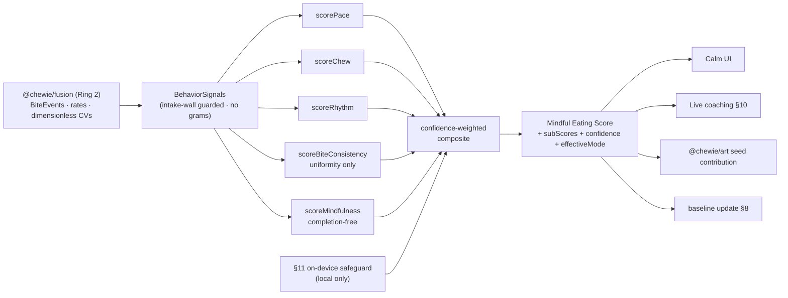
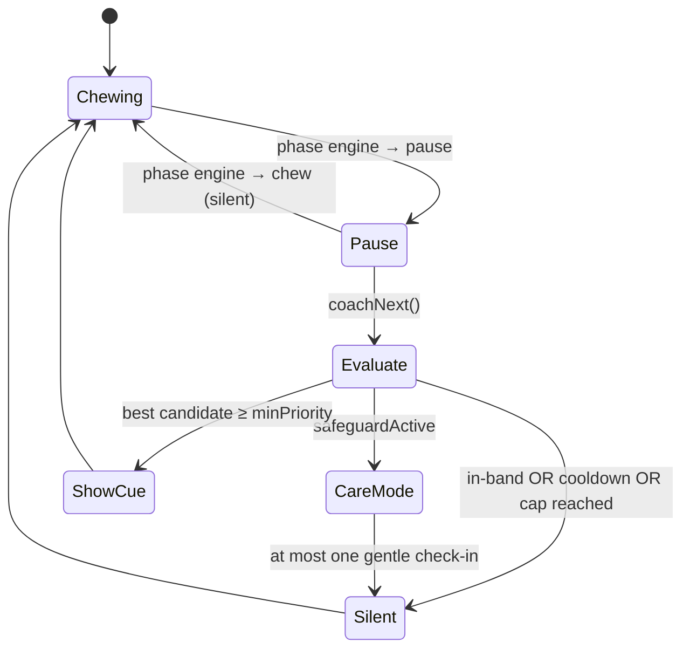

# Chewie — Mindful Eating Score, Battle Yourself & Live Coaching

**Doc:** `docs/05-scoring-model.md`
**Package:** `@chewie/scoring` (pure, framework-agnostic TypeScript)
**Ring:** 1 (Calm Core) for the tap-only score; enriched — never gated — by Ring 2 (Sensing) signals.
**Status:** Design v2 — buildable spec. Every band constant is a *configurable, non-medical* placeholder pending ED-clinician review (Phase 5 gate, §16). Where an intake-adjacent signal is involved, the clinician review has an **explicit lower-shoulder / small-portion scrutiny item** (§5.4, §16).

**This doc owns:** the 1–100 behavior score math, sub-score curves, weighting/compositing, the "battle yourself" baseline, live-coaching decision logic, the **on-device disordered-use safeguard (incl. its honest detection limits, §11.2)**, the optional Balance & Variety insight *contract*, and the anti-gaming / anti-ED guarantees with their executable property tests.

> **Conformance.** Stack, naming, phases, and ethics follow `docs/00-architecture-spine.md`. This doc conforms to the single doc-numbering and ADR scheme committed there and mirrored in `docs/02-system-architecture.md` §5. All sibling references below use that scheme; a CI link-checker over `docs/` fails the build on any dangling cross-reference.

### Related docs (referenced, never duplicated)

| Path | What this doc borrows from it |
| --- | --- |
| `docs/00-architecture-spine.md` | Canonical spine; ADR index pointer; CI link-check policy. |
| `docs/01-product-vision.md` | **First-run/onboarding-flow owner** (age-gate-first, permission priming, first-meal guidance) and app-wide empty states. This doc owns only the *scoring* empty states (warmup, no-signal). |
| `docs/02-system-architecture.md` | `@chewie/core-types` — the ONE home of `BiteEvent`, `Estimate<T>`, `SensorMode`; the Ring-boundary lint; the ADR index (§5.6); the shared **config index** (`@chewie/config`) that owns chew/pause timing defaults. |
| `docs/03-chewing-engine-and-art.md` | `@chewie/engine` XState phase engine; the sleep-inclusive **`ChewieClock`** (§2) that is the single source of truth for elapsed time; **process-death checkpoint / resume / reaper** and the `unattended` flag (§2.6) this doc keys eligibility off; `@chewie/art` (how a `BehaviorScore` seeds ChewArt). |
| `docs/04-sensing-fusion.md` | `@chewie/fusion` (Ring 2): `SensorMode`, production of `BiteEvent`s, weight-time step detection, chew/hand-to-mouth cues, **and all grams→dimensionless-signal conversion** (§2, §5.4). We consume its *outputs*; we never import it. |
| `docs/07-data-model.md` | Encrypted schema (no weight/BMI/goal columns); the `SessionCheckpoint`/`MealSession` shapes; the **`LocalProfile` model** that owns per-profile baselines and the shared-device decision (§14). |
| `docs/08-privacy-dpia.md` | DPIA, Article 9 handling, the age-band field, minor-safe defaults; records the safeguard's honest detection limits (§11.2) as a DPIA line item. |
| `docs/adr/README.md` | Single ADR index. This doc is governed by **ADR-0008 — isolated behavior scoring** (scoring cannot receive intake), and cites **ADR-0005** (scale-primary + fusion modes) and **ADR-0010** (sleep-inclusive `ChewieClock` + recovery). No ad-hoc ADR numbers appear here. |

---

## 1. Design goals & non-negotiables

1. **Primary score measures behavior, not quantity.** Pace, chew thoroughness, honored pauses, steady rhythm, bite *uniformity*, and (where measurable without surveillance) presence. *Eating less — or taking smaller bites, or stopping earlier — must never, by any path, raise the score.*
2. **Bands, not minimization.** Every behavioral magnitude signal (pace, chew time) is scored by *distance from a comfortable band*; both extremes lower the score; the band center = 100. **Absolute food quantity is not a scored dimension at all.**
3. **Honest under any hardware, even mid-meal.** One score works in `NONE / SCALE_ONLY / CAMERA_ONLY / BOTH`, and over a session whose mode *changes* (§13), by scoring from each bite's actual provenance, dropping unavailable sub-scores, renormalizing, and publishing an overall confidence.
4. **Self-vs-self only, asymptoting at healthy.** "Battle yourself" compares a person to their own gently-adapting baseline; improvement can never be pushed past a healthy band toward an extreme.
5. **Care over congratulation — honestly scoped.** Detectable disordered-use patterns route to a calm resource card and soften scoring and never produce a personal best; and §11.2 states plainly which patterns are *not* detectable by default.
6. **No red, no "failed."** All copy comes from a constrained catalog; streaks freeze, never reset; completion is *never* a score lever.

### 1.1 What changed vs the raw briefing and vs draft v1 (and why)

| # | Prior idea | This design | Why |
|---|----------|----------------------------|-----|
| 1 | Per-second `setInterval` decrement; timing anchored to `performance.now()` | Elapsed time comes from the **sleep-inclusive `ChewieClock`** (doc 03). Scoring never calls `Date.now()`/`performance.now()`; it consumes engine/fusion timestamps already anchored to a clock that advances through sleep. | `performance.now()`/`mach_absolute_time` freeze while the device sleeps; a lock→sleep→resume would under-count elapsed time and mis-rate pace. Doc 03 §2 is the single source of truth. |
| 2 | Completion credit: `SATIETY_STOP` 100, `NATURAL_END` 92, `ABANDONED` 60 | **Completion is removed from the numeric score entirely.** Satiety is celebrated *qualitatively* (tile warmth, copy), never with points. Abandonment is handled by *eligibility*, not a penalty. | Any completion delta is a "stop sooner ⇒ higher / finish ⇒ lower" gradient — the exact invariant the mandate forbids. Now `∂composite/∂completionKind = 0` (property P3). |
| 3 | Per-bite **mass band** with a left shoulder (small bites scored down) | **No absolute-mass term anywhere.** Bite consistency scores only a *dimensionless* mass **uniformity** (CV), computed in fusion, and drops to `null` for legitimately small portions / low confidence. | "Your bites are too small" is actively harmful for small-appetite, pediatric, and ED-recovery users, and is quantity-shaping. Uniformity is scale-invariant, so mass can move the score neither up nor down. |
| 4 | grams passed into `@chewie/scoring`; wall banned only `totalGrams`/`portionGrams` | **All grams→signal conversion happens in `@chewie/fusion`** (doc 04). Scoring receives only dimensionless numbers. `meanBiteGrams`, `gramsPerMin`, `grams`, `massG`, … are added to the intake wall and a deep type guard. | Resolves the "boundary is in two places" contradiction; makes the property test actually able to catch a grams regression (§2, §12-P4). |
| 5 | Shared types imported from `@chewie/fusion` (Ring 2) into scoring (Ring 1) | Shared types imported from **`@chewie/core-types`** (Ring-1-safe), per doc 02 §5. | `@chewie/scoring` is Ring 1; importing Ring 2 fails the boundary lint doc 02 defines ("Ring N may never import Ring N+1"). |
| 6 | `presenceRatio` = "fraction of session the eater stayed engaged (not walked away)" | **Presence defined per `SensorMode`; `null` (dropped, confidence 0) whenever it can't be measured without watching the person.** Never gaze/attention-policing; never rewards staring at the phone. | Detecting "walked away vs mindfully still" is surveillance-adjacent and impossible in NONE/SCALE_ONLY. Defaulting to a neutral drop-out is honest. |
| 7 | Pace = bites/min, with grams/min blended *inside scoring* | Pace = **bites/min only** in scoring. The scale improves the *accuracy/confidence* of bites/min (cross-checking taps against weight steps) in fusion, but passes no mass rate into scoring. | Keeps pace a pure behavioral rate and keeps every mass quantity out of the scorer. |
| 8 | Robustified EWMA baseline | Kept: warmup, EWMA-MAD winsorization, rest-day freeze, safeguard/`unattended` ineligibility. | Resists a single wild/gamed session; never punishes a missed day; distress never becomes a record. |
| 9 | "Coach live" | Coaching **arbitration**: priority + rate-limit + care-mode override, **pause-phase only**, catalog with **no bite-size / no "eat less" cue**. | Keeps the table calm and guarantees care mode wins; structurally cannot nudge toward smaller portions. |

---

## 2. Package boundary & the intake type wall

`@chewie/scoring` imports its shared types from **`@chewie/core-types`** (the Ring-1-safe home defined in `docs/02-system-architecture.md` §5) — never from `@chewie/fusion`, which is Ring 2. It imports no React, no native modules, no cloud. The *only* input to the primary score is `BehaviorSignals`, and that type is **structurally prevented from carrying any food quantity — total, per-bite, or rate**.

```ts
// packages/scoring/src/index.ts
import type { SensorMode, BiteEvent, Estimate } from '@chewie/core-types';
//        ^ Ring-1-safe. Importing '@chewie/fusion' here fails the boundary lint (doc 02 §5).
```

```ts
// packages/scoring/src/wall.ts
// No food quantity — total, per-bite, or per-minute mass/energy — may EVER reach the scorer.
type ForbiddenIntakeKeys =
  // meal totals / energy
  | 'totalGrams' | 'totalMass' | 'gramsEaten' | 'massEaten'
  | 'calories' | 'kcal' | 'mealCalories' | 'energy'
  | 'totalIntake' | 'portionGrams' | 'servings' | 'weightKg' | 'bmi'
  // per-bite mass (added in v2 — these were the leak the critique found)
  | 'meanBiteGrams' | 'gramsPerBite' | 'biteGrams' | 'grams' | 'massG' | 'massPerBite'
  // mass RATES
  | 'gramsPerMin' | 'massPerMin';

// Shallow guard: compile error if BehaviorSignals grows a forbidden top-level key.
type AssertNoIntake<T> =
  Extract<keyof T, ForbiddenIntakeKeys> extends never ? T : never;

// Deep guard: also forbids Estimate<mass> nested one level down (e.g. a signal object
// that tries to smuggle { meanBiteGrams: Estimate<number> }).
type DeepAssertNoIntake<T> = {
  [K in keyof T]: K extends ForbiddenIntakeKeys ? never
    : T[K] extends object ? DeepAssertNoIntake<T[K]> : T[K];
};

// These lines fail `tsc` the moment a mass field appears anywhere in BehaviorSignals.
export type BehaviorSignalsGuarded = AssertNoIntake<DeepAssertNoIntake<BehaviorSignals>>;
```

Because grams never reach scoring, there is **no `bandScore(grams, …)` call inside `@chewie/scoring`** (draft v1 had one — removed). Every food-quantity→signal conversion — per-bite mass → dimensionless uniformity CV, weight-time curve → bites/min accuracy — happens in `@chewie/fusion` (doc 04 §5.4) and reaches us only as pure numbers.

> **Rules enforced by CI (dependency-cruiser + the boundary lint):**
> 1. `packages/scoring` may not import `@chewie/fusion`, `@chewie/nutrition`, React, or native modules.
> 2. `packages/scoring` may import only `@chewie/core-types` (types) and `@chewie/config` (band/weight constants).
> 3. Property test P4 (§12) fails the build if any forbidden key becomes reachable at runtime.

---

## 3. Core data model

```ts
// ---- Shared shapes: imported, never re-declared (canonical defs live in @chewie/core-types) ----
// import type { SensorMode, BiteEvent, Estimate } from '@chewie/core-types';
//
//   type SensorMode = 'NONE' | 'SCALE_ONLY' | 'CAMERA_ONLY' | 'BOTH';
//   interface Estimate<T> { value:T; low:T; high:T; confidence:number /*0..1*/; source:SensorMode; unit?:string }
//   interface BiteEvent {
//     tStartMonoMs:number; tEndMonoMs:number;   // sleep-inclusive ChewieClock (doc 03 §2)
//     intervalMsFromPrev?:number; chewProxyMs?:number;
//     grams?:Estimate<number>;                  // scoring NEVER reads this field
//     source:SensorMode; confidence:number /*0..1*/; flags?:string[];
//   }
// This doc uses those definitions verbatim; it does not paraphrase them (per doc 02/03).

// ---- Inputs the scorer is ALLOWED to see: dimensionless / behavioral only ----
export interface PaceSignal {
  bitesPerMin: number;   // behavioral RATE. Ring 1: from taps. Ring 2: same rate, higher accuracy/confidence
  confidence: number;    // 0..1, supplied by engine/fusion, aggregated over the window's provenance (§13)
}

export interface ChewSignal {
  secondsPerBite: number; // camera chew cadence, or inter-bite-gap proxy. A DURATION, never mass
  confidence: number;
}

export interface RhythmSignal {
  pauseAdherence: number; // honoredPauses / scheduledPauses ∈ [0,1]
  interBiteCV: number;    // coefficient of variation of inter-bite gaps (≥0, dimensionless)
  confidence: number;
}

export interface BiteUniformitySignal {   // renamed from BiteSizeSignal — NO absolute mass term
  massCV?: number;             // dimensionless CV of per-bite mass, COMPUTED IN FUSION. undefined w/o a scale
  confidence: number;
  legitimateSmallPortion?: boolean; // fusion/context hint → drop to null, never penalize (§5.4)
}

export interface PresenceSignal {
  ratio: number;         // 0..1 "person plausibly present at the table" (NOT gaze/attention). Camera modes only
  confidence: number;    // 0 ⇒ dropped from composite (§5.5)
}

export interface MindfulSignal {
  endRushRatio: number;              // last-third pace / whole-meal pace (≈1 good; >1 rushed finish)
  presence?: PresenceSignal | null;  // null/undefined when unmeasurable without watching the eater (§5.5)
  confidence: number;
}

export interface BehaviorSignals {   // <-- guarded by §2 wall; carries NO food quantity
  sensorMode: SensorMode;            // EFFECTIVE mode for display/eligibility (§13); may differ per-bite
  pace: PaceSignal;
  chew: ChewSignal;
  rhythm: RhythmSignal;
  uniformity: BiteUniformitySignal;
  mindful: MindfulSignal;
  completion: CompletionKind;        // recorded for tile/copy/eligibility — NOT an input to any sub-score (§5.5, §7)
  biteCount: number;                 // validity gating only, never scored by magnitude
  durationMs: number;                // from ChewieClock elapsed (doc 03), validity gating only
  unattended: boolean;               // set by engine reaper/maxMealGuard (doc 03 §2.6) → eligibility only (§8.4)
}

export type CompletionKind =
  | 'SATIETY_STOP'   // eater tapped "I'm satisfied" — celebrated qualitatively, scored equal to all others
  | 'NATURAL_END'    // reached planned end steadily
  | 'ABANDONED'      // walked away / maxMealGuard / reaper — neutral; excluded from self-competition
  | 'RECOVERED'      // finalized from a process-death checkpoint via doc 03 "Wrap it up" (§7)
  | 'IN_PROGRESS';

// ---- Outputs ----
export type SubScoreKind = 'pace' | 'chew' | 'rhythm' | 'biteConsistency' | 'mindfulness';

export interface SubScore {
  kind: SubScoreKind;
  value: number;          // 0..100
  confidence: number;     // 0..1
  band?: { center: number; lo: number; hi: number; unit: string }; // for gentle UI copy
  note?: string;          // catalog key, e.g. 'pace.slightlyFast'
}

export interface BehaviorScore {
  composite: number;                                  // 1..100 (Mindful Eating Score)
  confidence: number;                                 // 0..1 overall, from effective per-window provenance
  effectiveMode: SensorMode;                          // provenance actually used for confidence & eligibility (§13)
  subScores: Record<SubScoreKind, SubScore | null>;   // null = unavailable this session
  flags: ScoreFlag[];                                 // 'SAFEGUARD_ACTIVE' | 'LOW_CONFIDENCE' | 'WARMUP' | 'UNATTENDED' | 'DEGENERATE'
  vsBaseline?: BaselineDelta;                         // present once out of warmup (§8)
  isPersonalBest: boolean;
  completion: CompletionKind;                         // echoed for the tile/copy layer; not part of the number
}
```

---

## 4. The band-score primitive

A single, unit-tested function maps any raw *behavioral* signal to 0–100 through a healthy band with soft, asymmetric shoulders. Inside `[lo, hi]` the score is a flat 100 (the *plateau*). Outside, it decays as a Gaussian in the number of tolerance-widths away — flat near the edge (very forgiving), steepest around one σ, then leveling toward `floor`. There is deliberately **no hard zero-cliff**.

```ts
export interface BandSpec {
  lo: number;     // lower plateau edge (score 100 on [lo,hi])
  hi: number;     // upper plateau edge
  softLo: number; // 1σ tolerance below lo  (bigger = more forgiving of "too low"); Infinity = no low penalty
  softHi: number; // 1σ tolerance above hi  (bigger = more forgiving of "too high"); Infinity = no high penalty
  floor?: number; // asymptotic minimum, default 0
  unit: string;
}

export function bandScore(x: number, b: BandSpec): number {
  const floor = b.floor ?? 0;
  if (x >= b.lo && x <= b.hi) return 100;
  const d = x < b.lo ? (b.lo - x) / b.softLo : (x - b.hi) / b.softHi; // Infinity σ ⇒ d = 0 ⇒ never penalized
  const s = floor + (100 - floor) * Math.exp(-0.5 * d * d);
  return clamp(Math.round(s), floor, 100);
}
```

Properties (unit-tested): continuous; `= 100` on `[lo,hi]`; strictly decreasing as you move away on either finite-σ side; symmetric in *form* but tunable per side; a value one `softLo` below `lo` ≈ **60.7** (floor 0), two σ ≈ **13.5**, three σ ≈ **1.1**. Reference decay (floor 0):

| distance (σ) | 0 | 0.5 | 0.86 | 1.0 | 1.43 | 2.0 | 3.0 |
|---|---|---|---|---|---|---|---|
| score | 100 | 88.2 | 69.0 | 60.7 | 36.2 | 13.5 | 1.1 |

**One-sided bands** set the harmless edge's σ to `Infinity` (open): pause adherence uses `hi = 1, softHi = ∞` so "over-adhering" is never penalized; every CV band uses `lo = 0, softLo = ∞` so "perfectly steady/uniform" is never penalized.

> Band constants and default weights live in `@chewie/config` (the shared config package indexed in doc 02), *not* inline, so the schema default, engine default, and scoring default cannot drift. Chew/pause *timing* defaults (e.g. the placeholder chew/pause milliseconds used in the worked examples below) are owned by the same `@chewie/config` entry and cited — never re-declared — here.

---

## 5. The five behavioral sub-scores

All band constants are placeholders pending clinician review (§16). Users may *widen* bands via `ScoringConfig`; the *shape* is fixed.

### 5.1 Pace — `scorePace`
- **Unit:** bites/min (the only pace input). In `SCALE_ONLY`/`BOTH`, fusion cross-checks taps against weight step-downs to raise the *confidence and accuracy* of bites/min — it never passes a mass rate into scoring.
- **Band (bites/min):** `lo 1.1, hi 2.8, softLo 1.5, softHi 0.7`. **Asymmetric on purpose:** eating fast declines more sharply than eating slowly (savoring is aligned with the product); extreme prolongation is left to the safeguard (§11), never to a punitive pace curve — and, critically, coaching never nudges *up* in pace to "eat faster/more."

| bites/min | 0.2 | 0.6 | **2.0** | 3.5 | 4.2 | 5.0 |
|---|---|---|---|---|---|---|
| pace score | 85 | 92 | **100** | 61 | 14 | 3 |

```ts
function scorePace(p: PaceSignal, cfg: BandCfg): SubScore {
  const v = bandScore(p.bitesPerMin, cfg.paceBites); // no grams path exists
  return { kind: 'pace', value: v, confidence: p.confidence, band: bandInfo(cfg.paceBites), note: paceNote(v) };
}
```

### 5.2 Chew — `scoreChew`
- **Unit:** seconds/bite (camera chew cadence; else inter-bite-gap proxy at lower confidence).
- **Band:** `lo 14, hi 32, softLo 7, softHi 12`. Gulping declines more than lingering.

| s/bite | 4 | 8 | **22** | 40 | 45 |
|---|---|---|---|---|---|
| chew score | 36 | 69 | **100** | 74 | 56 |

### 5.3 Rhythm — `scoreRhythm` (pause adherence + steadiness)
Two one-sided sub-signals:
- **Pause adherence:** `lo 0.85, hi 1.0, softLo 0.22, softHi ∞` → below 85% honored, gentle decline; over-adhering never penalized.
- **Inter-bite steadiness** from CV: `hi 0.40, softHi 0.30, lo 0, softLo ∞` → only erratic cadence declines; robotic-steady is fine (a *confidence* check, not a penalty, handles implausibly perfect cadence — §9).

```ts
function scoreRhythm(r: RhythmSignal, cfg: BandCfg): SubScore {
  const adh = bandScore(r.pauseAdherence, cfg.pauseAdherence);
  const steady = bandScore(r.interBiteCV, cfg.rhythmCV);
  const v = Math.round(0.55 * adh + 0.45 * steady);
  return { kind: 'rhythm', value: v, confidence: r.confidence, note: rhythmNote(adh, steady) };
}
```

### 5.4 Bite consistency — `scoreBiteConsistency` (uniformity only; **no absolute-size term**)
This sub-score exists to reward a *steady, unhurried* bite rhythm — **not** any particular bite size. It consumes only `massCV`, a **dimensionless** coefficient of variation that `@chewie/fusion` computes from per-bite masses (doc 04 §5.4). Because CV is invariant under uniform scaling, absolute food quantity is mathematically incapable of moving this score up or down.

- **Uniformity band (CV):** `hi 0.40, softHi 0.35, lo 0, softLo ∞` — low-good, one-sided. There is **no lower shoulder on mass**, so small bites are never scored down. (Draft v1's symmetric grams band, and its "too small" left shoulder, are deleted — see §1.1 #3.)
- **Drops to `null`** (not penalized, not zero) when: `massCV` is unavailable (no scale → `NONE`/`CAMERA_ONLY` without fiducial mass), confidence `< cfg.minConf`, or `legitimateSmallPortion` is set. In those cases the dimension simply doesn't vote (§6).
- **Clinician-review item (blocking, §16):** confirm that even the *uniformity* framing carries no implicit "bigger is better" reading, and that the drop-to-null path fully covers small-appetite, pediatric, and ED-recovery contexts. Ship no bite-consistency surface before that sign-off.

```ts
function scoreBiteConsistency(u: BiteUniformitySignal, cfg: BandCfg): SubScore | null {
  if (u.massCV == null || u.confidence < cfg.minConf || u.legitimateSmallPortion) return null;
  const uniform = bandScore(u.massCV, cfg.biteCV); // dimensionless; NO absolute-mass band anywhere
  return { kind: 'biteConsistency', value: uniform, confidence: u.confidence, note: uniformNote(uniform) };
}
```

### 5.5 Mindfulness — `scoreMindfulness` (**completion-free, presence-optional**)
Rewards an unhurried, present finish. **Completion kind is NOT an input** — stopping at satiety, finishing steadily, and being interrupted all score identically on the mindfulness dimension (property P3). Satiety is celebrated elsewhere (§7): warmer copy and a distinctive-but-not-higher-scoring tile.

`presence` is used *only* when it can be measured without watching the person:

| SensorMode | How `presence` is derived | Default |
|---|---|---|
| `NONE`, `SCALE_ONLY` | No camera ⇒ no non-surveilling presence signal exists. We do **not** infer "walked away" from tap gaps (that would penalize mindful stillness). | `presence = null` → dropped, confidence 0. Mindfulness = `endRush` only. |
| `CAMERA_ONLY`, `BOTH` | A coarse **"a person is plausibly at the table"** cue (periodic body/hand-in-frame from the existing MediaPipe pipeline). **Never** gaze/eye-tracking; **never** "did you look at the screen." | `presence` present at fusion-supplied confidence, but **still low-weighted**; on any doubt, fusion returns `null`. |

Presence is framed as *"you were here, at your meal,"* never as attention-policing, and it must never reward looking **at** the phone — the phone is on a stand and the eater should be looking at their food and companions.

```ts
function scoreMindfulness(m: MindfulSignal, cfg: BandCfg): SubScore | null {
  const parts: { v: number; w: number }[] = [];
  const endRush = bandScore(m.endRushRatio, cfg.endRush); // { lo:0.8, hi:1.15, softLo:0.4, softHi:0.35 }
  parts.push({ v: endRush, w: 0.7 });
  if (m.presence && m.presence.confidence >= cfg.minConf) {
    parts.push({ v: 100 * clamp(m.presence.ratio, 0, 1), w: 0.3 * m.presence.confidence });
  }
  const wsum = parts.reduce((a, p) => a + p.w, 0);
  if (wsum === 0) return null; // nothing measurable ⇒ dimension drops out, not a zero
  const v = Math.round(parts.reduce((a, p) => a + p.v * p.w, 0) / wsum);
  return { kind: 'mindfulness', value: v, confidence: m.confidence, note: mindfulNote(m) };
}
```

### 5.6 Signal availability & confidence per SensorMode

Fusion (doc 04) supplies each signal's confidence; scoring never fabricates it. These are *typical steady-state* values; §13 explains how they aggregate when the mode changes mid-meal.

| Sub-score | NONE (tap) | SCALE_ONLY | CAMERA_ONLY | BOTH |
|---|---|---|---|---|
| pace | 0.60 | 0.95 | 0.75 | 0.98 |
| chew | 0.40 (proxy) | 0.50 (proxy) | 0.80 | 0.85 |
| rhythm | 0.70 | 0.90 | 0.75 | 0.95 |
| biteConsistency | — (null) | 0.95 | 0.55 or null | 0.95 |
| mindfulness (endRush) | 0.80 | 0.90 | 0.80 | 0.90 |
| — presence sub-part | null | null | ≤0.6 (coarse) | ≤0.6 (coarse) |

In `NONE` mode the score is honestly built from pace + rhythm + endRush-mindfulness (+ weak chew proxy); the UI labels it *"based on your rhythm and pauses."*

---

## 6. Compositing — the Mindful Eating Score

Default weights (from `@chewie/config`, sum to 1), tuned so *rhythm and pace* — the calm-eating heart — dominate:

```ts
const DEFAULT_WEIGHTS: Record<SubScoreKind, number> = {
  pace: 0.25, chew: 0.20, rhythm: 0.25, biteConsistency: 0.15, mindfulness: 0.15,
};
```

Composite = **confidence-scaled weighted mean over available sub-scores**, renormalized so absent sensors don't drag the score down — they just don't vote.

```ts
export function scoreBehavior(sig: BehaviorSignals, cfg = defaultConfig): BehaviorScore {
  const subs: Record<SubScoreKind, SubScore | null> = {
    pace: scorePace(sig.pace, cfg),
    chew: scoreChew(sig.chew, cfg),
    rhythm: scoreRhythm(sig.rhythm, cfg),
    biteConsistency: scoreBiteConsistency(sig.uniformity, cfg),
    mindfulness: scoreMindfulness(sig.mindful, cfg),
  };
  // NOTE: sig.completion is deliberately NOT read here — it can never move the number (P3).

  let wSum = 0, acc = 0, cAcc = 0, cW = 0;
  for (const k of KINDS) {
    const s = subs[k]; if (!s || s.confidence < cfg.minConf) continue;
    const w = DEFAULT_WEIGHTS[k] * s.confidence; // confidence-scaled weight
    wSum += w; acc += w * s.value;
    cW += DEFAULT_WEIGHTS[k]; cAcc += DEFAULT_WEIGHTS[k] * s.confidence;
  }

  const flags: ScoreFlag[] = [];
  if (sig.unattended) flags.push('UNATTENDED');
  if (wSum === 0) return degenerate(subs, sig, flags); // no usable signal → gentle empty state, DEGENERATE flag
  const composite = clamp(Math.round(acc / wSum), 1, 100);
  const confidence = cAcc / cW;
  if (confidence < cfg.lowConfidenceThreshold) flags.push('LOW_CONFIDENCE');

  const base: BehaviorScore = {
    composite, confidence, effectiveMode: sig.sensorMode,
    subScores: subs, flags, isPersonalBest: false, completion: sig.completion,
  };
  return applySafeguards(base, sig, cfg);
}
```

Overall confidence is surfaced as a soft ring opacity / "rough" label — never hidden.



---

## 7. Completion, satiety, abandonment & process death

**Completion never touches the number** (§5.5, P3). What it does control is *eligibility*, *copy*, and *tile flavor* — and how the app resolves how a meal ended.

- **Satiety is a first-class, celebrated moment — qualitatively.** The pause-phase UI offers *"I'm satisfied — end here."* Taking it yields `SATIETY_STOP`: a warm ChewArt tile and warm copy, and it is *fully* eligible for baseline/PB. It earns **no extra points** over finishing steadily, so noticing fullness is never scored *above* — nor below — eating to a planned end. Interoception is honored by the experience, not by a scoring gradient.
- **The scale-triggered satiety prompt is tightly constrained** (this is the mid-meal "should you stop?" nudge):
  - It is **suppressed entirely for any safeguard-flagged user** (§11).
  - It **never fires from the intake curve when the intake pipeline is disabled** (`intakeNumbersHidden`), and never in `NONE`/`CAMERA_ONLY` where there is no weight plateau to read.
  - When it does fire (`SCALE_ONLY`/`BOTH`, intake enabled, not flagged), it is a *question* — "how full do you feel?" — and only the eater's tap sets `SATIETY_STOP`. The scale never decides "you should stop eating."
- **`ABANDONED`** (walked away / `maxMealGuard` / reaper, per doc 03 §2.6) is neutral: it is *not* penalized in the number, and it is *excluded from self-competition* via `unattended` (§8.4). Walking away from a phone on a stand is not a moral event.
- **Process death** (OS kill, battery death, hard crash) is owned by `docs/03` §2.6 (periodic `SessionCheckpoint` → resume-or-wrap-up sheet → orphan reaper). Scoring's contract at the seam:
  - The engine invokes `scoreBehavior` **only at `FINALIZE`** — including the "Wrap it up" branch of the resume sheet, where `completion = 'RECOVERED'`.
  - A `RECOVERED` or reaper-closed session is scored (so the eater still gets a tile) but arrives with `unattended = true` and is therefore **ineligible for baseline and PB** (§8.4). No mid-meal session is ever silently lost, and no stranded `status:'active'` row is ever scored twice.
  - Disambiguation at finalize is the engine's (doc 03), not scoring's: `SATIETY_STOP`/`NATURAL_END` come from explicit taps/timer; `ABANDONED` from `maxMealGuard`/reaper; `RECOVERED` from the checkpoint path. Scoring treats all five kinds identically for the *number* and reads only `unattended` for eligibility.
- The score is **completely independent of whether the plate was emptied** — there is no "plate cleared" bonus anywhere.

---

## 8. Battle Yourself — personal baseline & improvement

The competitor is always your own recent self, and the ceiling is *healthy*, not *extreme*.

### 8.1 Robustified EWMA baseline

```ts
export interface Baseline {
  composite: EwmaStat;
  sub: Record<SubScoreKind, EwmaStat>;
  sessions: number;          // count of VALID sessions folded in
  updatedAt: number;         // ChewieClock-sourced (doc 03)
}
export interface EwmaStat { mean: number; mad: number } // mad = EWMA of |x-mean|

const ALPHA = 0.20;          // ~ half-life of 3–4 valid sessions
const WARMUP = 4;            // below this: "learning your rhythm", show trend not delta
const WINSOR_K = 2.5;        // clamp outliers to mean ± K·mad before folding in

export function updateBaseline(base: Baseline, score: BehaviorScore, ctx: SessionCtx): Baseline {
  if (!isBaselineEligible(score, ctx)) return base; // §8.4 — safeguarded/unattended/degenerate never move it
  const foldStat = (st: EwmaStat, x: number): EwmaStat => {
    const clamped = clamp(x, st.mean - WINSOR_K * st.mad, st.mean + WINSOR_K * st.mad);
    return {
      mean: ALPHA * clamped + (1 - ALPHA) * st.mean,
      mad:  ALPHA * Math.abs(x - st.mean) + (1 - ALPHA) * st.mad,
    };
  };
  return { ...base, sessions: base.sessions + 1, updatedAt: ctx.now,
    composite: foldStat(base.composite, score.composite),
    sub: mapKinds(k => foldStat(base.sub[k], score.subScores[k]?.value ?? base.sub[k].mean)) };
}
```

Winsorization means a single outlier (a stressful gulp-fest, or a *gamed* session) can nudge but not yank the baseline; `mad` gives an adaptive "is this delta meaningful?" threshold so we don't celebrate noise.

### 8.2 Improvement delta

```ts
export interface BaselineDelta { composite: number; meaningful: boolean; perSub: Record<SubScoreKind, number> }

export function deltaVsBaseline(score: BehaviorScore, base: Baseline): BaselineDelta | undefined {
  if (base.sessions < WARMUP) return undefined; // show "learning your rhythm", not a number (§15)
  const d = score.composite - base.composite.mean;
  return {
    composite: Math.round(d),
    meaningful: Math.abs(d) >= Math.max(3, 0.75 * base.composite.mad),
    perSub: mapKinds(k => Math.round((score.subScores[k]?.value ?? base.sub[k].mean) - base.sub[k].mean)),
  };
}
```

UI copy: `+4` → *"A little steadier than your recent rhythm."* A negative delta is neutral (*"A quicker meal today — that happens"*), never red, never "worse." Below warmup: *"Chewie is still learning your rhythm."*

### 8.3 Personal best — gated (validity, **framed as inclusion, not requirement**)

```ts
export function isPersonalBest(score: BehaviorScore, history: PbState, ctx: SessionCtx): boolean {
  if (!isBaselineEligible(score, ctx)) return false;       // safeguarded/unattended/degenerate never PB
  if (score.confidence < 0.5) return false;                // don't crown a guess
  const gates = ctx.cfg.pbGates[ctx.mealKind];             // separate gates per meal kind (see below)
  if (ctx.biteCount < gates.minBites) return false;
  if (ctx.durationMs < gates.minDuration) return false;
  return score.composite > pbFor(history, ctx.mealKind);   // compared within its OWN meal kind
}
```

Two changes vs draft v1 so the gates can never read as *"eat more / longer to qualify":*

1. **Quick Mode gets its own best.** `pbGates` is keyed by `mealKind` (`'meal' | 'quick'`), and a personal best is compared **within its kind**. A mindful snack can set a *"best quick session"* — a small/short meal is never implicitly "not enough to count."
2. **Copy never states the gate as a requirement.** The UI says *"we celebrate a personal best once there's enough of a session to judge fairly"* — it never says "eat at least N bites" or "last at least M minutes." Below the gate the meal is a normal, warmly-tiled session; it simply isn't crowned a *record*. **Clinician review confirms this framing is non-shaming (§16).**

Because the composite is quantity-invariant (§9, P1/P2), a PB **cannot** be reached by eating more, less, or smaller.

### 8.4 Baseline/PB eligibility (one gate for both)

`isBaselineEligible` returns `false` when any of: a `SAFEGUARD_ACTIVE` flag is present (§11), `UNATTENDED` is set (abandoned / reaped / `RECOVERED`, §7), or the session is `DEGENERATE` (no usable signal). Such sessions still render a calm tile and (optionally) a care card — they just never enter self-competition, so **distress or a forgotten phone can never become a "record."**

---

## 9. Anti-gaming & anti-ED analysis (with the mechanism)

| Exploit / risk | Why it fails here |
|---|---|
| **Eat less total to score higher** | Composite is a function only of rates, cadences, adherence, dimensionless CVs, and end-rush ratio. Removing trailing bites at the same cadence leaves every sub-score unchanged; completion is not scored. *Property P1.* |
| **Take tiny (or huge) bites to score higher** | Absolute per-bite mass is **not a scored dimension**. Only the dimensionless uniformity CV is used, and it is invariant under uniform scaling — so scaling every bite's mass by any factor leaves the composite unchanged. *Property P2.* |
| **Stop earlier / finish to score higher** | Completion kind is not an input; `∂composite/∂completionKind = 0`. *Property P3.* |
| **Prolong the meal forever** | Pace and chew are bands; extreme-slow gently declines, and sustained abnormal prolongation is caught by the safeguard (§11), not rewarded. |
| **Rush then game the ending** | `endRushRatio` in mindfulness penalizes a sped-up finish; rhythm CV penalizes the erratic cadence. |
| **Auto-tapper / robotic fake bites (tap-only)** | Tap-only confidence is capped (≤0.75), so it can't reach high-confidence PBs. Implausibly perfect cadence (CV≈0 with metronomic gaps) triggers a *confidence* discount, not a punishment. In `SCALE`/`BOTH`, taps are cross-checked against real weight step-downs. |
| **Chase an ever-higher target** | The "battle" target is your baseline *score*, itself bounded by fixed health bands, so improvement asymptotes at healthy. Coaching is clamped to bands (§10.4) and has **no** cue about portion or amount. |
| **Distress becomes a high score** | Safeguarded / unattended sessions are ineligible for baseline and PB and route to care (§11); scoring is softened or suppressed. |
| **Smuggle grams into the score** | The intake wall (§2) plus property P4 fail the build if `meanBiteGrams`/`gramsPerMin`/any mass field becomes reachable in `BehaviorSignals`. |

---

## 10. Live coaching — deterministic, on-device, pause-only

All coaching is computed locally (Ring 1/2), band-based, deterministic. **Cues appear only during the pause phase** (chew phase stays silent), at most one per pause, from a constrained catalog, never punitive, **never about eating less or taking bigger bites.**

### 10.1 Rolling in-meal window

```ts
export interface LiveWindow {
  recentBites: BiteEvent[];      // last N (e.g. 5), from engine/fusion; grams field never read
  phase: 'chew' | 'pause';
  paceBitesPerMin: number;
  meanChewSec?: number;
  interBiteCV: number;
  lastPauseHonored: boolean;
  cuesShown: { key: string; atBite: number }[];
  safeguardActive: boolean;
}
```

### 10.2 Candidate generation & arbitration

```ts
export function coachNext(w: LiveWindow, base: Baseline | null, cfg: CoachCfg): CoachCue | null {
  if (w.phase !== 'pause') return null;                 // calm during chewing
  if (w.safeguardActive) return careModeCue(w, cfg);    // §11 override — no performance nudges, no satiety prompt
  if (cuesSince(w) < cfg.minPausesBetweenCues) return null;
  if (w.cuesShown.length >= cfg.maxCuesPerMeal) return null;

  const cands: Candidate[] = [];
  // Each rule fires only when OUT of band beyond a margin; severity = 1 - bandScore/100.
  // There is deliberately NO rule keyed on bite size / amount / total.
  pushIf(cands, w.paceBitesPerMin > cfg.pace.hi + cfg.margin, key('pace.slower'), 0.25, sev(w.paceBitesPerMin, cfg.pace));
  pushIf(cands, w.meanChewSec != null && w.meanChewSec < cfg.chew.lo, key('chew.linger'), 0.20, sev(w.meanChewSec!, cfg.chew));
  pushIf(cands, !w.lastPauseHonored, key('pause.invite'), 0.25, 0.6);
  pushIf(cands, w.interBiteCV > cfg.rhythmCV.hi, key('rhythm.steady'), 0.25, sev(w.interBiteCV, cfg.rhythmCV));
  pushIf(cands, justEnteredBand(w), key('praise.steady'), 0.10, 0.4, /*positive*/ true);

  if (cands.length === 0) return null;
  const best = cands
    .map(c => ({ c, p: c.weight * c.severity * recencyDecay(w, c.key, cfg) }))
    .sort((a, b) => b.p - a.p)[0];
  return best.p >= cfg.minPriority ? toCue(best.c) : null;
}
```

Key properties: **one nudge per pause**, per-key cooldown, hard `maxCuesPerMeal` (default 5), a bias toward the highest-weight out-of-band dimension, and positive reinforcement as a first-class candidate.

### 10.3 Cue catalog (constrained, i18n nl/en, no punitive/quantity templates)

| key | en (example) | Never says |
|---|---|---|
| `pace.slower` | "No rush — maybe let this next bite last a little longer." | "You're eating too fast / too much" |
| `chew.linger` | "Try noticing the flavor for a few more chews." | counts to hit |
| `pause.invite` | "This is a pause. Rest your fork for a moment?" | "You skipped a pause" |
| `rhythm.steady` | "Find a gentle, even rhythm — like breathing." | — |
| `praise.steady` | "Lovely, steady rhythm." | comparisons to others |
| `satiety.checkin` | "Checking in — how full do you feel?" | "Stop eating" / "You've had enough" |
| `care.gentle` | "However today's meal goes is okay. Want a quiet moment?" | any score / number |

The catalog schema (lint rule in CI) forbids adding red/failure/"you failed"/"eat less"/"bigger bites"/"finish your plate" templates. Every string flows through i18next + the constrained catalog.

### 10.4 Nudges are clamped to bands
A nudge's *target* is `clamp(currentBaselineTarget ± smallStep, band.lo, band.hi)`. The coach can move you *toward* the band from outside it, but never past band center toward an extreme. **There is no cue that suggests smaller portions, larger bites, more food, or less food** — such a template cannot even be added (§10.3).



### 10.5 Worked coaching timeline (SCALE_ONLY, intake enabled, not safeguard-flagged)
- t=0–3 min: bites/min rising to 3.6 (fast). First pause → `pace.slower`. Chew phase stays silent.
- t=3–6 min: pace eases to 3.0; CV spikes to 0.5 (erratic). Next eligible pause → `rhythm.steady`; `pace.slower` suppressed by cooldown.
- t=6–9 min: pace 2.4, CV 0.3 → in band. `justEnteredBand` → `praise.steady`.
- t≈14 min: scale plateau detected. Because intake is enabled, the eater is *not* safeguard-flagged, and mode is `SCALE_ONLY`, `satiety.checkin` fires — a question, not an instruction. Eater taps *"satisfied"* → `SATIETY_STOP`. Warm tile + copy; the *number* is unchanged by that choice; composite delta `+5` vs baseline; *"A steadier meal than your recent rhythm."*
- *Contrast:* had this eater been safeguard-flagged, the plateau would trigger **no** satiety prompt (§7, §11) — care mode shows at most one gentle `care.gentle` check-in.

---

## 11. On-device disordered-use safeguard

This doc **owns** the safeguard (per doc 02's scheme). It runs **only on-device**, is easy to turn off (so it cannot itself become a surveillance/shaming vector), and its output is **never** mirrored to the companion or uploaded. It always states the app is not medical advice.

### 11.1 Scoring-side behavior when a signal is present

```ts
function applySafeguards(bs: BehaviorScore, sig: BehaviorSignals, cfg: ScoringConfig): BehaviorScore {
  const risk = cfg.safeguard?.evaluate(sig, cfg.usageContext); // on-device only; never sent anywhere
  if (!risk?.active) return bs;
  return {
    ...bs,
    flags: [...bs.flags, 'SAFEGUARD_ACTIVE'],
    isPersonalBest: false,                                     // never crown a distress session
    composite: cfg.safeguard.softenScore ? null as any : bs.composite, // optionally hide the number (show the tile)
  };
}
```

Behavioral rules:
- Safeguarded sessions are **ineligible for baseline and PB** (§8.4).
- The composite may be **softened or hidden** (config); the coach switches to **care mode** (§10.2) — at most one gentle, dismissible check-in; **never a performance nudge, never a number, never a satiety prompt, never congratulation for low intake.**
- A calm resource card (region-appropriate) is offered.

### 11.2 Honest detection limits (**required by the mandate — do not overstate protection**)

The safeguard's strongest theoretical triggers are the ones it can *least* rely on for the highest-risk users:

- **"Sustained extreme-low intake"** and **"skipped-meal pattern"** are only observable when the user has *already enabled the intake pipeline* and *keeps opening/logging in the app.* The users at highest ED risk are exactly those who keep intake **off** or simply **stop opening the app** — for them, these two signals are **dark**. Presenting them as always-on protection would be dishonest, so we do not.
- Therefore the **default-mode heuristic leans on the behavioral/usage signals that genuinely exist without the intake pipeline and without continued engagement being assumed:**
  - **obsessive number-toggling** (rapidly flipping `intakeNumbersHidden` on/off, or repeatedly re-opening a score),
  - **extreme self-set targets** (bands or chew/pause timings set to physiologically extreme values),
  - **session-shape anomalies** (e.g. many ultra-short "sessions", compulsive re-checking of a finished score),
  - and, *only when the user opted into intake,* the intake-based signals above — clearly marked as opt-in-dependent.
- This limitation is written into the DPIA/clinician review (`docs/08`): **engagement-based detection cannot reach a disengaged restrictor**, and the safeguard is a gentle, dismissible affordance — not a monitoring system and not a substitute for care. Copy never implies the app is watching for you when it structurally cannot.

---

## 12. Tests — the invariants are executable

Pure logic → Vitest, including **property-based tests** (`fast-check`). CI blocks merge on any failure.

**P1 — Eating less never raises the score (total-intake invariance).**
```ts
// Removing the final k bites at the same cadence does not increase the composite,
// regardless of the resulting completion kind.
fc.assert(fc.property(arbSession(), fc.nat(), arbCompletion(), (s, k, c) => {
  const full = scoreBehavior(toSignals(s));
  const shorter = scoreBehavior(toSignals({ ...truncateBites(s, k), completion: c }));
  return shorter.composite <= full.composite + EPS;
}));
```

**P2 — Absolute bite mass never moves the score (scale invariance).**
```ts
// Scaling every per-bite mass by any factor λ>0 (which only changes absolute grams, not the CV
// fusion derives) leaves the composite unchanged.
fc.assert(fc.property(arbSession(), fc.double({ min: 0.1, max: 10 }), (s, λ) => {
  return scoreBehavior(toSignals(scaleAllBiteMasses(s, λ))).composite
       === scoreBehavior(toSignals(s)).composite;
}));
```

**P3 — Completion kind never moves the score.**
```ts
fc.assert(fc.property(arbSession(), arbCompletion(), arbCompletion(), (s, c1, c2) => {
  return scoreBehavior(toSignals({ ...s, completion: c1 })).composite
       === scoreBehavior(toSignals({ ...s, completion: c2 })).composite;
}));
```

**P4 — No forbidden intake key is reachable in `BehaviorSignals`** (compile-time via `tsd`, plus a runtime reflection test over a populated `BehaviorSignals` asserting none of `ForbiddenIntakeKeys` appears at any depth — this is what would have caught the `meanBiteGrams` leak).

**P5 — Small bites are never scored down.** For any `massCV`, `scoreBiteConsistency` is non-increasing in `massCV` only (the low side is `Infinity`-σ open), and `legitimateSmallPortion` ⇒ `null`, never a reduced value.

**P6 — Monotone-in-distance for every finite-σ band; plateau = 100; one-sided (∞) shoulders never penalize.**

**P7 — Composite bounded [1,100]; renormalization ignores null sub-scores; adding a sensor never lowers a good score by more than its confidence-weighted vote.**

**P8 — Safeguarded / unattended sessions:** `isPersonalBest === false` and `updateBaseline` returns the input baseline unchanged.

**P9 — Coaching never emits during the chew phase, never exceeds `maxCuesPerMeal`, and never emits a suppressed-catalog key** (assert against the punitive/quantity deny-list, including any "bigger bite" / "eat less" template).

Golden fixtures: a handful of recorded real sessions with expected sub-scores (±1) to catch band-constant regressions.

---

## 13. Scoring over a session whose SensorMode changes

Doc 04 explicitly allows the mode to degrade or upgrade mid-meal (a scale disconnects; a camera is added). The score is therefore **not** computed against a single session-level mode:

- **Provenance is per-bite.** Each `BiteEvent` carries its own `source: SensorMode` and `confidence`. Pace, chew, rhythm, and end-rush are computed across *all* bites (timing is timing regardless of provenance); bite-uniformity uses only bites whose provenance actually carried mass.
- **Sub-score confidence is aggregated from the window's real provenance**, not looked up from a constant mode. For a sub-score computed over a set of bites, `confidence = aggregate({ perBite.confidence })` (a confidence-weighted mean, floored by the fraction of bites lacking the relevant sensor). A meal that was `BOTH` for 5 minutes and `NONE` after does not claim `BOTH`-level confidence for the whole score.
- **`effectiveMode`** (on `BehaviorScore`) is the *modal, most-informative* provenance across the session's bites. It drives the displayed confidence label and **baseline eligibility’s mode-comparability check** (a `NONE`-effective session and a `BOTH`-effective session are still both eligible; `effectiveMode` is recorded so trend views can note the shift, not exclude it).
- Mid-meal a scale drop simply makes later bites `NONE`-provenance; `biteConsistency` naturally thins out and, if too few mass-bearing bites remain, drops to `null` (§5.4) rather than fabricating uniformity.

---

## 14. Multiple profiles on one device (scoping note)

`@chewie/scoring` is **stateless and pure**: it operates on the `Baseline`/`PbState` the app hands it for the *active* profile. It never reads or blends two profiles' baselines, because it is only ever given one. Consequently:

- Per-profile baselines, PB, streaks, and the age-band that gates intake/companion features are owned by the **`LocalProfile` model in `docs/07`**; the shared-device question (single-user-per-device vs. lightweight local profile-switching, and its age-gate/minor-safety implications) is an **explicit decision owned by `docs/07`/`docs/08`**, not by scoring.
- Scoring's only obligation: it must be invoked with the correct profile's `Baseline`/`PbState`, and it will never cross-contaminate. This is stated here so a shared kitchen tablet cannot silently merge two people's self-competition through the scoring layer.

---

## 15. Empty & first-run states owned by scoring

The overall first-run/onboarding flow (age gate, permission priming, first-meal guidance, empty gallery/history) is owned by **`docs/01`**. Scoring owns only these score-specific empty states, cross-linked from there:

| State | Condition | UI |
|---|---|---|
| **First meal / warmup** | `baseline.sessions < WARMUP` | No delta, no PB; *"Chewie is still learning your rhythm."* Show the raw sub-scores softly, framed as exploration not judgment. |
| **No usable signal (degenerate)** | `wSum === 0` | No number; a calm tile still renders; *"A quiet meal — nothing to measure, and that's fine."* |
| **Low confidence** | `confidence < lowConfidenceThreshold` | Score shown with a "rough" label and reduced ring opacity; never hidden as if failed. |
| **Unattended / recovered** | `UNATTENDED` flag (§7) | A clearly-flagged tile (per doc 03 §11); excluded from self-competition; no "you crashed" language. |

---

## 16. Phase alignment & clinician-review gate

- **Phase 1 (Calm Core):** `bandScore`, pace + rhythm + endRush-mindfulness from taps/timing, composite, warmup baseline; the **"hide all numbers" switch and the §11 safeguard hooks ship with the very first score.** Coaching = pause-only, band-based. No grams anywhere.
- **Phase 2 (Scale):** fusion emits `massCV` (dimensionless) → bite-uniformity sub-score; higher-confidence bites/min; full "battle yourself"; property tests P1–P9 live.
- **Phase 3 (Camera):** chew-cadence sub-score; coarse table-presence sub-part; `CAMERA_ONLY`/`BOTH` confidences; mid-meal mode-transition scoring (§13); the optional Balance & Variety insight (off by default, §17).
- **Phase 5 — blocking clinician gate:** an ED clinician signs off on **every band constant**, on the **safeguard thresholds and its §11.2 honest limits**, and specifically on **(a)** the absence of any lower-mass penalty / the small-portion drop-to-null path (§5.4) and **(b)** the PB-gate framing (§8.3) before any intake-adjacent surface is enabled by default.

---

## 17. The separate "Balance & Variety" insight (optional, off by default)

Implemented in `@chewie/nutrition` (full data mapping in `docs/07-data-model.md` / the nutrition insight it houses); sketched here only to fix the **contract that keeps it away from the score.**

- **Off by default.** Enabled only by explicit adult opt-in; **disabled for minors**; every figure gated by the app-wide `intakeNumbersHidden` switch, which *disables the pipeline*, not just the view.
- **Qualitative & non-graded.** No `NutritionScore`, no `/100 healthiness`, no red "bad meal." The token `NutritionScore` is banned (lint rule).
- **Invitational copy.** *"This meal included: vegetables, a protein."* Suggestions are invitations (*"Meals with a plant often feel more satisfying"*), never deficits.
- **Everything is an `Estimate<T>`** (the canonical `@chewie/core-types` shape: `{ value, low, high, confidence:number, source, unit? }`) with ranges + a "rough estimate" label; the shared UI component refuses to render a bare number without its range.

```ts
export interface BalanceInsight {
  presentGroups: FoodGroupPresence[];       // { group:'vegetable', present:true, confidence:0.7 }
  varietyCount: Estimate<number>;
  plantForward: boolean;
  proteinPresent: boolean;
  hydrationNoted?: boolean;
  suggestions: string[];                     // catalog keys, invitational only
  disclaimer: 'rough-estimate-not-medical';  // required, always shown
}
// HARD SEPARATION: this type can never be an input to scoreBehavior (enforced by §2 wall + CI import rule).
```

The user's requested "how healthy was the meal" number is delivered *as this insight* — gentle, optional, ranged — never as a punitive grade or a driver of the behavior score.

---

## 18. Persistence & privacy notes (scoring-owned rows)

- `session_scores`: `{ id, sessionId, composite, confidence, effectiveMode, subScores(json), flags(json), completion, createdAt }`. **No** weight/BMI/goal/total-mass/calorie/per-bite-grams columns (schema-level impossibility per the mandate; schema owned by `docs/07`).
- `baselines`: one row of EWMA stats *per `LocalProfile`* (§14). `pb_state`: best composite **per `mealKind`** (§8.3) + guard metadata.
- Per-bite masses (used only to derive the dimensionless `massCV` in fusion) live in fusion's time-series table (`docs/04`/`docs/07`), are individually hideable, and are **never** copied into a scoring row.
- The behavior score is safe to mirror to a paired companion (it is behavior, not intake); the **safeguard output and any intake figures are never mirrored** (§11).
- Camera frames are never persisted (Article 9; `docs/08`).

---

## 19. Public API surface (recap)

```ts
// @chewie/scoring — imports ONLY @chewie/core-types (types) and @chewie/config (constants)
export function bandScore(x: number, b: BandSpec): number;
export function scoreBehavior(sig: BehaviorSignals, cfg?: ScoringConfig): BehaviorScore;
export function updateBaseline(base: Baseline, score: BehaviorScore, ctx: SessionCtx): Baseline;
export function deltaVsBaseline(score: BehaviorScore, base: Baseline): BaselineDelta | undefined;
export function isPersonalBest(score: BehaviorScore, pb: PbState, ctx: SessionCtx): boolean;
export function coachNext(w: LiveWindow, base: Baseline | null, cfg: CoachCfg): CoachCue | null;
export const DEFAULT_BANDS: BandConfig; // re-exported from @chewie/config; clinician-review-pending
// NOTE: there is deliberately no export that accepts total mass, per-bite grams, calories,
// a completion-credit lever, or a nutrition insight.
```

---

## 20. Open questions & risks

See the structured `open_questions` returned with this doc; the full risk register lives in `docs/00-architecture-spine.md`. The scoring-specific residual risks are: (1) every band constant remains an unvalidated placeholder until the Phase-5 clinician gate; (2) the §11.2 detection gap (a disengaged restrictor is unreachable) is mitigated but not solved and must be re-reviewed each release; (3) coarse camera "table presence" must be continuously audited so it never drifts toward attention/gaze monitoring.
