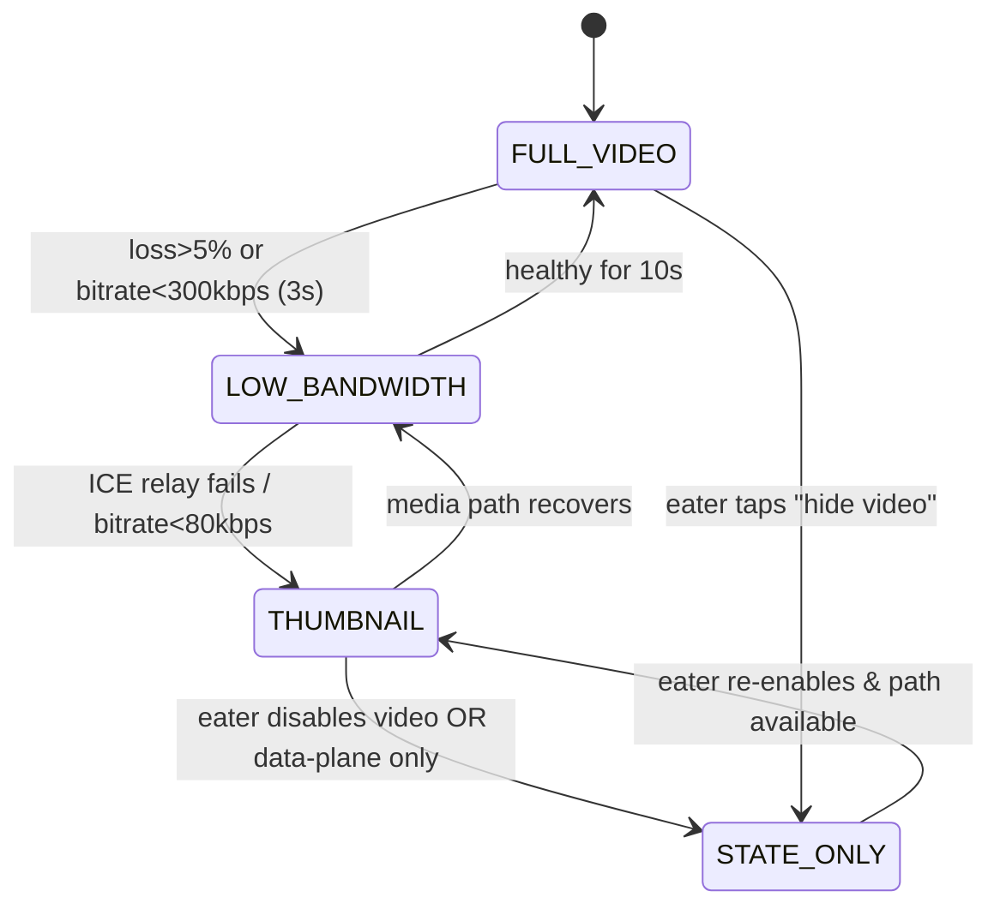
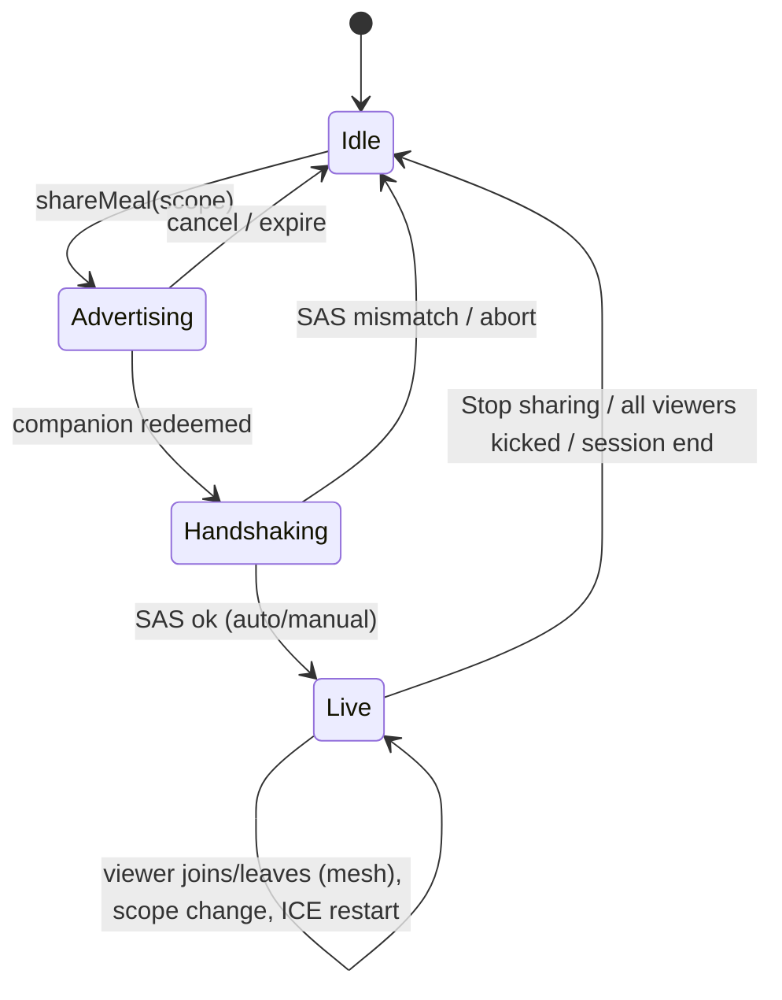
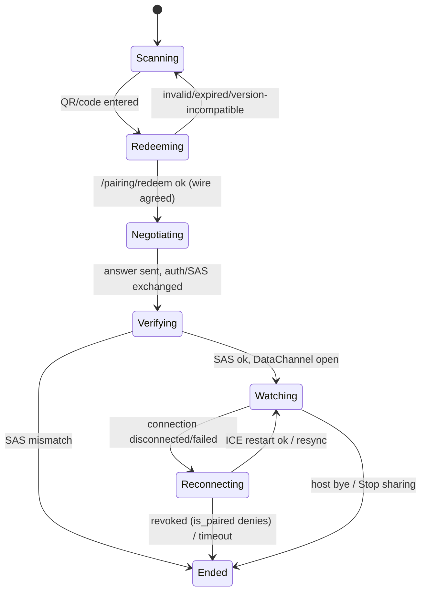

# Companion Mode, Secure Pairing & Realtime (Ring 3 — Companion Plane)

> Canonical path: `docs/06-companion-and-pairing.md`
> Owner: Companion / Realtime area. Status: Draft for build (Phase 4).
> Ring: 3 (the only cloud-touching ring). Packages: `@chewie/companion` (client), `supabase/functions/*` (signaling/token Edge Functions).
> ADRs referenced (by the single index in `docs/adr/README.md`): `0007-companion-webrtc-p2p` (primary), `0003-supabase-single-eu-backend`, `0008-isolated-behavior-scoring`, `0010-continuous-clock-timing-and-recovery`.

## 0. Scope & relationship to the rest of Chewie

This document specifies the **two-phone companion feature**: how an **Eater** device (on the stand, running the Calm Core + Sensing session) shares a **live camera view** and a **live mirror of Chewie state** with one or more **Companion** devices, securely, consentfully, and ephemerally.

It conforms to the shared architecture spine and **does not re-define load-bearing cross-ring artifacts** that other docs own. It *cites* them:

### Related docs (canonical numbering: `docs/NN-topic.md`, ADRs `docs/adr/NNNN-title.md`)

| Doc | What this doc consumes from it (never redefines) |
|---|---|
| `docs/00-architecture-spine.md` | The spine + the single authority reconciling doc filenames and the ADR index. |
| `docs/01-product-vision.md` | Product framing, the ethical mandate, the first-run/onboarding flow this doc plugs a share-consent step into. |
| `docs/02-system-architecture.md` | **The canonical `pairings` migration + `is_paired()` predicate (§12.1), the corrected revocation semantics (§12.2), the `CompanionStateMsg` shared type (§14), and the ADR index (§5.6).** This doc is the expansion of that seam. |
| `docs/03-chewing-engine-and-art.md` | The `ChewieClock` sleep-inclusive monotonic clock (§2.2) the countdown mirror synchronises against, and in-progress-session recovery (§8.4). |
| `docs/04-sensing-and-ai.md` | The camera track this ring may relay; the shared thermal budget in companion mode (§7.5 there / §7.5 here). |
| `docs/05-scoring-model.md` | `BehaviorScore`, the symmetric bands, and **R-HUD-1 (no live numeric score) / R-COERCE (anti-coercion) rules** this ring must not violate over the wire. |
| `docs/07-data-and-persistence.md` | `LocalProfile`, the age-band the companion gate reads, the default-timings config, and the single-profile-per-device decision (§13.1 of doc 02). |
| `docs/08-privacy-safeguards-and-onboarding.md` | GDPR Article 9 handling, the DPIA, minor-safe defaults, and the honest limits of the disordered-use safeguard. |
| `docs/09-testing-spikes-and-dod.md` | The **S6 spike** (real TURN relay-rate on carrier networks) and the Definition of Done gates this ring must pass. |

Shared cross-ring types — `Estimate<T>`, `SensorMode`, `BiteEvent`, `CompanionStateMsg` — are defined **once** in the Ring-1 package `@chewie/core-types` and are **imported, never re-declared** here (spine rule, doc 02 §5.4).

This section **consumes** structured state and **never** feeds back into the primary score. It is **severable**: deleting `@chewie/companion` and `supabase/functions/*` leaves a complete, shippable offline app (Rings 1–2). Enforced by the ring rule — Ring 1/2 code may never import `@chewie/companion` (CI bundle-graph check, doc 02 §5.5).

### In scope
Pairing (QR + rotating code), MITM-resistant handshake (a DH/signature-authenticated SAS that **never shares a secret with the backend**), scoped & revocable grants, WebRTC P2P media (DTLS-SRTP), signaling over Supabase Realtime + Edge Functions, the state-sync protocol, protocol-version negotiation, NAT traversal (STUN/TURN + honest cost model), reconnection, degraded modes, consent/presence/kick UX, and the Companion ("watch") app mode.

### Out of scope / non-goals (restated for this ring)
- **No recording, no server-side media storage, no record button** — the backend is never the media system of record.
- **No always-on cloud analysis of the feed**; the single opt-in still-frame call is Ring 2's concern (`docs/04-sensing-and-ai.md`), not here.
- **No SFU / managed media server** in the first release. 1:1 P2P is primary; a small **mesh** (2–3 viewers) is an optional near-term extension; SFU is deferred (`0007-companion-webrtc-p2p`).
- **No public feed, leaderboard, or viewer-to-viewer visibility.** Companions never see each other's identities.
- **No live numeric score to anyone** — see §3 R-HUD-1 enforcement below.

---

## 1. What I changed / improved over the raw briefing

| # | Raw idea | Improvement in this design | Why |
|---|----------|----------------------------|-----|
| 1 | "SAS/code confirmation to prevent MITM" | **The SAS authenticates the DTLS fingerprints via an ephemeral pairing key whose private half never leaves the eater and is *never sent to the server*.** QR flow auto-verifies via a signature the companion checks with the QR-carried pairing *public* key; code flow falls back to a human 4-word compare. **No secret is shared with the backend**, so a rogue Supabase actor cannot forge the SAS. | The previous draft POSTed the pairing secret to the Edge Function, which would let the exact adversary the SAS excludes (a compromised relay) compute a valid SAS and MITM the media keys. Fixed structurally (§6). |
| 2 | "Data channel mirrors app state" (implying a ticking countdown) | **The companion is sent phase-transition events with an authoritative `ChewieClock` timestamp + duration and renders its own drift-free countdown**, using an NTP-lite offset between the two devices' **sleep-inclusive** clocks. No per-second tick messages. | Mirrors the host engine (`ChewieClock`, doc 03 §2.2 / ADR-0010); `performance.now()` is insufficient because it does not advance across device sleep. Cuts state traffic ~30×. |
| 3 | "degraded (audio-off, thumbnail) modes" | **Four explicit media tiers** (`FULL_VIDEO` → `LOW_BANDWIDTH` → `THUMBNAIL` → `STATE_ONLY`) with automatic `getStats()`-driven adaptation; **video plane and state plane are independent transports** so state survives total media failure. | Honest graceful degradation; the companion is always at least state-only while Realtime works. |
| 4 | "scoped and revocable grants" | **Fine-grained scope flags** with **`score` (qualitative band only) and `intake` OFF by default**, `intake` hard-off for minors and when `intakeNumbersHidden` is set, and a **fail-safe filter** that omits fields under version mismatch. | Genuine per-signal consent; keeps the ethical mandate structural across the wire. |
| 5 | "host can kick viewers" | **Revocation is authoritative at the source** (eater tears down the PeerConnection instantly) **with RLS as the durable backstop** that blocks re-subscription — *not* an instant remote kill-switch (matches doc 02 §12.2). | A kicked viewer must not keep receiving; but we are honest that RLS propagation is not instantaneous, so security rests on source teardown. |
| 6 | "app-state sync" | **Versioned snapshot + delta protocol with a monotonic `seq`, resync, and explicit protocol-version negotiation** at pairing. | Reconnecting/loss/version-drift otherwise show stale, garbled, or silently mis-scoped state. |
| 7 | "TURN" (unspecified) | **Provider-abstracted ephemeral TURN creds** (Cloudflare Realtime API path *and* a coturn HMAC path — they differ), a **sensitivity-range** cost model (not a fragile point estimate), and a **Supabase Realtime cost/limits** line for signaling + thumbnail transport. The real relay rate is measured by the **S6 spike** before any monthly figure is quoted. | Never ship a static TURN secret; never quote a headline the mobile-carrier reality can't support. |
| 8 | "score how they're doing, remotely" | **No live numeric score crosses the wire.** The companion mirrors only the same **qualitative pace band + phase** the eater's own HUD shows (R-HUD-1). A number is available only in a **post-meal reveal the eater explicitly chooses** (§9.6). | Removes a ready-made coercion lever ("your score just dropped") and stops this doc contradicting doc 05. |

---

## 2. Roles, vocabulary & the two planes

**Roles** (spine naming): **Eater** (a.k.a. host — the device on the stand) and **Companion** (a.k.a. viewer). Companion actions are **pair**, **watch**, **revoke**. Active watchers are surfaced via **Presence**.

The link is split into **two independent transports** so failure of one never takes the other down:

| Plane | Transport | Direction | Carries | Survives when… |
|-------|-----------|-----------|---------|----------------|
| **State plane** | WebRTC **DataChannel** (primary) → **Supabase Realtime Broadcast** (fallback) | Eater → Companion (control both ways) | `CompanionStateMsg`: phase, phase-remaining params, bite count, **qualitative pace band**, current tip, sensor mode, degraded-mode signals, ping/pong | almost always (Realtime is a low-bandwidth cloud fallback) |
| **Video plane** | WebRTC **media track** (DTLS-SRTP), P2P, TURN-relayed only on NAT failure | Eater → Companion (recvonly) | the plate camera view; optional audio (off by default) | direct P2P or TURN reachable, adequate bandwidth |

The **Companion UI is reconstructed locally** from the state plane; the video plane is an *enhancement*. A companion with no working video plane still gets a fully useful, calm, mirrored experience (`STATE_ONLY`).

```mermaid
flowchart LR
  subgraph Eater["Eater device (Rings 1+2, local)"]
    ENG["@chewie/engine\n(phase, ChewieClock)"]
    FUS["@chewie/fusion\n(bite events, pace band)"]
    SCO["@chewie/scoring\n(BehaviorScore — local only)"]
    CAM["camera track\n(VisionCamera)"]
    SHARE["@chewie/companion\nShareController"]
    ENG --> SHARE
    FUS --> SHARE
    SCO -->|"qualitative band only\n(no live number)"| SHARE
    CAM --> SHARE
  end

  subgraph Cloud["Supabase (EU) — Companion Plane hub"]
    EF["Edge Functions\npairing/mint, pairing/redeem,\nturn/credentials, pairing/revoke"]
    RT["Realtime\nBroadcast + Presence\n(topic pair:<id>, gated by is_paired())"]
    DB[("Postgres + RLS\npairings (+companion cols),\nconsent_receipts")]
  end

  subgraph Companion["Companion device (watch mode)"]
    VIEW["Companion UI\n(mirrored state + video)"]
  end

  TURN["Managed TURN\n(Cloudflare Realtime /\ncoturn fallback)"]

  SHARE <-->|signaling| RT
  VIEW  <-->|signaling| RT
  SHARE -->|mint / turn creds| EF
  VIEW  -->|redeem / turn creds| EF
  EF --> DB
  RT -. "authz via is_paired()" .-> DB

  SHARE ==>|"WebRTC DataChannel (state)"| VIEW
  SHARE ==>|"WebRTC media (DTLS-SRTP video)"| VIEW
  SHARE -. "relay on NAT fail" .-> TURN
  TURN -. .-> VIEW
```

The **fat `==>` arrows are P2P and never traverse Supabase.** The cloud only ever sees signaling, presence, and consent metadata — never media, never plaintext intake, and (§12) there is **no cloud `sessions` table** the companion could read state from.

---

## 3. Threat model, privacy & ethics (this ring)

The companion feature is where surveillance/coercion risk is highest. Constraints, enforced structurally:

1. **Eater is always in control.** Sharing starts only on an explicit eater action; the eater can end it (globally or per-viewer) instantly. There is no viewer-initiated "request to watch" that auto-connects.
2. **Ephemeral by construction.** No frames or media are written to disk on either device or the server. There is **no record button and no recording code path**. A live watermark (`LIVE · <eater name> · <clock>`) is composited on the companion's video; we are honest (§9.5) that we cannot technically stop a determined viewer's OS-level screen recording.
3. **Consent-first & scoped** (§9.1). The eater chooses *what* is shared. Defaults: `video=off`, `audio=off`, `state=on`, `score=off`, `tips=on`, `intake=off`.
4. **R-HUD-1 holds over the wire (no live numeric score).** The eater's own HUD deliberately shows **no live number** during a meal (doc 05 R-HUD-1); therefore **the companion never receives one either.** Only the same **qualitative 3-state pace band** (`easing | in_band | brisk`) and phase are mirrored. A numeric `BehaviorScore` is available solely through a **post-meal reveal the eater explicitly triggers** (§9.6). This is a hard rule of this ring — a live number to a watcher is precisely the score-pressure/coercion lever R-COERCE forbids.
5. **Revocable & visible.** Every active watcher is shown live via Presence with a one-tap **kick**, plus a global **Stop sharing**. Revocation is *authoritative at the source* and RLS-backstopped (§8, matching doc 02 §12.2 — **not** an instant remote kill-switch).
6. **MITM-resistant pairing without trusting the backend** (§6). The SAS binds the DTLS fingerprints through a key the server never holds.
7. **Special-category data.** The camera stream is GDPR Article 9 data (doc 08); the P2P design means Supabase never receives it. Consent receipts (metadata only) are logged for the eater's own DSAR/audit — never content.
8. **Minor safety.** Under the digital-consent age (default 16, per-member-state adjustable), the companion feature defaults **off** and, if a guardian enables it, is restricted to `state`-only, `intake` hard-off, with a parental gate (§9.5). The age band comes from `LocalProfile` (`docs/07`); on a potentially-shared device the conservative default applies (doc 02 §13.1).

### Adversaries considered
- **Passive network eavesdropper** → defeated by DTLS-SRTP (media) + WSS/TLS (signaling).
- **Malicious/compromised signaling relay (incl. a rogue Supabase actor)** → cannot read media (E2E DTLS-SRTP), and **cannot MITM the media keys without failing the SAS** — because the SAS is authenticated by an ephemeral pairing key the server never receives, and the QR commitment is read visually off the eater's screen (§6.4). *(This is now a true claim; the earlier draft's server-side secret disclosure is removed.)*
- **Uninvited third party guessing a code** → short TTL, single-use redeem token, rate-limited, high-entropy; low-entropy code path additionally requires a human SAS compare (§6).
- **A kicked/expired viewer trying to keep watching** → source-side PeerConnection teardown stops media instantly; RLS then blocks re-subscription (§8).
- **A coercive companion policing someone's eating** → mitigated by eater-only control, visibility, `intake` hard-off + **no live number**, witness-not-controller companion, and no comparison/verdict surfaces (§9.5). We acknowledge software cannot fully resolve a coercive relationship; flagged for ED-clinician review (§14).

---

## 4. Data model — extends the canonical pairing migration (does not redefine it)

**The base `pairings` table, the `is_paired(topic)` predicate, and the `realtime.messages` RLS policies are owned by `docs/02-system-architecture.md §12.1` and live once in `supabase/migrations/`.** This ring adds an **additive** migration `NNNN_companion_scope.sql` that (a) adds companion-specific columns to `pairings` and (b) creates the append-only `consent_receipts` audit table. It reuses doc 02's `active boolean` + `expires_at` as *the* authorization state — this ring introduces **no competing `status` enum** and no second RLS model.

```sql
-- Recap (owned by doc 02 §12.1; shown for context, NOT re-created here):
--   pairings(id, eater_id, companion_id, realtime_topic GENERATED 'pair:'||id,
--            active bool, expires_at, created_at)
--   is_paired(topic) := exists active, unexpired row where uid in (eater_id, companion_id)
--   policies: companion_signaling_read/write on realtime.messages USING is_paired(topic)
--             eater_manages_pairing (ALL), companion_reads_pairing (SELECT)

-- Additive companion migration -------------------------------------------------
alter table pairings
  add column redeem_token_hash bytea,          -- SHA-256(redeemToken); server verifies possession, never the SAS secret
  add column redeem_salt        bytea,
  add column scope              jsonb not null  -- see CompanionScope (§9.1); server clamps for minors / hidden intake
      default '{"video":false,"audio":false,"state":true,"score":false,"tips":true,"intake":false}',
  add column sas_confirmed      boolean not null default false,  -- code-flow human confirmation ack
  add column min_wire_v         int,            -- negotiated protocol floor (§11.1)
  add column max_wire_v         int;

-- Append-only consent audit for the EATER's own DSAR record; metadata only.
create table consent_receipts (
  id          bigint generated always as identity primary key,
  pairing_id  uuid not null references pairings(id) on delete cascade,
  eater_id    uuid not null,
  event       text not null,   -- offered|redeemed|sas_confirmed|activated|scope_changed|kicked|revoked|ended|expired
  actor       text not null,   -- 'eater'|'companion'|'system'
  meta        jsonb not null default '{}',  -- e.g. {"scope":{...}} — NEVER media/intake values
  at          timestamptz not null default now()
);
alter table consent_receipts enable row level security;
create policy receipts_eater_read on consent_receipts
  for select using (auth.uid() = eater_id);       -- inserts are service-role (Edge Fn) only
```

**What the server can and cannot know.** `redeem_token_hash` lets the server verify the companion *redeemed* the pairing — this only authorizes the **signaling topic**, never the media keys. The **SAS secret is never in any column and never POSTed** (§6). Setting `active=false` (revoke) makes `is_paired()` return false, so the companion cannot re-subscribe — the **durable backstop**, not an instant sever (§8, doc 02 §12.2). A `pg_cron` Edge Function expires stale rows and reaps terminal ones after a short window (receipts retained longer for DSAR — window is an open question, §14).

**Schema minimization still holds:** no `weight`/`bmi`/`goal`/`calorie_target` columns anywhere (doc 02 §12.1); this migration adds none.

---

## 5. Edge Function API (signaling is P2P; functions only mint/verify/relay-creds)

Names align with doc 02 §12.1 (`/pairing/mint`, `/pairing/redeem`, `/turn/credentials`). All are Deno/TypeScript, authenticated with the caller's anonymous Supabase JWT; privileged writes use the service role. Rate-limited per device.

```ts
// ---- POST /pairing/mint  (eater) ----
interface PairMintReq {
  scope: CompanionScope;                 // §9.1; server clamps for minors / hidden-intake
  wire: { min: number; max: number };    // supported protocol range (§11.1)
  ttlSeconds?: number;                   // default 120, max 300
}
interface PairMintRes {
  pairingId: string;
  redeemToken: string;                   // 256-bit base64url — authorizes the SIGNALING topic only; server stores hash
  rotatingCode: string;                  // 8-digit, rotates client-side (§6.2)
  realtimeTopic: string;                 // 'pair:<id>'
  qrPayload: string;                     // 'chewie://pair?pid=..&rt=<redeemToken>&pk=<pairingPubKey>&t=<topic>&wv=min-max'
  expiresAt: string;                     // ISO
}
// NOTE: pairingPubKey (the SAS-authenticating public key) is generated ON THE EATER DEVICE and
// placed in the QR by the client — it is NOT minted or seen by the server. The eater keeps the
// matching PRIVATE key locally and never transmits it. (§6.4)

// ---- POST /pairing/redeem  (companion) ----
interface PairRedeemReq {
  pairingId: string;
  redeemToken: string;                   // proves possession of the OOB token; NOT the SAS secret
  wire: { min: number; max: number };    // companion's supported protocol range
  device: { label: string; platform: 'ios'|'android'; appVersion: string };
}
interface PairRedeemRes {
  ok: true;
  realtimeTopic: string;
  scope: CompanionScope;                 // authoritative, server-clamped
  wire: number;                          // negotiated common protocol version (§11.1)
  ice: IceConfig;                        // STUN + ephemeral TURN creds (§7)
  role: 'companion';
}

// ---- POST /turn/credentials  (either paired peer) ----
interface TurnCredsRes {
  iceServers: RTCIceServer[];            // provider-specific ephemeral creds (§7.3)
  provider: 'cloudflare'|'coturn';
  expiresAt: string;                     // minutes; re-mint on ICE restart if stale
}

// ---- POST /pairing/revoke  (eater) ----  (thin wrapper over the row flip, adds a receipt)
interface PairRevokeReq { pairingId: string; companionId?: string; reason?: string; }
// sets pairings.active=false (or nulls companion_id for a single kick); writes a consent_receipt; 204
```

`/pairing/mint` and `/pairing/redeem` write `consent_receipts` (`offered`, `redeemed`). **No SDP/ICE passes through Edge Functions** — signaling goes over Realtime Broadcast directly between the two clients (§7.2). **`redeemToken` gates signaling; it can never help forge the SAS** (§6.4).

---

## 6. Pairing & the MITM-resistant handshake

### 6.1 Goals
Easy (scan a QR or type a code), fast (< a few seconds), secure (short-TTL, single-use, high-entropy, rate-limited), and **MITM-resistant even if the signaling relay is malicious** — *including a rogue backend* — via a fingerprint-binding SAS whose authenticating key the server never receives.

### 6.2 Two entry methods
- **QR (preferred):** the eater's screen shows a QR encoding `chewie://pair?pid=<id>&rt=<redeemToken>&pk=<pairingPubKey>&t=<topic>&wv=<min-max>`. The companion scans it. Because the companion visually reads the eater's own screen, both the `redeemToken` **and the eater's `pairingPubKey`** cross a **human-authenticated out-of-band channel** — the strongest case; SAS is **auto-verified** (§6.4).
- **Rotating numeric code (fallback, across a room):** an 8-digit code shown on the eater's screen, **rotating every 30 s** (TOTP-like, derived client-side from `redeemToken` + time-step; server stores the hash for current + previous step to tolerate skew). A code cannot carry a public key, so this path **requires a human 4-word SAS comparison** (§6.4) and tighter rate limits.

### 6.3 Pairing sequence

```mermaid
sequenceDiagram
    autonumber
    participant E as Eater app
    participant EF as Edge Functions
    participant DB as Postgres (RLS)
    participant RT as Realtime (topic pair:<id>)
    participant C as Companion app

    Note over E: Eater taps "Share this meal", picks scope
    E->>E: generate ephemeral pairing keypair (sk_E kept local, pk_E for QR)
    E->>EF: POST /pairing/mint {scope, wire, ttl}
    EF->>DB: insert pairings(active, redeem_token_hash, scope, wire, topic)
    EF-->>E: {pairingId, redeemToken, rotatingCode, topic, qrPayload(pk_E)}
    E->>E: render QR (rt + pk_E) + rotating code; subscribe RT as eater

    Note over C: Companion opens "Watch", scans QR (or types code)
    C->>EF: POST /pairing/redeem {pairingId, redeemToken, wire, device}
    EF->>DB: verify redeem_token_hash + TTL + single-use; set companion_id; negotiate wire
    EF->>DB: insert consent_receipt(event=redeemed)
    EF-->>C: {topic, scope, wire, iceConfig}
    C->>RT: subscribe topic (is_paired() now authorizes companion)

    Note over E,C: Both on the private channel → WebRTC signaling (§7.2)
    E->>RT: broadcast offer (SDP incl. DTLS fingerprint fp_E)
    C->>RT: broadcast answer (SDP incl. DTLS fingerprint fp_C)
    E->>E: sign auth = Sign(sk_E, "chewie-sas-v1|pid|sort(fp_E,fp_C)")
    E->>RT: broadcast {t:'auth', sig}
    C->>C: SAS_words = words(H("chewie-sas-v1|pid|sort(fp_E,fp_C)"))

    alt QR flow (pk_E arrived OOB via QR)
        C->>C: Verify(pk_E, sig) over sorted fingerprints
        Note over C: valid → auto-verified, no human step; invalid → ABORT (MITM)
    else Code flow (no pk_E available)
        Note over E,C: both screens show the same 4-word SAS_words;<br/>eater confirms they match → "Yes, it matches"
        C->>DB: update sas_confirmed=true (RLS-scoped)
    end
    E->>DB: (row stays active) ; consent_receipt(event=activated)
    Note over E,C: Media + state flow (DTLS-SRTP + DataChannel)
```

### 6.4 The fingerprint-binding SAS — and why the server can't forge it (improvement #1, blocker fix)

Both endpoints' DTLS certificate fingerprints (`fp_E`, `fp_C`) appear in the exchanged SDP and are the identities from which SRTP keys derive. The SAS binds *those exact fingerprints*:

```ts
// The SAS input — a canonical string over BOTH DTLS fingerprints (order-independent).
function sasInput(pairingId: string, fpE: string, fpC: string): Uint8Array {
  const [a, b] = [normalizeFp(fpE), normalizeFp(fpC)].sort();
  return utf8(`chewie-sas-v1|${pairingId}|${a}|${b}`);
}

// CODE flow: humans compare a 4-word rendering. No key needed; a relay that swaps a
// fingerprint changes the words on one side → the humans catch the mismatch (ZRTP/Signal pattern).
function sasWords(pairingId: string, fpE: string, fpC: string): string {
  return encodeWords(sha256(sasInput(pairingId, fpE, fpC)).slice(0, 3), 4); // "amber · otter · lantern · dune"
}

// QR flow: the eater SIGNS the fingerprint binding with an ephemeral pairing key whose PUBLIC
// half travelled OOB in the QR and whose PRIVATE half never left the eater and was NEVER sent
// to the server. The companion auto-verifies.
function eaterAuth(skE: PrivateKey, pairingId: string, fpE: string, fpC: string): Uint8Array {
  return ed25519.sign(skE, sasInput(pairingId, fpE, fpC));
}
function companionVerify(pkE_fromQR: PublicKey, sig: Uint8Array, pairingId: string, fpE: string, fpC: string): boolean {
  return ed25519.verify(pkE_fromQR, sig, sasInput(pairingId, fpE, fpC)); // false ⇒ ABORT
}
```

**Why a malicious/compromised relay (incl. a rogue Supabase actor) cannot MITM:**
- The media consumer is the companion (recvonly). To interpose, a relay must present *its own* DTLS fingerprint to the companion as if it were the eater's.
- **QR flow:** the companion verifies `sig` with `pk_E` **obtained by visually scanning the eater's screen** — a channel the relay cannot alter. A relay that swaps `fp_E` cannot produce a signature that verifies under `pk_E` (it lacks `sk_E`, which was never transmitted). Verification fails → abort. **The server never receives `sk_E` and never receives any SAS secret**, so even a fully rogue backend cannot forge the binding. `redeemToken` — which the server *does* learn — only authorizes the signaling topic and is useless for forging `sig`.
- **Code flow:** there is no OOB public-key channel, so the humans compare the 4-word SAS. A swapped fingerprint yields different words on the two screens → detected. (Weaker than QR because it depends on the humans actually comparing; hence QR is the default and code is the explicit fallback.)

This upgrades "code confirmation" from *signaling* auth to *media-key* auth, and — critically — **removes the previous design's disclosure of a shared secret to the backend**. The threat-model claim in §3 is now sound.

### 6.5 Anti-abuse
- `active` rows carry a short `expires_at` (mint TTL default 120 s until redeemed; then extended to cover a meal). Redeem is single-use (`... set companion_id where companion_id is null` atomically).
- Rotating code: 30 s step, server accepts current+previous step only.
- Rate limits (per device JWT + IP): `pairing/redeem` ≤ 5/min with hard lockout after N failed tokens; `pairing/mint` ≤ 10/hour.
- One live `active` companion by default (`maxViewers=1`); mesh raises this to 2–3 with an explicit eater choice and the uplink warning of §7.3/§10.

---

## 7. WebRTC media plane & NAT traversal

### 7.1 PeerConnection setup (react-native-webrtc)

Media is **one-way**: eater `sendonly` video (+ optional audio), companion `recvonly`. This makes "the companion cannot send media back" a structural fact.

```ts
const pc = new RTCPeerConnection({
  iceServers: ice.iceServers,          // STUN + ephemeral TURN (§7.3)
  iceTransportPolicy: 'all',           // 'relay' only in a privacy-max mode (§7.4)
  bundlePolicy: 'max-bundle',
  rtcpMuxPolicy: 'require',
});

// EATER side:
const [videoTrack] = eaterCameraStream.getVideoTracks();
const sender = pc.addTrack(videoTrack, eaterCameraStream);   // sendonly transceiver
// audio deliberately NOT added unless scope.audio && the eater toggles it on
const sc = pc.createDataChannel('chewie-state', { ordered: true, negotiated: true, id: 0 });
applyBitrateCap(sender, 600_000);       // §7.5

// COMPANION side:
pc.addTransceiver('video', { direction: 'recvonly' });
// negotiated data channel id:0 opens symmetrically
```

DTLS-SRTP is mandatory and automatic in WebRTC — media is encrypted end-to-end between the two phones; a TURN relay only ever forwards ciphertext.

### 7.2 Signaling over Supabase Realtime Broadcast

Signaling messages are Broadcast events on the private `pair:<id>` topic (authorized by `is_paired()`, doc 02 §12.1). **Trickle ICE** is used. Schema in §11.

```mermaid
sequenceDiagram
    autonumber
    participant E as Eater
    participant RT as Realtime topic
    participant C as Companion
    E->>RT: {t:'hello', wire:{min,max}}
    C->>RT: {t:'hello', wire:{min,max}}   %% protocol-version negotiation (§11.1)
    E->>E: pc.createOffer(); setLocalDescription
    E->>RT: {t:'sdp', kind:'offer', sdp}
    C->>C: setRemoteDescription(offer); createAnswer; setLocalDescription
    C->>RT: {t:'sdp', kind:'answer', sdp}
    E->>RT: {t:'auth', sig}              %% QR-flow fingerprint signature (§6.4)
    par Trickle ICE
        E->>RT: {t:'ice', candidate}   (repeated)
        C->>RT: {t:'ice', candidate}   (repeated)
    end
    Note over E,C: ICE checks (host→srflx→relay); DTLS handshake → SRTP keys
    Note over E,C: SAS verified (§6.4); DataChannel opens; state streams
```

### 7.3 STUN/TURN: who hosts it, credentials, and honest cost

- **STUN** (reflexive-address discovery): free. A redundant pair (our coturn's STUN + a public STUN). Most home-Wi-Fi ↔ home-Wi-Fi pairs connect via `srflx` candidates with **no TURN cost**.
- **TURN** (relay when both peers are behind symmetric NAT / restrictive CGNAT — **common on mobile carriers, and a companion watching over cellular is a common scenario here**): **Cloudflare Realtime TURN** primary (globally anycast), **self-hosted coturn** on a small EU VM as fallback and worst-case cost bound.

**Credential minting differs by provider — the `/turn/credentials` Edge Function abstracts a `TurnProvider`:**

```ts
interface TurnProvider { mint(pairingId: string): Promise<RTCIceServer[]>; }

// coturn: the classic long-term-credential REST scheme (HMAC-SHA1 over a timestamped username).
const coturn: TurnProvider = {
  async mint(pairingId) {
    const ttl = 15 * 60;
    const username = `${Math.floor(Date.now()/1000) + ttl}:${pairingId}`;
    const credential = base64(hmacSha1(TURN_STATIC_SECRET, username));   // secret stays server-side
    return [{ urls: ['turn:turn.chewie.eu:3478?transport=udp','turns:turn.chewie.eu:5349'], username, credential }];
  },
};

// Cloudflare Realtime: a DIFFERENT API — the coturn HMAC scheme does NOT apply. The Edge Function
// calls Cloudflare's TURN credential-generation endpoint with the app id + API token and returns
// the iceServers Cloudflare issues (short TTL). Documented here so the primary provider's flow is
// specified, not assumed.
const cloudflare: TurnProvider = {
  async mint(pairingId) {
    const r = await fetch(`https://rtc.live.cloudflare.com/v1/turn/keys/${CF_TURN_KEY_ID}/credentials/generate`, {
      method: 'POST',
      headers: { authorization: `Bearer ${CF_TURN_API_TOKEN}`, 'content-type': 'application/json' },
      body: JSON.stringify({ ttl: 15 * 60 }),
    });
    return (await r.json()).iceServers as RTCIceServer[];   // { urls, username, credential }
  },
};
```

No long-lived secret ever ships in the client either way.

**Cost model — a sensitivity range, not a fragile headline** (verify pricing before launch; relayed egress ≈ **\$0.05/GB**):

| Quantity | Value |
|---|---|
| Video bitrate (default cap) | 600 kbps |
| Data per fully-relayed 30-min meal | ~**135 MB** |
| Relay cost for one fully-relayed 30-min meal | ~**\$0.007** |
| **Relay rate (share of meals needing TURN)** | **15–40%** — home↔home is low; a companion over **carrier CGNAT/symmetric NAT** is materially higher. *Do not quote a firm monthly figure until the **S6 spike** (`docs/09`) measures the real rate on carrier networks.* |
| Illustrative monthly (10 000 meals/mo) | ~**\$10–\$27/mo** at 15–40% relay; **coturn fallback bounds the worst case to a fixed EU VM.** |

**Supabase Realtime cost & limits (previously omitted).** Realtime carries *more* than a happy-path optimist counts: (a) **all signaling** (hello/SDP/ICE/auth), (b) the **STATE_ONLY fallback** when the DataChannel can't open, and (c) **`THUMBNAIL` frames** when the media path fails. Realtime **bills per message and enforces a payload cap (~256 KB per message)**. Therefore:
- **Thumbnails are rate- and size-capped:** ≤ **1 fps**, ≤ **160 px**, JPEG quality-scaled so the **base64 payload stays well under 256 KB** (target ≤ ~180 KB with envelope overhead). Over the DataChannel there is no such cap, but the same rate/size cap applies for battery/thermals.
- **State messages are event-driven** (§12), not per-second, keeping Realtime message volume low in the normal case.

**Mesh uplink multiplier.** In P2P mesh the eater **encodes/uploads one media copy per viewer** — 2 viewers ≈ 2× uplink and encoder load, 3 ≈ 3×. This multiplies both carrier data and the shared thermal budget (§7.5) and is the reason mesh is capped at 2–3 and gated behind an explicit eater choice; beyond that, the deferred SFU path (`0007-companion-webrtc-p2p`) is required.

### 7.4 Degraded / privacy modes (improvement #3)

Media auto-adapts across four tiers driven by `pc.getStats()` (RTT, loss, available outgoing bitrate) and explicit eater choice:



| Tier | What the companion sees | Transport |
|---|---|---|
| `FULL_VIDEO` | Live plate view, ~600 kbps, 24–30 fps | WebRTC media track |
| `LOW_BANDWIDTH` | Lower res (~320p) / 10–15 fps / ≤250 kbps | WebRTC media track (`setParameters`) |
| `THUMBNAIL` | ≤1 fps, ≤160 px still (§7.3 caps) | **state plane** (DataChannel; Realtime fallback under the 256 KB cap) |
| `STATE_ONLY` | No image; full mirrored calm UI (phase, countdown, bites, qualitative band, tip) | state plane only |

- **Audio is off by default** and never added unless `scope.audio` and the eater explicitly enables it — a separate, revocable toggle.
- **Thumbnail frames inherit the exact Article 9 handling** (in-memory only, never persisted) and the same scope/hide-numbers/minor gating as live video (privacy sign-off flagged in §14).

### 7.5 Bitrate / thermal management
```ts
function applyBitrateCap(sender: RTCRtpSender, maxBps: number) {
  const p = sender.getParameters();
  p.encodings = [{ maxBitrate: maxBps, maxFramerate: 30, scaleResolutionDownBy: 1 }];
  sender.setParameters(p);
}
```
The eater device is *also* running Ring 2 on-device ML over a 20–40 min meal, and the encoder shares a thermal budget with it (`docs/04-sensing-and-ai.md §7.5` calls this out as a gating spike, `docs/09` S3). The `ShareController` coordinates with fusion's duty-cycler: under thermal pressure it drops framerate → resolution → `THUMBNAIL`, **never letting the companion feature degrade the core session or the sensing accuracy**. Mesh multiplies this load (§7.3). Keep-awake + "keep charging" guidance apply (`docs/01`, `docs/03`).

### 7.6 Reconnection & eater process death

```ts
pc.onconnectionstatechange = () => {
  switch (pc.connectionState) {
    case 'disconnected': scheduleGrace(2000, tryIceRestart); break; // transient blip
    case 'failed':       tryIceRestart(); break;
    case 'closed':       cleanup(); break;
  }
};
let backoff = 500;
async function tryIceRestart() {
  if (!pairingActive()) return;                    // never reconnect a revoked pairing
  const offer = await pc.createOffer({ iceRestart: true });
  await pc.setLocalDescription(offer);
  if (turnCredsStale()) ice = await refreshTurnCreds();
  broadcast({ t: 'sdp', kind: 'offer', sdp: offer.sdp });
  backoff = Math.min(backoff * 2, 15000);          // capped exponential backoff
}
```

- **Signaling drop** (Realtime lost): the client re-subscribes to `pair:<id>`; the grant outlives a meal, so re-subscription succeeds without re-pairing — unless the pairing was revoked (`is_paired()` denies → viewer cleanly severed).
- **Viewer rejoin**: on reconnect the companion sends `{t:'resync'}` and the eater replies with a fresh `snapshot` (§12); video re-negotiates via ICE restart.
- **Eater app backgrounded → foregrounded**: session and share continue; a fresh snapshot is pushed.
- **Eater app *process death* (OS kill / battery / hard crash)**: the PeerConnection is gone; companions see the `bye`/Presence drop and show "Sharing ended," never a frozen frame. If the eater relaunches and **resumes the in-progress meal** via the engine's checkpoint (`docs/03 §8.4` recovery; `docs/07` checkpoint shape), that is a *new* PeerConnection → the companion must **re-pair** (a new short-lived token). We do not attempt to silently re-establish a stream across process death — re-pairing keeps the consent act explicit.

---

## 8. Revocation & kick — source-authoritative, RLS-backstopped (improvement #5; matches doc 02 §12.2)

We are **honest that RLS is not an instant remote kill-switch.** Immediacy comes from the source; RLS is the durable backstop that prevents re-authorization. "Stop all" / "Kick" performs, in order:

1. **Source-side teardown (immediate, authoritative):** the eater closes the `RTCPeerConnection` + DataChannel and stops the local media track for that companion → media and state stop at the source instantly, regardless of RLS timing. There is no relay that could keep pushing.
2. **Broadcast a `bye` control message** so a cooperating companion tears down too.
3. **Flip the row (`active=false`, or null `companion_id` for a single kick) — the durable backstop:** `is_paired()` now returns false, so the companion cannot **re-subscribe** or re-negotiate. A `consent_receipt(event=kicked|revoked)` is written; Presence reflects the departure.

```mermaid
sequenceDiagram
    autonumber
    participant E as Eater
    participant EF as Edge Fn /pairing/revoke
    participant DB as Postgres (RLS)
    participant RT as Realtime
    participant C as Companion
    E->>E: pc.close() + stop track    %% [immediate, authoritative] media stops at source
    E->>C: DataChannel {t:'control', op:'bye', reason:'revoked'}  (best-effort)
    E->>EF: POST /pairing/revoke {pairingId, companionId}
    EF->>DB: active=false / companion_id=null; consent_receipt(kicked)   %% durable backstop
    Note over RT,C: is_paired() now denies → companion cannot re-subscribe
    C->>C: onconnectionstatechange=closed → "Sharing ended by host"
```

**Global Stop sharing** = teardown all PeerConnections + `active=false` + end the share session. **Presence** (§9.2) drives the live watcher list the kick UI acts on.

---

## 9. Consent, presence & Companion UX

### 9.1 Scope model (fine-grained consent, improvement #4)

```ts
interface CompanionScope {
  video: boolean;   // live plate view (thumbnail/full)     — default OFF
  audio: boolean;   // table audio — separate explicit toggle — default OFF
  state: boolean;   // phase, countdown, bite count          — default ON
  score: boolean;   // the QUALITATIVE pace band only (never a live number) — default OFF (§3 R-HUD-1)
  tips:  boolean;   // the current pause-tip                 — default ON
  intake: boolean;  // grams/nutrition RANGES — default OFF; HARD-OFF for minors & when intakeNumbersHidden
}
```
The server **clamps** scope on `/pairing/mint` and `/pairing/redeem`: for a minor or when `intakeNumbersHidden` is set, `intake` is forced `false` regardless of the request. `score` gates only the **qualitative band** and the optional **post-meal reveal** (§9.6) — there is no wire representation of a live number to gate, by construction (§12.1). Scope is echoed authoritatively; the eater can tighten scope mid-session (a `scope` control message + receipt) — e.g. drop video to state-only without dropping the pairing.

### 9.2 Presence & the "who is watching" indicator
- Each companion `track()`s Presence with `{companionId, label, joinedAt, tier}`. The eater renders a **persistent, unmissable on-screen indicator** whenever ≥1 watcher is active: an animated eye/dot + "N watching," in **calm (never alarming-red) styling** consistent with the design system's no-failure-state rule. Tapping opens the **watcher sheet**: per-viewer label, connection tier, join time, **Kick**, and a global **Stop sharing**.
- The indicator is part of the eater's full-screen calm surface, legible in both chew and pause phases; **it is impossible to be in a sharing state without it visible.**

### 9.3 Companion ("watch") app mode
The Companion is the **same app** in watch mode (no separate binary). Its UI **reconstructs the calm surface locally** from the state plane, layered with the optional video:

- Full-screen phase colour + central icon + phase label, **countdown rendered locally** (§12.2) so it stays smooth and drift-free even on a lossy link.
- Bite counter; the **qualitative pace band** (if `scope.score`) shown exactly as the eater sees it — a gentle *easing / in-band / brisk* cue, **never a number**; current tip (if `scope.tips`). All **read-only**; the companion has **no controls over the eater's session** (can't change timings, can't nudge in v1). The companion is a **witness, not a controller** — an intentional anti-coercion choice.
- Video pane with the **live watermark** (`LIVE · <eater> · <clock>`), a connection-tier chip, and a "you are watching a live, non-recorded stream" banner.
- The companion sees **only what scope allows**; the intake area is **absent** (not greyed) when `scope.intake` is false.

### 9.4 First-share consent & permission priming
The end-to-end first-run/onboarding flow is owned by `docs/08` + `docs/01`; this ring contributes a **just-in-time share-consent step** the first time an eater taps "Share this meal":
- A calm explainer: *what* is shared (per-scope), that it is **live and not recorded by us**, that they can stop anyone instantly, and that a watcher is a companion, not a monitor.
- **Just-in-time permission requests** with rationale: camera (only if `scope.video`), notifications (for "someone is watching"/"sharing ended"). BLE is a Ring-2 concern, not requested here.
- If the profile's age band is under the digital-consent age, the flow lands on the **minor-safe path** (§9.5) instead.

### 9.5 What we can and cannot enforce; minor safety & anti-coercion
- **Honesty (screen recording):** we remove all *our* recording paths and show a watermark, but a determined companion could OS-screen-record. We mitigate, not eliminate — explicit "not recorded by us" framing, watermark, total eater control/visibility, and copy that frames watching as *support*. We document this rather than implying DRM-grade protection.
- **Minor safety:** under digital-consent age the companion feature is **off** by default; if a guardian enables it, restricted to `state`-only, `intake` hard-off, behind a parental gate. Age band from `LocalProfile` (`docs/07`); on a potentially-shared device the conservative default applies (doc 02 §13.1).
- **No comparison/leaderboard/verdict** ever crosses to the companion (consistent with `docs/05`): the companion sees the eater's own calm state, never a judgment.
- **Sharing onboarding copy** centres on *encouragement and company at the table*, never *monitoring compliance*.
- The disordered-use **safeguard runs on-device only and is never shared with the companion or cloud**; note (per `docs/08`) that its strongest intake-based signals are dark for a disengaged restrictor, so it is a gentle backstop, not surveillance.

### 9.6 The only path to a number: an eater-chosen post-meal reveal
Because no live number crosses the wire (§3), the *only* way a companion ever sees a numeric `BehaviorScore` is if, **after** the meal completes, the **eater explicitly chooses** to share the post-meal summary. It is sent as a distinct `PostMealReveal` message (§12.1), gated by `scope.score` **and** an explicit tap, with a receipt. Default is to share nothing numeric.

---

## 10. State machines

**Eater `ShareController`:**


**Companion connection FSM:**


---

## 11. Signaling message schema & protocol-version negotiation

Broadcast events on `pair:<id>`. Envelope + discriminated union:

```ts
interface SignalEnvelope {
  v: number;            // wire version of THIS envelope (negotiated, §11.1)
  from: 'eater' | 'companion';
  cid: string;          // per-connection id (mesh: one companion = one cid)
  ts: number;           // sender epoch ms (diagnostic only; timing uses ChewieClock, §12.2)
  msg: SignalMsg;
}

type SignalMsg =
  | { t: 'hello'; wire: { min: number; max: number } }                    // version negotiation (§11.1)
  | { t: 'sdp'; kind: 'offer' | 'answer'; sdp: string }
  | { t: 'auth'; sig: string }                                            // QR-flow fingerprint signature (§6.4)
  | { t: 'ice'; candidate: RTCIceCandidateInit | null }                   // null = end-of-candidates
  | { t: 'resync' }                                                       // companion requests a fresh snapshot
  | { t: 'scope'; scope: CompanionScope }                                 // eater tightened/loosened scope
  | { t: 'tier'; tier: MediaTier }                                        // degraded-mode signal
  | { t: 'bye'; reason: 'revoked' | 'ended' | 'error' | 'replaced' | 'incompatible' };
```

Signaling is **only** SDP/ICE/control — never state payloads (those go on the DataChannel, §12). If the DataChannel can't open, the state plane **falls back to Broadcast** using the §12 messages tunnelled as `{ t:'state', ... }` (subject to the Realtime 256 KB cap, §7.3).

### 11.1 Protocol-version negotiation (minor fix #6)
Two phones may run different app versions with different wire schemas. Mirroring `docs/07`'s upcaster stance for sync, the companion wire protocol negotiates explicitly:
- `/pairing/mint` and `/pairing/redeem` exchange each side's supported `wire.{min,max}`; the server records the **agreed common version** on the row and returns it. Each `SignalEnvelope.v` and `StateEnvelope.v` uses that agreed version.
- **No overlap** in supported ranges ⇒ redeem fails with a calm "**Update to watch**" (an incompatible `bye` reason exists for the runtime case).
- **Overlap but not the newest** ⇒ both sides emit at the agreed floor and **drop unknown fields** they receive.
- **Fail-safe rule (security-relevant):** any field a receiver does not understand at the negotiated version is **omitted, never guessed** — in particular the **scope/intake filter fails closed** (intake is treated as *not shared* under any version ambiguity), so a schema drift can never leak intake to a companion.

---

## 12. State-sync protocol (DataChannel; improvements #2 & #6)

The mirrored state is the shared type **`CompanionStateMsg` from `@chewie/core-types`** (doc 02 §14). This ring transports it with a snapshot/delta envelope; it does **not** redefine the payload shape. The corrected `CompanionStateMsg` (below) is the definition `@chewie/core-types` carries — it **supersedes the earlier `behaviorScore: number` field** shown in doc 02 §14 (per the R-HUD-1 fix), replacing a live number with a qualitative band.

### 12.1 Envelope, snapshot, delta & the corrected state payload
```ts
// @chewie/core-types — corrected CompanionStateMsg (no live numeric score).
type PaceBand = 'easing' | 'in_band' | 'brisk';   // the SAME qualitative cue the eater's own HUD shows

interface CompanionStateMsg {
  v: number;                          // negotiated wire version (§11.1)
  sessionId: string;
  quickMode: boolean;
  sensorMode: SensorMode;             // from @chewie/core-types (NONE|SCALE_ONLY|CAMERA_ONLY|BOTH)
  phase: 'idle'|'chew'|'pause'|'paused'|'complete';
  phaseStartedAtHostMonoMs: number;   // ChewieClock (sleep-inclusive) on the EATER device (§12.2)
  phaseDurationMs: number;            // 0 for open-ended phases
  biteCount: number;
  targetBites?: number;               // shown as a gentle band, never a quota
  paceBand?: PaceBand;                // present only if scope.score — QUALITATIVE, never a number (§3)
  currentTip?: string;                // present only if scope.tips
  mealElapsedMs: number;
  // Intake present ONLY if scope.intake (and not minor / not intakeNumbersHidden); else omitted entirely:
  intake?: { gramsSoFar: Estimate<number>; paceGpm: Estimate<number> };  // Estimate<T> per §12.3
}

// Post-meal only, and only on explicit eater choice (§9.6):
interface PostMealReveal {
  sessionId: string;
  behaviorScore: number;              // 1..100 — the ONE numeric score, shared post-meal by choice
  bandSummary: string;               // e.g. "steady and calm today"
}

interface StateEnvelope {
  v: number;
  seq: number;                        // monotonic per session; gap ⇒ companion sends {t:'resync'}
  t: 'snapshot' | 'delta' | 'thumbnail' | 'reveal' | 'ping' | 'pong' | 'control';
  ts: number;                         // eater epoch ms (diagnostic)
  body: CompanionStateMsg | Partial<CompanionStateMsg> | PostMealReveal | ThumbBody | PingBody | ControlBody;
}
```
`snapshot` carries a full `CompanionStateMsg` (on connect, on resync, and every 10 s); `delta` carries only changed fields (event-driven: phase transition, bite, band change, tip change) — **not** a per-second stream. `reveal` carries a `PostMealReveal` only after `phase='complete'` and only if the eater chose to share it.

### 12.2 Drift-free countdown mirroring via the sleep-inclusive `ChewieClock` (improvement #2; clock-source fix)
The companion never receives ticking numbers. It receives `phaseStartedAtHostMonoMs` + `phaseDurationMs` (stamped by the **eater's `ChewieClock`**) and computes remaining time locally against **its own `ChewieClock`**, offset by an NTP-lite estimate.

> **Clock-source correctness (explicit).** Both devices timestamp with the **native sleep-inclusive `ChewieClock`** — `mach_continuous_time()` on iOS, `SystemClock.elapsedRealtimeNanos()` on Android (doc 03 §2.2, ADR-0010). **`performance.now()` / `mach_absolute_time` are insufficient because they do NOT advance while the device is asleep** — a lock→sleep→resume on either phone would under-count elapsed time and land the mirrored countdown in the wrong phase. All timing here uses `ChewieClock`; wall-clock `ts` fields are diagnostic only.

```ts
// NTP-lite offset between the two devices' ChewieClock domains.
// companion sends {t:'ping', body:{c0}} stamped with its ChewieClock;
// eater replies {t:'pong', body:{c0, e1}} where e1 is the eater's ChewieClock at receipt.
function onPong(c0: number, e1: number, c2 = ChewieClock.nowMs()) {  // c2 = companion ChewieClock at receipt
  const rtt = c2 - c0;
  const offset = e1 - (c0 + rtt / 2);      // hostMono ≈ localMono + offset
  offsetEstimator.push(offset, rtt);       // keep the min-RTT sample (most accurate)
}

function remainingMs(snap: CompanionStateMsg): number {
  const nowHostMono = ChewieClock.nowMs() + offsetEstimator.best();   // local mono → host mono
  return Math.max(0, snap.phaseDurationMs - (nowHostMono - snap.phaseStartedAtHostMonoMs));
}
```
Because **both** clocks survive sleep, the offset estimate stays valid across a locked screen on either device; a resume re-issues a `ping` to refresh it. This mirrors the host engine exactly, so the two countdowns stay visually locked with no high-frequency stream. Ping/pong every ~3 s doubles as a liveness probe (§7.6).

### 12.3 `Estimate<T>` is imported, not redefined (shared-type fix)
Any quantitative field (only ever `intake`, and only when scoped) uses the **single canonical `Estimate<T>` from `@chewie/core-types`** (doc 02 §5.4 / doc 04 §8.1):

```ts
// @chewie/core-types — THE only sanctioned quantitative-estimate shape (cited, not redefined here).
type Confidence = number;                 // 0..1 numeric (composes with fusion's noisy-OR/min math)
interface Estimate<T> {
  value: T; low: T; high: T;
  confidence: Confidence;                 // numeric 0..1 — NOT 'low'|'med'|'high'
  unit?: string;                          // 'g' | 'g/min' | ...
  source: SensorSource;                   // provenance
}
```
The companion's shared `<EstimateValue>` component **refuses to render `value` without `low..high` and a "rough estimate" label** — so an intake number can never appear as precise. This is the same component and same type used by Rings 1–2; there is exactly one definition.

### 12.4 Resilience
- `seq` gap detection ⇒ companion requests `{t:'resync'}`; periodic 10 s snapshots bound worst-case staleness.
- DataChannel `chewie-state`: `ordered: true, negotiated: true, id: 0` (reliable; state is small and correctness beats latency).
- Backpressure: if `sc.bufferedAmount` grows, drop coalescible deltas (keep only the latest per field) — never drop a `snapshot`, `reveal`, or `control`. Thumbnails are dropped first.

### 12.5 Ethical gating at the wire (structural)
The `ShareController` builds every snapshot/delta/reveal through a **scope filter** that omits forbidden fields *before serialisation*:
- `paceBand` dropped if `!scope.score`; **never any live number regardless of scope** (there is no numeric field in `CompanionStateMsg` to leak).
- `intake` dropped if `!scope.intake`, if the eater is a minor, if `intakeNumbersHidden`, **or under any version ambiguity** (§11.1 fail-closed).
- `PostMealReveal` emitted only after `complete` **and** an explicit eater choice.

Because forbidden fields are never serialised, a companion client cannot render what it never received — "the companion can't see it" is a property of the transport, not just the UI.

---

## 13. Testing strategy

- **Pairing/handshake unit tests** (Vitest, pure): SAS input determinism & fingerprint-order independence; **QR-flow signature verifies with `pk_E` and FAILS on any swapped fingerprint (MITM)**; **the server never receives `sk_E` or any SAS secret** (assert the mint/redeem payloads contain neither); expired/single-use/rate-limit enforcement on `redeemToken`.
- **State-protocol property tests**: for any interleaving/drop/reorder of deltas + periodic snapshots, the companion's reconstructed state converges to the eater's within one snapshot interval; **`intake` never appears when scope forbids it, when the eater is a minor, or under version mismatch** (fail-closed); **no numeric score is ever present in any live message** (only `PostMealReveal` after `complete`).
- **Version-negotiation tests**: incompatible ranges → "update to watch"; partial overlap → agreed floor + unknown-field drop; intake fails closed under drift.
- **Clock-sync tests**: bounded countdown skew under injected jitter/loss **and across a simulated lock→sleep→resume on either device** (the `ChewieClock` path, aligned with `docs/09` S2's sleep-inclusive target).
- **RLS integration tests** (Supabase): a revoked/expired companion is denied by `is_paired()` on `realtime.messages` and cannot read another pairing.
- **WebRTC E2E** (Maestro + two dev-client builds / simulated peers): pair → SAS → media → degrade to thumbnail → recover → kick → verify media stops **at the source**. Force `iceTransportPolicy:'relay'` to exercise the TURN path against both providers.
- **Chaos**: kill Realtime mid-session (state falls back to Broadcast within the 256 KB cap); kill TURN (falls to thumbnail/state-only); process-kill the eater app (companions get Presence drop; resume requires re-pair).

---

## 14. Risks & open questions

**Risks**
- **Coercion misuse** remains the dominant residual risk; mitigated by eater-only control, visibility, `intake` hard-off + **no live number**, witness-not-controller companion, and framing — but software cannot fully resolve a coercive relationship. **Gate: ED-clinician design review before this ring ships** (spine risk register).
- **OS-level screen recording** by a companion is outside our control (§9.5) — minimised, disincentivised, and honestly documented.
- **Thumbnail-over-state-plane** briefly materialises frames; ephemeral and consent-gated, it still inherits Article 9 handling (in-memory only) and needs an explicit privacy-review sign-off (`docs/08`).
- **NAT/TURN reliability on carrier networks** and the **15–40 % relay-rate uncertainty** — the monthly cost headline is *deliberately a range* until the **S6 spike** (`docs/09`) measures the real rate on carrier CGNAT; coturn fallback bounds the worst case.
- **Supabase Realtime limits** (per-message billing, ~256 KB cap) constrain thumbnail size/rate and the state-only fallback — capped in §7.3; monitor message volume.
- **Thermal contention** with Ring 2 ML over a long meal (multiplied by mesh) — mitigated by the shared duty-cycler, but bounded by `docs/04`/`docs/09` S3's hard pass/fail budget on the low-end reference phone.
- **Cross-doc filename drift for this doc.** Sibling docs reference this file as `06-companion-plane.md` (doc 04) and `06-companion-realtime.md` (doc 02), while its committed path is `docs/06-companion-and-pairing.md`. The CI link-checker (`pnpm docs:links`) plus the single index in `docs/00-architecture-spine.md` / `docs/adr/README.md` must reconcile these to one canonical filename; until then this is a known broken-link risk (root-cause of the cross-reference findings).

**Open questions**
1. **Companion→eater reactions:** allow a tiny, eater-enabled, **non-numeric** "proud of you" reaction, or does *any* companion→eater channel undermine witness-not-controller? (Leaning: a minimal, eater-enabled reaction set only.)
2. **Mesh vs SFU threshold:** at 2 or 3 viewers, when does uplink/thermal cost force the deferred SFU path — and do we ever want group-watch given ED/comparison risk?
3. **QR vs code default:** default to QR (auto-SAS, stronger) and treat code as the explicit fallback? (Leaning yes — and note the code path's SAS is human-dependent.)
4. **TURN residency:** Cloudflare anycast may relay outside the EU; do we pin coturn-EU for privacy-max users at higher cost and expose it as a setting?
5. **Consent-receipt retention window** for DSAR vs data minimisation — how long, and surfaced where in the eater's privacy screen? (Owner: `docs/08`.)
6. **Companion identity longevity:** re-pair every meal (max ephemerality) vs an optional "trusted companion" remembered device — the latter needs its own revocation UI and a visible remembered-devices list.
7. **`CompanionStateMsg` upstream edit:** this doc's corrected payload (qualitative band, no live number) must be landed in `@chewie/core-types` and doc 02 §14 so the "supersedes" note (§12) becomes an actual single definition rather than a documented divergence.
