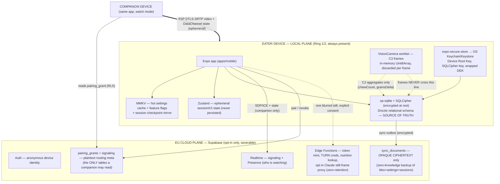
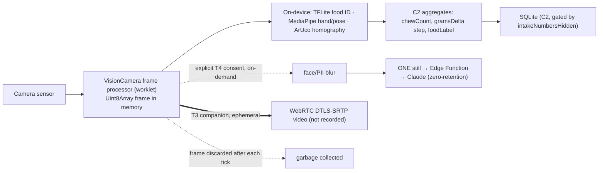
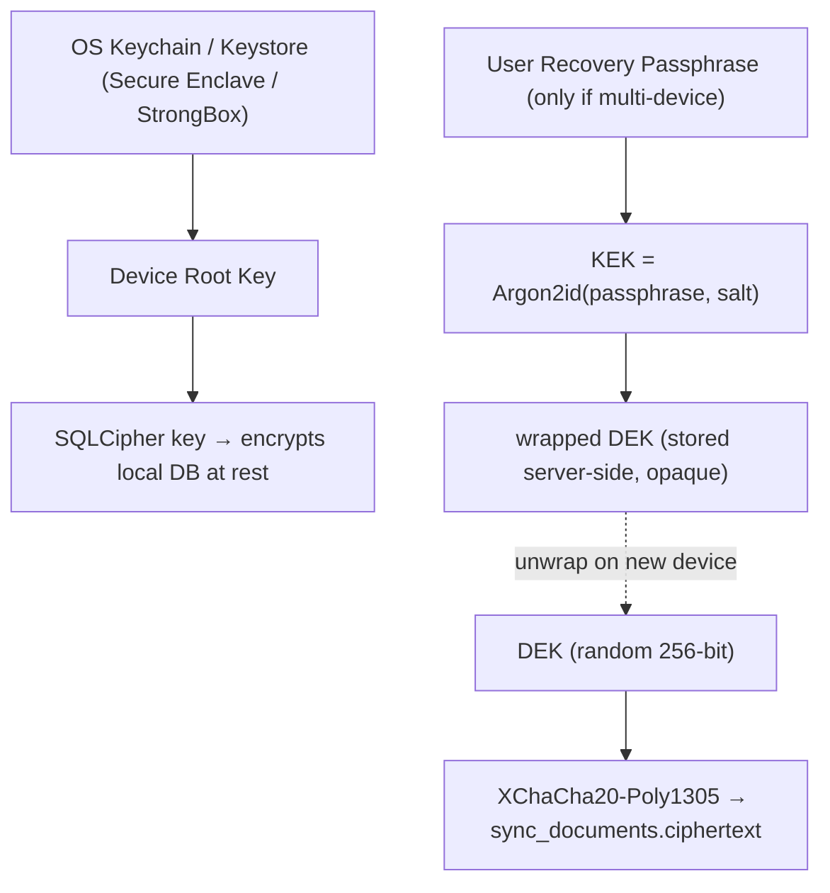
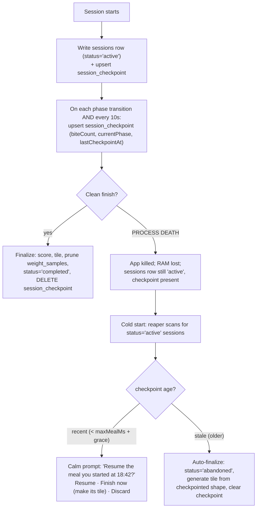

# Chewie — Data Model, Sync, Privacy & GDPR

**Area owner:** Data Model, Sync, Privacy & GDPR
**Status:** Design (Phase 0 → Phase 5 spanning)
**Conforms to:** the canonical architecture spine (concentric rings, React Native + Expo, Supabase EU, on-device-first AI, behavior-only scoring).

### Related docs (canonical numbering)

This repo uses a single flat, numbered convention: `docs/NN-name.md`, with ADRs in `docs/adr/NNNN-title.md` indexed by `docs/adr/README.md`. A CI link-checker (§17.1) walks `docs/` and fails the build on any dangling cross-reference or ADR citation, so the divergence that used to exist between sibling docs cannot recur.

| Ref | File | Owns |
|---|---|---|
| doc 01 | `docs/01-product-vision.md` | product vision, ethical mandate |
| doc 02 | `docs/02-system-architecture.md` | ring topology, transport |
| doc 03 | `docs/03-chewing-engine-and-art.md` | `@chewie/engine`, `ChewieClock`, `@chewie/art`, **in-progress session recovery (owner)** |
| doc 04 | `docs/04-sensing-and-ai.md` | `@chewie/fusion`, sensor drivers |
| doc 05 | `docs/05-scoring-model.md` | `@chewie/scoring`, safeguard heuristics |
| doc 06 | `docs/06-companion-plane.md` *(planned)* | Ring 3 / WebRTC / pairing UX |
| **doc 07** | **`docs/07-data-model-and-privacy.md`** | **this doc** |
| doc 08 | `docs/08-onboarding-and-consent.md` *(planned)* | **first-run flow owner**, age gate, intake-disclosure UX |
| doc 09 | `docs/09-release-and-safety-defaults.md` *(planned)* | `RELEASE_DEFAULTS`, minor-safe defaults |
| doc 10 | `docs/10-dpia.md` *(planned)* | mandatory DPIA |
| — | `docs/adr/README.md` | the single ADR index (all ADR numbers resolve here) |
| — | `packages/config` | **single source of placeholder timings/defaults** (§7.1) |
| — | `packages/core-types` | **single home of `Estimate<T>`, `BiteEvent`, `SensorMode`** (§5) |

> This doc no longer re-defines `Estimate<T>` or `BiteEvent` locally. Per the cross-doc reconciliation (§5), they are **frozen in `packages/core-types` (Ring 1)** and every doc — including docs 02, 04, 09 — cites that definition rather than paraphrasing it.

---

## 0. Scope & one deliberate deviation from the brief

This document owns **every byte Chewie persists or transmits**: the schema, where data lives, how (and whether) it syncs, how it migrates, and how it is protected and governed under GDPR. It does **not** re-specify scoring maths, fusion algorithms, the `ChewieClock`, or the WebRTC transport — those live in sibling docs; here we define only the *data* they read and write, plus the two data-shaped artifacts explicitly delegated to this doc: the **in-progress session checkpoint shape** (recovery logic owned by doc 03) and the **intake-disclosure persisted model** (UX owned by doc 08).

**Deviation, called out honestly:** the raw section brief said "local-first core (IndexedDB/SQLite via **Capacitor**)". The canonical spine explicitly **rejects Capacitor** in favour of **React Native + Expo with `op-sqlite` + SQLCipher + Drizzle** (see ADR index). I conform to the spine: the local store is **encrypted SQLite via `op-sqlite`**, not IndexedDB/Capacitor. The persistence *design* (relational local plane, opaque-ciphertext cloud plane) is engine-agnostic and would port unchanged if that decision were ever revisited.

---

## 1. Principles that drive every schema decision

1. **Local-first, always.** The Calm Core (Ring 1) reads/writes only the on-device SQLite DB. Zero rows are required in the cloud for the core loop. Airplane mode forever is a supported configuration.
2. **The cloud never sees plaintext eating data.** When sync is enabled, the server stores **opaque ciphertext** (client-side E2E encrypted) plus a thin layer of non-sensitive routing metadata. The operator, a subpoena, or a breach yields ciphertext only.
3. **Ethics enforced by schema *shape*, not by disclaimers.** There are **no `weight`, `bmi`, `goal`, `target_weight`, `calorie_budget` columns anywhere** — a weight-loss flow cannot be built without a schema migration that CI blocks (§12.4). The primary score table structurally cannot hold grams/calories.
4. **Intake is off *and* hidden by default — for everyone.** Intake computation and intake numbers are two separate, explicit opt-ins (§11.2). Enabling the scale for *behavior* purposes never surfaces grams/pace. Hidden-by-default is the persisted default for adults and minors alike.
5. **Data minimisation by construction.** We store coarse age *bands*, not birth dates; derived `BiteEvent`s, not raw high-frequency sensor streams (by default); seeds+params, not rendered images.
6. **Camera imagery is the most sensitive asset and is never persisted.** Frames live in a VisionCamera worklet as in-memory `Uint8Array`s and are discarded per frame. No repository, sync path, or export can reach them (§10).
7. **Every quantitative estimate is a range.** The only sanctioned numeric-estimate shape is `Estimate<T>` (§5); a bare number cannot be persisted for intake fields.

---

## 2. Data classification — the master table that governs handling

Every field maps to exactly one class. The class dictates: *may it be persisted? may it leave the device? may it sync? may a companion ever see it?*

| Class | Examples | Persist locally? | Sync (encrypted)? | Leave device? | Companion may see? | GDPR |
|---|---|---|---|---|---|---|
| **C0 – Non-personal** | app version, `algoVersion`, `scoringVersion` | yes | yes (plaintext meta ok) | yes | n/a | none |
| **C1 – Personal** | profile id, locale, settings, session timing, `ChewArt` tiles, `BehaviorScore`, continuity/streaks, session checkpoint | yes | yes (ciphertext) | only encrypted | live `BehaviorScore`/phase over ephemeral channel only | Art 6 |
| **C2 – Health / special (Art 9)** | `MealEstimate` (grams, pace, nutrition), `WeightSample`, food labels, `BalanceInsight`, `SafeguardEvent` | yes (SafeguardEvent local-only) | yes **except SafeguardEvent (never syncs)** | only encrypted; **never** for SafeguardEvent | **never** the numbers; **never** SafeguardEvent | **Art 9** — explicit consent |
| **C3 – Imagery / biometric (Art 9, highest)** | camera frames, live video, hand/pose landmarks | **never persisted** | **never** | only ephemeral P2P stream w/ consent, or one blurred still w/ explicit consent | live video only, ephemeral, not recorded | **Art 9** — explicit consent, DPIA |

Rules of thumb baked into the code:
- **C3 never touches the persistence layer.** Enforced by an architectural boundary: `@chewie/fusion` frame processors return only C2 aggregates (`chewCount`, a `gramsDelta` step), never a frame.
- **SafeguardEvent (disordered-use heuristic output) is C2 but pinned local-only** — excluded from the sync outbox and from any companion/cloud path, so the safeguard cannot itself become a surveillance vector.
- **Intake C2 numbers are gated by a derived `intakeNumbersHidden` selector** (§11.2) whose default resolves to *hidden* for everyone.

---

## 3. Storage topology



**Key property:** delete the entire Cloud subgraph and the app is still complete. The Local plane is the system of record; the Cloud plane is an opt-in encrypted mirror + a signaling backplane.

---

## 4. Consent tiers as a state machine

Consent is **layered exposure**, each layer an independent, revocable opt-in with a signed **consent receipt** (§13.4). Enabling any cloud feature provisions an **anonymous** Supabase identity (no email, no account) — it does *not* force data backup on.

```mermaid
stateDiagram-v2
    direction LR
    [*] --> T1_LocalOnly: default (no network reachable)
    T1_LocalOnly --> T2_CloudSync: opt-in encrypted backup<br/>(consent receipt, provisions anon identity)
    T2_CloudSync --> T1_LocalOnly: withdraw → CRYPTO-SHRED cloud
    T1_LocalOnly --> T3_Companion: enable companion<br/>(explicit; provisions anon identity; sync NOT required)
    T3_Companion --> T1_LocalOnly: disable → revoke all grants
    T3_Companion --> T4_CloudAI: enable "second opinion"<br/>(EXPLICIT Art 9 consent, off by default)
    T4_CloudAI --> T3_Companion: disable
    T1_LocalOnly --> [*]: delete everything (crypto-shred + purge)
```



> **Intake disclosure is orthogonal to these transport tiers.** Turning on *intake computation* and *intake numbers* (§11.2) is a separate, explicit, local opt-in that is **not** implied by enabling sensing, the scale, sync, or the companion. A person can run the scale for behavior/pace-band coaching forever and never see a gram.

| Tier | What it turns on | Data that leaves the device | Lawful basis |
|---|---|---|---|
| **T1 Local-only** *(default)* | nothing | none | n/a (on-device only) |
| **T2 Cloud sync** | encrypted backup + multi-device | ciphertext of C1/C2 (never SafeguardEvent) | Art 6(1)(a) + **Art 9(2)(a)** explicit consent |
| **T3 Companion** | pairing, signaling, live P2P view | pairing metadata (C1); **ephemeral** live video (C3) & state (C1) P2P only | explicit consent |
| **T4 Cloud AI** | one blurred still "second opinion" | **one** blurred still frame (C3), on demand, zero-retention | **Art 9(2)(a)** explicit consent |

A `ConsentReceipt` row (append-only) is written on every GRANT/WITHDRAW. Withdrawing a tier runs its teardown (revoke grants / crypto-shred cloud) **before** the receipt's `WITHDRAW` is finalized.

---

## 5. Shared value types (frozen in `packages/core-types`)

These types are the reconciled, single canonical definitions. Docs 02, 04, 05, 09 import them; none redefine them. The two historically-divergent types (`Estimate<T>`, `BiteEvent`) are called out explicitly.

```ts
// packages/core-types/src/ids.ts

/** UUIDv7: time-ordered, client-generatable offline (no server round-trip),
 *  index-friendly. Replaces autoincrement, which cannot survive distributed
 *  offline inserts across devices. */
export type Uuid = string & { readonly __brand: 'uuid' };

/** Hybrid Logical Clock — the causality token stamped on every mutable,
 *  syncable field. Beats wall-clock LWW: clock skew between two phones can
 *  otherwise silently discard the newer edit. Encoded as a lexicographically
 *  sortable string so `max()` = "wins". */
export interface Hlc { wall: number; counter: number; nodeId: Uuid; }
export type HlcString = string; // `${pad(wall)}:${pad(counter)}:${nodeId}`

export enum SensorMode { NONE='NONE', SCALE_ONLY='SCALE_ONLY', CAMERA_ONLY='CAMERA_ONLY', BOTH='BOTH' }
export type AgeBand = 'UNDER_16' | 'AGE_16_17' | 'ADULT' | 'UNDISCLOSED';
```

### 5.1 `Estimate<T>` — FROZEN (was defined three incompatible ways)

Previously docs disagreed on the confidence representation (`number` vs `'low'|'medium'|'high'`), on the extra fields (`source` vs `method` vs `source+unit`), and on the home package (`core-types` vs `@chewie/fusion` vs `packages/shared`). **Resolution:** one definition, in `packages/core-types` (Ring 1, so scoring/fusion/nutrition/ui all depend downward on it), with **numeric confidence** — chosen deliberately because `@chewie/fusion` composes confidences with noisy-OR / `min` arithmetic, which needs a number, not an enum.

```ts
// packages/core-types/src/estimate.ts
// THE only sanctioned quantitative-estimate shape. The shared UI component
// refuses to render `value` without `low/high` and a "rough estimate" label,
// so an estimate cannot be shown as precise/medical truth.
export interface Estimate<T extends number = number> {
  value: T;
  low: T;
  high: T;
  confidence: number;      // 0..1 — numeric (composes with fusion noisy-OR / min)
  method: 'scale' | 'fiducial' | 'classifier' | 'manual' | 'fused';
  unit: string;            // 'g' | 'g/min' | ... — makes the number self-describing in UI/export
}

// For UI copy buckets only, derive a label — never persist the enum as the source of truth:
export const confidenceBand = (c: number): 'low'|'medium'|'high' =>
  c < 0.34 ? 'low' : c < 0.67 ? 'medium' : 'high';
```

### 5.2 `BiteEvent` — FROZEN (was defined four incompatible ways)

`BiteEvent` crosses ring **and** companion boundaries, so its divergence was load-bearing. Prior variants disagreed on confidence (enum vs number), mass field name (`grams` vs `massG` vs `grams`), and timestamps (`t`/`intervalMs` vs `tStartMonoMs`/`tEndMonoMs` vs `atMs`). **Resolution:** one definition in `core-types`, **numeric confidence**, a single `tOffsetMs` on the `ChewieClock` timebase (§6.2), and `gramsDelta` as an `Estimate` (never a bare number).

```ts
// packages/core-types/src/bite-event.ts
export type BiteSource = 'MANUAL' | 'SCALE_STEP' | 'HAND_TO_MOUTH' | 'FUSED';

export interface BiteEvent {          // C2 — IMMUTABLE, insert-only
  id: Uuid;
  sessionId: Uuid;
  profileId: Uuid;
  tOffsetMs: number;                  // ms from session start on the ChewieClock
                                      //   (sleep-inclusive continuous monotonic; NOT wall clock)
  source: BiteSource;
  confidence: number;                 // 0..1 (canonical — was an enum in some earlier drafts)
  gramsDelta: Estimate<number> | null;// C2 per-bite mass step; null in NONE/CAMERA_ONLY, and
                                      //   never surfaced while intake is hidden (§11.2)
  chewCount: number | null;
  chewDurationMs: number | null;
  // No updatedHlc / deleted: append-only log; union-merged; removed only via session cascade.
}
```

---

## 6. The canonical data model (TypeScript)

Grouped by ring. Fields marked `// C2`/`// C3` carry the classification from §2. Every mutable syncable entity carries `updatedHlc: HlcString` and `deleted: boolean` (tombstone). Immutable entities carry neither (insert-only, union-merged).

### 6.1 Identity, profiles & settings (C1)

> **Multiple profiles per device — explicit decision.** Chewie supports **lightweight local profile switching** (a shared kitchen-stand tablet, or partners taking turns). The schema is already keyed by `profileId` throughout, so this is a natural fit, and it is the *safer* choice under the minor-safety mandate: a shared device must not blend an adult's and a child's baselines, streaks, or age-gated defaults. Rules: each `LocalProfile` carries its **own** `ageBand`, continuity, baseline, and settings; exactly one profile is active at a time (`ActiveProfilePointer`); creating a new profile **always re-runs the age gate** (doc 08) and applies that profile's own minor-safe defaults. Profiles are local-only identities; only a profile that has separately opted into a cloud tier gets a `cloudUserId`. There is deliberately **no** cross-profile aggregate view (no household leaderboard — that would violate the no-comparison mandate).

```ts
export interface ActiveProfilePointer { activeProfileId: Uuid; } // stored in MMKV; the only "who's using it now" state

export interface LocalProfile {
  id: Uuid;                 // also the HLC nodeId for this device's writes
  createdAt: string;        // ISO 8601
  displayLabel: string;     // local, non-identifying (e.g. "Green cup") — for the switcher only
  locale: 'nl' | 'en';
  ageBand: AgeBand;         // set at onboarding PER PROFILE; drives gating (§11.3)
  cloudUserId: Uuid | null; // Supabase anon uid once this profile enables any cloud tier; else null
  schemaVersion: number;    // local schema this row was last written under
  // NOTE: no dateOfBirth (minimisation), no weight, no BMI, no goal.
}

export type IntakeDisclosure = 'HIDDEN' | 'SHOWN';

export interface Settings {
  profileId: Uuid;
  // --- calm core (defaults sourced from packages/config, §7.1) ---
  chewPhaseMs: number; pausePhaseMs: number; bitesTarget: number | null;
  chewColor: string; pauseColor: string; icon: string;
  hapticsEnabled: boolean; tipsEnabled: boolean;
  quickModeChewMs: number; quickModePauseMs: number;
  // --- intake ethics gates (TWO fields; unify on doc 08's stronger model) ---
  intakePipelineEnabled: boolean; // default FALSE — is intake even COMPUTED/derived at all?
  intakeDisclosure: IntakeDisclosure; // default HIDDEN — are intake numbers ever SHOWN?
  // `intakeNumbersHidden` is NOT stored; it is a derived selector (§11.2).
  // --- ring / transport gates ---
  sensingEnabled: boolean;        // Ring 2 opt-in (RING2_SENSING_ENABLED) — for BEHAVIOR; does NOT reveal intake
  companionEnabled: boolean;      // Ring 3 opt-in
  cloudSyncEnabled: boolean;      // Tier 2
  cloudAiSecondOpinion: boolean;  // Tier 4, default false
  safeguardsEnabled: boolean;     // default true; user-disableable (anti-surveillance)
  // per-FIELD causality → per-field LWW so unrelated edits never clobber (§9)
  _clocks: Record<string, HlcString>;
  updatedHlc: HlcString;
}
```

### 6.2 Session, checkpoint & sensing

```ts
export type SessionMode = 'FULL' | 'QUICK';
export type SessionStatus = 'active' | 'completed' | 'abandoned';

export interface MealSession {              // C1
  id: Uuid; profileId: Uuid;
  mode: SessionMode; sensorMode: SensorMode;
  startedAt: string;                        // ISO wall clock — for display only
  startedMono: number;                      // ChewieClock reference (§ below) — drift-free duration base
  localDate: string;                        // 'YYYY-MM-DD' device-local CIVIL date at session start;
                                            //   FROZEN at start — the canonical day bucket (§6.6)
  endedAt: string | null; status: SessionStatus;
  plannedChewMs: number; plannedPauseMs: number;
  biteCount: number;                        // denormalised; recomputed from BiteEvents on merge
  tileId: Uuid | null;                      // ChewArt generated on completion
  behaviorScoreId: Uuid | null;
  estimateId: Uuid | null;                  // OPTIONAL; null unless intake pipeline was enabled
  restDay: boolean;                         // gentle continuity — a first-class rest day
  updatedHlc: HlcString; deleted: boolean;
}
```

> **`startedMono` is on the `ChewieClock`, NOT `performance.now()`.** This is the reconciliation of the clock-source contradiction flagged across docs 01/02. `performance.now()` / `mach_absolute_time` **stop advancing while the device sleeps**, so a recompute-on-resume after a locked screen would *under*-count elapsed time and land the engine in the wrong phase. The single source of truth for all elapsed-time computation is the native **`ChewieClock`** defined in doc 03 §2.2, wrapping `mach_continuous_time()` (iOS) / `elapsedRealtimeNanos()` (Android) — both of which **include sleep**. `MealSession.startedMono` stores a reading from that clock. Wall-clock (`startedAt`) is persisted only for display and never for duration maths.

```ts
export interface SessionCheckpoint {        // C1 — process-death recovery (shape owned here, logic in doc 03)
  profileId: Uuid;                          // single active checkpoint per profile
  sessionId: Uuid;
  startedAtWall: string;                    // ISO — to render "resume the meal you started at 18:42?"
  startedMono: number;                      // ChewieClock reference at session start (sleep-inclusive)
  localDate: string;                        // frozen civil date (§6.6)
  mode: SessionMode; sensorMode: SensorMode;
  plannedChewMs: number; plannedPauseMs: number;
  biteCount: number;                        // last checkpointed count
  currentPhase: 'CHEW' | 'PAUSE';           // last known phase, for a calm resume
  lastCheckpointAt: string;                 // ISO wall — heartbeat; drives the reaper (§6.5)
}

export interface WeightSample {             // C2 — raw curve, LOCAL-ONLY by default
  id: Uuid; sessionId: Uuid;
  tOffsetMs: number; grams: number; stable: boolean;
  // pruned to BiteEvents on session finalize (§13.3 retention); not in default sync set
}
```

`BiteEvent` is defined in §5.2 (`core-types`).

### 6.3 Estimates & insight (C2, optional, gated) — **not scoring**

```ts
export interface MealEstimate {             // C2 — only ever written when intakePipelineEnabled
  id: Uuid; sessionId: Uuid; profileId: Uuid;
  totalGrams: Estimate<number> | null;
  gramsPerBite: Estimate<number> | null;
  paceGramsPerMin: Estimate<number> | null;
  foodLabels: FoodLabel[];
  balanceInsightId: Uuid | null;
  sensorMode: SensorMode; method: Estimate['method'];
  updatedHlc: HlcString; deleted: boolean;
}
export interface FoodLabel { label: string; confidence: number; groupTags: string[]; } // 0..1, per §5.1

export interface BalanceInsight {           // C2 — qualitative, NON-punitive
  id: Uuid; profileId: Uuid; sessionId: Uuid;
  variety: string[];                        // e.g. ['vegetables_present','whole_grain']
  narrative: string;                        // from constrained catalog; no red verdicts
  confidence: number;                       // 0..1
  // DELIBERATELY no numeric grade. The banned type 'NutritionScore'/'/100 healthiness'
  // has no representation here — a punitive framing has nowhere to live.
}
```

### 6.4 Art, score, baseline, continuity (C1)

```ts
export interface ChewArtTile {              // C1 — IMMUTABLE, insert-only, ~hundreds of bytes
  id: Uuid; profileId: Uuid; sessionId: Uuid;
  seed: string; algoVersion: number;
  params: ChewArtParams;                    // derived from BEHAVIOR + session shape ONLY
  createdAt: string;                        // NOT from intake — art is not an "ate little" trophy
}

export interface BehaviorScore {            // C1 — mirrors scoreBehavior() signature exactly
  id: Uuid; sessionId: Uuid; profileId: Uuid;
  score: number;                            // 1..100; 100 = centred in healthy bands
  components: {
    paceInBand: number;                     // symmetric distance-from-band (0..1)
    chewThoroughness: number; pauseAdherence: number;
    rhythmSteadiness: number; consistencyVsBaseline: number; // self vs self
  };
  baselineId: Uuid | null; scoringVersion: number; createdAt: string;
  // STRUCTURAL GUARANTEE: no grams, no calories, no totalGrams field exists here.
  // There is no column an intake value could be written to. (§12.4 CI guard, and
  // packages/scoring's scoreBehavior() cannot even receive intake as an argument.)
  updatedHlc: HlcString; deleted: boolean;
}

export interface Baseline {                 // C1 — self-vs-self only ("battle yourself")
  id: Uuid; profileId: Uuid; windowStart: string; windowEnd: string;
  medianPaceScore: number; medianChew: number; medianPauseAdherence: number;
  sampleCount: number;                      // behaviour stats ONLY — never intake medians
  updatedHlc: HlcString;
}

export interface Continuity {               // C1 — streaks that never punish
  profileId: Uuid;
  currentRun: number; longestRun: number;
  frozenUntil: string | null;               // 'YYYY-MM-DD' civil date; missed day → freeze, not reset
  lastEngagedDate: string;                  // 'YYYY-MM-DD' civil date (§6.6)
  restDays: string[];                       // 'YYYY-MM-DD' civil dates; first-class, don't break runs
  tzAtLastEngage: string;                   // IANA tz active at last engagement (§6.6 travel/DST rule)
  updatedHlc: HlcString;
}
```

### 6.5 Consent, pairing, safeguards, sync plumbing

```ts
export type ConsentTier = 'LOCAL_ONLY'|'CLOUD_SYNC'|'COMPANION'|'CLOUD_AI';
export interface ConsentReceipt {           // C1 — APPEND-ONLY ledger, legal proof
  id: Uuid; profileId: Uuid;
  tier: ConsentTier; action: 'GRANT'|'WITHDRAW';
  policyVersion: string; purposes: string[];
  lawfulBasis: 'consent'|'explicit_consent';
  at: string;                               // immutable; included in DSAR export
}

export type PairingStatus = 'pending'|'active'|'revoked'|'expired';
export interface PairingGrant {             // C1 metadata — lives in CLOUD; only companion-readable table
  id: Uuid; eaterUserId: Uuid; companionUserId: Uuid | null;
  tokenHash: string;                        // hash of short-lived signed pairing token (QR/code)
  status: PairingStatus; scope: 'LIVE_VIEW'|'STATE_ONLY';
  createdAt: string; expiresAt: string; revokedAt: string | null;
}

/** Safeguard signals split by whether they need the intake pipeline. See §6.5.1 for the
 *  honesty note: intake-based signals are DARK unless the user opted into intake, and
 *  usage-based signals are dark for a user who simply stops opening the app. */
export type SafeguardSignal =
  // default-available (work in behavior-only calm mode, no intake needed):
  | 'OBSESSIVE_NUMBER_TOGGLING'   // repeatedly enabling/disabling intake disclosure
  | 'EXTREME_SELF_SET_TARGET'     // extreme bite target / chew or pause timings set by the user
  | 'SESSION_SHAPE_ANOMALY'       // e.g. abnormally many ultra-short sessions
  // intake-gated (ONLY available when intakePipelineEnabled — see §6.5.1):
  | 'SUSTAINED_LOW_INTAKE'
  | 'SKIPPED_MEAL_PATTERN'
  | 'BITE_SIZE_RESTRICTION';

export interface SafeguardEvent {           // C2 — LOCAL-ONLY, never synced, never to companion
  id: Uuid; profileId: Uuid;
  signal: SafeguardSignal;
  requiresIntakePipeline: boolean;          // true for the intake-gated set above
  at: string; acknowledged: boolean;        // rolling 30-day window; excluded from outbox + companion export
}

/** Drives sync push. One row per pending local mutation. */
export interface SyncOutboxRow {
  id: Uuid; entityType: string; entityId: Uuid;
  hlc: HlcString; op: 'upsert'|'delete';
  ciphertext: Uint8Array; nonce: Uint8Array; schemaVersion: number;
  attempts: number; nextRetryAt: string | null;
}
```

#### 6.5.1 Honest limits of the disordered-use safeguard (data-level statement)

The care pathway (owned by doc 05) must not be presented as more protective than it structurally can be. Stated at the data level:

- **The intake-gated signals (`SUSTAINED_LOW_INTAKE`, `SKIPPED_MEAL_PATTERN`, `BITE_SIZE_RESTRICTION`) only fire when `intakePipelineEnabled === true`.** With intake off (the default for everyone), `MealEstimate`/`WeightSample`-derived signals have no data to run on. `requiresIntakePipeline` on the event records this explicitly.
- **All signals are engagement-based.** They can only observe a person who keeps opening the app. **The users at highest ED risk are precisely those who keep intake off, or who stop opening the app entirely — for them the strongest signals are dark by construction.**
- **Therefore the default-mode heuristic leans on the usage/behavior signals that always exist** (`OBSESSIVE_NUMBER_TOGGLING`, `EXTREME_SELF_SET_TARGET`, `SESSION_SHAPE_ANOMALY`), and the app never implies it can detect restriction it cannot see.
- **This limitation is a required section of the DPIA and the ED-clinician review** (doc 10, doc 05): engagement-based detection cannot reach a disengaged restrictor, and the product must not market the safeguard as a safety net that catches everyone.

---

## 7. Local store — SQLite (SQLCipher) via Drizzle

Representative DDL for the load-bearing tables; the rest follow the §6 interfaces one-to-one. `PRAGMA user_version` carries the migration version (§11).

### 7.1 One source for default timings/values

Default chew/pause/quick timings and colour tokens live in **`packages/config`** (e.g. `DEFAULT_TIMINGS`, clinician-review placeholders). The Drizzle schema defaults and the `@chewie/engine` defaults are **both generated from that module**, and a Vitest test (§12.4) asserts `schema.defaults === DEFAULT_TIMINGS`, so the schema default and the engine default **cannot drift** (the historical 30000/8000 vs 26000/8000 vs 30000/10000 divergence is eliminated). The values shown in the DDL below are illustrative of that generated output; `packages/config` is authoritative.

```sql
-- 001_init.sql  (op-sqlite, opened with SQLCipher key from Keychain/Keystore)
PRAGMA journal_mode = WAL;
PRAGMA foreign_keys = ON;

CREATE TABLE profiles (
  id            TEXT PRIMARY KEY,            -- UUIDv7
  created_at    TEXT NOT NULL,
  display_label TEXT NOT NULL DEFAULT '',
  locale        TEXT NOT NULL DEFAULT 'nl',
  age_band      TEXT NOT NULL DEFAULT 'UNDISCLOSED',
  cloud_user_id TEXT,
  schema_version INTEGER NOT NULL
  -- INTENTIONALLY ABSENT: weight, bmi, goal, target_weight, calorie_budget, dob
);

-- values below are GENERATED from packages/config (§7.1); do not hand-edit
CREATE TABLE settings (
  profile_id              TEXT PRIMARY KEY REFERENCES profiles(id) ON DELETE CASCADE,
  chew_phase_ms           INTEGER NOT NULL DEFAULT 30000,  -- == DEFAULT_TIMINGS.chewMs
  pause_phase_ms          INTEGER NOT NULL DEFAULT 10000,  -- == DEFAULT_TIMINGS.pauseMs
  bites_target            INTEGER,
  chew_color              TEXT NOT NULL DEFAULT '#7BB77E',
  pause_color             TEXT NOT NULL DEFAULT '#E6B566',
  icon                    TEXT NOT NULL DEFAULT 'leaf',
  haptics_enabled         INTEGER NOT NULL DEFAULT 1,
  tips_enabled            INTEGER NOT NULL DEFAULT 1,
  quick_chew_ms           INTEGER NOT NULL DEFAULT 15000,  -- == DEFAULT_TIMINGS.quickChewMs
  quick_pause_ms          INTEGER NOT NULL DEFAULT 4000,   -- == DEFAULT_TIMINGS.quickPauseMs
  -- INTAKE: two-field model, both default to the SAFE (hidden/off) state for EVERYONE
  intake_pipeline_enabled INTEGER NOT NULL DEFAULT 0,      -- intake not even computed by default
  intake_disclosure       TEXT    NOT NULL DEFAULT 'HIDDEN', -- numbers never shown by default
  -- ring / transport gates
  sensing_enabled         INTEGER NOT NULL DEFAULT 0,      -- behaviour sensing; does NOT reveal intake
  companion_enabled       INTEGER NOT NULL DEFAULT 0,
  cloud_sync_enabled      INTEGER NOT NULL DEFAULT 0,
  cloud_ai_second_opinion INTEGER NOT NULL DEFAULT 0,
  safeguards_enabled      INTEGER NOT NULL DEFAULT 1,
  field_clocks            TEXT    NOT NULL DEFAULT '{}',   -- JSON: field -> HlcString
  updated_hlc             TEXT    NOT NULL
);

CREATE TABLE sessions (
  id TEXT PRIMARY KEY, profile_id TEXT NOT NULL REFERENCES profiles(id) ON DELETE CASCADE,
  mode TEXT NOT NULL, sensor_mode TEXT NOT NULL DEFAULT 'NONE',
  started_at TEXT NOT NULL, started_mono REAL NOT NULL,   -- started_mono is a ChewieClock reading
  local_date TEXT NOT NULL,                               -- 'YYYY-MM-DD' frozen civil date (§6.6)
  ended_at TEXT, status TEXT NOT NULL DEFAULT 'active',
  planned_chew_ms INTEGER NOT NULL, planned_pause_ms INTEGER NOT NULL,
  bite_count INTEGER NOT NULL DEFAULT 0,
  tile_id TEXT, behavior_score_id TEXT, estimate_id TEXT,
  rest_day INTEGER NOT NULL DEFAULT 0,
  updated_hlc TEXT NOT NULL, deleted INTEGER NOT NULL DEFAULT 0
);
CREATE INDEX idx_sessions_profile_started ON sessions(profile_id, started_at DESC);
CREATE INDEX idx_sessions_active ON sessions(profile_id) WHERE status = 'active';  -- reaper scan

-- single active checkpoint per profile; overwritten (upsert) as the meal progresses
CREATE TABLE session_checkpoint (
  profile_id TEXT PRIMARY KEY REFERENCES profiles(id) ON DELETE CASCADE,
  session_id TEXT NOT NULL,
  started_at_wall TEXT NOT NULL, started_mono REAL NOT NULL, local_date TEXT NOT NULL,
  mode TEXT NOT NULL, sensor_mode TEXT NOT NULL,
  planned_chew_ms INTEGER NOT NULL, planned_pause_ms INTEGER NOT NULL,
  bite_count INTEGER NOT NULL DEFAULT 0,
  current_phase TEXT NOT NULL,
  last_checkpoint_at TEXT NOT NULL
);

CREATE TABLE bite_events (             -- immutable, insert-only
  id TEXT PRIMARY KEY, session_id TEXT NOT NULL REFERENCES sessions(id) ON DELETE CASCADE,
  profile_id TEXT NOT NULL, t_offset_ms INTEGER NOT NULL,
  source TEXT NOT NULL, confidence REAL NOT NULL,   -- numeric 0..1 (canonical §5.2)
  grams_delta TEXT,                     -- JSON Estimate<number> | null
  chew_count INTEGER, chew_duration_ms INTEGER
);
CREATE INDEX idx_bites_session_t ON bite_events(session_id, t_offset_ms);

CREATE TABLE behavior_scores (
  id TEXT PRIMARY KEY, session_id TEXT NOT NULL REFERENCES sessions(id) ON DELETE CASCADE,
  profile_id TEXT NOT NULL, score INTEGER NOT NULL,
  components TEXT NOT NULL,              -- JSON; behaviour components ONLY
  baseline_id TEXT, scoring_version INTEGER NOT NULL, created_at TEXT NOT NULL,
  updated_hlc TEXT NOT NULL, deleted INTEGER NOT NULL DEFAULT 0
  -- NO grams/calorie columns; CI guard (§12.4) fails the build if one is added
);

CREATE TABLE chewart_tiles (           -- immutable, insert-only
  id TEXT PRIMARY KEY, profile_id TEXT NOT NULL, session_id TEXT NOT NULL,
  seed TEXT NOT NULL, algo_version INTEGER NOT NULL, params TEXT NOT NULL, created_at TEXT NOT NULL
);

CREATE TABLE meal_estimates (          -- C2, optional; only written when intake_pipeline_enabled=1
  id TEXT PRIMARY KEY, session_id TEXT NOT NULL REFERENCES sessions(id) ON DELETE CASCADE,
  profile_id TEXT NOT NULL,
  total_grams TEXT, grams_per_bite TEXT, pace_grams_per_min TEXT, -- JSON Estimate | null
  food_labels TEXT NOT NULL DEFAULT '[]', balance_insight_id TEXT,
  sensor_mode TEXT NOT NULL, method TEXT NOT NULL,
  updated_hlc TEXT NOT NULL, deleted INTEGER NOT NULL DEFAULT 0
);

CREATE TABLE continuity (
  profile_id TEXT PRIMARY KEY REFERENCES profiles(id) ON DELETE CASCADE,
  current_run INTEGER NOT NULL DEFAULT 0, longest_run INTEGER NOT NULL DEFAULT 0,
  frozen_until TEXT, last_engaged_date TEXT NOT NULL DEFAULT '',
  rest_days TEXT NOT NULL DEFAULT '[]', tz_at_last_engage TEXT NOT NULL DEFAULT '',
  updated_hlc TEXT NOT NULL
);

CREATE TABLE consent_receipts (        -- append-only
  id TEXT PRIMARY KEY, profile_id TEXT NOT NULL,
  tier TEXT NOT NULL, action TEXT NOT NULL, policy_version TEXT NOT NULL,
  purposes TEXT NOT NULL, lawful_basis TEXT NOT NULL, at TEXT NOT NULL
);

CREATE TABLE safeguard_events (        -- LOCAL-ONLY; never enters sync_outbox
  id TEXT PRIMARY KEY, profile_id TEXT NOT NULL, signal TEXT NOT NULL,
  requires_intake_pipeline INTEGER NOT NULL DEFAULT 0,
  at TEXT NOT NULL, acknowledged INTEGER NOT NULL DEFAULT 0
);

CREATE TABLE sync_outbox (
  id TEXT PRIMARY KEY, entity_type TEXT NOT NULL, entity_id TEXT NOT NULL,
  hlc TEXT NOT NULL, op TEXT NOT NULL,
  ciphertext BLOB NOT NULL, nonce BLOB NOT NULL, schema_version INTEGER NOT NULL,
  attempts INTEGER NOT NULL DEFAULT 0, next_retry_at TEXT
);
```

**MMKV vs SQLite:** the `settings` row in SQLite is the durable, syncable, exportable source of truth. A write-through mirror keeps a copy in **MMKV** for synchronous, render-time reads of the hot feature flags and the derived `intakeNumbersHidden` selector (so the UI thread never awaits SQLite to know whether to render a number or a phase colour), plus the `ActiveProfilePointer` and a mirror of `session_checkpoint` for a fast cold-start resume check. **Zustand** holds only ephemeral, never-persisted session/UI state.

---

## 8. Cloud plane — Postgres schema (Supabase, EU)

The cloud is **not** a mirror of the relational schema. It is (a) an **opaque encrypted-document store** and (b) a **thin plaintext signaling/pairing layer**. This makes RLS trivial and makes "the server never sees intake" true by construction.

```sql
-- profiles: maps an anonymous auth user to nothing sensitive
create table public.cloud_profiles (
  user_id     uuid primary key references auth.users(id) on delete cascade,
  created_at  timestamptz not null default now(),
  age_band    text not null default 'UNDISCLOSED'  -- ONLY for minor-gating cloud features
  -- no locale-of-record, no eating data, ever
);

-- THE encrypted backup store: server sees owner + routing meta + ciphertext. Nothing else.
create table public.sync_documents (
  id                uuid not null,             -- entity UUIDv7
  owner             uuid not null references auth.users(id) on delete cascade,
  entity_type       text not null,             -- 'session'|'tile'|'settings'|'estimate'|...
  hlc               text not null,             -- causality token, OPAQUE to server
  schema_version    int  not null,
  ciphertext        bytea not null,            -- XChaCha20-Poly1305(plaintext, DEK)
  nonce             bytea not null,
  deleted           boolean not null default false,
  server_received_at timestamptz not null default now(),
  primary key (owner, id)
);
create index on public.sync_documents (owner, server_received_at);

-- wrapped DEK for multi-device recovery: server stores ciphertext of the key only
create table public.key_bundles (
  owner        uuid primary key references auth.users(id) on delete cascade,
  wrapped_dek  bytea not null,   -- DEK encrypted under KEK = Argon2id(recovery passphrase)
  kdf_params   jsonb not null,   -- salt + Argon2 cost params (public, non-secret)
  updated_at   timestamptz not null default now()
);

-- companion pairing: the ONLY table a non-owner (companion) may read
create table public.pairing_grants (
  id                uuid primary key,
  eater_user_id     uuid not null references auth.users(id) on delete cascade,
  companion_user_id uuid references auth.users(id) on delete set null,
  token_hash        text not null,             -- sha256 of short-lived signed token
  status            text not null default 'pending', -- pending|active|revoked|expired
  scope             text not null default 'STATE_ONLY',
  created_at        timestamptz not null default now(),
  expires_at        timestamptz not null,
  revoked_at        timestamptz
);
create index on public.pairing_grants (companion_user_id) where status = 'active';

-- ephemeral WebRTC signaling; TTL-purged (§13.3). Content is SDP/ICE, not media.
create table public.signaling (
  id          uuid primary key default gen_random_uuid(),
  grant_id    uuid not null references pairing_grants(id) on delete cascade,
  sender      uuid not null references auth.users(id),
  payload     jsonb not null,
  created_at  timestamptz not null default now()
);
```

There is deliberately **no** table for camera frames, no table for meal video, no plaintext intake table, and no server-side recording path.

---

## 9. Sync strategy — recommendation & merge algorithms

### 9.1 Recommendation: **per-field LWW over Hybrid Logical Clocks + insert-only logs for immutable data.** Not full CRDT.

| Option | Verdict |
|---|---|
| **Wall-clock LWW (table-level)** | Rejected. Clock skew between two phones silently discards the newer edit; table-level granularity clobbers unrelated fields. |
| **Full CRDT (Yjs/Automerge)** | Rejected for MVP. Overkill: Chewie has almost no concurrently-edited shared documents (a meal happens on one device at a time). Adds bundle size, encode/merge complexity, and metadata growth for ~zero benefit. Kept as a *seam* only. |
| **Per-field LWW over HLC + insert-only logs** ✅ | **Recommended.** HLC removes clock-skew data loss and gives a total causal order. Per-field granularity means editing colour on phone A and phase length on phone B both survive. Immutable data (bite events, tiles, consent receipts) is **insert-only → union merge → no conflicts at all**. |

This matches the spine's "recommend, keep it simple" and its repository-seam note (drop in PowerSync/ElectricSQL later without touching the UI).

### 9.2 Entities partitioned by merge class

| Merge class | Entities | Merge rule |
|---|---|---|
| **LWW register (per field)** | settings, baseline, continuity | for each field, keep the value whose per-field `HlcString` is greatest |
| **LWW row** | sessions, meal_estimates, behavior_scores, balance_insights | keep the row whose `updatedHlc` is greatest; `deleted=true` is just a value that wins by HLC |
| **Insert-only log (union)** | bite_events, chewart_tiles, consent_receipts | union by `id`; never updated; on session tombstone they cascade |
| **Device-local, never syncs** | weight_samples (default), safeguard_events, session_checkpoint, C3 frames | excluded from outbox entirely |

> `session_checkpoint` is **deliberately never synced**: an in-progress meal belongs to exactly one device, and resuming someone's live meal on another phone would be both wrong and creepy. Recovery is strictly on the device that owns the meal.

### 9.3 HLC generation (drift-safe)

```ts
function now(local: Hlc, wallNowMs: number): Hlc {
  const wall = Math.max(local.wall, wallNowMs);          // monotonic guard vs backward clock jumps
  const counter = wall === local.wall ? local.counter + 1 : 0;
  return { wall, counter, nodeId: local.nodeId };
}
function receive(local: Hlc, remote: Hlc, wallNowMs: number): Hlc {
  const wall = Math.max(local.wall, remote.wall, wallNowMs);
  const counter =
    wall === local.wall && wall === remote.wall ? Math.max(local.counter, remote.counter) + 1 :
    wall === local.wall ? local.counter + 1 :
    wall === remote.wall ? remote.counter + 1 : 0;
  return { wall, counter, nodeId: local.nodeId };
}
// compare(a,b): by wall, then counter, then nodeId (deterministic final tiebreak)
```

> Note the timebase split: **in-meal** durations use the sleep-inclusive `ChewieClock` (§6.2); **cross-device causality** uses HLC wall time. They solve different problems — the monotonic clock keeps a single meal's phase exact; the HLC keeps two devices' edits from clobbering each other — and neither is used for the other's job.

### 9.4 Merge algorithm (client-side, after decrypt)

```ts
function mergeDocument(localRow, remoteDoc /* decrypted */) {
  switch (mergeClass(remoteDoc.entityType)) {
    case 'INSERT_ONLY':
      if (!localRow) insert(remoteDoc);           // union; ignore if id already present
      return;
    case 'LWW_ROW':
      if (!localRow || cmpHlc(remoteDoc.hlc, localRow.updated_hlc) > 0) upsert(remoteDoc);
      return;                                       // deleted=true wins iff its HLC is newer
    case 'LWW_FIELD':                               // settings, baseline, continuity
      const merged = { ...(localRow ?? {}) };
      for (const [field, remoteClock] of Object.entries(remoteDoc.fieldClocks)) {
        const localClock = localRow?.fieldClocks?.[field];
        if (!localClock || cmpHlc(remoteClock, localClock) > 0) {
          merged[field] = remoteDoc[field];
          merged.fieldClocks[field] = remoteClock;
        }
      }
      upsert(merged);
      return;
  }
}
```

### 9.5 Worked conflict examples

- **Settings, two devices offline.** Phone A changes `chewColor`; Phone B changes `pausePhaseMs`. Per-field LWW: both survive; no field clobbered.
- **Intake disclosure is safety-monotone on merge.** `intakeDisclosure` and `intakePipelineEnabled` merge by per-field HLC like any other setting, but the derived selector (§11.2) resolves to *hidden* whenever **either** field is missing/unknown, so a partial or stale merge can never *accidentally* reveal numbers — the fail-safe direction is always "hide".
- **Bite count divergence.** Two devices each recorded bites for the *same* session id (rare, e.g. a restored backup). `bite_events` union-merge, then `sessions.bite_count` is **recomputed** from the merged event set — never a blind LWW on the denormalised count.
- **Edit vs delete.** Phone A edits a session (`updatedHlc = H1`); Phone B deletes it (`deleted=true, updatedHlc = H2`). Winner is `max(H1,H2)` by HLC. No delete-specific special-casing except crypto-shred (§12.3), which is always terminal.

### 9.6 Sync protocol (MVP — Edge Function; PowerSync seam later)

```
POST /functions/v1/sync-push   { docs: EncryptedDoc[] }   -> { accepted: id[], serverHlcHigh }
GET  /functions/v1/sync-pull?sinceHlc=<HlcString>&limit=N -> { docs: EncryptedDoc[], nextHlc }
```
`EncryptedDoc = { id, entityType, hlc, schemaVersion, ciphertext, nonce, deleted }`. Client drains `sync_outbox` on connectivity (exponential backoff via `next_retry_at`), then pulls `sinceHlc = last-seen`, decrypts, and runs §9.4. The server performs **no merge** — it stores the latest-HLC doc per `(owner,id)` and streams deltas. Repository interface `SyncRepository` isolates this so PowerSync/ElectricSQL can replace it wholesale.

---

## 10. Camera & C3 imagery — the non-negotiable path



Invariants (verified by architectural lint + review):
- The frame `Uint8Array` **never** reaches any repository, the outbox, the export bundle, or MMKV. `@chewie/fusion`'s public API returns only C2 aggregates.
- The **only** off-device C3 paths are: (T3) an ephemeral P2P video stream that is never recorded and has no record button; (T4) exactly one blurred still per explicit request, proxied with zero retention. Both require their tier's consent receipt.
- Hand/pose **landmarks** are derived C3, live only in the worklet, and are reduced to C2 counts before anything is stored.

---

## 11. Migration & versioning

### 11.1 Local store — forward-only, transactional

```ts
const MIGRATIONS: Migration[] = [
  { version: 1, up: sql_001_init },
  { version: 2, up: sql_002_add_rest_day },
  // ...
];
async function migrate(db) {
  const current = (await db.get('PRAGMA user_version')).user_version;
  for (const m of MIGRATIONS.filter(m => m.version > current).sort(byVersion)) {
    await db.transaction(async tx => {
      await tx.exec(m.up);
      if (m.backfill) await m.backfill(tx);
      await tx.exec(`PRAGMA user_version = ${m.version}`);
    });                                   // atomic: a crash mid-migration rolls back cleanly
  }
}
```
Forward-only (no `down` in production); every migration is a pure SQL script + optional idempotent backfill; a failed migration rolls back and the app stays on the prior version.

### 11.2 The intake kill-switch — two-field model + derived selector

The historical divergence (a single boolean `intakeNumbersHidden` in some docs, a `DEFAULT 0`/`false` persisted default in others, and a two-field model in doc 08) is resolved here on **doc 08's stronger model**. There are two persisted fields, both defaulting to the *safe* state for **everyone** (adults included):

```ts
// packages/core-types/src/intake.ts — the ONE place the switch is interpreted
export interface IntakeGates {
  intakePipelineEnabled: boolean;    // persisted default: false  (intake not even computed)
  intakeDisclosure: IntakeDisclosure;// persisted default: 'HIDDEN' (numbers never shown)
  ageBand: AgeBand;
}

/** THE single derived selector every grams/calorie/portion UI element and the whole
 *  intake pipeline read. Fail-safe: unknown/partial state resolves to HIDDEN. */
export function intakeNumbersHidden(g: Partial<IntakeGates>): boolean {
  if (!g || g.intakePipelineEnabled !== true) return true;   // not computed → nothing to show
  if (g.intakeDisclosure !== 'SHOWN') return true;           // computed but not disclosed → hidden
  if (g.ageBand === 'UNDER_16') return true;                 // minors: always hidden (§11.3)
  return false;
}
```

Consequences that satisfy the mandate:
- **Enabling the scale or camera (`sensingEnabled`) does NOT reveal intake.** Behavior sensing and intake disclosure are independent switches. A sensing-enabled adult sees grams/pace **only** after a *separate*, explicit intake opt-in.
- **Revealing numbers requires passing through the gentle interstitial** (owned by doc 08): "these are rough estimates, not a target." Only that flow flips `intakePipelineEnabled → true` and `intakeDisclosure → 'SHOWN'`.
- **Turning disclosure back off both hides the numbers and disables the pipeline itself** (`intakePipelineEnabled → false`), so no `MealEstimate`/`WeightSample` rows accrue while hidden.
- **Fail-safe direction is always "hide"** — any partial/legacy/merged state resolves hidden (see also §9.5).

The old single boolean `intakeNumbersHidden` survives only as a **read-only derived selector**; it is never persisted, so there is no column whose default could silently be "shown".

### 11.3 Onboarding-driven defaults (minor safety)

The **first-run flow is owned by doc 08** (age gate first, just-in-time permission priming, first-meal guidance, empty states). This doc owns only the *persisted* consequence of the age gate. At onboarding — and on **every new profile** (§6.1) — `ageBand` is captured. If `UNDER_16` (threshold adjustable per member-state Art 8 digital-consent age; see §16 Q3):

- `intakeDisclosure` is forced `HIDDEN`, `intakePipelineEnabled` forced `false`, and both are **harder to toggle** (extra confirmation);
- `companionEnabled` and `cloudAiSecondOpinion` default OFF / parental-gated;
- the profile runs **behavior-only calm mode**.

These defaults are applied by a deterministic `applyMinorSafeDefaults(ageBand)` helper called from the settings-provisioning path (and asserted by test), so no UI route can forget them.

### 11.4 Synced content — lazy client-side upcasting

Because the server holds **opaque ciphertext**, it cannot migrate content. Instead each `sync_document` carries `schema_version`; on pull the client decrypts then runs a **versioned upcaster chain** before merge:

```ts
function upcast(entityType, fromVersion, plaintext) {
  let doc = plaintext;
  for (let v = fromVersion; v < CURRENT[entityType]; v++)
    doc = UPCASTERS[entityType][v](doc);   // e.g. v2 adds restDay:false
  return doc;
}
```
**Version negotiation:** a device advertises its max supported `schema_version`. If it pulls a doc with a *newer* version it cannot upcast (an older app meeting a newer sibling device), it **refuses that doc and prompts an app update** rather than lossily downcasting — a safety choice over silent corruption.

---

## 12. Encryption, keys & structural ethics enforcement

### 12.1 Key hierarchy



- **At rest (all tiers):** SQLite is SQLCipher-encrypted; the key is generated on device and stored via `expo-secure-store` (never leaves the secure element).
- **In transit / at rest in cloud (T2+):** payloads are E2E encrypted under a per-user **DEK** the server never sees. For multi-device recovery, the DEK is wrapped under a **KEK derived from a user recovery passphrase** (Argon2id) and the *wrapped* DEK is stored in `key_bundles`. Zero-knowledge: Supabase holds ciphertext + a wrapped key it cannot open.

### 12.2 Threat-relevant consequence
A full server compromise or lawful-access demand yields: routing metadata (`owner`, `entity_type`, `hlc`, timestamps, sizes) + ciphertext. **No intake values, no food labels, no scores, no video.** Metadata minimisation keeps `entity_type` coarse and avoids sensitive values in plaintext columns.

### 12.3 Delete-everything = crypto-shred (instant & verifiable)
"Delete everything" **destroys the DEK and every wrapped copy** first — rendering all cloud ciphertext permanently unrecoverable in O(1), *before* the (eventually consistent) hard `DELETE` of `sync_documents` completes — then drops the local DB and discards the SQLCipher key. The user is not left waiting on server-side deletion to be safe.

### 12.4 CI guards — banned columns, timing drift, score isolation
Three build-failing tests protect the structural guarantees:
1. **Banned columns.** A Vitest test parses the Drizzle schema + all migrations and fails the build if any identifier matches the banned diet/body-weight set: `/\b(bodyweight|body_weight|bmi|weight_goal|target_weight|weight_loss|calorie_budget)\b/i`. (Food *mass* `grams`/`gramsDelta` is permitted — it is C2 intake, gated — but *body* weight, BMI, and diet goals have no representation anywhere.)
2. **Default drift.** A test asserts every timing/colour default in the generated schema equals its `packages/config` source (§7.1), so schema and engine defaults cannot diverge.
3. **Score isolation.** A property-based test in `@chewie/scoring` asserts `scoreBehavior()`'s type cannot receive grams/calories and that reducing intake never raises the score.

---

## 13. GDPR compliance

**Controller:** Constant Dynamics (for cloud processing only). In T1 the app processes the user's data solely on the user's own device; our controller footprint is minimal (we provide software, we do not centrally process). **Processors (DPA + EU residency required):** Supabase (EU region), Cloudflare Realtime TURN (opaque relay, sees no media content — only encrypted relay traffic), Anthropic/Claude (T4 only, zero-retention), Sentry (opt-in crash reports, scrubbed of sensitive data).

### 13.1 Lawful basis per processing activity

| Activity | Personal data | Lawful basis |
|---|---|---|
| On-device calm core (T1) | C1/C2 on device | processing on user's own device; consent for any special-category inference feature the user enables |
| Encrypted backup/sync (T2) | ciphertext of C1/C2 | Art 6(1)(a) consent + **Art 9(2)(a) explicit consent** |
| Companion pairing + signaling (T3) | pairing metadata (C1) | Art 6(1)(a) consent |
| Companion live video (T3) | ephemeral C3 | **Art 9(2)(a) explicit consent** |
| Cloud AI still-frame (T4) | one blurred still (C3) | **Art 9(2)(a) explicit consent**, on-demand |
| Crash reporting | diagnostics (C0/C1) | Art 6(1)(a) consent, opt-in |

We **do not** rely on legitimate interest for any special-category (Art 9) data. No processing for advertising or profiling-for-marketing exists.

### 13.2 Data-subject rights

- **Access / Portability (DSAR export):** on-device, decrypt-and-emit a versioned JSON bundle (below) — no server round-trip needed. Includes the full `consent_receipts` ledger. **Excludes** `safeguard_events` from any companion-facing export by design; the subject's own export includes them.
- **Erasure:** crypto-shred (§12.3) + purge `sync_documents`/`key_bundles`/`pairing_grants` for the user + local DB drop. Anonymous auth user deleted (cascades). On a multi-profile device, erasure is scoped per profile unless "delete everything" is chosen.
- **Rectification:** edit locally; re-sync propagates via HLC LWW.
- **Restriction / objection:** withdraw the relevant consent tier (§4); teardown runs before the `WITHDRAW` receipt.

```jsonc
// DSAR export bundle (versioned)
{
  "chewieExportVersion": 1,
  "exportedAt": "2026-07-11T18:00:00Z",
  "profile": { "id": "...", "ageBand": "ADULT", "locale": "nl" },
  "settings": { /* incl. intakePipelineEnabled, intakeDisclosure */ },
  "sessions": [ /* incl. localDate, bites, scores, estimates, tiles by reference */ ],
  "biteEvents": [ /* ... */ ],
  "chewArtTiles": [ /* seed + params — reproducible at any resolution */ ],
  "behaviorScores": [ /* behaviour components only */ ],
  "mealEstimates": [ /* Estimate<T> ranges */ ],
  "balanceInsights": [ /* qualitative */ ],
  "baselines": [ /* self-vs-self behaviour stats */ ],
  "continuity": { /* streak/rest-day state, civil-date based */ },
  "consentReceipts": [ /* full ledger — proof of lawful basis */ ],
  "safeguardEvents": [ /* subject's own copy only; never in companion export */ ]
}
```

### 13.3 Retention schedule

| Data | Retention |
|---|---|
| Camera frames (C3) | **0** — never persisted; discarded per frame |
| Companion live video (C3) | ephemeral; exists only during an active session; never recorded |
| Cloud AI still (C3) | zero-retention at processor; not stored by us |
| Raw `weight_samples` (C2) | local; **pruned to `BiteEvents` on session finalize** (default); not synced |
| `session_checkpoint` (C1, local) | overwritten during a meal; **cleared on session finalize/abandon**; never synced |
| Sessions / tiles / scores (C1) | until user deletes; encrypted backup while T2 on |
| `signaling` (SDP/ICE) | TTL minutes; cron-purged |
| `pairing_grants` | until revoked/expired; hard-deleted on erasure |
| `safeguard_events` (C2, local) | rolling 30-day window; never synced/exported to companion |
| `consent_receipts` | retained for the consent's active life + statutory limitation period (legal proof) |
| Crash reports (opt-in) | per Sentry policy; scrubbed |

### 13.4 Consent receipts & DPIA
Every GRANT/WITHDRAW writes an immutable `ConsentReceipt` capturing `policyVersion`, enumerated `purposes`, and `lawfulBasis` — our auditable proof of valid consent. A **DPIA is mandatory** before any intake or camera feature ships (see doc 10); an ED clinician reviews every intake feature (spine risk register), and the DPIA must state the safeguard's honest limits from §6.5.1. No feature reaches production without its DPIA section and clinician sign-off.

---

## 14. Row-Level Security (Postgres) — full examples

RLS default-denies; policies are additive. The **only** cross-user read is a companion reading a pairing grant they are party to.

```sql
alter table public.cloud_profiles  enable row level security;
alter table public.sync_documents  enable row level security;
alter table public.key_bundles      enable row level security;
alter table public.pairing_grants   enable row level security;
alter table public.signaling         enable row level security;

-- cloud_profiles: owner only
create policy own_profile on public.cloud_profiles
  for all using (user_id = auth.uid()) with check (user_id = auth.uid());

-- sync_documents: OWNER ONLY — no companion, no cross-user read of encrypted backup
create policy sync_owner_all on public.sync_documents
  for all using (owner = auth.uid()) with check (owner = auth.uid());

-- key_bundles: owner only
create policy keys_owner on public.key_bundles
  for all using (owner = auth.uid()) with check (owner = auth.uid());

-- pairing_grants: eater manages their own; companion may READ only an ACTIVE grant naming them
create policy grants_eater_all on public.pairing_grants
  for all using (eater_user_id = auth.uid()) with check (eater_user_id = auth.uid());

create policy grants_companion_read on public.pairing_grants
  for select using (companion_user_id = auth.uid() and status = 'active');

-- Claiming a pending grant (companion sets themselves) is done via a SECURITY DEFINER
-- Edge Function that verifies the signed token hash, so no broad companion UPDATE policy exists.

-- signaling: readable/insertable only by the two parties of an ACTIVE grant
create policy signaling_parties on public.signaling
  for all using (
    exists (
      select 1 from public.pairing_grants g
      where g.id = signaling.grant_id and g.status = 'active'
        and auth.uid() in (g.eater_user_id, g.companion_user_id)
    )
  ) with check (sender = auth.uid());
```

**Realtime authorization** (state-only fallback plane) reuses the same predicate: a companion may join channel `session:<eaterUserId>` only while `is_paired(eaterUserId, auth.uid())` returns true; **instant revoke** flips the grant to `revoked`, the predicate fails on the next check, and Presence drops the watcher — one-tap "stop all".

```sql
create or replace function public.is_paired(eater uuid, companion uuid)
returns boolean language sql stable security definer set search_path = public as $$
  select exists (
    select 1 from public.pairing_grants
    where eater_user_id = eater and companion_user_id = companion
      and status = 'active' and expires_at > now()
  );
$$;
```

**What a companion can never reach:** `sync_documents` (owner-only, and ciphertext regardless), `key_bundles`, historical `sessions`/`bite_events`/`meal_estimates` (those are only in the eater's local DB / encrypted backup — they have no readable cloud representation at all). The companion sees only the **ephemeral live** `BehaviorScore`/phase/tip over the DataChannel, and live video — never stored numbers, never intake, never history.

---

## 15. In-progress session recovery (process death vs backgrounding)

Backgrounding is handled by the engine's fold-forward against the `ChewieClock` (doc 03): on resume, elapsed time is recomputed from `startedMono` on the sleep-inclusive clock, so the phase is exact even after a locked screen. **Process death is different** — an OS memory kill, battery death, or hard crash wipes the headless in-RAM engine state (XState context, bite counters) and the never-persisted Zustand session state. For a 20–40 min meal on a stand, this is a *likely* event, not an edge case, and without recovery the whole mid-meal session vanishes silently (no tile, no partial history) while its `sessions` row is stranded at `status='active'` forever.

**This doc owns the persisted checkpoint shape (§6.2, §7); doc 03 owns the recovery *logic*.** The contract:



Rules:
- **Checkpoint cadence:** upsert `session_checkpoint` on every phase transition and at least every 10 s; write is a single-row `INSERT … ON CONFLICT(profile_id) DO UPDATE`, cheap and non-blocking on the UI thread (also mirrored to MMKV for a synchronous cold-start check).
- **Resume choice is calm and non-coercive:** *Resume* re-seeds the engine from the checkpoint's `startedMono`/phase; *Finish now* finalizes and **still generates a ChewArt tile** from the checkpointed session shape (a crash must never cost the user their tile); *Discard* marks `abandoned` with no tile.
- **Reaper:** a cold-start pass (indexed by `idx_sessions_active`) reconciles any `status='active'` session. If its checkpoint is older than `DEFAULT_TIMINGS.maxMealMs + grace`, it is auto-finalized to `abandoned` (with a tile) so no session is stranded active forever. The reaper is idempotent and safe to run on every launch.
- **Never synced:** the checkpoint is device-local (§9.2) — recovery only ever happens on the device that owns the meal.

---

## 16. Timezone & day-boundary rule (continuity)

The monotonic-clock decision protects *in-meal* timing but says nothing about *calendar-day* bucketing, on which the entire gentle-continuity promise (streaks, "days practised", rest days, `frozenUntil`) depends. Without a rule, a meal near midnight, a DST shift, or travel across timezones could double-count or skip a day and silently reset a streak.

**Canonical rule — device-local civil date, frozen at session start:**
- Every session stores `localDate` = the device-local **civil** date (`YYYY-MM-DD`) computed **at session start** and **never recomputed** (§6.2). This is the only day bucket continuity ever reads.
- `Continuity.lastEngagedDate`, `restDays`, and `frozenUntil` are all civil-date strings compared by calendar date, never by elapsed hours — so a 23:55 meal and a 00:05 meal land on the two dates the user actually experienced them, regardless of clock arithmetic.
- **Travel / DST:** because the date is captured in the device's *then-current* local time and frozen, moving timezones does not retroactively shift past sessions. For the forward comparison, we also store `tzAtLastEngage`; when the current tz differs, the continuity engine treats **any** civil-date advance of ≥1 as "a new day" and never as "two days" — i.e. a day gained or lost by crossing the date line can *freeze* a streak but can never *reset* it and can never *double-freeze*. Consistent with the mandate, ambiguity always resolves in the gentler direction (freeze/keep, never break).
- A repeated same-`localDate` session is the same practise-day (does not increment the run twice).

This rule is added to the continuity model (§6.4) and to §17 open questions where a member-state or user-facing "what counts as a day" choice remains.

---

## 17. Open questions, risks & CI

### 17.1 Cross-doc consistency enforcement (new)
A CI job (`docs-linkcheck`) walks `docs/**`, resolves every relative link and every `docs/adr/NNNN-*` citation against `docs/adr/README.md`, and **fails the build on any dangling reference**. All ADR numbers in this doc resolve through that single index (the historical 0006/0007 collisions were renumbered there); design docs cite ADRs by index only, never by inlined number. `Estimate<T>` and `BiteEvent` are imported from `packages/core-types`, and a type-level test asserts no sibling package re-declares them.

### 17.2 Open questions
1. **Recovery-passphrase UX (T2 multi-device).** Zero-knowledge means a lost passphrase = unrecoverable cloud backup (local data unaffected). Printable recovery code + explicit "we cannot recover this" acknowledgement, or optional escrow (which weakens zero-knowledge)? Recommend passphrase-only for launch.
2. **`weight_samples` sync.** Default is local-only + prune-on-finalize. Do power users on scale hardware want the full curve backed up (encrypted)? Proposed: opt-in "keep full curve" flag, still C2/encrypted, off by default.
3. **Member-state digital-consent age.** Art 8 age varies (13–16). Localise the `UNDER_16` threshold per detected region, or use the strictest (16) everywhere? Recommend strictest-by-default, localised down only with legal sign-off.
4. **Companion identity floor.** Any anti-abuse floor on who can be a companion (re-confirm every N sessions, cooldown after revoke)? Coordinate with doc 06.
5. **PowerSync vs ElectricSQL** for the eventual managed-sync engine behind the `SyncRepository` seam — deferred to Phase 5; both must preserve the zero-knowledge (ciphertext-only) property, which some managed sync engines assume they can read. Validate before adopting.
6. **User-facing "what counts as a day".** Do we let a user pick a personal day-rollover hour (e.g. 04:00, for late-night eaters) instead of civil midnight? Would refine §16 without weakening the freeze-never-reset guarantee. Deferred.
7. **Multi-profile scope creep.** §6.1 commits to lightweight local profiles. Confirm with doc 08 whether a profile *switch* needs any friction (to stop a minor casually switching into an adult profile on a shared tablet) — e.g. an optional per-adult-profile PIN. Decision needed before shared-device marketing.

### 17.3 Risks (this section's slice of the spine register)
- **Zero-knowledge vs managed-sync tension** — a managed sync engine that expects plaintext rows would break the privacy model; the opaque-document design keeps us engine-independent, but integration must be verified.
- **Metadata leakage** — even with ciphertext, `entity_type` + timing + size are observable; kept coarse, but a determined operator could infer meal cadence. Documented; acceptable at MVP given no plaintext content.
- **Crypto-shred correctness** — "delete = destroy the key" is only as good as our guarantee that no unwrapped DEK copy lingers (memory, backups, logs). Needs a focused security review before T2 ships.
- **Checkpoint write amplification** — a 10 s single-row upsert over a 40-min meal is ~240 writes; trivial for SQLite/WAL, but must stay off the UI thread and be verified on low-end devices.
- **Safeguard blind spots** — §6.5.1: engagement/intake-based detection cannot reach a disengaged or intake-off restrictor. This is an honesty requirement, not a bug to "fix" with more surveillance; the DPIA and clinician review must state it plainly.
- **Local migration on a huge history** — a backfill over months of `bite_events` must stay within a transaction without OOM; chunk backfills, and test on low-end devices.
- **RLS + SECURITY DEFINER footguns** — the token-claim function runs elevated; it must strictly verify `token_hash` and grant status. Covered by dedicated policy tests before Phase 4.
