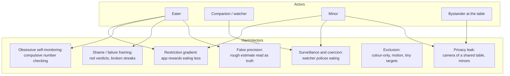
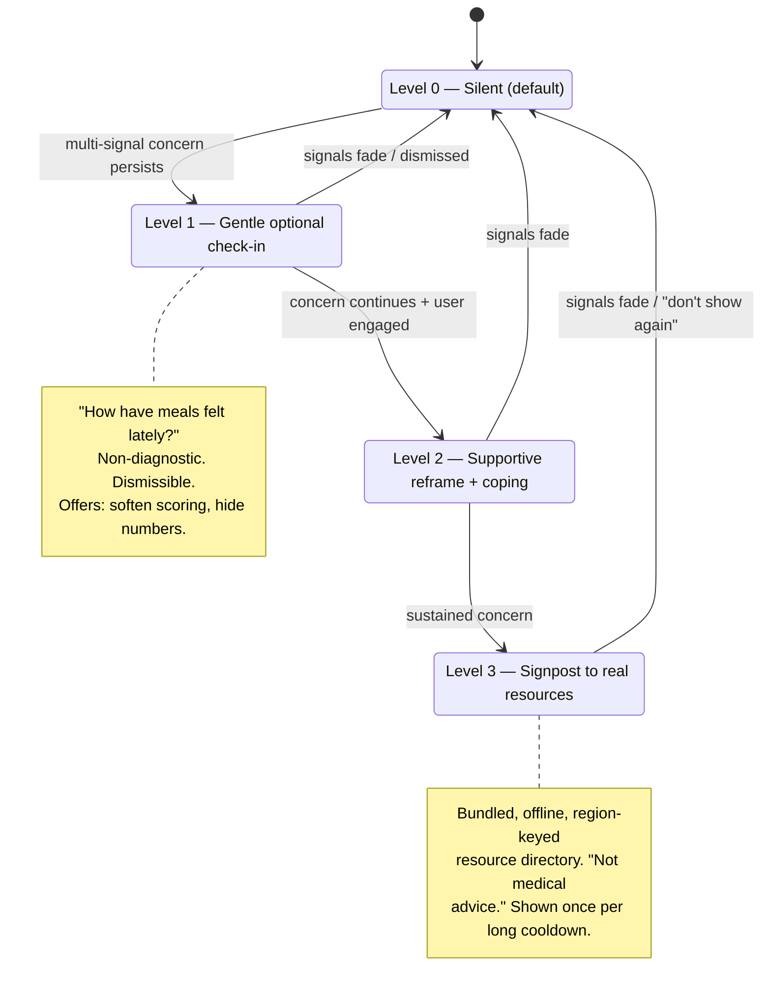

# Chewie — Responsible Design, Safety & Accessibility

> **Status:** Design (v2, Phase 0 baseline) · **Owner:** Responsible Design, Safety & Accessibility area · **Applies to:** all rings, all phases
> **Committed path:** `docs/08-responsible-design-and-safety.md`. This is the doc that sibling docs reference at slot **08** for privacy-UX, the disordered-use safeguard's *policy/consent framing*, DPIA line items, Article-9 handling, age-appropriateness, first-run safety requirements, and accessibility. (`docs/04-sensing-and-ai.md` calls it `08-privacy-safeguards-and-onboarding.md`; `docs/05-scoring-model.md` calls it `08-privacy-dpia.md`. **Exact-filename reconciliation across the set is owned by `docs/00-architecture-spine.md` + the CI link-checker** — see OQ-7.)

### Related docs (single `docs/NN-*.md` scheme; the spine is the authority, CI link-checks every link)

| Doc | What it owns that this doc depends on |
|---|---|
| `docs/00-architecture-spine.md` | The canonical spine; the single authority reconciling doc filenames; the ADR-index pointer; the `pnpm docs:links` CI policy. |
| `docs/01-product-vision.md` | Vision, personas, core loop, the **first-run/onboarding-flow owner** (age-gate-first, permission priming, first-meal guidance, empty states), and the `ChewieClock` timing requirements. |
| `docs/02-system-architecture.md` | `@chewie/core-types` — the ONE home of `Estimate<T>`, `BiteEvent`, `SensorMode`, `DEFAULT_TIMINGS` (§5.4–5.6); the ring-boundary lint; the **single ADR index (§5.6)**; the `ChewieClock` contract (§8.2). |
| `docs/03-chewing-engine-and-art.md` | `@chewie/engine`, the **native sleep-inclusive `ChewieClock` module (§2.2)**, in-progress session checkpoint & crash recovery, ChewArt generation. |
| `docs/04-sensing-and-ai.md` | `@chewie/fusion`, `SensorMode`, the on-device Article-9 camera pipeline, the blurred single-frame cloud "second opinion." |
| `docs/05-scoring-model.md` | `@chewie/scoring` band math + property tests, coaching, and — **authoritatively — the on-device disordered-use safeguard (§11) and its honest detection limits (§11.2)**, plus the Balance & Variety insight *contract*. |
| `docs/06-companion-and-pairing.md` | Ring 3 WebRTC/Supabase pairing, RLS, Presence, `CompanionStateMsg`. |
| `docs/07-data-model-and-privacy.md` | Encrypted SQLite schema (**no weight/BMI/goal columns**), the `LocalProfile` model + age-band field, `SessionCheckpoint`; co-owns the shared-device decision (§8 here). |
| `docs/09-design-system.md` | Tokens (no red/failure states), motion, haptics; home of the shared `<EstimateValue>` component. |
| `docs/adr/README.md` | The single ADR index — every ADR below is cited by that index, never re-numbered here. |

**ADRs referenced (by the single index only):** `0002-concentric-rings-topology`, `0004-ondevice-first-ai`, `0007-companion-webrtc-p2p`, `0008-isolated-behavior-scoring`, `0010-continuous-clock-timing-and-recovery`.

---

This document owns the *human-safety* layer of Chewie: the eating-disorder (ED) and surveillance risk model, the concrete feature-level mitigations, the honesty-about-accuracy rules, accessibility, age-appropriateness, tip content policy, the safety framing of the care pathway (whose detection math is owned by `docs/05`), and a **red-team list plus a hard checklist that every other doc and PR must satisfy.** Where a rule can be enforced by a type, a lint, a test, or a schema absence, it is — not by a disclaimer paragraph.

The single most important framing to internalise before reading further:

> **Chewie helps people eat *calmly, slowly, and mindfully*. It is not a diet app, not a food logger, and not a medical device. "Ate less" must never make any number go up. If a design decision creates even a soft gradient toward restriction, self-surveillance, or comparison, it is wrong and this doc overrides it.**

---

## 0. What we changed / improved over the raw briefing (and over the v1 draft)

The brief invited better ideas. This doc upgrades the raw idea, and the v1 revision closes the cross-doc critique findings. Each is flagged inline where it appears.

1. **Phase is signalled through 5 redundant channels, never colour alone.** The raw idea leans on "the whole screen becomes green/amber." That fails WCAG 1.4.1 (Use of Color) and excludes ~8% of men (CVD). We encode phase in *colour + label text + icon glyph + motion character + haptic pattern* + a screen-reader live announcement, so the app is fully usable in grayscale, with the screen off, or by a screen-reader user. (§6.3)
2. **The disordered-use care heuristic keys primarily off BEHAVIOR/USAGE, not intake — and we are honest that its strongest signals are dark for the highest-risk users.** Because intake is off by default (§3.2), a safeguard that needs grams is blind most of the time; worse, a user who keeps intake *off* or simply *stops opening the app* is invisible to any engagement-based signal. We state this limitation everywhere the triggers are listed and record it as a DPIA/clinician line item. Detection math is owned by `docs/05` §11/§11.2; this doc owns its policy, UX, and honesty framing. (§3.7)
3. **Honesty-about-accuracy is a canonical type + a component + a lint rule, not a guideline.** We do **not** redefine `Estimate<T>` — we cite the single frozen definition in `@chewie/core-types` (numeric `confidence: 0..1`), and the shared `<EstimateValue>` component *refuses to render a bare number*; a custom lint rule bans raw estimate rendering. (§5)
4. **"Discreet / Social Mode" is a first-class feature.** A glowing full-screen colour at a shared dinner table is itself a social-accessibility problem. Discreet Mode collapses the UI to a dim, minimal, haptic-first (or face-down, haptic-only) experience so Chewie is genuinely non-intrusive. (§6.7)
5. **Hide-numbers is a pipeline kill-switch, not per-widget hiding.** One selector both hides *and disables the computation of* every intake/nutrition figure app-wide; defaults ON for minors and can't be silently re-enabled. (§3.2)
6. **No live numeric HUD, ever.** No ticking gram counter, no live 1–100 score, no "grams remaining." These are the exact surfaces that fuel restriction and compulsive checking. Intake and the behavior score are *gentle, post-meal, ranged*; live coaching is qualitative only. (§3.3, §5.4)
7. **The care pathway is provably local, and always leaves a passive floor.** Its state can never be serialized to companion/cloud (property test, §3.7.5). Crucially — new in v2 — **disabling the active heuristic never removes the ability to find help:** a static "Getting support" entry always lives in Settings (§3.7.6), and neither the pathway nor that entry is reachable or flippable by a paired companion. (§3.7)
8. **All elapsed-time-of-record uses the native sleep-inclusive `ChewieClock`, never `performance.now()`.** Safety copy about "resuming a meal" and any time-window logic depends on a clock that keeps counting while the phone is locked; `performance.now()` does not, and would under-count sleep. We standardize on `ChewieClock` (ADR-0010) and use persisted calendar-day buckets for multi-day windows. (§3.7.2, §5.4, §11.7 checklist)
9. **Shared-device / multiple profiles has an explicit, reconciled decision** — aligned with `docs/07`'s committed lightweight local profile-switching: a per-profile age gate, no household aggregate view, and switch-into-adult friction (optional PIN, prompted when a minor profile exists) so a minor can't bypass gating. This doc owns the safety policy doc 07 deferred to it. (§8)
10. **Safety requirements for the first-run flow are written down** even though `docs/01` owns the flow itself: age-gate-first, just-in-time permission priming with calm rationale, minor-safe defaults, calm empty/first states, and no-red crash-resume copy. (§9)

---

## 1. Principles → invariants

The ethical mandate restated as engineering invariants this doc is accountable for. Each maps to an enforcement mechanism, not a promise.

| # | Principle | Enforcement mechanism | Owner doc |
|---|-----------|----------------------|-----------|
| P1 | Score measures **behavior only** | `scoreBehavior()` type signature cannot receive grams/kcal; property tests (ADR-0008) | `docs/05-scoring-model.md` (constraints restated here §3.1) |
| P2 | Healthy **bands**, never "minimize" | Symmetric distance-from-band curves; property test "reducing intake below band never raises score" | `docs/05-scoring-model.md` |
| P3 | Intake/nutrition **off by default, hideable, disableable** | `intakeNumbersHidden` single selector gates render **and** pipeline | this doc §3.2 |
| P4 | **No weight-loss framing** | Schema has no weight/BMI/goal columns; onboarding copy catalog forbids diet lexicon | `docs/07-data-model-and-privacy.md` schema + this doc §3.5 |
| P5 | Estimates are **ranged & honest** | Canonical `Estimate<T>` (`@chewie/core-types`) + `<EstimateValue>` + lint rule | this doc §5 |
| P6 | **Gentle continuity**, no punitive streaks | `freeze`/`rest-day` model; message catalog has no failure templates | this doc §3.4 |
| P7 | **Consent-first, revocable, ephemeral** companion | RLS + Presence + explicit pairing; no record path (ADR-0007) | `docs/06-companion-and-pairing.md` (UX/consent rules here §4) |
| P8 | Camera frames = **GDPR Art. 9** | Never persisted/uploaded by default; on-device only (ADR-0004) | `docs/04-sensing-and-ai.md` (UX rules here §4.4) |
| P9 | **Local-only** disordered-use safeguard | On-device heuristic; anti-exfiltration property test + boundary lint | `docs/05-scoring-model.md` §11 (policy/UX/DPIA here §3.7) |
| P10 | **Self-vs-self only**, no comparison | No feeds/leaderboards; trends compare to own baseline | this doc §3.6 |
| P11 | **Age-appropriate** defaults | Age band gates features via defaults matrix; per-profile age gate on shared devices | this doc §7, §8 |
| P12 | **Not a medical device** | No diagnosis/precision claims; MDR-out-of-scope copy | this doc §3.7.7, §5.5 |
| P13 | **Drift-free, sleep-inclusive timing** | Native `ChewieClock`; `performance.now()` documented insufficient (ADR-0010) | `docs/03-chewing-engine-and-art.md` §2.2 (safety copy rules here §9.4) |

**A rule of thumb for reviewers:** if a feature would still make sense in a calorie-counting weight-loss app, be suspicious. Chewie's north star is *savoring and calm*, not *measuring and reducing*.

---

## 2. Harm model (who can be hurt, and how)

We design against concrete personas and failure modes, not an abstract "user."



Each vector is answered by named controls in §3–§9 and cross-checked in the red-team table (§10). The two **dominant** risks — restriction/ED harm (H1, H2, H4) and surveillance/coercion (H3) — get the deepest treatment and a mandatory external review gate (§11.3).

---

## 3. Eating-disorder risk: analysis and baked-in mitigations

### 3.1 Behavior-not-quantity scoring (the constraint this doc places on `@chewie/scoring`)

The score is computed in `docs/05-scoring-model.md` / `@chewie/scoring` under **ADR-0008 (isolated behavior scoring)**; **this doc owns the constraints it must satisfy** and restates them so they can be reviewed here:

- The primary score is `BehaviorScore` (1–100). Its input type is *only* behavior signals. Intake is not a parameter — there is no code path from grams/kcal into it.
- All banded signals are **symmetric** in principle: too-fast and too-slow both lower the score; too-big and too-small bites both lower it. Center of band = 100. Monotonic "less is better" curves are prohibited. (`docs/05` may deliberately make the *fast* side decline more sharply than the *slow* side — savoring-aligned — but never introduces a "less food raises score" gradient; extreme prolongation is left to the safeguard, not a punitive curve.)
- **"Battle yourself" is self-vs-self only** — the baseline is the eater's own gently-adapting rolling statistic, never a population norm or another person; and safeguarded/unattended sessions are ineligible to set a personal best (`docs/05` §8).

```ts
// The ONLY shape scoring may receive. Note the absence of grams/kcal/portion.
// (Mirrored from @chewie/scoring so this doc's reviewers can audit it in place;
//  the authoritative definition lives in docs/05.)
interface BehaviorSignals {
  paceInBand: BandDistance;        // grams/min OR bites/min mapped to distance-from-comfortable-band
  chewDuration: BandDistance;      // per-bite chew time vs band
  pauseAdherence: number;          // 0..1 honored pauses
  rhythmSteadiness: number;        // 0..1 low variance of inter-bite interval
  consistencyVsBaseline: number;   // 0..1 vs OWN adapting baseline
}
type BandDistance = number; // 0 = ideal; magnitude in either direction penalises
declare function scoreBehavior(s: BehaviorSignals): BehaviorScore; // cannot see intake
```

**Responsible-design rule R-SCORE-1:** the behavior score is **never shown as a live ticking number.** During the meal, coaching is qualitative and gentle (§3.3). The numeric score, if the user wants it, appears *after* the meal, framed as a gentle self-trend, not a grade.

> Property tests that enforce P1/P2 live in `@chewie/scoring`; §11.2 lists the exact invariants this doc requires them to cover.

### 3.2 Hide-numbers = pipeline kill-switch (improvement #5)

Hiding numbers per-widget is fragile (one forgotten `<Text>{grams}</Text>` leaks). Instead, a single selector gates **both** rendering and computation.

```ts
type IntakeDisclosure =
  | 'HIDDEN'          // default product-wide; forced for minors
  | 'SUMMARY_RANGE'   // opt-in: gentle post-meal ranges only
  | 'DETAILED_RANGE'; // opt-in: per-bite ranges (still ranged, still post-meal)

interface SafetyPrefs {
  intakeDisclosure: IntakeDisclosure;   // default 'HIDDEN'
  intakePipelineEnabled: boolean;       // when false, fusion never computes grams/kcal at all
  behaviorScoreVisibility: 'LIVE_QUALITATIVE_ONLY' | 'POSTMEAL_NUMERIC' | 'OFF';
}

// Single app-wide selector. Every intake/nutrition element MUST read through this.
function useIntakeVisible(): boolean {
  const { intakeDisclosure, intakePipelineEnabled } = useSafetyPrefs();
  const ageBand = useAgeBand();                        // active LocalProfile.ageBand, docs/07
  if (ageBand === 'UNDER_16' || ageBand === 'UNDISCLOSED') return false; // hard gate, see §7
  return intakePipelineEnabled && intakeDisclosure !== 'HIDDEN';
}
```

Rules:

- **R-HIDE-1:** when `intakeVisible === false`, `@chewie/fusion` must **not compute** grams/kcal (skip the nutrition path entirely) — hiding also means *not calculating*, so a screenshot or memory dump has nothing to leak, and there is no incidental data to feel anxious about.
- **R-HIDE-2:** the toggle to *reveal* numbers uses gentle, neutral copy and a brief "these are rough estimates, not a target" interstitial. The toggle to *hide* is always one tap and never gated.
- **R-HIDE-3:** for minors the selector returns `false` unconditionally; it cannot be flipped without exiting the minor age band (§7).

### 3.3 No live numeric HUD (improvement #6)

**R-HUD-1 (hard rule for all rings):** there is **no live decrementing/incrementing numeric display** of grams, calories, "amount remaining," or score during a meal. These surfaces are the mechanical heart of restrictive/obsessive behavior.

What the eater sees live instead:

| Live surface | Allowed representation |
|---|---|
| Pace | A soft "you're in a comfortable rhythm" state, or a gentle "maybe ease off a touch" nudge — a 3-state qualitative band (`too_fast / comfortable / too_slow`), never a number. |
| Bite count | A simple tally is OK (it's neutral and mindful), shown as calm dots/count, never framed as a target to beat. |
| Intake (grams/kcal) | **Nothing live.** Optional gentle ranged summary *after* the meal only. |
| Score | **Nothing live.** Optional post-meal reveal only. |

### 3.4 Gentle continuity, not punitive streaks (P6)

```ts
type DayState =
  | { kind: 'PRACTICED' }      // ate at least one mindful meal
  | { kind: 'REST' }           // explicitly a rest day — first-class, never negative
  | { kind: 'FROZEN' };        // no session logged; streak FREEZES, never resets to 0

interface Continuity {
  currentRun: number;          // counts PRACTICED; FROZEN days do not decrement it
  restDaysAreFine: true;       // type-level reminder; UI never shames a rest day
}
```

- **R-STREAK-1:** a missed day *freezes* the run; it never resets to zero and never renders in a red/negative style.
- **R-STREAK-2:** "rest day" is selectable and celebrated as healthy (rest is part of a good relationship with food/eating).
- **R-STREAK-3:** no "don't break your streak!" pressure notifications. Reminders (if enabled) are invitational ("a calm meal is waiting whenever you like"), rate-limited, and never guilt-based.

> Day-boundary logic uses the local **calendar day** (persisted), not a monotonic timer — a freeze must survive a reboot and a locked screen. See the clock note in §3.7.2.

### 3.5 No weight-loss framing (P4) — enforced by schema absence + lexicon lint

- **R-FRAME-1:** onboarding centers digestion, satiety awareness, savoring, calm. No BMI, no weight, no calorie budget, no goal-weight, no "burn/deficit" language anywhere.
- **R-FRAME-2:** the data schema (owned by `docs/07-data-model-and-privacy.md`) has **no** `weight`, `bmi`, `goal`, `targetCalories`, or `deficit` columns, so a diet flow *cannot be built without a reviewed schema change*.
- **R-FRAME-3:** a CI lexicon lint (§3.5.1) blocks banned diet/shame tokens from all user-facing strings.

#### 3.5.1 Banned lexicon (CI-enforced against the i18n catalog)

```jsonc
// packages/copy/banned-lexicon.json — checked by scripts/lint-copy.ts in CI
{
  "hardBanned": [
    "weight loss", "lose weight", "diet", "calorie deficit", "burn calories",
    "guilty", "cheat meal", "bad food", "junk", "shame", "failed", "you failed",
    "streak broken", "over your limit", "too many calories", "fat", "skinny",
    "slim down", "bmi", "goal weight", "punish", "earn it", "work it off"
  ],
  "reviewRequired": [   // allowed only with clinician sign-off recorded in the PR
    "calorie", "calories", "kcal", "portion", "grams", "healthy", "unhealthy",
    "restrict", "control", "less", "reduce"
  ],
  "notes": "Case-insensitive, whole-word, across all locales (nl + en). A hardBanned hit fails CI. A reviewRequired hit requires a linked clinician-review approval id in the PR body."
}
```

> The `reviewRequired` list deliberately includes words we *sometimes* need (e.g. "calorie" inside an opt-in insight). CI doesn't ban them — it forces a human/clinician decision, so tone drift can't slip in silently.

### 3.6 Thoughtful defaults & anti-comparison (P3, P10)

The default install, with no configuration, is a **calm, behavior-only, offline, numberless** experience:

| Setting | Default |
|---|---|
| `intakeDisclosure` | `HIDDEN` |
| `intakePipelineEnabled` | `false` |
| `behaviorScoreVisibility` | `LIVE_QUALITATIVE_ONLY` (numeric reveal is opt-in) |
| Nutrition "Balance & Variety" insight | Off |
| Camera sensing (Ring 2) | Off |
| Companion (Ring 3) | Off |
| Reminders | Off (opt-in, invitational) |
| Care heuristic (§3.7) | On, but silent until sustained multi-signal concern; fully disable-able (passive help floor always remains, §3.7.6) |
| Comparison surfaces | **None exist** — no feed, no leaderboard, no friends, no share-by-default |

### 3.7 The care pathway: a soft "how are you doing?" (P9, P12) — improvements #2 & #7

This is the most sensitive feature in the app. **Ownership split (to avoid the cross-doc duplication the critique flagged):**

- **`docs/05-scoring-model.md` §11 owns the detection engine** — the on-device signal evaluation, thresholds, hysteresis constants, and the scoring-softening hooks, in `@chewie/scoring`. It also owns the **honest-limits statement (§11.2)**.
- **This doc owns the *policy, consent, UX, resource directory, anti-exfiltration guarantee, passive floor, and DPIA framing*** — everything the eater actually experiences, and the guarantees that keep the pathway from becoming surveillance or shaming.

#### 3.7.1 Design constraints (non-negotiable)

- **On-device only.** No care signal, care state, or care event ever leaves the phone — not to cloud, not to companion, not to crash reports. Enforced by property test + boundary lint (§3.7.5).
- **Behavior-first signals, honest about blind spots.** Works in the default numberless mode off usage/behavior signals; intake is an *optional additional* signal only when the user already enabled it. We are explicit that this cannot reach a disengaged restrictor (§3.7.3).
- **Multi-signal + persistence + hysteresis.** Never a single-threshold trip. Concern must accumulate across several *distinct* signals over a rolling multi-day window before anything surfaces (constants owned by `docs/05` §11). This prevents false-positive shaming (one skipped lunch does nothing).
- **Never blocking, never diagnostic, always dismissible, always disable-able.** No "you may have an eating disorder." Supportive, tentative, MDR-out-of-scope language only.
- **Rate-limited & cool-down.** At most one gentle prompt per long cool-down window; "don't show again" is always offered and honored permanently.
- **A passive help floor always remains** even when the active heuristic is off (§3.7.6).
- **Not medical advice** stated on any care surface.

#### 3.7.2 Signal model (policy view; thresholds live in `docs/05` §11)

```ts
type CareSignalKind =
  | 'SKIPPED_MEAL_PATTERN'        // meal cadence unusually sparse over the window (engagement-gated, see 3.7.3)
  | 'EXTREME_LOW_BITE_TARGET'     // user manually set bite size / timings to extreme-restrictive values
  | 'OBSESSIVE_RECHECK'           // compulsive opening/closing of intake or score surfaces
  | 'COMPULSIVE_NUMBER_TOGGLING'  // rapidly enabling/disabling numbers repeatedly
  | 'SESSION_SHAPE_ANOMALY'       // e.g. sessions abandoned early & repeatedly, or extreme durations
  | 'SUSTAINED_EXTREME_LOW_INTAKE'; // OPTIONAL & engagement-gated — only if intake pipeline already enabled

interface CareSignal {
  kind: CareSignalKind;
  weight: number;           // 0..1 contribution
  observedOnDay: string;    // LOCAL CALENDAR DAY (YYYY-MM-DD), persisted — survives reboot/sleep
}

interface CareWindow {
  signals: CareSignal[];    // rolling, e.g. last 14 calendar days, on-device only
  distinctKinds: number;    // how many DIFFERENT signal kinds are active
  accumulatedWeight: number;
}

type CareLevel = 0 | 1 | 2 | 3;
```

> **Clock note (improvement #8, ADR-0010).** Multi-day cadence uses persisted **calendar-day buckets**, not an in-memory monotonic timer — a locked/asleep phone or a reboot must not erase the window. *Within-session* elapsed timing (e.g. "session abnormally long") is measured with the native sleep-inclusive `ChewieClock` (`mach_continuous_time` / `elapsedRealtimeNanos`, `docs/03` §2.2), never `performance.now()`, which stops advancing while the device sleeps.

#### 3.7.3 Honest detection limits (improvement #2) — the part we refuse to overclaim

The safeguard's strongest *theoretical* triggers are exactly the ones it can *least* rely on for the highest-risk users:

- **`SUSTAINED_EXTREME_LOW_INTAKE`** is observable **only** when the user has already enabled the intake pipeline. In the default numberless experience it is **dark**.
- **`SKIPPED_MEAL_PATTERN`** is observable **only** while the user keeps opening/logging in the app. Someone who is restricting and simply **stops opening Chewie** emits no signal at all.
- The users at highest ED risk are disproportionately those who keep intake **off** or **disengage** — for them these two signals are dark. Presenting the pathway as always-on protection would be dishonest, so **we do not.**
- The default-mode heuristic therefore leans on the signals that *do* exist while engaged: **`EXTREME_LOW_BITE_TARGET`** (bands/timings set to physiologically extreme values), **`OBSESSIVE_RECHECK` / `COMPULSIVE_NUMBER_TOGGLING`**, and **`SESSION_SHAPE_ANOMALY`**.
- **This limitation is a DPIA/clinician-review line item (§11.3):** *engagement-based detection cannot reach a disengaged restrictor.* The safeguard is a gentle, dismissible affordance — **not a monitoring system and not a substitute for care.** Copy never implies "the app is watching for you" when it structurally cannot. This matches `docs/05` §11.2 verbatim in intent.

#### 3.7.4 Escalation ladder (what the eater actually sees)

The detection engine (`docs/05` §11) emits a `CareLevel`; this doc owns the UX at each level.



- **Level 1:** a small, dismissible card, e.g. *"How have meals been feeling lately? There's no wrong answer."* One tap offers: *soften scoring*, *hide all numbers*, *turn this off*.
- **Level 2:** supportive reframe toward savoring/self-kindness + practical calm-eating coping, plus an easy path to hide numbers / disable intake pipeline.
- **Level 3:** signpost to *real, region-appropriate* support (directory §3.7.8). Always prefixed with *"Chewie isn't a medical service. If things feel hard, talking to someone can help."*

At every level: **Not diagnostic. Not blocking. Dismissible. "Don't show again" honored forever. The active pathway can be switched off in settings — and doing so still leaves the passive floor (§3.7.6).**

#### 3.7.5 Anti-surveillance property test + boundary lint (improvement #7)

```ts
// packages/safety/__tests__/care-is-local.test.ts
test('care state is never serialized to any network/companion payload', () => {
  // The CompanionStateMsg builder and any cloud DTO builder are given a CareState and
  // MUST omit it — the field is not in the wire schema (docs/06 CompanionStateMsg).
  const wire = buildCompanionState({ ...session, care: someCareState });
  expect(Object.keys(wire)).not.toContain('care');
  expect(JSON.stringify(wire)).not.toMatch(/care|SKIPPED_MEAL|EXTREME_LOW/i);
});
```

Plus an **architectural fitness rule** (dependency-cruiser, the same mechanism that enforces ring boundaries per ADR-0002): the companion/cloud serializers **may not import** the care module or its types. This is checked in CI (§11.4). `docs/05` §11 independently guarantees the safeguard output is never mirrored/uploaded; this doc adds the wire-schema and import-boundary guarantees.

#### 3.7.6 Passive help floor + companion cannot disable it (v2 fix for the "no floor" critique)

Autonomy requires that the *proactive* pathway be fully disable-able — but disabling the prompts must **never** remove the ability to find help, and a controlling person must not be able to silence it.

- **R-CARE-FLOOR-1 (always-reachable static entry):** a plain, non-nagging **"Getting support"** item lives permanently in Settings, listing the offline resource directory (§3.7.8). It is present **regardless** of whether the active heuristic is on or off, and it never fires a network call.
- **R-CARE-FLOOR-2 (eater-only disable):** turning off the proactive prompts requires the **eater's own action** in Settings. There is no remote or companion-facing control for it. A paired companion is view-only (§4) and has **no access to Settings, history, or care state** — so a controlling watcher cannot silence the pathway or the floor.
- **R-CARE-FLOOR-3 (honest about residual risk):** we state plainly (here and in the DPIA) that a person in the grip of an ED can still turn off the active prompts. The static floor is the mitigation that keeps *finding* help one tap away even then; it is not a claim that harm is prevented.

#### 3.7.7 Not-a-medical-device framing (P12)

- No diagnosis, no treatment claim, no clinical-precision claim, anywhere.
- Care copy is tentative and supportive: *"some people find it helpful to…"*, never *"you have…"*.
- Keeps Chewie out of EU MDR scope: we make no medical-purpose claim. Any wording implying diagnosis/treatment fails clinician review (§11.3).

#### 3.7.8 Resource directory (bundled, offline, clinician-verified)

Signposting must work **offline** (so showing a care card never emits a network call that could reveal it) and must be **current** (stale hotline numbers are actively harmful).

```ts
interface SupportResource {
  id: string;
  region: string;             // ISO country/region; NL + EU first (KauwApp origin), then broader
  languages: string[];        // e.g. ['nl','en']
  orgName: string;
  kind: 'helpline' | 'chat' | 'info' | 'clinician-finder';
  contact: { phone?: string; url?: string; hours?: string };
  lastVerified: string;       // ISO date — SHOWN in UI; entries stale > 12 months are hidden
  clinicianApprovedBy: string;// review record id
}
```

- Curated **with clinician input**; each entry carries a `lastVerified` date shown to the user; entries older than 12 months are auto-hidden pending re-verification.
- **Ship-blocker:** exact org names, numbers, and URLs must be verified by the reviewing clinician before any build that includes Level 3 (or the §3.7.6 floor) ships (Phase 1). *We deliberately do not hard-code specific hotline numbers in this design doc* — an out-of-date number in a care surface is worse than none. NL/EU eating-disorder and mental-health organisations are the seed set; the reviewer confirms current details and adds region fallbacks.
- If no verified resource exists for the user's region, both Level 3 and the passive floor fall back to a general *"talking to your GP / a trusted person can help"* message rather than an unverified number.

---

## 4. Consent & surveillance ethics — camera + companion

The camera and the remote-watcher are the app's highest-risk capabilities. The mechanics (WebRTC, RLS, TURN, Presence, `CompanionStateMsg`) live in `docs/06-companion-and-pairing.md` and `docs/04-sensing-and-ai.md`; **this doc owns the consent model, the surveillance-abuse defenses, and the UX rules** (ADR-0007, ADR-0004).

### 4.1 Consent model (eater is always in control)

```ts
interface CompanionConsent {
  pairingId: string;
  companionLabel: string;         // eater-chosen, e.g. "Mum"
  grantedAt: number;
  scope: 'STATE_ONLY' | 'STATE_AND_VIDEO'; // eater picks; STATE_ONLY is the softer default
  expiresAt: number;              // pairings are time-boxed; auto-expire
  active: boolean;                // eater can flip to false instantly (revoke)
}
```

- **R-CONSENT-1 (explicit pairing):** a companion can only ever connect after the *eater* performs an explicit pairing action (scan a QR / enter a short-lived signed code minted per `docs/06`). No silent or pre-authorized watchers.
- **R-CONSENT-2 (default to the softer scope):** the pairing chooser defaults to `STATE_ONLY` (mirrors phase/countdown/bite/gentle tip — *no video*). Video (`STATE_AND_VIDEO`) is a deliberate second choice with its own confirmation.
- **R-CONSENT-3 (always visible, one-tap stop):** during any shared session a persistent, non-dismissible banner shows *who is watching* (via Presence) with a **Stop all** control reachable in one tap, anchored in the thumb zone (§6.6) so stopping is instant and one-handed.
- **R-CONSENT-4 (ephemeral by design):** streams are live-only, DTLS-SRTP P2P, **never recorded**, no record button exists in either app, and a live/ephemeral watermark is rendered on the companion view. There is no server-side media store (ADR-0007).
- **R-CONSENT-5 (revocable & expiring):** revoking is immediate (RLS removes read access the instant the pairing row deactivates); pairings also auto-expire so a forgotten grant doesn't linger.
- **R-CONSENT-6 (view-only):** the companion cannot control the eater's session, timings, or settings. Watching is passive; the companion cannot inject commands.

### 4.2 Consent + revoke flow

```mermaid
sequenceDiagram
  participant Eater
  participant Edge as Supabase Edge (token)
  participant Companion
  Eater->>Eater: Enable sharing (explicit)
  Eater->>Edge: Request short-lived signed pairing token
  Edge-->>Eater: QR / code (expires quickly)
  Eater->>Companion: Shows QR / code in person
  Companion->>Edge: Presents token to verify
  Edge-->>Companion: Pairing row created (RLS-scoped, time-boxed)
  Note over Eater,Companion: Eater picks scope (STATE_ONLY default)
  Companion-->>Eater: Appears in "who's watching" (Presence)
  Eater->>Eater: Tap "Stop all" anytime
  Eater->>Edge: Deactivate pairing row
  Edge-->>Companion: RLS revokes read; stream torn down
```

### 4.3 Anti-coercion design (the hardest problem: H3)

A consent flow doesn't stop a controlling person from *pressuring* someone to share. We add friction and education, and keep the eater in structural control:

- **R-COERCE-1 (eater-side kill is absolute):** the eater can end sharing at any moment; nothing the companion does can keep a stream alive.
- **R-COERCE-2 (no silent/background watching):** sharing requires the eater's app to be foreground and shows the persistent banner; there is no way to be watched without an on-screen indicator.
- **R-COERCE-3 (no history for the watcher):** companions get *live only* — no meal history, no trends, no intake numbers, **no care state, no settings**. A controlling watcher can't mine the past or silence the safeguard (§3.7.6).
- **R-COERCE-4 (minors restricted):** for minors the companion feature is disabled or parent-gated with extra friction (§7); a minor can't be casually surveilled.
- **R-COERCE-5 (education at pairing):** a brief, calm one-time note frames the companion as *supportive company*, not supervision, and reminds the eater they're in control and can stop anytime.
- **R-COERCE-6 (no watcher-visible score pressure):** what the companion mirrors is calm state + gentle tips; it does **not** surface intake numbers or a punitive grade the watcher could weaponise.

### 4.4 Camera as Article-9 data (P8) — UX rules

Detailed data handling is in `docs/04-sensing-and-ai.md` and the DPIA (§11.3); the UX-side rules this doc enforces:

- **R-CAM-1:** camera frames are processed **on-device, in-memory, ephemeral** — never written to disk, never uploaded in the default path (ADR-0004).
- **R-CAM-2 (bystander awareness):** because a table may include other people, the camera enable flow explicitly prompts the eater to be mindful of others in frame; the camera is off by default and clearly indicated when active (OS indicator + in-app).
- **R-CAM-3 (the one cloud path is loud & opt-in):** the single "cloud second opinion" is an explicit, on-demand, **one still frame**, face/PII-blurred *on-device before it leaves the device*, zero-retention, results shown only as ranges. Never continuous, never automatic.
- **R-CAM-4 (no camera required):** every capability degrades gracefully to scale-only or manual (`docs/04` `SensorMode`); the camera is never mandatory, so a privacy-conscious eater is a first-class user, not a degraded one.

---

## 5. Honesty about accuracy (P5) — improvement #3

Camera-based calorie/nutrition estimation is inherently rough; a scale is better but still imperfect. **We make it structurally impossible to present an estimate as precise.**

### 5.1 The only sanctioned estimate shape (cited, not redefined)

We use the single frozen `Estimate<T>` from **`@chewie/core-types`** (`docs/02` §5.4). Confidence is **numeric `0..1`** — chosen deliberately because fusion composes confidences with noisy-OR / min arithmetic that an enum cannot express; the UI maps the number to a coarse label for display. This doc does **not** declare a competing shape (that divergence is what the critique flagged).

```ts
// @chewie/core-types — THE canonical definition (do not re-declare elsewhere)
interface Estimate<T> {
  value: T;            // point estimate — NEVER rendered alone
  low: T;              // range lower bound
  high: T;             // range upper bound
  confidence: number;  // 0..1 — composes with fusion noisy-OR/min
  unit?: string;       // e.g. 'g', 'g/min'
  source?: SensorMode; // NONE | SCALE_ONLY | CAMERA_ONLY | BOTH — provenance
}
```

### 5.2 The component that refuses to lie

The shared `<EstimateValue>` component (home: `docs/09-design-system.md` / the UI package) is the **only** approved way to render any `Estimate`:

```tsx
function EstimateValue({ est }: { est: Estimate<number> }) {
  return (
    <View accessibilityLabel={`Rough estimate: ${est.low} to ${est.high} ${est.unit ?? ''}`}>
      <Text>{`~${est.low}–${est.high} ${est.unit ?? ''}`}</Text>
      <ConfidenceChip confidence={est.confidence} /> {/* label + icon, colour-independent (§6.3) */}
      <Text style={styles.caption}>rough estimate</Text>
    </View>
  );
}
```

- **R-EST-1:** the component **never renders `est.value` as a bare number.** It always shows the range + a "rough estimate" label + confidence.
- **R-EST-2 (lint enforced):** a custom ESLint rule `no-bare-estimate` forbids rendering `.value` of an `Estimate` in JSX or template strings; estimates must flow through `<EstimateValue>`. CI fails otherwise.
- **R-EST-3 (confidence is colour-independent):** confidence is shown by label + icon shape, not colour alone (§6.3).
- **R-EST-4 (provenance honesty):** `CAMERA_ONLY` estimates render with visibly wider ranges / lower confidence than `SCALE_ONLY` or `BOTH`; the UI never hides that a number came from the weaker sensor.

### 5.3 Copy rules for estimates

- Never "you ate X calories." Always "roughly X–Y — a ballpark, not a measurement."
- Never a lone "healthiness: 62/100." Nutrition is the qualitative, opt-in **Balance & Variety** insight (contract in `docs/05` §17; data in `@chewie/nutrition` / `docs/07`), with variety/balance language and ranges — never a punitive grade. The token `NutritionScore` / any `/100 healthiness` name is **banned** (naming conventions).

### 5.4 No live numbers (restated as an accuracy rule)

Ranged estimates stabilise only *after* a meal — live per-second numbers would be both inaccurate *and* anxiety-inducing, a double reason for R-HUD-1 (§3.3). Any live phase/countdown the companion mirrors is re-derived on each device from an authoritative `ChewieClock` timestamp + duration (`docs/06`), not a ticking number pushed over the wire — so there is no live intake number to mirror in the first place.

### 5.5 Not-a-medical-device disclosure

Wherever any intake/nutrition estimate appears, a persistent, quiet line states it is *informational, not medical or nutritional advice, and not a measurement.* This is a standing caption, not a one-time modal, so it can't be missed by a user who skipped onboarding.

---

## 6. Accessibility (WCAG 2.2 AA as the floor)

Chewie's core UI is unusual — a full-screen colour that changes — which makes accessibility *more* central, not less. Target: **WCAG 2.2 Level AA**. Design tokens are owned by `docs/09-design-system.md`; the CI checks below run over those tokens.

### 6.1 Contrast (1.4.3 text, 1.4.11 non-text) — the soft-colour tension

Soft, calm backgrounds (high-lightness, low-saturation green/amber) make it hard to reach 4.5:1 for text. Resolution:

- **R-A11Y-CONTRAST-1:** the central **ink** (label, countdown text, counter) uses a constrained near-black (light) / near-white (dark) token, **build-time verified** to meet ≥4.5:1 (normal) / ≥3:1 (large) against **every** phase background it is ever painted on.
- **R-A11Y-CONTRAST-2:** the central **icon** and countdown bar are UI graphics → must meet ≥3:1 non-text contrast (1.4.11) against both phase backgrounds.
- **R-A11Y-CONTRAST-3:** a **High-Contrast theme** deepens the phase backgrounds and ink for users who need more than the soft palette provides. Selectable, and auto-suggested if the OS "increase contrast" setting is on.

```ts
// scripts/validate-palette.ts — runs in CI over design tokens (docs/09)
for (const phase of ['chew', 'pause']) {
  for (const fg of ['ink', 'iconStroke', 'countdown']) {
    const ratio = contrastRatio(tokens.bg[phase], tokens.fg[fg]);
    const min = fg === 'ink' ? 4.5 : 3.0;
    assert(ratio >= min, `${fg} on ${phase} bg = ${ratio.toFixed(2)}:1 < ${min}:1`);
  }
}
```

### 6.2 Colourblind-safe palettes (1.4.1)

- **R-A11Y-CVD-1:** phase palettes are chosen from CVD-safe pairs and validated by simulating protanopia/deuteranopia/tritanopia and asserting the two phase backgrounds remain distinguishable in **luminance** (not just hue).

```ts
interface PhasePalette {
  chewBg: string; pauseBg: string;
  minLuminanceDeltaCVD: number; // asserted >= threshold under all 3 CVD sims
}
```

- **R-A11Y-CVD-2:** colour is *never the only* signal (§6.3), so even indistinguishable colours don't break the app.

### 6.3 Redundant phase signalling (improvement #1) — 1.4.1, 4.1.3

Phase is conveyed through **five** independent channels so no single-sense reliance exists:

```ts
type Phase = 'chew' | 'pause';

interface PhaseSignal {
  color: string;                     // 1: soft background (CVD-validated)
  label: string;                     // 2: text, e.g. "Chew" / "Pause" (i18n)
  icon: 'chew' | 'pause';            // 3: distinct glyph shapes (not just recolour)
  motion: 'gentle-pulse' | 'settle'; // 4: distinct animation CHARACTER (reduced-motion aware)
  haptic: HapticPattern;             // 5: distinct vibration on transition
  live: 'polite';                    // announced via accessibility live region (4.1.3)
}
```

- **R-A11Y-PHASE-1:** every phase transition updates label + icon + haptic + a screen-reader live-region announcement — usable with the screen off, in grayscale, or non-visually.
- **R-A11Y-PHASE-2:** the icons for chew vs pause are *shape-distinct*, not the same glyph recoloured.

### 6.4 Reduced motion (2.3.3)

- **R-A11Y-MOTION-1:** respect the OS "reduce motion" setting (and an in-app toggle). When on: replace the colour *crossfade* and any pulsing with a gentle, near-instant, non-oscillating transition; the countdown bar becomes a calm discrete fill rather than a continuous sweep; no parallax, no bounce.
- **R-A11Y-MOTION-2:** motion is never the *sole* carrier of phase (§6.3), so reduced motion loses nothing essential.
- **R-A11Y-MOTION-3:** ChewArt generation animations honor reduced motion (render final tile without a flourish).

### 6.5 Screen readers (1.3.1, 4.1.3, 2.5.3)

- **R-A11Y-SR-1:** all controls have labels/roles; the countdown exposes remaining time as an accessible value; phase changes and bite-count increments post polite live-region announcements.
- **R-A11Y-SR-2:** ChewArt tiles get meaningful `accessibilityLabel`s (e.g. "ChewArt tile from a calm 24-minute meal") — the gallery is navigable non-visually; export controls are labeled.
- **R-A11Y-SR-3:** the "who's watching" banner and "Stop all" are prominent in the accessibility tree and reachable early in focus order.

### 6.6 One-handed use & targets (2.5.8, 2.5.5)

- **R-A11Y-ONEHAND-1:** primary controls (start/pause, bite tap, stop-sharing) sit in the thumb zone (bottom third), reachable one-handed on large phones. The bite-tap target spans a large area since it's the most-used action during a meal.
- **R-A11Y-TARGET-1:** interactive targets are ≥44×44pt (iOS) / 48×48dp (Android) — comfortably above the 2.5.8 AA 24px minimum.
- **R-A11Y-ONEHAND-2:** no essential interaction requires reaching the top corners or a two-hand gesture.

### 6.7 At-the-table discretion / Discreet ("Social") Mode (improvement #4)

A bright full-screen glow at a shared dinner is socially intrusive — the opposite of the product's calm intent. Discreet Mode makes Chewie genuinely unobtrusive:

```ts
interface DiscreetMode {
  enabled: boolean;
  dimToMinimumBrightness: boolean;   // drop screen brightness hard
  hapticFirst: boolean;              // phase cues via vibration, minimal/no light
  minimalDarkUI: boolean;            // tiny dark UI instead of full-screen colour
  faceDownHapticOnly: boolean;       // phone face-down -> pure haptic guidance
}
```

- **R-A11Y-DISCREET-1:** Discreet Mode collapses to a dim, dark, minimal UI and drives the meal primarily through haptics, so the phone doesn't dominate the table or broadcast that someone is "using an eating app."
- **R-A11Y-DISCREET-2:** a **face-down** posture is supported: with the phone face-down, phase changes are haptic-only; the eater can eat without looking at a screen at all. (This also complements the on-a-stand overhead-camera setup.)
- **R-A11Y-DISCREET-3:** notification/haptic cues are gentle and can't produce loud sounds by default.

### 6.8 Other criteria

- **Text scaling / reflow (1.4.4, 1.4.10, 1.4.12):** UI honors OS dynamic type up to large sizes without truncation or overlap; layouts reflow.
- **Timing (2.2.1):** the chew/pause countdown is a *chosen calm pacing aid*, not a task deadline; nothing punishes "running out of time," and durations are fully user-adjustable (defaults from the single `DEFAULT_TIMINGS` source, `docs/02` §5.5). No content is lost or failed by the timer elapsing.
- **Language (nl + en) and reading level:** all copy at a plain reading level (§9), localized.

---

## 7. Age-appropriateness (P11)

Eating-related gamification is *especially* risky for young people. Chewie applies conservative, minimizing age gating. The age-band **field** and its persistence live in `docs/07-data-model-and-privacy.md` (`LocalProfile`); this doc owns the gating policy.

### 7.1 Age model (data-minimizing)

```ts
// Canonical enum owned by docs/07 (LocalProfile.ageBand) — cited, not redefined.
type AgeBand = 'UNDER_16' | 'AGE_16_17' | 'ADULT' | 'UNDISCLOSED';
// Onboarding asks for birth YEAR (or a neutral age-band question), maps to a band,
// and stores ONLY the band on the LocalProfile — not a birthdate (GDPR minimisation).
```

- The GDPR digital-consent age is **16** by default (adjustable per member state); the gate and defaults respect the applicable local threshold.
- We store the derived **band**, not a date of birth. The band is never shared with companions or cloud.
- **`UNDISCLOSED` is treated as the most-protective band** (equivalent to `UNDER_16` for gating: intake and companion disabled, behavior-only) until the user discloses a band — so a skipped/declined age step never lands in a permissive default. Matrix rows below read `UNDER_16` as also covering `UNDISCLOSED`.

### 7.2 Defaults matrix (feature × age band)

| Feature | `UNDER_16` / `UNDISCLOSED` | `AGE_16_17` | `ADULT` |
|---|---|---|---|
| Calm Core (phases, art, tips) | full | full | full |
| Behavior score (qualitative) | yes | yes | yes |
| Numeric behavior score reveal | Off, gated | Off by default | Opt-in |
| **Intake numbers / pipeline** | **Disabled, cannot enable** | Off; enabling needs extra friction + reaffirmed disclosure | Off; opt-in |
| Nutrition "Balance & Variety" | **Disabled** | Off; opt-in with friction | Off; opt-in |
| Cloud "second opinion" | **Disabled** | Off; opt-in | Off; opt-in |
| **Companion (watch/pair)** | **Disabled or parent-gated** | Restricted; extra friction | Opt-in |
| Care pathway | On (behavior-first), softer copy | On | On |

- **R-AGE-1:** for `UNDER_16` (and `UNDISCLOSED`), `useIntakeVisible()` returns `false` unconditionally (§3.2) and the intake pipeline is disabled — a minor gets the calm, behavior-only experience with no numbers and no watchers by default.
- **R-AGE-2:** the age band cannot be trivially bypassed to unlock intake — changing it is a deliberate, friction-ful action, and downgrading age re-locks minor protections.
- **R-AGE-3:** minor-facing copy is extra gentle and avoids any measurement framing.

> Age gates are a *risk reducer, not proof of age*; we pair them with conservative defaults so even a mis-stated age lands somewhere safe-ish (behavior-only, no comparison, no numbers pushed).

---

## 8. Shared devices & multiple profiles — the safety policy over doc 07's model

A shared family tablet on the kitchen stand, or partners taking turns, must not silently blend two people's baselines, streaks, and — most importantly — **age-gated defaults**. **`docs/07-data-model-and-privacy.md` §6.1 owns the data decision and has committed to lightweight local profile-switching** (the schema is keyed by `profileId` throughout; exactly one profile is active at a time; no cross-profile aggregate view, per the no-comparison mandate). `docs/05` §14 independently guarantees `@chewie/scoring` is stateless and never blends two profiles' baselines. This section owns the **safety policy** doc 07 defers to us (its open item: *"confirm with doc 08 whether a profile switch needs friction"*).

**Decision: lightweight local profiles are the safer choice under the minor-safety mandate, and the age gate is enforced per profile.**

- **R-PROFILE-1 (per-profile age gate):** every `LocalProfile` carries its **own** `ageBand`, continuity, baseline, and safety prefs. Creating a profile **always re-runs the age gate** (§7, §9.1) and applies that profile's own minor-safe defaults. A profile's `ageBand` is never inherited from another profile.
- **R-PROFILE-2 (no silent blend):** because scoring/continuity/PB are per active profile (`docs/05` §14) and there is no household aggregate view, a shared tablet cannot merge two people's self-competition or trends.
- **R-PROFILE-3 (switch friction to protect minors — resolving doc 07's open item #7):** a **minor cannot casually switch into an adult profile** to bypass gating. Adult profiles that have unlocked intake or companion features may set an **optional lightweight lock (e.g. a per-adult-profile PIN)**; when set, switching *into* that profile requires it. The lock is opt-in (autonomy-preserving for solo adults) but **recommended and prompted whenever a household declares a minor profile exists on the device.** Switching *into* a more-protective profile never requires a lock.
- **R-PROFILE-4 (most-protective default while unknown):** before any profile's age is disclosed, gating uses `UNDISCLOSED` = most-protective (§7.1), so a freshly created or mid-onboarding profile is never permissive.

---

## 9. Safety requirements for first-run / onboarding

`docs/01-product-vision.md` **owns the first-run/onboarding flow** (age gate, permission priming, first-meal guidance, empty states). This doc does **not** re-specify the flow; it specifies the **safety requirements that flow must satisfy**, so nothing safety-critical is lost between docs (the critique's "no doc owns onboarding end-to-end" finding).

### 9.1 Age-gate-first

- **R-ONB-1:** the age band (§7) is captured **before** any intake/companion capability is offered — for the first profile *and* every profile created later (§8, R-PROFILE-1). Nothing that a minor must not see can render before the band is known; the safe default until then is `UNDISCLOSED` = behavior-only, numberless.

### 9.2 Just-in-time permission priming (calm rationale)

- **R-ONB-2:** notifications, BLE, and camera permissions are requested **just-in-time**, each preceded by a one-line calm rationale, never up-front en masse. The camera prime includes the bystander-awareness note (R-CAM-2). Declining any permission leaves a first-class experience (no nagging, graceful degradation per `docs/04` `SensorMode`).

### 9.3 Calm empty & first states

- **R-ONB-3:** empty states are warm, never "you have nothing yet" scolding:
  - **Empty gallery (no tiles):** an inviting "your first ChewArt appears after your first calm meal" state, not a barren grid.
  - **Empty history:** a gentle "no meals recorded yet" with a single soft call to begin.
  - **No baseline yet (scoring warmup):** the score-specific warmup/no-signal empty states are owned by `docs/05` §15; onboarding must link to them and must **not** show a numeric score or a "0" during warmup.

### 9.4 No-red crash-resume copy (ties to ADR-0010 recovery)

- **R-ONB-4:** the in-progress-meal recovery flow after process death is **owned by `docs/03` §recovery** (checkpoint + reaper for stranded `active` sessions). This doc constrains its *copy and tone*: the resume prompt is calm and offers *carry on / wrap up gently / set aside* — **no red, no "you crashed," no data-loss scolding.** Because `ChewieClock` is sleep-inclusive (ADR-0010, P13), a resume after a long gap lands in "wrap it up gently" territory rather than a bogus phase.

---

## 10. Red-team: how the product could harm, and what stops it

| # | Attack / harm | Who | Design control that blocks it | Enforced by |
|---|---|---|---|---|
| RT-1 | User games the app by eating less to raise the score | Eater | Behavior-only score; intake not a parameter; symmetric bands | Type signature + property tests (§3.1, §11.2, ADR-0008) |
| RT-2 | Live gram/kcal HUD fuels restriction & obsessive checking | Eater | No live numeric HUD; post-meal ranged only | R-HUD-1 (§3.3) |
| RT-3 | Compulsive number re-checking becomes a ritual | Eater | Numbers are gentle/post-meal; obsessive-recheck is itself a *care signal* (§3.7.2) | Care heuristic (`docs/05` §11) |
| RT-4 | Punitive streaks create failure anxiety | Eater | Freeze-not-reset; rest days first-class; no red states | R-STREAK-* (§3.4) |
| RT-5 | A controlling person surveils/polices another's eating | Companion | Eater-absolute kill, live-only, no history, view-only, always-visible watchers, minors restricted | R-COERCE-* (§4.3) |
| RT-6 | Someone is watched without knowing | Eater | Foreground-only sharing + persistent non-dismissible banner + OS camera indicator | R-COERCE-2, R-CAM-2 |
| RT-7 | A rough estimate is taken as medical truth | Eater | Canonical `Estimate<T>` + `<EstimateValue>` (ranges, "rough estimate", confidence) + lint | R-EST-* (§5) |
| RT-8 | Nutrition rendered as a punitive "healthiness /100" | Eater | Qualitative Balance & Variety only; `NutritionScore` name banned | Naming lint (§5.3) |
| RT-9 | Colour-only phase excludes CVD / low-vision / SR users | Eater | 5-channel redundant phase signalling; live regions | R-A11Y-PHASE-* (§6.3) |
| RT-10 | Bright screen shames/annoys at a shared table | Eater/bystander | Discreet Mode + face-down haptic-only | R-A11Y-DISCREET-* (§6.7) |
| RT-11 | Camera captures bystanders / minors at the table | Bystander/minor | Off by default, on-device ephemeral, blur-before-any-upload, awareness prompt | R-CAM-* (§4.4) |
| RT-12 | Minor pushed into calorie/comparison behaviors | Minor | Under-16 defaults: no numbers, no companion, softer copy | Defaults matrix (§7) |
| RT-13 | Weight-loss diet flow bolted on later | Product/eng | No weight/BMI/goal columns; schema change requires review; diet lexicon banned | Schema absence + CI (§3.5) |
| RT-14 | Care/safeguard data leaks or becomes surveillance | Eater | Care state on-device only; never serialized; disable-able | Anti-exfil property test + boundary lint (§3.7.5) |
| RT-15 | Care card false-positives shame a healthy user | Eater | Multi-signal + persistence + hysteresis + cooldown + "don't show again" | Heuristic design (`docs/05` §11) |
| RT-16 | Comparison/leaderboards create social ED pressure | Eater | No feeds/leaderboards exist; self-vs-self only | Product non-goal (§3.6) |
| RT-17 | Companion sees a punitive score and pressures eater | Companion | Mirror surfaces calm state + tips only; no intake numbers, no grade | R-COERCE-6 (§4.3) |
| RT-18 | Stale hotline number in a care card | Eater | `lastVerified` shown; >12mo hidden; clinician-verified before ship; GP fallback | §3.7.8 |
| RT-19 | Reminder notifications guilt users into meals | Eater | Off by default; invitational, rate-limited copy; no streak-guilt | R-STREAK-3 (§3.4) |
| RT-20 | Disabling the safeguard removes all help; a controller silences it | Eater/Companion | Passive "Getting support" floor always in Settings; disable is eater-only; companion has no Settings access | R-CARE-FLOOR-* (§3.7.6) |
| RT-21 | Highest-risk user is invisible to detection (intake off / disengaged) | Eater | Honest limits stated; behavior-first signals; passive floor; DPIA line item | §3.7.3, §3.7.6, §11.3 |
| RT-22 | Shared device blends a minor into adult defaults, or a minor switches into an adult profile | Minor | Per-profile age gate; no household aggregate; switch-into-adult friction (optional PIN, prompted when a minor profile exists); UNDISCLOSED = most-protective | R-PROFILE-* (§8) |
| RT-23 | Meal lost / stranded `active` after crash, framed as failure | Eater | Calm resume-or-close copy; sleep-inclusive clock; reaper (owned `docs/03`) | R-ONB-4 (§9.4) |

---

## 11. The Responsible Design Checklist (the gate other docs & PRs must pass)

This is the actionable deliverable. **Any doc, feature, or PR that touches scoring, intake/nutrition, camera, companion, copy, timing, or the design system must satisfy the relevant items.** CI + review enforce the machine-checkable ones; the human items are review-gated.

### 11.1 Product/UX gate (every intake/score/companion feature)

- [ ] Does **not** create any surface where eating less raises a number. (P1/P2)
- [ ] No live numeric HUD (grams/kcal/score/"remaining"). (R-HUD-1)
- [ ] Intake/nutrition is off by default, hideable **and** pipeline-disable-able via the single selector. (R-HIDE-1..3)
- [ ] No weight/BMI/calorie-budget/weight-loss framing in copy or schema. (R-FRAME-*)
- [ ] Streaks freeze (never reset/shame); rest days first-class. (R-STREAK-*)
- [ ] Comparison is self-vs-self only; no feeds/leaderboards introduced. (P10)
- [ ] Any estimate uses the canonical `Estimate<T>` (`@chewie/core-types`) and renders via `<EstimateValue>`. (R-EST-*)
- [ ] "Not medical advice" disclosure present on any intake/nutrition/care surface. (P12)
- [ ] Passive "Getting support" floor remains reachable regardless of heuristic state. (R-CARE-FLOOR-1)

### 11.2 Scoring invariants (property tests in `@chewie/scoring`, cross-checked by this doc — ADR-0008)

- [ ] `scoreBehavior` signature cannot receive grams/kcal/portion (compile-time).
- [ ] Property: *reducing intake below the band never increases the score.*
- [ ] Property: bands are **symmetric** — too-fast/too-slow and too-big/too-small both reduce score; center = 100.
- [ ] Property: baseline used by "battle yourself" is the eater's own adapting history, never a population/other-person value; safeguarded/unattended sessions are PB-ineligible.

### 11.3 Clinical & ethics review gate (blocking for any intake feature)

- [ ] Every intake/nutrition/care-pathway feature reviewed and signed off by an ED clinician **before ship**; review id linked in the PR. (Phase 1 care pathway; Phase 2 intake; Phase 3 nutrition.)
- [ ] Any `reviewRequired` lexicon token (§3.5.1) carries a linked clinician approval.
- [ ] Care-pathway copy is non-diagnostic, supportive, MDR-out-of-scope; resources verified & dated.
- [ ] **Safeguard honest-limits are recorded as a DPIA line item** — "engagement-based detection cannot reach a disengaged restrictor" (§3.7.3), mirroring `docs/05` §11.2.
- [ ] DPIA completed/updated for camera + companion before those rings ship; this gate confirms it exists.

### 11.4 Machine-checkable CI gates

- [ ] `lint-copy`: banned-lexicon scan passes across all locales (§3.5.1).
- [ ] `no-bare-estimate` ESLint rule: no raw `.value` rendering of an `Estimate`. (R-EST-2)
- [ ] `validate-palette`: contrast matrix (≥4.5:1 text, ≥3:1 UI) for every fg×phase-bg pairing (§6.1).
- [ ] `validate-cvd`: phase backgrounds distinguishable in luminance under 3 CVD sims (§6.2).
- [ ] Dependency-cruiser: ring boundaries hold (ADR-0002) **and** companion/cloud serializers do **not** import the care module/types or intake. (§3.7.5)
- [ ] Care anti-exfiltration property test passes (§3.7.5).
- [ ] Schema check: no `weight/bmi/goal/targetCalories/deficit` columns (§3.5, `docs/07`).
- [ ] Tip content: `reviewStatus === 'clinician-reviewed'` and reading-grade cap for every shipped tip (§12).
- [ ] `docs:links`: every cross-reference and ADR id in this doc resolves against the canonical map + ADR index (finding-#4 gate). No timing/estimate/bite shape is re-declared here rather than cited.

### 11.5 Accessibility gate (WCAG 2.2 AA)

- [ ] Phase conveyed by ≥3 non-colour channels incl. a screen-reader announcement. (R-A11Y-PHASE-*)
- [ ] Reduced-motion path implemented and loses no essential info. (R-A11Y-MOTION-*)
- [ ] Screen-reader labels for all controls, countdown value, bite count, art tiles, "Stop all." (R-A11Y-SR-*)
- [ ] Targets ≥44pt/48dp; primary actions in thumb zone; no two-hand requirement. (R-A11Y-ONEHAND/TARGET-*)
- [ ] Dynamic type / reflow without truncation or overlap.
- [ ] Discreet Mode + face-down haptic-only available. (R-A11Y-DISCREET-*)
- [ ] High-Contrast theme available and OS-contrast-aware.

### 11.6 Consent/surveillance gate (any companion/camera change)

- [ ] Pairing is explicit, time-boxed, scope-chosen (STATE_ONLY default), revocable in one tap. (R-CONSENT-*)
- [ ] Persistent "who's watching" + "Stop all" present; sharing requires foreground + indicator. (R-COERCE-2, R-CONSENT-3)
- [ ] No recording path, no record button, live watermark; companion is view-only with no history/settings/care state. (R-CONSENT-4, R-COERCE-3/6)
- [ ] Camera frames on-device/ephemeral; the one cloud path is opt-in, single, blurred, zero-retention. (R-CAM-*, ADR-0004)
- [ ] Minors: companion disabled/parent-gated; intake disabled; per-profile age gate with switch-into-adult friction on shared devices. (§7, §8)

### 11.7 Timing/clock gate (any elapsed-time or day-window logic)

- [ ] Elapsed-time-of-record uses the native sleep-inclusive `ChewieClock`, never `performance.now()`/`Date.now()`. (P13, ADR-0010)
- [ ] Multi-day windows (streaks, care window) use persisted calendar-day buckets that survive reboot/sleep. (§3.4, §3.7.2)
- [ ] Any timing default cited by constant from `DEFAULT_TIMINGS`, never a hard-coded literal. (`docs/02` §5.5)

---

## 12. Content guidelines for tips

Tips appear **only during the pause phase** (never mid-chew) and are the app's main "voice." They must reinforce savoring/digestion/calm — never nudge toward eating less or measuring.

### 12.1 Tip schema (with required review metadata)

```ts
interface TipEntry {
  id: string;
  locale: 'nl' | 'en';
  text: string;                 // plain-language, short
  category: 'savoring' | 'digestion' | 'mindfulness' | 'pace' | 'gratitude' | 'body-cues';
  readingGradeMax: number;      // asserted <= target (e.g. grade 8) in CI
  reviewStatus: 'draft' | 'clinician-reviewed';
  reviewedBy?: string;          // required before a tip ships
  bannedTopicScan: 'passed';    // set by CI lexicon scan (§3.5.1)
}
```

### 12.2 Content policy

- **Allowed:** noticing flavor/texture, chewing thoroughly, resting the fork, breathing, noticing fullness/satiety *without judgment*, gratitude, gentle posture/hydration, "there's no rush."
- **Banned:** calories, weight, "eat less/more," portion moralising, "good/bad food," willpower/discipline framing, before/after body talk, any diet advice, any medical/nutritional prescription.
- **Tone:** invitational, second-person-soft, never imperative-shaming. "You might notice…" not "You must…"
- **R-TIP-1:** every tip is clinician-reviewed before ship (`reviewStatus: 'clinician-reviewed'`) and passes the banned-lexicon scan.
- **R-TIP-2 (reading level):** tips are capped at a plain reading grade (CI-checked) and localized (nl + en).
- **R-TIP-3 (rotation):** tips rotate without immediate repeats and never create urgency; a "show fewer tips / off" control exists.
- **R-TIP-4 (no measurement nudges):** tips never reference numbers, scores, or intake.

---

## 13. Rollout tie-in (what ships when)

Mapped to the phase plan in `docs/00-architecture-spine.md` / `docs/01-product-vision.md`:

- **Phase 0:** design tokens with no red/failure states (`docs/09`); `validate-palette` / `validate-cvd`; `lint-copy`; `no-bare-estimate`; dependency-cruiser boundary rules incl. care anti-import; scoring property-test harness (`docs/05`); care module skeleton with anti-exfil test; `docs:links` link-checker.
- **Phase 1 (Calm Core MVP):** ships **with** the very first score → the hide-numbers switch, gentle-continuity streaks, redundant phase signalling, Discreet Mode, reduced-motion, screen-reader support, age gate + defaults matrix + shared-device fallback, first-run safety requirements (§9), tip content policy, and the care pathway (Levels 0–3 + passive floor, offline resource directory, clinician-reviewed). Safety is not deferred.
- **Phase 2 (scale):** intake stays optional/ranged/hideable; band-based scoring property tests enforced; "battle yourself" self-vs-self.
- **Phase 3 (camera):** Article-9 handling UX rules; Balance & Variety insight off-by-default with ranges; opt-in blurred single-frame cloud path; clinician review of every intake feature.
- **Phase 4 (companion):** full consent/surveillance gate (§11.6); anti-coercion education; minors restricted.
- **Phase 5:** DPIA finalization, ED-clinician design review of every intake feature and safeguard threshold, accessibility hardening, age-appropriateness hardening, store-review prep (camera/BLE/"another person watching" justifications, no medical claims).

---

## 14. Open questions & honest risks

**Open questions** (need decisions, some with clinician/legal input):

1. **Care-heuristic thresholds** (raise/clear thresholds, window horizon, cooldown length): tuned *with* an ED clinician to balance under-detection vs false-positive shaming. Owned numerically by `docs/05` §11; placeholder values ship behind flags until validated.
2. **Resource directory content & jurisdiction coverage:** which NL/EU orgs, verified current details, re-verification cadence. Needs a named clinical partner and a re-verification owner.
3. **Age assurance vs. friction:** self-declared age band is weak. Accept it (conservative defaults as backstop) or add stronger (privacy-invasive) assurance? Leaning self-declared + conservative defaults; confirm with legal/DPIA.
4. **Should the numeric behavior score exist at all for adults,** or is even a post-meal number a subtle harm gradient? Default keeps it opt-in/off; revisit after user research with the clinician.
5. **Companion for minors:** fully disabled vs. verifiable-parental-consent gate — depends on legal reading of GDPR/child-safety per member state.
6. **Discreet Mode as default at the table?** The *calm* full-screen may itself be the wrong default in company; consider auto-suggesting Discreet Mode when a companion or camera is active.
7. **Doc-set filename/number reconciliation (root cause of the cross-reference finding).** This doc is committed at `docs/08-responsible-design-and-safety.md`, but siblings reference it as `08-privacy-safeguards-and-onboarding.md` (`docs/04`) and `08-privacy-dpia.md` (`docs/05`), and forward docs (07/09) are not yet on disk. **The spine (`docs/00-architecture-spine.md`) must freeze one filename per slot and the `docs:links` CI job must go green before Phase 1.** Until then this is a known, tracked broken-link risk, not a silent divergence.
8. **Profile-switch lock strength (§8, R-PROFILE-3):** is an optional per-adult-profile PIN sufficient friction to stop a minor switching into an adult profile on a shared tablet, or is a stronger (biometric / mandatory-when-minor-present) lock warranted? Needs a decision with `docs/07` before shared-device marketing; conservative default is PIN-optional-but-prompted-when-a-minor-profile-exists.

**Honest risks** (this doc's residual risk after mitigations):

- **ED harm is mitigated structurally but not eliminated.** No app-side control fully prevents self-directed misuse; the clinician gate, care pathway, and passive floor reduce, not remove, risk. Critically, **engagement-based detection cannot reach a disengaged restrictor** (§3.7.3) — we must not over-claim safety.
- **Anti-coercion is partial.** We keep the eater in structural control and remove history/recording, but we cannot stop interpersonal pressure to share. Education + minor restrictions + eater-absolute-kill are our best levers; social harm remains possible.
- **Estimate honesty depends on discipline.** The lint/component make bare numbers hard, but new surfaces (exports, the cloud summary) must be audited each time — hence §11.4 as a standing gate.
- **Care false-positives are inevitable at some rate.** Hysteresis + "don't show again" + full disable keep them low-harm, but a poorly-tuned heuristic could still feel intrusive; ship conservative (bias toward silence) and iterate with clinical input.
- **Localization of tone.** Banned-lexicon and reading-level checks are per-locale, but nuance/shame can hide in translation; native-speaker + clinician review of nl copy is required, not optional.
- **Cross-doc integrity.** Until the spine freezes the filename/ADR map and CI link-checks it (OQ-7), the strongest source of *silent* error is a divergent shape or a dangling link — which is exactly why §11.4 makes citing (not re-declaring) `Estimate<T>`/`BiteEvent`/`DEFAULT_TIMINGS`/`ChewieClock` a hard gate.
