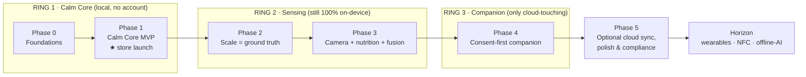
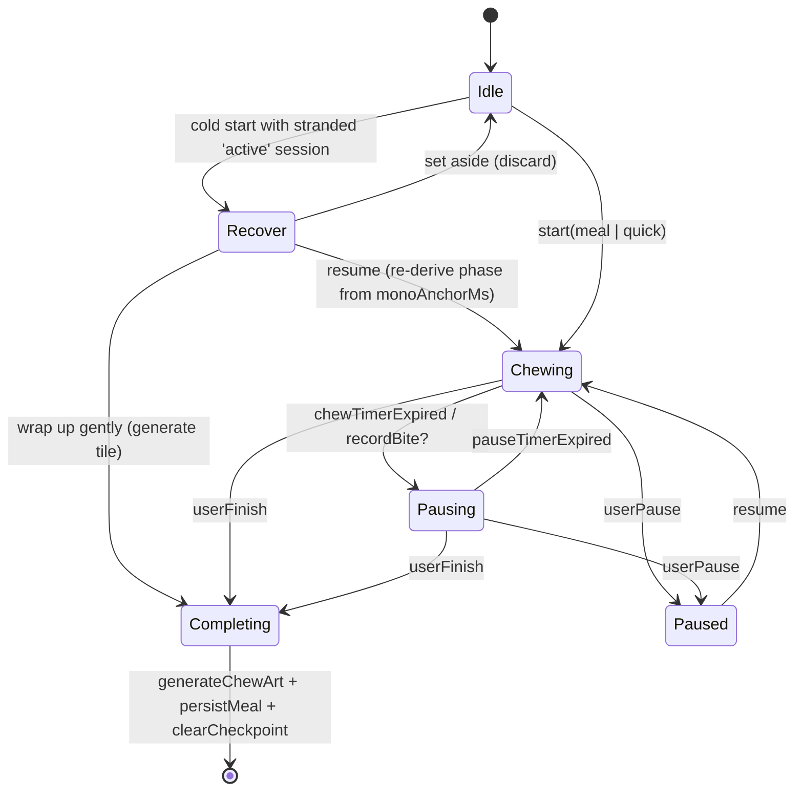
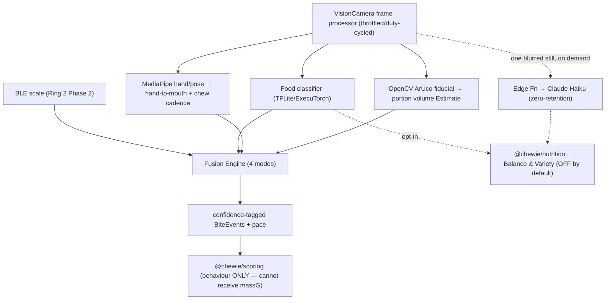
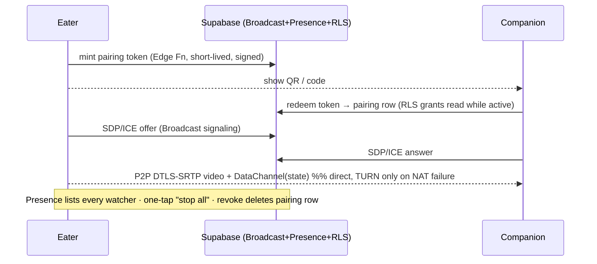
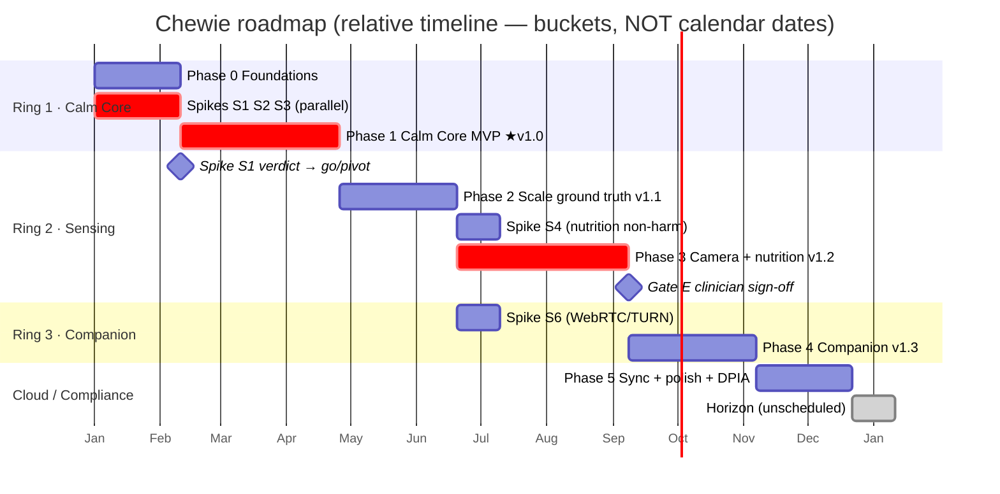

# Roadmap, MVP Scope & Delivery Plan

> **Owner:** Delivery / Roadmap area.
> **Status:** Draft v0.2 — conforms to the Chewie Canonical Architecture Spine (`docs/02-system-architecture.md`).
> **Scope of this doc:** phasing, scope-per-phase, definition of done, build-vs-buy, effort/sequencing, the cut list, release gates, and the riskiest assumptions to validate. It does **not** re-derive the algorithms, data model, shared types, or ethics rules — those live in the sibling docs referenced below, and this plan **cites** them rather than re-declaring them.

## Related documents (canonical numbering: `docs/NN-topic.md`, ADRs `docs/adr/NNNN-title.md`)

This repo uses one flat numbering scheme. **This file is `docs/09-roadmap-and-mvp.md`.** A CI link-checker (`pnpm docs:links`, lychee over `docs/`) walks every relative link and every `docs/adr/NNNN-*` citation and **fails the build on any dangling reference or ADR id** — so the cross-reference drift that used to exist between sibling docs cannot recur. All ADR numbers in this doc resolve through the single index in `docs/adr/README.md`.

| Concern | Doc | Package |
|---|---|---|
| **Canonical architecture spine (source of truth)** | `docs/02-system-architecture.md` | — |
| Product vision, ethics, **first-run/onboarding flow & empty states** | `docs/01-product-vision.md` | — |
| System architecture, ring topology, **frozen shared types**, ADR index | `docs/02-system-architecture.md` | `@chewie/core-types` |
| Calm loop, phase engine, **`ChewieClock`, session checkpoint/recovery**, ChewArt | `docs/03-chewing-engine-and-art.md` | `@chewie/engine`, `@chewie/art` |
| Scale drivers, sensor fusion, camera/on-device AI, nutrition insight | `docs/04-sensing-and-ai.md` | `@chewie/fusion`, `@chewie/nutrition` |
| Behaviour score, symmetric bands, disordered-use safeguard **detection math + honest limits** | `docs/05-scoring-model.md` | `@chewie/scoring` |
| Companion pairing, WebRTC, state mirror | `docs/06-companion-and-pairing.md` | — |
| Storage, encrypted schema, `LocalProfile`/age-band, `SessionCheckpoint` shape, shared-device co-decision | `docs/07-data-model-and-privacy.md` | — |
| Responsible design & safety: ED/surveillance risk model, safeguard **policy/consent framing**, minors/age-appropriateness, DPIA line items, Art-9, accessibility | `docs/08-responsible-design-and-safety.md` | — |
| Decision records | `docs/adr/README.md` (single index) + `docs/adr/NNNN-*.md` | — |

> **Shared types & constants have exactly one home** (do not paraphrase them here): `Estimate<T>` and `BiteEvent` live in **`@chewie/core-types`** with numeric `confidence: 0..1`; default timings live in **`@chewie/config`** as `DEFAULT_TIMINGS`. This doc quotes those homes; a golden test in `@chewie/core-types` asserts no sibling package re-declares the shapes. See `02-system-architecture.md §5.4–5.6`.

### ADR index used by this plan (authority: `docs/adr/README.md §5.6`)

Referenced by number only; the historical `0006`/`0007` collisions are renumbered once in the index.

| ADR | Decision | Cited in this plan |
|---|---|---|
| `0001-client-platform-react-native-expo` | RN + Expo over Flutter/Capacitor | §0.1, Phase 0/1 |
| `0002-concentric-rings-topology` | Rings + strict dependency ordering | §1, §9 |
| `0003-supabase-single-eu-backend` | One managed EU backend | Phase 4/5 |
| `0004-ondevice-first-ai` | On-device-first AI; one opt-in blurred still | Phase 3 |
| `0005-scale-primary-sensor-and-fusion-modes` | Scale primary; four fusion modes | Phase 2/3 |
| `0006-scale-driver-abstraction` | Driver abstraction, **streaming-first**; avoid vendor SDKs | Phase 2 |
| `0007-companion-webrtc-p2p` | P2P video + DataChannel; no SFU; planes split | Phase 4 |
| `0008-isolated-behavior-scoring` | Scoring package cannot receive intake | Phase 1/2, Gate E |
| `0009-local-first-encrypted-sqlite-and-sync-seam` | Encrypted SQLite + repository seam | Phase 0/5 |
| `0010-continuous-clock-timing-and-recovery` | Sleep-inclusive `ChewieClock` + session recovery | Phase 1 |
| `0011-deterministic-seed-params-chewart` | Seed+params ChewArt, reproducible | Phase 1 |

---

## 0. What this plan changes vs. the raw briefing (and why)

The raw section brief predates the finalized spine. Where they conflict, **the spine wins** (project mandate). Five deliberate corrections, each a genuine improvement:

1. **Platform: RN + Expo native, not "PWA + Capacitor."** The brief said *"Phase 0 MVP: PWA"* and *"Phase 4: native (Capacitor) polish."* ADR `0001` rejected Capacitor (getUserMedia + MediaPipe-WASM + WebRTC + Canvas-2D art hit a perf ceiling on old devices; **no web API exposes the sleep-inclusive clock the loop needs** — see §0.1a) and Flutter (splits off TypeScript). The product of record is a **React Native + Expo dev-client** app from Phase 0. We keep the *spirit* of "PWA = frictionless, try-before-install, offline" via an **optional thin Web Echo** (§8) that reuses the pure packages `@chewie/engine` + `@chewie/art` (Skia has a CanvasKit/WASM web target). The Web Echo is a marketing/demo surface only, never on the critical path, and cannot host sensing/companion or the continuous clock. "Capacitor native polish" is therefore *moot* — we are native from day one — so that brief-Phase-4 slot is repurposed as the **Horizon** backlog (§Horizon).

   **0.1a — clock-source correction (important).** The naive-timer fix is not just "use a monotonic anchor." `performance.now()` / `mach_absolute_time` **do not advance while the device is asleep**, and a meal phone on a stand *will* lock its screen. Recomputing elapsed from those on resume **under-counts** the sleep interval and lands the user in the wrong phase — the exact bug the timing design exists to prevent. The single source of truth is a native, **sleep-inclusive** clock, `ChewieClock`, wrapping `mach_continuous_time()` (iOS) / `SystemClock.elapsedRealtimeNanos()` (Android), injected everywhere (ADR `0010`, `03-chewing-engine-and-art.md §2.2`). This plan aligns the S2 spike accordingly (§7).

2. **Phase numbers realigned to the spine's six phases.** The brief's 0–4 numbering is offset from the spine's 0–5 because the spine correctly splits *Foundations* (pure packages, encrypted schema, CI, provisioning) from the *Calm Core MVP* it enables. This doc adopts the **spine numbering as canonical** and maps the brief onto it in §1.

3. **Risk spikes are front-loaded, not discovered mid-ring.** The facts that can kill or reshape the product — *are consumer BLE scales readable?*, *is the calm loop drift-free and battery-safe for 40 min on cheap phones across a real sleep/resume?*, *is ChewArt actually lovable?* — are run as **timeboxed Phase-0 spikes in parallel with foundations**, each with an explicit **kill/pivot criterion** (§7).

4. **The ethics validation is shifted left into a hard gate.** Safeguards ship *with* the first score, and an ED-clinician reviews intake features. We make that a **named release gate with a *paper* pre-review before any intake code is written** (Gate E, §6), not a post-hoc audit. "Less food never raises the score" is enforced in the type system (`@chewie/scoring` cannot receive grams/mass; ADR `0008`) and asserted by property tests that must be green to pass the gate.

5. **A sequencing subtlety the brief glosses:** the camera-OCR scale fallback depends on the VisionCamera pipeline, which is **Phase 3**. So in **Phase 2**, a scale with no BLE driver degrades to *manual entry*, not OCR; OCR fallback lands with the camera ring. Called out in the Phase 2 and Phase 3 scopes (§4) so nobody promises OCR a phase early.

---

## 1. Phase model & brief→spine mapping

Chewie ships as **concentric rings** (ADR `0002`); each ring is independently lovable and gated behind a feature flag. A ring may never import the ring outside it — enforced by lint (§9), not discipline.



| Raw brief phase | Canonical phase(s) | Feature flag(s) that turn it on |
|---|---|---|
| Phase 0 / MVP (calm loop + ChewArt + settings + gallery, local) | **Phase 0** (Foundations) + **Phase 1** (Calm Core MVP) | none — always on; `RING2/3` **off** |
| Phase 1 (BLE scale + behaviour score + self-baseline) | **Phase 2** | `RING2_SENSING_ENABLED`, `SCALE_DRIVER_*` |
| Phase 2 (camera food-ID + nutrition + fusion) | **Phase 3** | `RING2_CAMERA_ENABLED`, `NUTRITION_INSIGHT_ENABLED`, `CLOUD_AI_SECOND_OPINION` |
| Phase 3 (companion pairing/streaming) | **Phase 4** | `RING3_COMPANION_ENABLED` |
| Phase 4 (native polish, offline AI, wearable/NFC) | **Phase 5** + **Horizon** | `CLOUD_SYNC_ENABLED`, plus Horizon flags |

> Note: brief-Phase-1 (behaviour score) is drawn into the same ring as the scale because the spine ships a *gentle behaviour score from taps* already in Phase 1; Phase 2 upgrades it from tap-derived to scale-derived. See §4.1.

### Feature-flag contract (the spine of the gating)

```ts
// @chewie/config — read via a single selector; defaults are the SHIPPED state.
export interface FeatureFlags {
  // Ring 2
  RING2_SENSING_ENABLED: boolean;        // master switch for the sensing layer
  RING2_CAMERA_ENABLED: boolean;         // VisionCamera frame processors
  NUTRITION_INSIGHT_ENABLED: boolean;    // "Balance & Variety" — OFF by default, forced OFF for minors
  CLOUD_AI_SECOND_OPINION: boolean;      // single blurred still-frame to Claude — explicit opt-in only
  // Ring 3
  RING3_COMPANION_ENABLED: boolean;      // pairing + WebRTC
  RING3_COMPANION_VIDEO_ENABLED: boolean;// video plane; state-only companion works without it
  // Ring 1.5 (cloud, opt-in)
  CLOUD_SYNC_ENABLED: boolean;           // zero-knowledge E2E backup of tiles+settings
  // Global ethical overrides (see §6)
  intakeNumbersHidden: boolean;          // disables the whole intake PIPELINE, not just the UI
  minorSafeDefaults: boolean;            // set true when age band < digital-consent age
}

// Store builds pin these. A half-built ring can never leak into a release:
export const RELEASE_DEFAULTS: FeatureFlags = {
  RING2_SENSING_ENABLED: false, RING2_CAMERA_ENABLED: false,
  NUTRITION_INSIGHT_ENABLED: false, CLOUD_AI_SECOND_OPINION: false,
  RING3_COMPANION_ENABLED: false, RING3_COMPANION_VIDEO_ENABLED: false,
  CLOUD_SYNC_ENABLED: false, intakeNumbersHidden: false, minorSafeDefaults: false,
};
```

Flags flip **true** only when that phase clears its exit gate (§6). Until then the ring's code may exist in `main` behind a `false` flag, but the store build renders as if it does not exist.

---

## 2. Delivery principles (invariants for every phase)

1. **The lovability gate.** Ring 1 must be a product someone loves in airplane mode with no account. Every later ring must *also* leave Ring 1 fully functional if that ring's hardware/cloud is absent. Acceptance test in §6.
2. **Ethics before capability.** No intake number reaches a user before its safeguard ships in the same build and its paper design clears ED-clinician pre-review (Gate E). Scoring cannot receive intake (ADR `0008`).
3. **Honesty by type.** Any quantitative estimate is the single canonical `Estimate<T>` from `@chewie/core-types` (`{ value; low; high; confidence: 0..1; unit; source }`); the shared `<EstimateValue>` component refuses to render a bare number without its range and a "rough estimate" label. No feature "rounds up" confidence.
4. **De-risk before build.** A ring is not scheduled until its killer assumption (§7) has a green spike or an accepted pivot.
5. **Relative sequencing, continuous re-baseline.** Effort is in **EW (engineer-weeks)** as a *planning currency*, not a calendar commitment. Re-estimate at each gate.
6. **Pure logic is framework-free and tested.** `@chewie/engine|scoring|art|fusion|nutrition|core-types|config` are pure TS with Vitest unit + property tests; they never import React/native. The native `ChewieClock` is injected into `@chewie/engine`, so the engine stays pure and a fake clock drives its tests.

**Assumed team shape (small):** ~3 client engineers (one doubling on backend/Edge Functions), 1 product designer, fractional DPO/legal, fractional ED-clinician advisor (retained from Phase 0), fractional ML engineer from Phase 3. Effort numbers below assume this shape.

**Product-scope decisions locked for the MVP** (so downstream docs don't re-litigate them):
- **Single-user-per-device** for the MVP. `07-data-model-and-privacy.md` models exactly one `LocalProfile` (one age-band, one continuity/baseline/settings set). A shared kitchen tablet is explicitly **out of scope** for v1 because blending two people's baselines/streaks is meaningless and — more seriously — a minor sharing a device could inherit an adult's age-gated defaults. Lightweight local **profile-switching** is deferred to Horizon and must be designed with the age-gate implication front and centre. This decision is owned jointly by `07` and `01` (age gate); this plan just records that it is *made*, not open.

---

## 3. Reusable Definition-of-Done template

Every phase's DoD instantiates this typed checklist. "Done" = all `required` items green.

```ts
interface DoDChecklist {
  functional:      Criterion[];  // the scope works end-to-end on a real device
  quality: {
    unitCoverage:  ">=80% on pure packages touched";
    e2e:           "Maestro flow(s) green on iOS + Android";
    lowEndDevice:  "verified on a defined low-end reference phone";
    a11y:          "screen-reader + dynamic-type + reduced-motion pass";
    i18n:          "nl + en complete via i18next; no hardcoded strings";
  };
  ethics:          Criterion[];  // phase-specific guardrails demonstrably enforced
  privacy:         Criterion[];  // data-minimisation, retention, consent for this phase
  release: {
    flagState:     FeatureFlags; // exact flag values this build ships with
    storeReady:    boolean;      // data-safety forms, usage strings, no medical claims
    rollback:      "flag flip returns app to previous ring with no data loss";
  };
}
type Criterion = { id: string; statement: string; required: boolean; evidence: string };
```

**Reference devices:** low-end Android = a ~€150 phone (e.g. 3–4 GB RAM, no NPU); low-end iOS = oldest OS-supported iPhone. Battery/thermal budgets are measured on these, not flagships.

---

## 4. Phases in detail

Each phase lists **Scope · Definition of Done · Key risks · Build-vs-buy · Effort/sequencing · Exit gate.**

### Phase 0 — Foundations  ·  `RING1`  ·  Effort: **M (~6–10 EW)**

**Scope.** No user-facing app yet; this is the rig that makes Phase 1 cheap and safe to build.
- pnpm workspace + Turborepo: `apps/mobile` (Expo SDK 53, dev-client/CNG) + packages `@chewie/{core-types,config,engine,scoring,art,fusion,nutrition}`. `core-types` and `config` are the shared homes for `Estimate<T>`/`BiteEvent`/`SensorMode` and `DEFAULT_TIMINGS`/`FeatureFlags` respectively.
- CI (GitHub Actions) + EAS Build/Update pipelines; Vitest, Maestro harness, Sentry (opt-in) wired but dormant; **the `pnpm docs:links` link-checker** (lychee over `docs/` + ADR-index resolution) wired into CI from day one.
- **Encrypted storage schema** (op-sqlite + SQLCipher + Drizzle) with **NO weight/BMI/goal columns** — the schema absence is the guardrail (§6). MMKV for settings/flags **and the in-progress `SessionCheckpoint`** (§4.1); Zustand for ephemeral UI state.
- Pure package skeletons with first tests: XState v5 statechart stub (clock injected), `scoreBehavior()` **type signature that cannot receive intake** (ADR `0008`), a Skia ChewArt proof-of-concept (ADR `0011`), the score-invariant property-test harness, and the **native `ChewieClock` module scaffold** (iOS/Android bridge) behind a TS interface.
- Design tokens with **no red/failure states**; the constrained copy catalog scaffold (nl+en); the **ADR index `docs/adr/README.md`** committed with `0001`–`0011` written from the spine's `decisions`.
- Supabase project provisioned in **EU region**, DPA signed — but **zero code in Ring 1 can reach it** (lint boundary proves it).
- **Spikes S1, S2, S3 run in parallel here** (§7) — they gate Phases 1 and 2, so they start now.

**Definition of Done.**
- `pnpm build && pnpm test` green in CI; an empty dev-client app boots on both reference devices via EAS.
- Ring-boundary lint rule active and failing a deliberate cross-ring import in a test (proves it works).
- Encrypted DB opens, migrates, and round-trips a row; schema linter asserts banned columns are absent; `MealSession` table has the `status` column + checkpoint fields (§4.1) that Phase 1 recovery needs.
- `docs:links` green over `docs/`; **ADR index resolves** (no dangling ADR id anywhere in `docs/`).
- ADRs `0001`–`0011` merged; DPIA skeleton opened (`07-data-model-and-privacy.md`).
- Spikes S1–S3 have written verdicts (green / pivot).

**Key risks.** Expo native-module friction (BLE/VisionCamera/WebRTC/**the ChewieClock native module** all need config plugins) — mitigated by committing to dev-client from day one and pinning versions. Turborepo/pnpm + Skia web target setup churn.

**Build-vs-buy.** *Buy/OSS:* Expo, Turborepo, Supabase, Drizzle, SQLCipher, Skia, XState, Vitest, Maestro, Sentry, lychee. *Build:* the ring-boundary lint config, the encrypted-schema linter, the property-test harness, the `ChewieClock` native bridge (thin — no OSS wraps `mach_continuous_time`/`elapsedRealtimeNanos` for RN cleanly).

**Exit gate → Gate A** (§6). Flags all `false`.

---

### Phase 1 — Calm Core MVP  ·  `RING1`  ·  Effort: **L (~18–26 EW)**  ·  ★ **first store launch**

This is the whole bet: a complete, offline, account-free product people love with *none* of the ambitious features.

**Scope.**
- **First-run / onboarding flow** (owner doc: `01-product-vision.md`). One doc owns the whole first launch so it isn't assembled from fragments: **age-gate first** (sets the age-band that `minorSafeDefaults` and companion restrictions depend on — captured as a coarse band, never a stored birthdate; see open questions), **just-in-time permission priming** with calm rationale (notifications now; BLE/camera deferred to their rings), single-profile creation (§2 decision), a guided **first-meal** experience, and the **empty states** for gallery (zero tiles), history (zero meals), and insights (no baseline yet — scoring is in "warmup").
- **Full-screen chew/pause phase loop.** Reanimated color transitions on the UI thread, driven by the `@chewie/engine` XState machine off the **sleep-inclusive `ChewieClock`** (see improvement box; ADR `0010`). Central icon + phase label + **countdown bar** + bite counter; keep-awake; expo-haptics phase-change cues; expo-notifications as background fallback.
- **In-progress session recovery** (owner: `@chewie/engine`, doc `03`; persisted shape defined in `07`). Distinct from backgrounding: process death (OS memory kill, battery death, hard crash) destroys the in-memory engine and the ephemeral Zustand session, so a mid-meal session must survive a cold restart (§4.1 below).
- **Manual-tap bite counter.** (Scale automates this in Phase 2.)
- **Quick Mode** for snacks; **pause-only educational tips** from the copy catalog.
- **Full customization:** chew/pause durations (seeded from `DEFAULT_TIMINGS` in `@chewie/config`), colors, haptics, tip frequency.
- **ChewArt:** deterministic seeded mosaic tile per completed meal, stored as **seed+params** (ADR `0011`; re-renderable at any resolution); growing gallery; **PNG/SVG export**.
- **Local meal history.** Encrypted SQLite.
- **Gentle behaviour score v0** from timing + tap cadence only — and, shipped in the *same build*, the **safeguards module** and the **one-switch "hide all numbers"** control, and gentle-continuity streaks (freeze, rest day, no failure copy).
- nl + en.

> **Improvement — drift-free, sleep-inclusive timing (replaces naive per-second `setInterval`, *and* corrects the "monotonic anchor" half-fix).** A per-tick `setInterval` accumulates drift and freezes when the OS throttles a dimmed screen. But the deeper trap is anchoring on `performance.now()` / `mach_absolute_time`: **those stop advancing while the device is asleep**, and a meal phone locks its screen, so a "recompute from the anchor" on resume *under-counts* the sleep interval and lands in the wrong phase. The single source of truth is therefore the native, sleep-inclusive **`ChewieClock`** (`mach_continuous_time()` / `SystemClock.elapsedRealtimeNanos()`), injected into `@chewie/engine`. The UI derives `remaining = duration − (clock.nowMs() − phaseStartedAt)` each animation frame, so it is exact through dim, background, **and a fully asleep/locked screen** — on resume it recomputes against a clock that *did* keep counting. `Date.now()` is a cross-check only (jumps on NTP/user clock changes). Full design: `03-chewing-engine-and-art.md §2.2`, ADR `0010`.

```ts
// @chewie/engine — phase progress is derived from an injected sleep-inclusive clock, never accumulated
function phaseProgress(clock: ChewieClock, phaseStartedAtMono: number, durationMs: number) {
  const elapsed = clock.nowMs() - phaseStartedAtMono;   // continuous, counts through sleep
  return { remainingMs: Math.max(0, durationMs - elapsed),
           fraction: Math.min(1, elapsed / durationMs),
           expired: elapsed >= durationMs };
}
```

#### 4.1 In-progress session recovery (fixes the process-death gap)

Backgrounding is handled by fold-forward against `ChewieClock` because the process is still alive. **Process death is different** and, for a 20–40 min meal on a stand, *likely* — it must never silently lose the meal or strand a `MealSession` row at `status='active'` forever. Mechanism:

```ts
// Persisted on phase change and every ~5s to MMKV (fast, crash-safe). Owner: @chewie/engine.
// Shape mirrored by the MealSession 'active' row — canonical definition in 07-data-model-and-privacy.md.
interface SessionCheckpoint {
  sessionId: string;
  monoAnchorMs: number;      // ChewieClock anchor at meal start (sleep-inclusive)
  wallAnchorMs: number;      // Date.now() at meal start — detects a reboot (ChewieClock resets on reboot)
  config: SessionConfig;     // chew/pause/quick durations, colors, mode
  phase: 'chew' | 'pause' | 'paused';
  phaseStartedAtMono: number;
  biteCount: number;
  sensorMode: SensorMode;
  updatedWallMs: number;
}
```

- **Cold-start detection & calm choice.** On launch, if a `status='active'` session (or checkpoint) exists, the engine enters a `Recover` state and offers a **calm resume-or-close**: *"You had a meal in progress — carry on, wrap it up gently, or set it aside?"* No red, no "you crashed," no data-loss scolding. Resume re-derives the phase from `monoAnchorMs`; closing generates a tile for what happened; setting aside discards it. Because `ChewieClock` is sleep-inclusive, a resume after hours simply lands in "close this meal" territory rather than a bogus phase; if `wallAnchorMs` shows a reboot happened (mono anchor invalid), we fall back to the wall delta with a "we lost the exact timing" note rather than a wrong phase.
- **Reaper.** A launch-time sweep closes `active` sessions older than a threshold: generate a partial tile if a minimum meal length was reached, otherwise discard silently. No orphaned `active` rows accumulate.



**Definition of Done.**
- *Functional:* a full meal and a Quick-Mode snack run end-to-end offline; each completed meal deterministically yields a ChewArt tile that re-renders identically from its seed on both devices; gallery + PNG/SVG export work; all timings/colors customizable; tips show only in pause; **onboarding runs age-gate-first with calm JIT permission priming**; **all empty states (gallery/history/insights) are designed, not blank**; **a killed-mid-meal app relaunches into the calm Recover choice and can resume in the correct phase** (tested by force-killing during a live session).
- *Quality:* engine + art + scoring ≥80% unit coverage; **golden/snapshot tests** prove tile determinism across iOS/Android; Maestro runs the meal flow **and the process-death recovery flow**; **timer verified drift-free over a real 40-min session that includes a lock→device-sleep→resume cycle** on the low-end phone (spike S2 target, not merely a dimmed foreground); battery/thermal within budget; reduced-motion honored; nl+en complete.
- *Ethics:* the **hide-all-numbers switch disables the pipeline** (not just visibility) — proven by a test asserting no numeric intake selector returns a value when set; streaks never reset to zero; copy catalog contains zero punitive/red templates (lint over the catalog); the safeguards module renders its dismissible help card on a simulated pattern, **runs only on-device, and never transmits anything** — and its trigger honesty is documented (see box below).
- *Privacy:* runs fully in airplane mode; no network sockets opened by Ring 1 (integration test asserts zero outbound connections); no account; age-band captured as a coarse value, no birthdate stored.
- *Release:* store-ready (data-safety = "no data collected"; no camera/BLE usage strings needed yet; **no medical claims** copy review passed); flags all `false`; App Store + Play submissions prepped.

> **Honesty about the safeguard's reach (must be stated wherever triggers are listed).** The strongest disordered-use signals — *sustained extreme-low intake* and *skipped-meal cadence* — are only observable when the user has **enabled the intake pipeline and keeps logging**. The users at highest ED risk often keep intake **off** or simply **stop opening the app**, so those signals are **dark by default** and the care pathway cannot reach a disengaged restrictor. The default-mode heuristic therefore leans on signals that **do** exist without intake: obsessive number-toggling, extreme self-set bite targets/timings, and session-shape anomalies. `05-scoring-model.md`, the DPIA, and the clinician review must all state plainly that **engagement-based detection is structurally limited** and is a soft safety net, never a substitute for care. The safeguard is also easy to turn off, so it cannot itself become a surveillance/shaming vector, and it always states the app is not medical advice.

**Key risks.** (1) ChewArt not actually motivating → **spike S3** must be green before we lean on it as the retention driver. (2) Full-screen continuous animation battery/jank on low-end → mitigated by UI-thread derived values, a seeded **fixed-point PRNG** (no GPU-nondeterministic ops), and low-end profiling (spike S2). (3) Store review of a health-adjacent app → keep zero medical claims, position as "mindful eating / savoring."

**Build-vs-buy.** *Buy/OSS:* Reanimated, Skia, XState, expo-haptics/keep-awake/notifications, i18next. *Build:* the phase engine, the `ChewieClock` bridge, the checkpoint/recovery flow, the ChewArt generator (see art box), the behaviour-score v0, safeguards module, onboarding flow, copy catalog.

> **Improvement — better art algorithm (ADR `0011`).** Rather than random pixel noise, ChewArt is a **deterministic Wang-tile / truchet mosaic** parameterized by meal features (bite count → tile density; rhythm steadiness → symmetry; pause adherence → palette warmth), seeded by a fixed-point PRNG so it is **pixel-reproducible** and storable as `{ seed, params }`. This makes the gallery a few kilobytes, makes every tile *earned and legible* ("this one is calm and even because that meal was") — never "less food = prettier" — and sidesteps GPU nondeterminism. Full spec in `03-chewing-engine-and-art.md`.

**Exit gate → Gate B + Gate E-lite** (behaviour score v0 reviewed by clinician even though no intake yet). Flags all `false`. **Ship to stores. This is v1.0.**

---

### Phase 2 — Scale as ground truth  ·  `RING2` (still 100% local)  ·  Effort: **L (~14–20 EW)**

**Scope.**
- `react-native-ble-plx` behind a **scale-driver abstraction** (ADR `0006`; canonical resolution order & per-vendor drivers in `04-sensing-and-ai.md`). The abstraction is **streaming-first** — the fusion needs the weight-*time curve*, so scales that stream continuous weight are primary; stabilization-only scales are handled but weaker. Resolution: `SIG Weight Scale Service 0x181D` → per-vendor proprietary GATT/manufacturer-data drivers → **manual entry** (camera-OCR fallback is Phase 3, see §0 correction 5). Curated *supported-scale list*.
- **Weight-time curve → automatic bite step-detection**: each bite = a downward step; derive **grams/bite** and **grams/min pace**.
- `@chewie/fusion` **`SCALE_ONLY`** mode producing confidence-tagged `BiteEvent`s — the canonical `@chewie/core-types` shape (see box), not a local paraphrase.
- **Band-based BehaviourScore** (upgrades v0): symmetric healthy bands, center = 100, too-fast/slow and too-big/small both lower the score; property tests assert *reducing intake below the band never raises the score* (ADR `0008`).
- **"Battle yourself"** vs one's own gently-adapting baseline (self-vs-self only, no comparison surfaces).
- Intake numbers **optional, ranged (`Estimate<T>`), hideable** by the Phase-1 switch.

> **Cite, don't redeclare.** `BiteEvent` and `Estimate<T>` are frozen in `@chewie/core-types` (numeric `confidence: 0..1`, `massG?: Estimate<number>`, `tStartMonoMs`/`tEndMonoMs` on `ChewieClock`, `source: SensorMode`). This plan does not restate their fields — see `02-system-architecture.md §5.4`. The sensing-layer-only types below (`ScaleReading`, `ScaleDriver`) are owned by `04-sensing-and-ai.md`; shown here only to make the build concrete.

```ts
// Sensing-layer types (home: @chewie/fusion / 04-sensing-and-ai.md). NOT the cross-ring BiteEvent.
interface ScaleReading { grams: number; atMono: number; stable: boolean; source: ScaleSource; }
interface ScaleDriver {
  readonly id: string;                              // curated-list key
  matches(adv: BleAdvertisement): boolean;          // is this my device?
  parse(packet: Uint8Array): ScaleReading | null;   // → normalized reading
  streams: boolean;                                 // true = continuous curve; false = stabilization-only
}
```

```
# Bite step-detection over the weight-time curve (stability-aware) — emits the canonical BiteEvent
smooth ← median+lowpass filter over readings                # kill LCD jitter
for each new stable reading r:
    Δ ← lastStableWeight − r.grams
    if Δ ≥ MIN_BITE_GRAMS and settledFor(STABLE_MS):        # ignore hand-on-plate transients
        emit BiteEvent{                                     # @chewie/core-types shape
          tStartMonoMs: r.atMono, tEndMonoMs: r.atMono,
          massG: Estimate(Δ, Δ−tol, Δ+tol, conf, 'g', 'SCALE_ONLY'),
          phase: currentPhase, source: 'SCALE_ONLY', confidence: conf }
        lastStableWeight ← r.grams
pace ← totalConsumed / activeMinutes                        # grams/min, shown only as a band position
```

**Definition of Done.**
- *Functional:* app pairs with **every scale on the launch supported-list** and auto-counts bites within tolerance vs a hand-logged reference meal; grams/bite and grams/min shown as `Estimate<T>` ranges; SCALE_ONLY fusion emits canonical `BiteEvent`s; "battle yourself" trends against personal baseline; **removing the scale degrades cleanly to Phase-1 manual tapping** (lovability gate).
- *Quality:* fusion + scoring property tests green, including the **intake-cannot-raise-score** invariant; step-detector validated against recorded weight-time traces (fixtures); Maestro pairing flow.
- *Ethics (Gate E required):* ED-clinician **paper pre-review of the band design + battle-yourself framing before build**, then sign-off on the built feature; bands are symmetric (test); no "eat less = better" gradient exists in code; intake numbers off/hideable; no comparison to other people anywhere.
- *Privacy:* BLE-only, **no cloud**; Bluetooth usage strings; weight-time data stored encrypted, never leaves device.
- *Release:* `RING2_SENSING_ENABLED=true`, camera/nutrition/companion flags `false`; supported-scale list published with **honest compatibility caveats** (no over-promising).

**Key risks (dominant).** **BLE scale fragmentation** — proprietary/undocumented GATT, stabilization-only emission, auto-power-off. This is **spike S1**; if scales prove unreadable, Ring 2 pivots to *camera-OCR-first* (Phase 3 leads) or *manual-with-smart-assist*. Also: false bite detection from plate jostling → stability-aware detection + tolerances.

**Build-vs-buy.**
- **Scale comms: BUILD on OSS.** Use open `react-native-ble-plx`; **avoid vendor SDKs** (lock-in to one hardware maker; ADR `0006`). Write per-vendor *drivers* against the small interface above; ship a curated list and grow it. Reverse-engineering effort is the real cost — bounded by S1.
- **Nothing bought here.**

**Exit gate → Gate C + Gate E.** Ship as v1.1 (opt-in sensing).

---

### Phase 3 — On-device camera sensing + nutrition + fusion  ·  `RING2`  ·  Effort: **XL (~20–30 EW)**

**Scope (all on-device by default; ADR `0004`).**
- `react-native-vision-camera` frame processors: **food classifier** (TFLite/ExecuTorch), **MediaPipe Tasks hand/pose** (hand-to-mouth + chew cadence), **OpenCV ArUco/AprilTag fiducial** homography for scale-less portion estimation.
- **Fusion Engine across all four modes** (NONE/SCALE_ONLY/CAMERA_ONLY/BOTH; ADR `0005`): correlate weight step-downs with hand-to-mouth events into confidence-tagged bites; derive pace from whichever sensors are present.
- **Camera-OCR scale fallback** (now that the camera pipeline exists): read the LCD when a scale has no BLE driver.
- Optional **"Balance & Variety" nutrition insight** (`@chewie/nutrition`) — **OFF by default**, ranges + confidence, qualitative variety/balance, **never a lone "/100 healthiness," never a red verdict.** Forced off for minors.
- Optional **explicit single-frame, face/PII-blurred cloud "second opinion"** food-ID + optional NL meal summary via a Supabase Edge Function → Claude (Haiku multimodal). On-demand, zero-retention, ranged output only (ADR `0004`).



**Definition of Done.**
- *Functional:* food-ID returns a **ranged** top-k with confidence on a fixed test-meal set; hand-to-mouth + chew cadence detected; fiducial portion estimate produced with a printed reference; fusion produces sensible bites in each of the four modes; BOTH mode measurably improves confidence over either alone; OCR reads at least the launch-list LCD scales; the cloud second-opinion path sends exactly one blurred still and returns ranges.
- *Quality:* frame pipeline **throttled/duty-cycled** to stay within battery/thermal budget over a 30-min meal on the low-end phone; fusion property tests; models profiled for latency.
- *Ethics (Gate E, strongest):* **ED-clinician sign-off on every intake/nutrition surface** *and* paper pre-review before build; nutrition insight is off by default, qualitative, ranged, non-shaming, has **no punitive verdict** and **no `NutritionScore`/graded-healthiness identifier anywhere** (name-lint); minor-safe defaults force it off; the disordered-use safeguard can soften/disable scoring.
- *Privacy (highest-stakes):* camera frames are **GDPR Art. 9** — **never written to disk, never uploaded** in the default path (asserted by a test that fails if a frame buffer is persisted); the only cloud path is the explicit, blurred, single, zero-retention still; DPIA updated; camera usage strings precise.
- *Release:* `RING2_CAMERA_ENABLED=true`, `NUTRITION_INSIGHT_ENABLED=false` (default), `CLOUD_AI_SECOND_OPINION` opt-in; store data-safety updated for camera.

**Key risks.** (1) **On-device food-ID accuracy is inherently low** — **spike S4**: is it good enough to be *non-harmful* when shown only as ranges? Mitigated by scale-as-ground-truth for the *quantitative* side, ranges everywhere, nutrition optional. (2) Power/thermals with camera + models 30–40 min — duty-cycle, run models intermittently, keep-awake + charging guidance, always allow scale-only/manual. (3) Nutrition data coverage/licensing (below).

**Build-vs-buy.**
- **Vision models: BUY/USE pre-trained, don't train (spine non-goal).** MediaPipe Tasks (free, Google), OpenCV ArUco (free) → *build integration only*. Food classifier: evaluate **(a)** an open TFLite food model (e.g. Food-101-class) + our own Open Food Facts mapping (cheapest, most control, lower accuracy) vs **(b)** a commercial on-device SDK such as **Passio Nutrition-AI** (strong on-device food+nutrition, but $$ + SDK lock-in) vs **(c)** cloud Claude only. **Recommendation:** ship (a) with ranges + the (c) opt-in second opinion; keep (b) as an *accelerator* to adopt only if S4 shows (a) is unacceptably harmful/inaccurate.
- **Nutrition DB: BUY = use open data, bundle offline.** **Open Food Facts (ODbL — attribution + share-alike on the DB)** + **USDA FoodData Central (public domain)**. Build the food→nutrient-**range** mapping; user-correctable. Reject network nutrition APIs (Nutritionix/Edamam) on privacy+cost+offline grounds.
- **Cloud AI: BUY per-call** — Claude Haiku via Edge Function, zero-retention.

**Exit gate → Gate D + Gate E.** Ship as v1.2.

---

### Phase 4 — Consent-first companion  ·  `RING3` (first opt-in cloud)  ·  Effort: **L (~16–24 EW)**

**Scope (ADR `0007`).**
- Supabase **Realtime state mirroring** + **Presence** ("who's watching"); explicit, revocable **pairing via short-lived signed tokens/QR** (Edge Function mint/verify) under **RLS** (a companion may read a session *only while an active pairing row grants it*).
- **WebRTC P2P live view** over **managed TURN** — **ephemeral, not recorded, no record button, live/ephemeral watermark**; DTLS-SRTP end-to-end.
- **Separate state plane and video plane**: a WebRTC **DataChannel mirrors structured Chewie state** — phase transitions carry an authoritative **`ChewieClock` timestamp + duration** so the companion renders its **own** drift-free countdown (NTP-lite offset between the two devices' *sleep-inclusive* clocks), not per-second tick messages (`06-companion-and-pairing.md §…`); **state-only companion works when NAT/video fails.**
- Deterministic **band-based live coaching nudges** (on-device; "battle yourself" live).



**Definition of Done.**
- *Functional:* pairing via QR/code works and is **revocable with one tap**; Presence shows every active watcher; **eater can stop all instantly**; companion mirrors state in real time with its own `ChewieClock`-driven countdown; P2P video connects across common NATs and **falls back to state-only** when video/NAT fails; **no record path exists** (code review confirms no media is written server-side or client-side).
- *Quality:* WebRTC connection success measured on real carrier/CGNAT networks (**spike S6**); reconnection handling; latency acceptable.
- *Ethics:* pairing requires **explicit eater action**; **eater is always in control**; video is **view-only, ephemeral, watermarked, not recorded**; **anti-coercion friction/education** on first pair; who-can-be-a-companion constraints; minors' companion access restricted.
- *Privacy:* streams ephemeral, **never recorded by default**; Supabase holds only pairing/consent rows (RLS) — **never raw video, never plaintext intake**; consent receipts logged; TURN creds short-lived/minted per session.
- *Release:* `RING3_COMPANION_ENABLED=true`; App Store/Play "another person watching" + camera justifications; DPIA updated for the cloud plane.

**Key risks.** (1) **Surveillance/coercion misuse** — the dominant *product* risk; mitigated structurally (eater-controlled, view-only, ephemeral, revocable, watchers always visible) + friction/education. (2) **WebRTC NAT traversal + TURN cost** on mobile — **spike S6**; managed TURN + short-lived creds + graceful state-only fallback. (3) Store sensitivity to remote-viewing.

**Build-vs-buy.**
- **TURN: BUY managed** — **Cloudflare Realtime** TURN; **self-hosted coturn** as fallback. STUN free. Don't build.
- **Signaling/auth/Presence/RLS: BUY = Supabase** (already provisioned; ADR `0003`).
- **Media: BUILD on OSS `react-native-webrtc` P2P** — **reject a managed SFU** (LiveKit/Daily/Agora route media through a vendor, add cost, contradict ephemeral-by-design; keep SFU only as the *future group-watch* path).

**Exit gate → Gate F.** Ship as v1.3.

---

### Phase 5 — Optional cloud, polish & compliance  ·  Effort: **M–L (~12–18 EW)**

**Scope.**
- **Opt-in zero-knowledge, client-side-E2E-encrypted backup/sync** of tiles+settings via the **repository seam** (PowerSync / ElectricSQL later; ADR `0009`); **server stores ciphertext only** under RLS; keys derived on device. Never raw video, never plaintext intake.
- **"Battle yourself" behaviour-first trend view**; art **share pages**; richer optional Claude meal summaries.
- **Compliance & hardening:** finalize **DPIA**; **ED-clinician design review of every intake feature**; accessibility; **age-appropriateness hardening**; full **DSAR export/delete**; consent-receipt review; App Store/Play review prep with **no medical claims**.

**Definition of Done.** Opt-in sync round-trips ciphertext and restores a gallery on a new device with no plaintext on the server (verified); DSAR export + delete flows complete; DPIA signed; clinician review sign-off recorded for every intake feature; accessibility audit passed; minor-safe defaults verified end-to-end.

**Key risks.** E2E key management/recovery UX (lost key = lost backup — must be honest about it); sync engine maturity; scope creep.

**Build-vs-buy.** **Sync: BUY/OSS behind the seam** — PowerSync or ElectricSQL; encryption client-side (libsodium). **Backup storage: Supabase Storage** (ciphertext only). Don't build a bespoke sync engine.

**Exit gate → Gate G.** Ship as v1.4 / v2.0.

---

### Horizon — deferred research (was brief-"Phase 4" leftovers)

Explicitly **not scheduled**; ideas parked with a bar to clear before promotion:
- **Local multi-profile / profile-switching** on a shared kitchen device — promote only with the age-gate/minor-safety implication (§2) designed first; single-user-per-device is the MVP stance.
- **Wearable HR/HRV** (satiety/relaxation signal) — promote only if it strengthens the *behaviour/calm* story, never intake.
- **NFC tag on the plate-stand** to auto-start a meal session (low risk).
- **Fully offline on-device LLM** meal summaries (removes the one cloud AI call).
- **Group/multi-viewer companion** via an SFU (deferred from Phase 4 by design).
- **Additional languages** beyond nl/en.

---

## 5. Effort & sequencing summary

Relative currency = **EW (engineer-weeks)**; **not calendar-locked**; re-baseline at every gate.

| Phase | T-shirt | EW (rough) | Can parallelize with | Hard prerequisite |
|---|---|---|---|---|
| 0 Foundations | M | 6–10 | spikes S1–S3 | — |
| 1 Calm Core MVP | L | 18–26 | S2/S3 verdicts feed it | Phase 0 |
| 2 Scale sensing | L | 14–20 | S1 verdict gates start | Phase 1 shipped |
| 3 Camera + nutrition | XL | 20–30 | ML-eng ramps here | Phase 2; Gate E paper pre-review |
| 4 Companion | L | 16–24 | S6 spike | Phase 3 (camera feed to stream) |
| 5 Cloud/polish/compliance | M–L | 12–18 | runs alongside 4 tail | Phase 4 |

> Phase 1 grew from earlier estimates because onboarding/first-run, empty states, and the process-death recovery flow are now *in scope* (they were previously unowned) — honest cost of closing those gaps.

**Parallelization guidance for a 3-engineer team.** During Phase 1, one engineer can prototype the scale-driver spike (S1) while two build the calm core. Phases are otherwise **sequential across rings** (a ring may not import the next) but internally parallel (engine vs art vs UI vs onboarding). The **ED-clinician** is engaged continuously from Phase 0 so Gate E never blocks on scheduling.



---

## 6. Release gates (the flag-flip discipline)

A gate is a checklist that must be green before that phase's flags flip `true` in a store build.

```ts
interface ReleaseGate {
  id: "A"|"B"|"C"|"D"|"E"|"F"|"G";
  phase: number;
  dod: DoDChecklist;             // §3 instance, all required items green
  flagsAfter: Partial<FeatureFlags>;
  signoffs: Array<"eng-lead"|"design"|"dpo"|"ed-clinician">;
}
```

| Gate | After phase | Adds sign-off | Flips |
|---|---|---|---|
| A | 0 | eng-lead | (none — internal) |
| B | 1 | + design, + dpo, + **ed-clinician (score v0)** | ship v1.0, flags stay `false` |
| C | 2 | + **ed-clinician** | `RING2_SENSING_ENABLED` |
| **E** | 2 & 3 (recurring) | **ed-clinician paper pre-review *before* build, then post-build sign-off on every intake surface** | intake surfaces enabled |
| D | 3 | + dpo (Art. 9), + ed-clinician | `RING2_CAMERA_ENABLED` (nutrition still off) |
| F | 4 | + dpo (cloud plane) | `RING3_COMPANION_ENABLED` |
| G | 5 | + dpo (DPIA final) | `CLOUD_SYNC_ENABLED` |

**Gate E is special:** it is not a single point but the recurring ethics gate. Its rule — *no intake number ships without (i) its safeguard in the same build, (ii) a passing intake-cannot-raise-score property test (ADR `0008`), and (iii) clinician sign-off on a paper design done before code* — is the single most important line in this plan. Gate E review also explicitly records the **safeguard-reach limitation** (engagement-based detection cannot reach a disengaged restrictor; §4.1 box).

---

## 7. Top riskiest assumptions to validate early (with kill/pivot criteria)

Each is a **timeboxed spike** with a written verdict. Spikes S1–S3 run in **Phase 0**; S4/S6 run just ahead of their rings.

| # | Assumption (if false, we're in trouble) | Spike | Success bar | If it fails → pivot |
|---|---|---|---|---|
| **S1** | *Consumer BLE kitchen scales can be read reliably enough to be quantitative ground truth (streaming-first).* | Buy 6–8 popular cheap scales; attempt `0x181D`, then sniff manufacturer data; log emission behaviour (streaming vs stabilization-only? auto-off?). | ≥3–4 scales yield a usable **streaming** weight-time curve with detectable bite steps. | Make **camera-OCR-first** the Ring-2 primary (Phase 3 leads Ring 2), or ship **manual-with-smart-assist**; reposition scale as "nice-to-have." Do **not** over-promise compatibility. |
| **S2** | *The calm loop is drift-free and battery/thermally acceptable for 20–40 min on a cheap phone across a real **lock → device-sleep → resume** cycle* (not merely a dimmed foreground). | Instrument the `ChewieClock` PoC; run a 40-min session on the low-end reference device that **locks the screen and lets the device sleep, then resumes**; measure phase error, battery, temp, jank. | **< 1 s phase error** after a multi-minute device sleep; battery/thermal within budget; 60 fps sustained while foregrounded. | Confirm the native continuous clock is wired (a `performance.now()` anchor would fail this by design); reduce animation cost; lean on charging guidance/keep-awake; cap session length. |
| **S3** | *ChewArt is intrinsically motivating enough to be the primary retention driver* (the whole ring bet assumes Ring 1 stands alone). | Prototype 20–30 tiles from varied meal params; qualitative reactions from ~10 target users; do they *want the next tile*? | Clear "I'd keep eating to grow this" signal; tiles read as earned/legible. | Strengthen the art algorithm and/or add a second gentle intrinsic hook (streak-freeze narrative, seasonal mosaics) — **without** adding intake/social pressure. |
| **S4** | *On-device (or blurred-still cloud) food/nutrition estimation is good enough to be **non-harmful** when shown only as ranges.* (A harm question, not just accuracy.) | Evaluate the open TFLite food model + OFF mapping on a fixed meal set; have the **ED clinician** review sample outputs framed as ranges. | Estimates are honestly ranged, never falsely precise, and the clinician judges the framing non-harmful. | Keep nutrition **off** longer; rely on scale for quantitative; adopt Passio only if it clears the *harm* bar; or ship variety-only qualitative insight with no numbers. |
| **S5** | *A behaviour-only score (no "eat less" lever) is motivating **and** passes clinician review* — the ethical core. | Paper-design the bands + "battle yourself"; clinician paper pre-review; small user test of the framing. | Users find self-vs-self behaviour improvement motivating; clinician signs off; property test proves intake can't raise score. | Simplify to qualitative feedback ("that felt calm and even") over a numeric score; never introduce an intake lever to compensate. |

**Watchlist (S6, validated before Phase 4):** *WebRTC P2P + managed TURN traverse real carrier/CGNAT networks with acceptable latency.* Success: connects on common NATs; clean fallback to state-only. Fail → lean on the **state-only companion** and defer live video.

---

## 8. Optional Web Echo (reconciling the "PWA" idea)

Not on the critical path. Because `@chewie/engine` (pure TS) and `@chewie/art` (Skia → CanvasKit/WASM web target) are framework-agnostic, a **read-mostly web demo** of the calm loop + a sample ChewArt tile can be published for *try-before-install* and art **share pages** (Phase 5). Constraints: **no sensing, no companion, no persistence of sensitive data, and no `ChewieClock`** (the web has no sleep-inclusive clock, so the web loop is a *demo* that does not claim drift-free timing across sleep). It exists to reduce install friction and host public art-share links, and must never diverge from the native product of record. Effort: **S**, only if marketing needs it.

---

## 9. Enforcing the boundaries (delivery mechanism, not vibes)

Ring isolation and doc/type consistency are **build-time guarantees**, so "a failed cloud call breaks the core" — or "a paraphrased type diverges" — cannot happen:

```jsonc
// eslint import-boundaries (sketch) — Ring N may not import Ring N+1
{
  "boundaries/elements": [
    { "type": "ring1", "pattern": ["packages/core-types/*","packages/config/*","packages/engine/*","packages/art/*","packages/scoring/*","apps/mobile/src/calm-core/*"] },
    { "type": "ring2", "pattern": ["packages/fusion/*","packages/nutrition/*","apps/mobile/src/sensing/*"] },
    { "type": "ring3", "pattern": ["apps/mobile/src/companion/*","apps/mobile/src/cloud/*"] }
  ],
  "boundaries/rules": [
    { "from": "ring1", "disallow": ["ring2","ring3"], "message": "Ring 1 (Calm Core) must not depend on sensing/cloud." },
    { "from": "ring2", "disallow": ["ring3"],          "message": "Ring 2 must not depend on the Companion/cloud plane." }
  ]
}
```

Also part of CI and Gate A:
- **`pnpm docs:links`** (lychee) — fails the build on any dangling `docs/` cross-reference or `docs/adr/NNNN-*` citation that does not resolve through `docs/adr/README.md`. This is the fix for the historical cross-reference drift; every "Related docs" index and ADR number must resolve.
- **Type-redeclaration golden test** — asserts no sibling package re-declares `Estimate<T>`/`BiteEvent` (they come from `@chewie/core-types`).
- **Schema linter** — asserts banned columns (`weight`, `bmi`, `goal`, `calorieBudget`) never exist.
- **Name linter** — bans the identifiers `NutritionScore` / any `*Healthiness*/100`.

---

## 10. Explicit cut list (deliberately deferred)

**Cut from the MVP (Phases 0–1):** all sensing, all camera, all cloud, accounts/login, any intake/nutrition numbers, companion, sync, analytics, **multi-profile / shared-device support** (single-user-per-device, §2).

**Deferred by design across the roadmap:**
- **No accounts** for the calm core, ever — identity exists only to enable companion pairing (Phase 4+).
- **No weight / BMI / calorie budgets / weight-loss goals** — not in onboarding, not in schema, at any phase.
- **No blended score** mixing behaviour with amount eaten — permanently separate packages (ADR `0008`).
- **No `NutritionScore` / graded "/100 healthiness" / red "bad meal" verdict** — permanently banned (name-lint).
- **No macro/food-diary** (MyFitnessPal-style) — intake stays secondary, optional, non-punitive.
- **No social feed, public-gallery-by-default, or leaderboards** — competition is self-vs-self only.
- **No group/multi-viewer companion or web viewer** in the first companion release (1:1 P2P first; SFU is Horizon).
- **No recording of companion video**, no record button, no always-on cloud feed analysis — ever.
- **No continuous frame upload** to cloud AI — a single blurred still only.
- **No second native codebase, no Flutter/Capacitor variant, no in-house ML training** for MVP.
- **No third-party behavioural analytics** in the calm core; crash reporting opt-in only.
- **Camera-OCR scale fallback deferred to Phase 3** (needs the VisionCamera pipeline; Phase 2 falls back to manual entry).
- **Wearables / NFC / offline on-device LLM / multi-profile** → Horizon.

---

## 11. Open questions & honest risks

Captured for tracking; owners assigned at Gate A. (Items the plan has *decided* — single-user-per-device, clock source, shared-type homes, ADR index — are recorded in §2/§0/§9, not here.)

- **Supported-scale list at launch:** which specific models, and how loudly do we caveat compatibility? (Depends on S1.) Owner: sensing.
- **Passio vs open-model decision:** taken at S4 with real accuracy + harm data. Owner: ML + clinician.
- **Age-band capture without a birthdate:** how do we set `minorSafeDefaults` from a coarse band without storing a birthdate we must then protect — and how does that band behave if a shared device is ever supported later? Owner: DPO + design (with `01`/`07`).
- **E2E backup key recovery:** lost key = lost backup. How honest/prominent is the warning, and do we offer an (optional, riskier) recovery path? Owner: DPO + eng.
- **Disordered-use safeguard tuning *and its honest limits*:** thresholds on the *default-mode* signals (number-toggling, extreme self-set targets, session-shape anomalies) that catch real patterns without becoming a shaming/surveillance vector or firing false positives — while documenting that intake-based triggers are dark by default and cannot reach a disengaged restrictor (§4.1 box). Runs on-device only, easy to turn off. Owner: clinician + eng.
- **TURN cost model** at scale on mobile carrier networks. Owner: eng + finance.
- **Store review posture** for a camera + BLE + "another person watching" health-adjacent app — pre-submission consult recommended before Phase 3/4. Owner: eng-lead.

> **Standing disclaimer to weave into product, not bury:** Chewie is **not a medical device** and gives **no medical or nutritional-precision advice**; every quantitative figure is a rough, ranged estimate. This is designed into the types (`Estimate<T>`), the copy catalog, and the gates above — not left as a footer paragraph.
