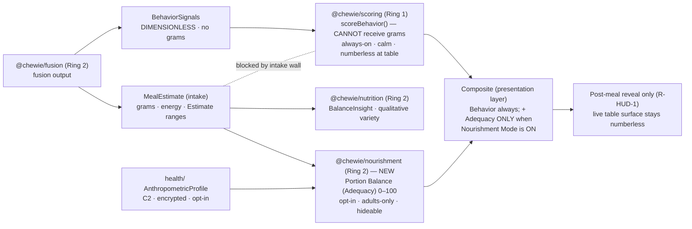

# Chewie — Nourishment Mode, Anthropometric Profile & Two‑Sided Portion Balance

> **Status:** Design (v1, buildable) · **Owner:** Nourishment area · **Applies to:** Ring 2 (opt‑in), Phase 3+
> **Committed path:** `docs/10-nourishment-and-intake-targets.md`
> **Feature name:** *Nourishment Mode* · **Score:** *Portion Balance* (a.k.a. *Adequacy*) · **New package:** `@chewie/nourishment` · **Profile module:** the opt‑in `health/` anthropometric module.

This document specifies **Nourishment Mode**: an **opt‑in, adults‑only, off‑by‑default, fully hideable** feature that lets an adult enter their height, weight, age, sex, and activity level; derive BMI, a WHO healthy‑weight **range**, and an energy need (TDEE); and be coached toward a **two‑sided per‑meal adequacy band** — an *ideal amount* they are guided to get **into and stay inside**, where **both under‑eating and over‑eating lower the score.**

### 0. Reconciliation mandate — what this doc changes and what it preserves

Chewie's v2 design (docs 01–09) hardened the ethical mandate into a **structural prohibition** on weight/BMI/portion‑quantity features: no `weight`/`bmi`/`goal` DB columns (`docs/07` §12.4), an intake type wall keeping grams out of the scorer (`docs/05` §2), `"bmi"`/`"weight loss"` in the banned lexicon (`docs/08` §3.5.1), and *"absolute food quantity is not a scored dimension at all"* (`docs/05` §1). The **product owner has decided this feature must exist.**

The reconciliation is **not** to weaken the mandate — it is to convert a *prohibition* into a **guarded, opt‑in, two‑sided, clamped** feature. The distinction that makes this health‑positive rather than a diet app:

> The user is **not** asking to eat *less*. They want to hit the **ideal amount** — a **two‑sided target range** — and be coached to get **into and stay inside** it. Under‑eating and over‑eating are **both** penalised. There is no "minimize" direction, and no target is ever set below the healthy range. This is an **adequacy** goal (avoiding both under‑ and over‑eating), materially different from a weight‑loss / restriction flow, which remains banned.

Every good safeguard from the v2 design is **kept and reframed** from *"this is banned"* to *"this is opt‑in, gated, two‑sided, and guarded."* The changes each sibling doc must make are enumerated in **§10**.

### Related docs (canonical on‑disk filenames; CI link‑checker gates every reference)

| Path | What this doc depends on / touches |
|---|---|
| `docs/01-product-vision.md` | Ethical mandate; first‑run/onboarding‑flow owner (Nourishment Mode enrollment is a *new, separate* opt‑in inside that flow). |
| `docs/02-system-architecture.md` | Ring topology & the boundary lint; the ADR index; the shared `@chewie/config` and `@chewie/core-types` homes. Registers the new `@chewie/nourishment` package (§1, §10). |
| `docs/03-chewing-engine-and-art.md` | The sleep‑inclusive `ChewieClock`; per‑meal timing context Nourishment Mode reads (never `performance.now()`). |
| `docs/04-sensing-and-ai.md` | `@chewie/fusion`: `MealEstimate` (`totalConsumedG`, `paceGramsPerMin`) and the energy/macros mapping (§6). Nourishment Mode consumes fusion **intake** as its input. |
| `docs/05-scoring-model.md` | `@chewie/scoring`: the **`bandScore` primitive** (§4) reused here two‑sided; the **intake wall** (§2) that stays; the "battle yourself" EWMA baseline (§8); the composite (§6). |
| `docs/07-data-model-and-privacy.md` | Encrypted SQLite schema, C2/Art‑9 handling, the intake two‑field kill‑switch (§11.2), and the **banned‑column CI guard** (§12.4) this doc amends to a table‑scoped allowlist. |
| `docs/08-responsible-design-and-safety.md` | Age gating (§7), the care pathway (§3.7), **R‑HUD‑1** (no live numeric HUD), the honesty‑of‑estimate rules (§5), and the **banned lexicon** (§3.5.1) this doc narrows for `"bmi"`. |
| `docs/09-roadmap-and-mvp.md` | Phase placement (Phase 3+, behind the ED‑clinician gate). |
| `docs/adr/README.md` | The single ADR index. This doc proposes a new ADR (§10): *guarded two‑sided nourishment plane*. |

**ADRs leaned on:** `0004-ondevice-first-ai`, `0005-scale-primary-and-fusion-modes`, `0008-isolated-behavior-scoring` (unchanged — the behavior score stays intake‑free), `0009-local-first-encrypted-sqlite`, `0010-continuous-clock-timing-and-recovery`.

---

## 1. Two scoring planes — the separation we keep

The team built an elegant separation: dimensionless **behavior** on one side, intake **numbers** on the other, split by a hard type boundary inside `@chewie/fusion` (`docs/04` §7.3). Nourishment Mode **does not touch that boundary**; it adds a **second, parallel plane** that lives entirely on the intake side.



Invariants that survive intact:

- **`@chewie/scoring` (BEHAVIOR plane)** stays **100 % intake‑free, always‑on, calm, numberless at the table.** The intake wall (`docs/05` §2), ADR‑0008, and property tests P1–P4 are **unchanged**. Grams still cannot reach `scoreBehavior()`. This is the dinner‑table heart and its character does not change.
- **`@chewie/nourishment` (ADEQUACY plane)** is a **separate Ring‑2 package** that *does* consume intake (`totalConsumedG` / energy from `@chewie/fusion`, `docs/04` §6–§8) plus the user's personal target, and produces the two‑sided **Portion Balance** score. It is off by default, adults‑only, and fully hideable.
- **Ring rule holds.** `@chewie/nourishment` is Ring 2; it may import `@chewie/fusion` (Ring 2, same ring) and the **pure `bandScore` function** from `@chewie/scoring` (Ring 1, downward import — allowed). It **never** calls `scoreBehavior()` and **never** hands intake to the behavior scorer, so the wall is not breached (a CI import rule, §10, forbids `@chewie/nourishment` from importing `scoreBehavior`).
- **The composite the user may see** includes Adequacy **only when Nourishment Mode is on**, and is assembled in the presentation/app layer — **not inside `scoreBehavior()`** — so no intake value ever becomes an argument to the behavior scorer. **The live at‑the‑table surface stays numberless (R‑HUD‑1 preserved).**

---

## 2. Enrollment, consent & the age gate

Nourishment Mode is a **distinct opt‑in**, stricter than the plain intake pipeline (`docs/07` §11.2). Enabling the scale, sensing, or intake numbers does **not** enable it.

### 2.1 Gating rules

- **R‑NOURISH‑AGE (adults‑only):** Nourishment Mode is available **only** to a `LocalProfile` whose `ageBand === 'ADULT'` (`docs/08` §7). `UNDER_16`, `AGE_16_17`, and `UNDISCLOSED` **cannot enroll** — this is deliberately *stricter* than the plain intake pipeline (which `AGE_16_17` may enable with friction), because anthropometric/BMI data is more sensitive and more susceptible to weight‑preoccupation harm in adolescents.
- **R‑NOURISH‑DEFAULT (off by default):** `nourishmentModeEnabled` defaults `false` for **everyone**. It requires enabling the intake pipeline **and** a further explicit enrollment step.
- **R‑NOURISH‑CONSENT (Art 9 explicit consent):** enrollment writes a `ConsentReceipt` (`docs/07` §6.5) with `lawfulBasis: 'explicit_consent'` and `purposes: ['nourishment_adequacy']`. The anthropometric profile is **C2 special‑category health data**.
- **R‑NOURISH‑HIDE (one‑tap hideable, pipeline kill):** the app‑wide `intakeNumbersHidden` selector (`docs/07` §11.2) governs Portion Balance exactly as it governs grams: when numbers are hidden, **no Adequacy number renders and no per‑meal target is computed or shown.** A one‑tap "hide all numbers" both hides Adequacy *and* returns the composite to behavior‑only. Disabling Nourishment Mode deletes the target derivation; the anthropometric profile can be deleted independently (crypto‑shred / row delete, `docs/07` §12.3).
- **R‑NOURISH‑NOTMED (not medical advice):** every enrollment screen and every Adequacy surface carries the standing *"informational, rough estimate — not medical or nutritional advice, not a measurement"* caption (`docs/08` §5.5).

### 2.2 Enrollment flow

```mermaid
stateDiagram-v2
  direction LR
  [*] --> Off: default (everyone)
  Off --> AgeCheck: user opens "Nourishment Mode"
  AgeCheck --> Off: ageBand ≠ ADULT<br/>(explain: adults only) + offer care/info floor
  AgeCheck --> Interstitial: ageBand = ADULT
  Interstitial --> Off: "not now" (one tap, no friction)
  Interstitial --> Profile: accept "rough estimates, a comfortable RANGE,<br/>never a weight-loss goal" + Art 9 consent
  Profile --> Screen: enter height, weight, age, sex, activity
  Screen --> Care: stats indicate BMI < 18.5<br/>OR user requests a reducing/under-target
  Care --> Off: gentle care/signpost pathway (docs/08 §3.7);<br/>NO reducing target is ever computed
  Screen --> Enrolled: stats in/above healthy range<br/>→ derive healthy range + TDEE + per-meal band
  Enrolled --> Off: disable anytime (one tap) / delete profile
```



Enrollment copy centers **adequacy and savoring** ("enough to feel nourished and satisfied"), never measurement or reduction. The interstitial states plainly: *"This estimates a comfortable amount to aim for — a range, not a single number, and never a weight‑loss goal. Eating too little lowers your Portion Balance just like eating too much."*

---

## 3. The AnthropometricProfile — an opt‑in C2 health module

### 3.1 Type (home: `@chewie/core-types`, `health/` module — opt‑in)

Height + weight alone are insufficient for an energy need — that is why age, sex, and activity are collected (they are inputs to Mifflin–St Jeor, §4). We store the **inputs**, never a weight *goal* and never a persisted BMI/target.

```ts
// packages/core-types/src/health/anthropometric.ts
// C2 (GDPR Art 9). Written ONLY when nourishmentModeEnabled === true AND ageBand === 'ADULT'.
export type BiologicalSex = 'MALE' | 'FEMALE';  // used only for the BMR constant (§4.3); self-selected

export type ActivityLevel =
  | 'SEDENTARY'      // little/no exercise            → PAL 1.20
  | 'LIGHT'          // light exercise 1–3 days/wk    → PAL 1.375
  | 'MODERATE'       // moderate 3–5 days/wk          → PAL 1.55
  | 'ACTIVE'         // hard exercise 6–7 days/wk      → PAL 1.725
  | 'VERY_ACTIVE';   // very hard / physical job      → PAL 1.90

export interface AnthropometricProfile {          // C2 — encrypted, local-first, opt-in
  profileId: Uuid;
  heightCm: number;                               // input
  weightKg: number;                               // input — CURRENT weight; NOT a goal, NOT a target
  ageYears: number;                               // input (BMR needs actual years, not the coarse band)
  sex: BiologicalSex;                             // input (BMR constant only)
  activity: ActivityLevel;                        // input
  updatedHlc: HlcString;
  // DELIBERATELY ABSENT: targetWeight, goalWeight, weightLoss, calorieBudget, deficit, bmi (derived at runtime).
}

// Per-meal split preferences (user override of the default distribution, §4.5).
export interface MealSplitPrefs {
  profileId: Uuid;
  fractions: Record<MealSlot, number>;            // must sum to 1; defaults in §4.5
  comfortMarginPct: number;                        // plateau half-width, default 0.15 (§4.6)
  updatedHlc: HlcString;
}
export type MealSlot = 'BREAKFAST' | 'LUNCH' | 'DINNER' | 'SNACK';
```

> **Why store `ageYears` (not just the `AgeBand`)?** Mifflin–St Jeor is sensitive to age in years. `ageYears` is C2 data confined to this opt‑in module and is **never** used for gating (gating still uses the coarse `LocalProfile.ageBand`, `docs/08` §7). It is deletable independently and never leaves the device except as ciphertext.

### 3.2 Reconciling with `docs/07` — schema addition + the amended banned‑column guard

`docs/07` §12.4 fails the build on any column matching `/\b(bodyweight|body_weight|bmi|weight_goal|target_weight|weight_loss|calorie_budget)\b/i`, and §3 states there are *"no `weight`, `bmi`, `goal` columns anywhere."* Nourishment Mode needs to persist height/weight/age/sex/activity. The reconciliation keeps the guard **strong** while opening a **single, reviewed, table‑scoped** home:

**New table — the only sanctioned home for anthropometric inputs:**

```sql
-- 0NN_nourishment.sql  (op-sqlite + SQLCipher; C2, encrypted at rest like all local rows)
CREATE TABLE anthropometric_profile (        -- C2 health module; one row per profile, opt-in
  profile_id   TEXT PRIMARY KEY REFERENCES profiles(id) ON DELETE CASCADE,
  height_cm    REAL NOT NULL,
  weight_kg    REAL NOT NULL,                 -- CURRENT weight (an input), never a goal/target
  age_years    INTEGER NOT NULL,
  sex          TEXT NOT NULL,                 -- 'MALE' | 'FEMALE' (BMR constant only)
  activity     TEXT NOT NULL,                 -- ActivityLevel
  updated_hlc  TEXT NOT NULL
  -- INTENTIONALLY ABSENT: bmi (derived at runtime), target_weight, goal_weight,
  --   weight_loss, calorie_budget, deficit. These remain un-buildable EVERYWHERE.
);

CREATE TABLE meal_split_prefs (
  profile_id         TEXT PRIMARY KEY REFERENCES profiles(id) ON DELETE CASCADE,
  fractions_json     TEXT NOT NULL,           -- JSON Record<MealSlot, number>, Σ = 1
  comfort_margin_pct REAL NOT NULL DEFAULT 0.15,
  updated_hlc        TEXT NOT NULL
);
```

**Amended CI guard (replaces the flat regex in `docs/07` §12.4):** the guard becomes **table‑scoped**, so a weight‑loss flow still cannot be built casually:

1. **Diet‑goal tokens stay hard‑banned in *every* table, including this one:** `target_weight`, `weight_goal`, `goal_weight`, `weight_loss`, `calorie_budget`, `deficit`, `bmi`. There is **no** persisted goal weight, calorie budget, deficit, or BMI **anywhere** — BMI and the healthy range are computed at runtime and never stored.
2. **`height_cm`, `weight_kg`, `age_years`, `sex`, `activity` are permitted *only* in `anthropometric_profile`** (allow‑listed by table name). The same identifiers in any other table fail the build. So a `sessions.weight_kg` or a generic `goals` table is still impossible.
3. **The allow‑listed table requires a linked ED‑clinician review id** in the migration's PR (same mechanism as the `reviewRequired` lexicon, `docs/08` §3.5.1).

```ts
// scripts/lint-schema.ts (amended) — pseudocode
const DIET_GOAL_TOKENS = /\b(bodyweight|body_weight|bmi|weight_goal|goal_weight|target_weight|weight_loss|calorie_budget|deficit)\b/i;
const ANTHRO_TOKENS    = /\b(height_cm|weight_kg|age_years|activity)\b/i;
const ANTHRO_ALLOWED_TABLE = 'anthropometric_profile';

for (const col of parseAllColumns(schemaAndMigrations)) {
  if (DIET_GOAL_TOKENS.test(col.name)) fail(`banned diet/goal column: ${col.table}.${col.name}`);
  if (ANTHRO_TOKENS.test(col.name) && col.table !== ANTHRO_ALLOWED_TABLE)
    fail(`anthropometric column outside the reviewed health module: ${col.table}.${col.name}`);
}
// + assert the anthropometric_profile migration PR carries a clinicianReviewId.
```

**Data‑classification & sync:** the anthropometric profile is **C2**, encrypted at rest, and — like all C2 rows other than `SafeguardEvent` — syncs only as **opaque ciphertext** when the user has enabled cloud backup (`docs/07` §2), and is included in the subject's own DSAR export (`docs/07` §13.2). It is **never** visible to a companion (`docs/07` §14). Deleting it is O(1) crypto‑shred / row delete.

---

## 4. The math — BMI, healthy range, BMR, TDEE, per‑meal band

All constants below live in `@chewie/config` (clinician‑review placeholders, like every band constant in `docs/05`), never inline, so schema/engine/nourishment cannot drift.

### 4.1 BMI (derived at runtime, never persisted)

```
BMI = weightKg / (heightCm / 100)^2          // kg/m²
```

Worked: `heightCm = 175`, `weightKg = 68` → `BMI = 68 / 1.75² = 68 / 3.0625 = 22.2` (within the healthy range).

### 4.2 WHO healthy‑weight RANGE for a given height

The WHO healthy BMI band is **18.5–24.9**. Inverting to a weight **range** for the person's height:

```
h_m        = heightCm / 100
healthyLoKg = 18.5 * h_m^2
healthyHiKg = 24.9 * h_m^2
```

Worked (`heightCm = 175`, `h_m² = 3.0625`): `healthyLoKg = 56.7 kg`, `healthyHiKg = 76.3 kg`. This is presented as a **range**, never a single "goal weight," and drives the **clamp** in §8.

### 4.3 Basal Metabolic Rate — Mifflin–St Jeor (the exact formulas)

```
BMR (kcal/day):
  MALE   : 10*weightKg + 6.25*heightCm − 5*ageYears + 5
  FEMALE : 10*weightKg + 6.25*heightCm − 5*ageYears − 161
```

Worked (male, `weightKg = 68`, `heightCm = 175`, `ageYears = 35`):
`BMR = 680 + 1093.75 − 175 + 5 = 1603.75 kcal/day`.

### 4.4 Activity factor → TDEE

```
PAL = { SEDENTARY:1.20, LIGHT:1.375, MODERATE:1.55, ACTIVE:1.725, VERY_ACTIVE:1.90 }[activity]
TDEE = BMR * PAL                              // total daily energy expenditure ≈ daily energy NEED
```

Worked (`MODERATE`, `PAL = 1.55`): `TDEE = 1603.75 * 1.55 ≈ 2486 kcal/day`.

TDEE is an **adequacy** anchor (how much energy the body needs), never a "budget to stay under." It is always computed against the **clamped** weight (§8), so an underweight input never yields a *lower* TDEE than the healthy range would.

### 4.5 Splitting TDEE into per‑meal centers (defaults + override)

```ts
// @chewie/config — default distribution; user-overridable via MealSplitPrefs (§3.1)
export const DEFAULT_MEAL_SPLIT: Record<MealSlot, number> = {
  BREAKFAST: 0.25, LUNCH: 0.35, DINNER: 0.35, SNACK: 0.05,   // Σ = 1.00
};
```

```
perMealCenterKcal(slot) = TDEE * fractions[slot]
```

Worked (`TDEE ≈ 2486`, `DINNER` fraction `0.35`): `perMealCenterKcal(DINNER) ≈ 870 kcal`. A user who eats two large meals can override to `{ LUNCH:0.45, DINNER:0.45, SNACK:0.10 }`; the fractions must sum to 1 (validated).

### 4.6 The per‑meal **target BAND** (two‑sided by construction)

The band is a `BandSpec` for the **reused `bandScore` primitive** (`docs/05` §4) — the same soft‑shouldered, plateau‑at‑100 curve the behavior score uses, here applied to **energy** (and optionally **mass**). Crucially **both shoulders are finite**, so under‑ and over‑eating both decay the score:

```ts
// @chewie/nourishment/src/band.ts
export function mealEnergyBand(centerKcal: number, marginPct = 0.15): BandSpec {
  const lo = centerKcal * (1 - marginPct);       // comfortable-range lower edge (plateau)
  const hi = centerKcal * (1 + marginPct);       // comfortable-range upper edge (plateau)
  return {
    lo, hi,
    softLo: centerKcal * 0.25,                    // 1σ below — FINITE (under-eating IS penalised)
    softHi: centerKcal * 0.30,                    // 1σ above — FINITE (over-eating IS penalised)
    floor: 0,
    unit: 'kcal',
  };
}
```

An optional **mass band** (`totalConsumedG` vs a mass center derived from an energy‑density prior) is available in `SCALE_ONLY` where energy is a wide range; it uses the identical two‑sided shape. Energy is the primary dimension when food ID is available; mass is the fallback. Both peak at the center and drop on **both** sides.

> **Contrast with the behavior plane.** In `@chewie/scoring`, the pace/chew bands are *asymmetric* (fast declines harder than slow) and every CV band is *one‑sided open* (`softLo = ∞`) so "steadier is never penalised" (`docs/05` §4). The Adequacy band is the opposite by design: **strictly two‑sided with two finite shoulders**, because *"eat toward the middle"* is the whole point and *"minimize"* must be impossible.

---

## 5. `@chewie/nourishment` — computing Portion Balance

### 5.1 Package boundary

```ts
// packages/nourishment/src/index.ts — Ring 2
import type { Estimate, Uuid } from '@chewie/core-types';
import type { MealEstimate } from '@chewie/fusion';     // Ring 2 — same-ring import OK
import { bandScore, type BandSpec } from '@chewie/scoring'; // Ring 1 — pure primitive only, downward
//  ↑ ONLY the pure math primitive. Importing scoreBehavior is FORBIDDEN by a CI rule (§10),
//    so no intake path can reach the behavior scorer. The intake wall (docs/05 §2) is untouched.
```

### 5.2 Inputs and the Adequacy computation

`@chewie/fusion` already produces the energy estimate (`docs/04` §6.2, `BalanceInsight.macros.energyKcal`) and `totalConsumedG` on the intake side of the wall. Nourishment Mode consumes those plus the derived band:

```ts
export interface PersonalTargets {                 // derived from AnthropometricProfile (§4), cached in memory
  bmi: number;
  healthyLoKg: number; healthyHiKg: number;
  tdeeKcal: number;                                 // computed against the CLAMPED weight (§8)
  perMeal: Record<MealSlot, { centerKcal: number; band: BandSpec }>;
  clampedForUnderweight: boolean;                   // true → §8 care path was taken; targets NOT reduced
}

export interface PortionBalance {                  // the Adequacy score — a SEPARATE score, never a BehaviorSignal
  slot: MealSlot;
  adequacy: number;                                 // 0..100, peaks at 100 at band center, drops BOTH sides
  intakeKcal: Estimate<number>;                     // ranged; never a bare number (docs/08 R-EST-*)
  position: 'BELOW' | 'IN_RANGE' | 'ABOVE';         // qualitative band position for copy
  confidence: number;                               // 0..1 — inherits fusion's intake confidence (wide!)
  disclaimers: string[];                            // always incl. "rough estimate — not medical advice"
}

export function scorePortionBalance(
  meal: MealEstimate, slot: MealSlot, t: PersonalTargets,
): PortionBalance | null {
  const energy = meal.nutrition?.macros?.energyKcal; // Estimate<number> from fusion (may be wide/absent)
  if (energy == null) return null;                   // no intake energy → Adequacy simply doesn't compute
  const { centerKcal, band } = t.perMeal[slot];

  const adequacy = bandScore(energy.value, band);    // TWO-SIDED: under AND over both < 100
  const position =
    energy.value < band.lo ? 'BELOW' : energy.value > band.hi ? 'ABOVE' : 'IN_RANGE';

  return {
    slot, adequacy,
    intakeKcal: energy,                              // carry the RANGE, not the midpoint alone
    position,
    confidence: energy.confidence,                   // honest: energy is ±20–50% even with a scale (docs/04 §9)
    disclaimers: [...meal.disclaimers, 'rough estimate — not medical advice'],
  };
}
```

### 5.3 Worked examples — both under‑ and over‑eating reduce it; center = 100

Using `perMealCenterKcal(DINNER) ≈ 870 kcal`, `marginPct = 0.15` → plateau `[739.5, 1000.5]`, `softLo = 217.5`, `softHi = 261`. `bandScore` decays as `100·exp(−½·d²)` outside the plateau (`docs/05` §4 reference curve):

| Ate (kcal) | Where | distance `d` | Adequacy | Reading |
|---|---|---|---|---|
| **870** | center | 0 | **100** | "right in your comfortable range" |
| 800 | in plateau | 0 | **100** | in range |
| 600 | below | `(739.5−600)/217.5 = 0.64` | **≈ 81** | **under‑eating lowers it** |
| 450 | below | `(739.5−450)/217.5 = 1.33` | **≈ 41** | further under → lower still |
| 300 | below | `(739.5−300)/217.5 = 2.02` | **≈ 13** | severe under → near floor |
| 1100 | above | `(1100−1000.5)/261 = 0.38` | **≈ 93** | slightly over |
| 1400 | above | `(1400−1000.5)/261 = 1.53` | **≈ 31** | **over‑eating lowers it** |
| 1700 | above | `(1700−1000.5)/261 = 2.68` | **≈ 3** | far over → near floor |

The curve is **symmetric in form**: moving away from the center in **either** direction lowers Adequacy, and the maximum (100) is achievable **only** by landing inside the comfortable range. "Eat as little as possible" scores near **zero**, not near 100 — *minimize is structurally impossible.*

### 5.4 Entering the composite (only when Nourishment Mode is on)

The behavior composite from `@chewie/scoring` (`docs/05` §6) is unchanged and intake‑free. Nourishment Mode adds an **optional second facet**, assembled in the presentation layer:

```ts
// apps/mobile — composite assembly (NOT inside scoreBehavior)
export interface NourishedComposite {
  behavior: number;                 // 1..100 from scoreBehavior() — always present, intake-free
  adequacy: number | null;          // 0..100 from scorePortionBalance() — ONLY when Nourishment Mode on
  shown: 'BEHAVIOR_ONLY' | 'BEHAVIOR_PLUS_ADEQUACY';
}

function assemble(behavior: BehaviorScore, pb: PortionBalance | null, gates: IntakeGates): NourishedComposite {
  const show = !intakeNumbersHidden(gates) && pb != null; // docs/07 §11.2 selector
  return show
    ? { behavior: behavior.composite, adequacy: pb!.adequacy, shown: 'BEHAVIOR_PLUS_ADEQUACY' }
    : { behavior: behavior.composite, adequacy: null,         shown: 'BEHAVIOR_ONLY' };
}
```

- The two facets are shown **side by side** (behavior + adequacy), each labelled, **never blended into one number that could hide a restriction gradient**. They are never multiplied into a single grade.
- Because Adequacy is assembled **outside** `scoreBehavior()`, no intake value is ever an argument to the behavior scorer — property test **P4** (`docs/05` §12) still holds, and the `@chewie/nourishment` → `scoreBehavior` import ban (§10) enforces it structurally.
- When `intakeNumbersHidden` is true (default, or one‑tap hide, or minor), `shown = 'BEHAVIOR_ONLY'` — Nourishment Mode disappears completely and the app is the calm behavior‑only product.

---

## 6. Live coaching (qualitative) + post‑meal feedback (ranged)

### 6.1 Live at‑the‑table coaching toward the band — qualitative only (R‑HUD‑1 preserved)

**R‑HUD‑1 (`docs/08` §3.3) is absolute:** there is **no live decrementing/incrementing kcal or gram readout**, no "amount remaining," no live Adequacy number. Live coaching toward the band is a **3‑state qualitative cue**, pause‑phase only, routed through the existing coaching arbitration (`docs/05` §10) — it can never be a ticking counter.

```ts
export type AdequacyCoachState = 'ROOM_TO_ENJOY_MORE' | 'COMFORTABLE' | 'AROUND_ENOUGH';
// Derived from the running intake estimate vs the band — but SURFACED as words, never a number.

function adequacyCue(runningKcal: Estimate<number>, band: BandSpec): AdequacyCoachState {
  if (runningKcal.value < band.lo) return 'ROOM_TO_ENJOY_MORE';   // gentle UP nudge toward adequacy
  if (runningKcal.value > band.hi) return 'AROUND_ENOUGH';        // gentle "you're around a satisfying amount"
  return 'COMFORTABLE';
}
```

| State | Example live copy (pause phase) | Never says |
|---|---|---|
| `ROOM_TO_ENJOY_MORE` | "There's room to enjoy a little more if you're still hungry." | "You've only eaten X kcal" / any number |
| `COMFORTABLE` | "You're in your comfortable range — nice." | a live score |
| `AROUND_ENOUGH` | "You're around a satisfying amount — check in with how full you feel." | "Stop eating" / "You're over your limit" |

Rules, aligned with the coaching catalog (`docs/05` §10.3) and its CI deny‑list:

- **Pause‑phase only, one cue per pause, rate‑limited** — same arbitration as behavior coaching.
- The upward nudge (`ROOM_TO_ENJOY_MORE`) is what makes this two‑sided *and health‑positive*: the app actively invites eating **toward** adequacy, the opposite of a restriction app. It is **suppressed** for any safeguard‑flagged user (§8) and never fires when Nourishment Mode is off.
- `AROUND_ENOUGH` is an **invitation to notice satiety**, phrased as a question, never an instruction to stop — it reuses the `satiety.checkin` framing (`docs/05` §10.3), and the scale never decides "you should stop" (`docs/05` §7).
- No template that says "eat less," "eat more to hit a number," "over your limit," or names a quantity may be added — the lexicon lint (`docs/08` §3.5.1) and the coaching deny‑list (`docs/05` §10.3) block them.

### 6.2 Post‑meal feedback — honest ranges, never "you ate X"

After the meal (never during), Adequacy is revealed as a **ranged, confidence‑qualified** estimate via the shared `<EstimateValue>` component (`docs/08` §5.2), which refuses to render a bare number:

- **R‑EST reuse:** "Roughly **520–740 kcal** this meal — a ballpark, in your comfortable range" — never "you ate 630 kcal." The range reflects the ±20–50 % intrinsic energy error (`docs/04` §9); `CAMERA_ONLY` renders visibly wider than `SCALE_ONLY`/`BOTH`.
- The Adequacy number is shown as a gentle self‑trend, **not a grade**, alongside the behavior score, both post‑meal.
- The standing *"rough estimate — not medical advice"* caption is always present.

---

## 7. "Battle yourself" on Portion Balance — asymptotes at the healthy band

The self‑competition model mirrors `docs/05` §8: the competitor is the user's **own gently‑adapting baseline**, and improvement **cannot be pushed past healthy** — here that is guaranteed *twice over*.

```ts
export interface AdequacyBaseline { stat: EwmaStat; sessions: number; updatedAt: number; }
// Reuse docs/05 §8.1 EWMA + MAD winsorization; ALPHA/WARMUP/WINSOR_K identical.

export function updateAdequacyBaseline(base: AdequacyBaseline, pb: PortionBalance, ctx: SessionCtx): AdequacyBaseline {
  if (!isNourishEligible(pb, ctx)) return base;    // safeguard-flagged / hidden / low-confidence → no move (§8)
  // fold pb.adequacy with the same robust EWMA as the behavior baseline
  return foldEwma(base, pb.adequacy, ctx.now);
}
```

Why improvement **asymptotes at healthy** and cannot become a restriction gradient:

1. **The score itself peaks at the center.** `bandScore` returns **100** at the band center and **less** on *both* sides. A rising Adequacy baseline can only mean *getting closer to the middle of the comfortable range* — it literally cannot reward moving toward either extreme. There is no higher score to chase past "in range."
2. **The target band is clamped to the healthy range (§8).** The center is derived from a TDEE computed against a **clamped** weight, so the "middle" the user battles toward is never an underweight amount.
3. **Distress never becomes a record.** Safeguard‑flagged / low‑confidence / hidden sessions are **ineligible** to move the baseline or set a "best," exactly as in `docs/05` §8.4 — a stressful under‑eating meal can never be crowned.

So a user improving their Portion Balance is, by construction, *getting more consistently into a healthy comfortable range* — the health‑positive adequacy goal — and can never be nudged past it toward restriction.

---

## 8. Safeguards (guardrails on a live feature, not prohibitions)

Every v2 safeguard is preserved and reframed.

### 8.1 Two‑sided by construction

Under‑eating **never** raises Adequacy — it lowers it, exactly like over‑eating (§4.6, §5.3). Both shoulders of the band are finite. A property test enforces it:

```ts
// packages/nourishment/__tests__/two-sided.test.ts
// P-N1: eating below the band NEVER raises Adequacy; the maximum is only at the center.
fc.assert(fc.property(arbBand(), fc.double({ min: 0, max: 4000 }), (band, kcal) => {
  const here = bandScore(kcal, band);
  const towardCenter = bandScore(moveToward(kcal, center(band), 1), band);
  return towardCenter >= here - EPS;               // moving TOWARD center never lowers the score
}));
// P-N2: bandScore is ≤ 100 everywhere and = 100 only on [lo,hi]; both softLo, softHi are finite (no ∞ side).
```

### 8.2 Targets CLAMP to the healthy range — no underweight optimization

The app **never** sets or optimizes toward an underweight target. TDEE and the per‑meal center are computed against a **clamped** weight; and an underweight input or a reducing request routes to **care**, not to a smaller band.

```ts
export function derivePersonalTargets(p: AnthropometricProfile, split: MealSplitPrefs, cfg: NourishConfig): PersonalTargets | CareTrip {
  const bmi = p.weightKg / Math.pow(p.heightCm / 100, 2);
  const h2 = Math.pow(p.heightCm / 100, 2);
  const healthyLoKg = 18.5 * h2, healthyHiKg = 24.9 * h2;

  // CLAMP: never derive a target from an underweight body mass.
  const clampedWeightKg = Math.max(p.weightKg, healthyLoKg);
  const underweight = p.weightKg < healthyLoKg;         // BMI < 18.5

  if (underweight) {
    // Do NOT build a reducing plan. Route to the gentle care/signpost pathway (docs/08 §3.7).
    return { kind: 'CARE_TRIP', reason: 'UNDERWEIGHT_STATS', clampedWeightKg };
  }

  const bmr = mifflinStJeor(clampedWeightKg, p.heightCm, p.ageYears, p.sex); // §4.3 on CLAMPED weight
  const tdee = bmr * PAL[p.activity];
  const perMeal = mapSlots(slot => {
    const centerKcal = tdee * split.fractions[slot];
    return { centerKcal, band: mealEnergyBand(centerKcal, split.comfortMarginPct) };
  });
  return { kind: 'TARGETS', bmi, healthyLoKg, healthyHiKg, tdeeKcal: tdee, perMeal, clampedForUnderweight: false };
}
```

- **There is no input for a "goal weight," a "calorie budget," or a "deficit."** The API surface cannot express "reduce." If a user *asks* to set an under‑target or a very‑low intake band, the request is refused and routed to care (below), never honored.
- Because the target is clamped, even a user at the very bottom of the healthy range gets a band centered on **adequacy at ≥ BMI 18.5**, never below.

### 8.3 Care‑pathway triggers (reuse `docs/08` §3.7 / `docs/05` §11)

Concerning patterns route to **gentle support/signposting**, never congratulation. Nourishment Mode being on actually **lights up** signals that were dark by default (`docs/08` §3.7.3), which is a net safety gain — but we remain honest that a user can disable it.

| Trigger | Care signal (existing) | Behaviour |
|---|---|---|
| Anthropometric stats indicate **BMI < 18.5** | new `UNDERWEIGHT_STATS` → routes at enrollment | **No reducing target built.** Gentle care card + signpost; offer behavior‑only mode. |
| **Sustained low Adequacy** (repeated `BELOW`‑band meals over the rolling window) | `SUSTAINED_EXTREME_LOW_INTAKE` (now *observable* because Nourishment Mode is on) | CareLevel escalation (`docs/08` §3.7.4); Adequacy softened/hidden; no "best." |
| **Skipped meals** over the window | `SKIPPED_MEAL_PATTERN` | Gentle check‑in; never guilt. |
| User **tries to set an underweight/very‑low target** | `EXTREME_LOW_BITE_TARGET` (extended to intake targets) | Request refused; care card; the app does not optimize downward. |

Care state is **local‑only, never synced, never to a companion** (`docs/07` §2, `docs/08` §3.7.5) — the anti‑exfiltration property test covers the new signals. The **passive "Getting support" floor** (`docs/08` §3.7.6) is always reachable, including for adults who declined enrollment because their stats were underweight.

### 8.4 Honesty, hide‑numbers, not‑medical‑advice

- **Honest ranges & confidence on every estimate.** Never "you ate X kcal" — always a `low..high` `Estimate` with confidence, wider for weaker sensors (`docs/04` §9, `docs/08` §5). Adequacy inherits that (wide) confidence and surfaces it.
- **Explicitly NOT medical advice.** Standing caption on every anthropometric and Adequacy surface; enrollment states Chewie is not a medical device and BMI/TDEE are population estimates, not a personal prescription. Any wording implying diagnosis/prescription fails clinician review (`docs/08` §3.7.7, §11.3).
- **One‑tap "hide all numbers"** hides Adequacy and the targets and stops their computation (`intakeNumbersHidden` pipeline kill, `docs/07` §11.2). Minors and `UNDISCLOSED` never see any of it.
- **Off by default, adults‑only, fully deletable** (§2).

### 8.5 Adequacy‑plane property tests (new, CI‑gated)

- **P‑N1 / P‑N2:** two‑sided; minimize impossible; max only at center (§8.1).
- **P‑N3 (clamp):** for any input with `BMI < 18.5`, `derivePersonalTargets` returns a `CARE_TRIP` and **never** a `perMeal` band; and for any input, every per‑meal center is computed from `max(weightKg, healthyLoKg)` — never a lower weight.
- **P‑N4 (no reduce API):** the public type surface of `@chewie/nourishment` contains **no** `goalWeight`/`targetWeight`/`calorieBudget`/`deficit` field (type‑level `tsd` assertion, mirroring `docs/05` P4).
- **P‑N5 (wall intact):** `@chewie/nourishment` does not import `scoreBehavior`; no intake value reaches the behavior scorer (dependency‑cruiser rule + `docs/05` P4 unchanged).
- **P‑N6 (eligibility):** safeguard‑flagged / hidden / low‑confidence meals never move the Adequacy baseline and never set a "best" (§7).

---

## 9. Phased build & review gate

- **Prerequisite:** the ED‑clinician gate (`docs/08` §11.3) is **blocking**. Nourishment Mode is an intake feature and every constant (BMI thresholds, the comfort margin, PAL factors, meal split, band shoulders) plus the two‑sided framing must be signed off before it is enabled by default for anyone. The DPIA (`docs/07` §13.4) is updated for the new C2 anthropometric data.
- **Phase 3+ (after scale + intake exist):** ship `@chewie/nourishment` behind `nourishmentModeEnabled`, adults‑only, off by default; the `anthropometric_profile` migration with its clinician‑review id; the amended schema/lexicon guards; the two‑sided property tests; post‑meal ranged reveal; qualitative live coaching; the clamp + care routing.
- **Aligns with** `docs/09` roadmap (intake stays optional/ranged/hideable; behavior scoring unchanged).

---

## 10. What each sibling doc must change

Precise, minimal edits so the doc set stays consistent (the CI link‑checker and the schema/lexicon guards must go green):

1. **`docs/02-system-architecture.md`** — Register **`@chewie/nourishment`** as a new **Ring‑2** package in the package table and ring‑boundary lint: it may import `@chewie/fusion` (Ring 2) and the **pure `bandScore`** from `@chewie/scoring` (Ring 1), but a dependency‑cruiser rule must **forbid it importing `scoreBehavior`** (and forbid any cloud/native import beyond what fusion allows). Add the proposed ADR *"guarded two‑sided nourishment plane (adequacy is a separate, clamped, opt‑in score; the behavior wall is untouched)"* to the ADR index.

2. **`docs/04-sensing-and-ai.md`** — State that `@chewie/nourishment` is a **consumer of `MealEstimate`** (specifically `nutrition.macros.energyKcal` and `totalConsumedG`), and confirm the fusion **intake wall (§7.3) is unchanged** — the new plane lives entirely on the *intake* branch, right of the wall. No code change to fusion; add a one‑line note in §6/§8 that energy estimates now also feed the adequacy plane, still ranged/hideable.

3. **`docs/05-scoring-model.md`** — **Scope** the non‑negotiable *"absolute food quantity is not a scored dimension at all"* (§1 #2) to read *"…not a scored dimension **in `@chewie/scoring` (the behavior score)**; a separate, opt‑in, two‑sided **Portion Balance** score in `@chewie/nourishment` may score energy/mass adequacy — see `docs/10`."* Note in §6 that the **user‑visible composite may add an Adequacy facet only when Nourishment Mode is on**, assembled **outside `scoreBehavior()`** (so P4 and the intake wall are untouched). Confirm `bandScore` is exported for reuse (it already is, §19).

4. **`docs/07-data-model-and-privacy.md`** — Add the **`anthropometric_profile`** and **`meal_split_prefs`** tables (C2, encrypted, opt‑in, adults‑only, ciphertext‑only sync, in DSAR export, never companion‑visible). **Amend the §12.4 banned‑column guard** from a flat regex to the **table‑scoped** rule (§3.2 here): diet‑goal tokens (`target_weight`, `goal_weight`, `weight_loss`, `calorie_budget`, `deficit`, `bmi`) stay banned **everywhere**; `height_cm`/`weight_kg`/`age_years`/`activity` are allowed **only** in `anthropometric_profile`, which requires a linked clinician‑review id. Add `nourishmentModeEnabled` to `Settings` (default `false`) and note it is gated behind `ageBand === 'ADULT'` + intake pipeline. Update §3's "no weight/bmi/goal columns" statement to "no *goal/target/deficit/bmi* columns anywhere; current height/weight live only in the reviewed, opt‑in `anthropometric_profile` health module."

5. **`docs/08-responsible-design-and-safety.md`** — Add **R‑NOURISH‑\*** rules (§2 here): adults‑only, off by default, Art‑9 consent, one‑tap hide, not‑medical‑advice. In the **banned lexicon (§3.5.1)**, move **`"bmi"` from `hardBanned` to `reviewRequired`** (permitted only inside Nourishment Mode surfaces, with clinician sign‑off) while **keeping `"weight loss"`, `"lose weight"`, `"goal weight"`, `"diet"`, `"calorie deficit"` hard‑banned** — the feature computes BMI for adequacy but never does weight loss. Add the **`UNDERWEIGHT_STATS`** care trigger and extend `EXTREME_LOW_BITE_TARGET` to underweight/low intake targets (§8.3). Confirm **R‑HUD‑1 is preserved** (live Adequacy is qualitative 3‑state only) and add a red‑team row for "Nourishment Mode used as a covert weight‑loss flow → blocked by two‑sided band + clamp + no reduce API + adults‑only + lexicon." Note the Defaults matrix: Nourishment Mode = **ADULT opt‑in only** (disabled for `AGE_16_17`, unlike plain intake).

6. **`docs/09-roadmap-and-mvp.md`** — Place Nourishment Mode at **Phase 3+**, behind the blocking ED‑clinician gate and the updated DPIA; note it does not alter the Phase‑1/2 behavior‑only core.

7. **`docs/01-product-vision.md`** — In the onboarding‑flow ownership, note the **new, separate Nourishment Mode enrollment** opt‑in (age‑gated ADULT, its own consent interstitial), and frame it in the vision as an **adequacy** feature (avoiding both under‑ and over‑eating), explicitly *not* weight loss — consistent with the ethical mandate.
