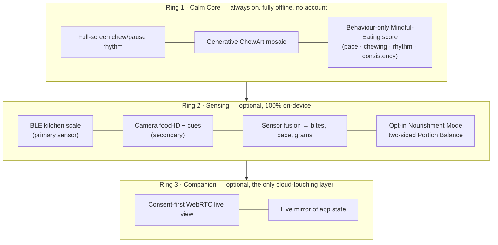

# Chewie 🥢

**A calm companion that helps you eat slower, chew more, and stay in your body during a meal.**

Chewie turns your phone into a quiet table-side coach. The whole screen breathes between a
**chew** colour and a **pause** colour, so you learn a slower rhythm without counting or
staring at numbers. Every finished meal becomes a unique piece of generative mosaic art
(**ChewArt**) that grows into a personal artwork over months.

Beyond the calm core, Chewie can *optionally* sense a meal (a Bluetooth kitchen scale as the
primary sensor, the camera as a helper), coach you gently, let a trusted person watch along,
and — for adults who opt in — help you land inside your **ideal amount**: a healthy,
**two-sided** range where eating *too little* counts against you exactly as much as eating
*too much*.

!!! note "This site is the design, not the app (yet)"
    Chewie currently exists as an **architecture & product design**. No application code has
    been written yet — the design is the deliverable, and the
    [roadmap](09-roadmap-and-mvp.md) is the build plan.

## The idea in one picture

Each ring is independent: **remove Rings 2 and 3 and you still have a complete, lovable,
offline app.** A failed cloud call can never break the dinner table.

## What makes it different

- **The calm core never asks how much you ate or what you weigh.** The always-on score
  measures *behaviour* — slowness, thorough chewing, honoured pauses, steady rhythm,
  consistency against your own gentle baseline — inside healthy **bands** where both extremes
  lower the score. Eating less can *never* raise it; that's enforced in code, not just policy.
- **Your artwork is the reward.** ChewArt tiles are seeded by *how* you ate, stored as tiny
  seed+params (never as images), reproducible and exportable.
- **The scale is the star sensor.** A Bluetooth kitchen scale gives ground-truth mass, precise
  per-bite weight loss, and exact pace — far more reliable than guessing from a camera. The
  camera adds food identification and cues, and powers the companion view. Everything degrades
  gracefully: scale-only, camera-only, both, or manual.
- **Nourishment Mode is opt-in, adults-only, and two-sided.** It coaches you *into and inside*
  your ideal amount, never toward eating less. See [doc 10](10-nourishment-and-intake-targets.md).
- **Watching-along is consent-first:** peer-to-peer, encrypted, ephemeral, never recorded, and
  revocable.
- **Privacy is the default:** local-first, encrypted-at-rest, no account for the core, camera
  frames never leave the device, health data treated as GDPR Article 9.

## The documents

| # | Document | What's inside |
|---|----------|---------------|
| 01 | [Product Vision, Personas & Core Loop](01-product-vision.md) | The problem, who it's for, the calm core loop, principles & non-goals, the "battle yourself" motivation reframed healthily |
| 02 | [System Architecture & Tech Stack](02-system-architecture.md) | Concentric-ring topology, React Native + Expo, Supabase (EU), what-runs-where, CI/deployment |
| 03 | [Chewing Engine & Generative ChewArt](03-chewing-engine-and-art.md) | Drift-free session FSM, full-screen visual/colour system, the ChewArt generator, gallery & export |
| 04 | [Sensing, Sensor Fusion & Meal AI](04-sensing-and-ai.md) | BLE scale drivers, camera pipeline, fusion modes, food ID, honest nutrition estimation with ranges |
| 05 | [Mindful-Eating Score & Self-Competition](05-scoring-model.md) | Behaviour-only banded scoring, the intake wall, live coaching, personal baseline |
| 06 | [Companion Mode, Secure Pairing & Realtime](06-companion-and-pairing.md) | WebRTC P2P, signalling, pairing/consent, state-sync, TURN |
| 07 | [Data Model, Sync, Privacy & GDPR](07-data-model-and-privacy.md) | Local-first encrypted schema, RLS, consent tiers, Article 9 handling, export/delete |
| 08 | [Responsible Design, Safety & Accessibility](08-responsible-design-and-safety.md) | Eating-disorder-risk safeguards, onboarding/age gate, honesty rules, accessibility, red-team |
| 09 | [Roadmap, MVP Scope & Delivery Plan](09-roadmap-and-mvp.md) | Phased plan (calm core → scale → camera → companion → cloud), spikes, definition of done |
| 10 | [Nourishment Mode & Two-Sided Portion Balance](10-nourishment-and-intake-targets.md) | Opt-in profile → BMI/healthy-range/TDEE → two-sided per-meal target band & adequacy score |

Architecture decisions are recorded as [ADRs](adr/README.md).

## Reading paths

- **New to the project?** → 01 → 02 → 09.
- **Building the MVP?** → 02 → 03 → 05 → 07, then 09 for sequencing.
- **Working on sensing / scoring / intake?** → 04 → 05 → 10, with 08 as the guardrail.
- **Reviewing safety & ethics?** → 08 first, then 05 §1–2, 07 §3, and 10 §0–2.

## A note on responsibility

Chewie touches eating, bodies, and (optionally) intake and weight — areas where a careless app
can do real harm. The calm core is numberless, the behaviour score can't be gamed toward eating
less, intake features are opt-in, two-sided, clamped to healthy ranges, and gated behind an
eating-disorder-clinician review, and there are care pathways instead of congratulation when
usage looks concerning. Chewie is a wellbeing companion, **not a medical device** — no diagnosis,
no clinical precision claims, estimates always shown as ranges. See
[Responsible Design & Safety](08-responsible-design-and-safety.md).
